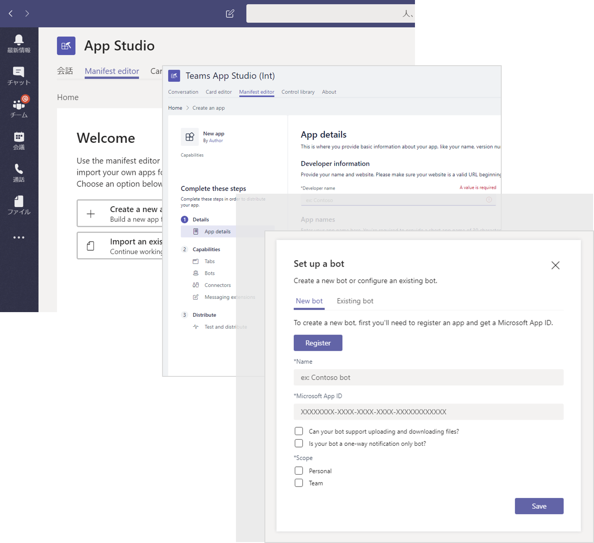
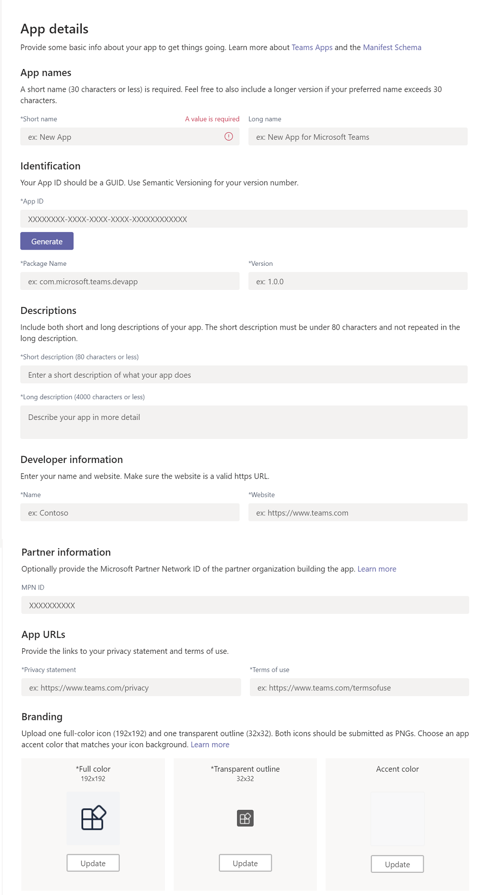
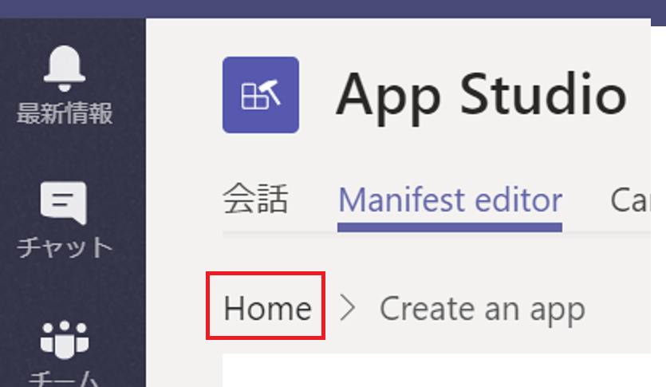
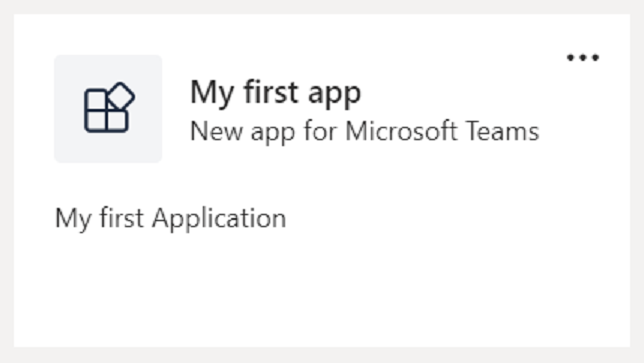
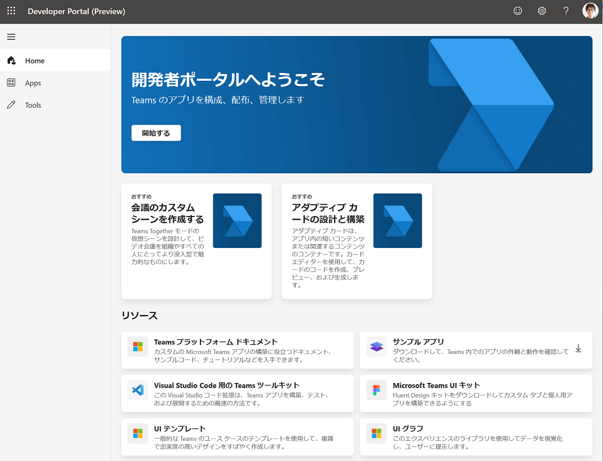
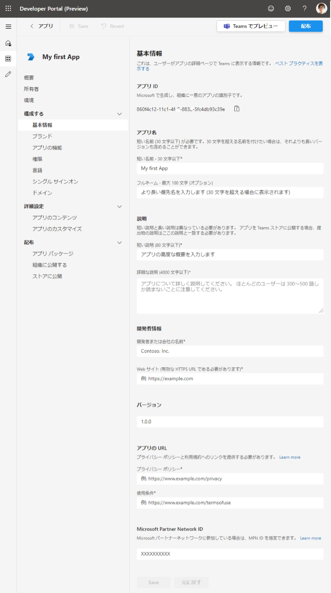

# 演習 1 : Microsoft Teams アプリケーションの新規作成
Microsoft Teams アプリケーションは、既存の Web アプリケーションや既存の Microsoft Bot Framework で作られたボットを統合するか、それぞれ向けに作られた Teams 用の SDK で拡張して行います。

これらを Teams にアプリケーションとして登録する場合で必要となるのがアプリの定義です。

これはアプリケーションをタブやボットやメッセージ拡張といった、Teams のどのような機能として使用するかを JSON で記述した manifest.json というファイルを作成しマニフェストファイルとします。

このマニフェストファイルの作成を効率的に行う方法は以下の 3 つあります。

1. **リファレンス : Microsoft Teams のマニフェスト スキーマ の [完全なマニフェストのサンプル](https://docs.microsoft.com/ja-jp/microsoftteams/platform/resources/schema/manifest-schema#sample-full-manifest) からスキーマをコピー**
2. **App Studio** もしくは **Microsoft Teams の開発者ポータル** を使用する

3. Visual Studio もしくは Visual Studio Code 用 Teams Toolkit が生成するプロジェクトに含まれるものを使用する

このチュートリアルでは App Studio とその後継となる Microsoft Teams の開発者ポータルを使用する方法を紹介します。

両者とも、作業結果は同じになるので**以下のいずれか**の手順で作業をおこなってくだい。

* [**App Studio について**](#app-studio-%E3%81%AB%E3%81%A4%E3%81%84%E3%81%A6)
* [**Microsoft Teams 用 開発者ポータル について**](#microsoft-teams-%E7%94%A8-%E9%96%8B%E7%99%BA%E8%80%85%E3%83%9D%E3%83%BC%E3%82%BF%E3%83%AB-%E3%81%AB%E3%81%A4%E3%81%84%E3%81%A6)

なお、手動によるマニフェストファイルの作成と Microsoft Teams の展開方法については以下のドキュメントをご覧ください。

* [**リファレンス : Microsoft Teams のマニフェスト スキーマ**](https://docs.microsoft.com/ja-jp/microsoftteams/platform/resources/schema/manifest-schema)

## App Studio について
App Studio は Microsoft Teams のアプリケーションで、アプリマニフェストを含むアプリ パッケージの作成を GUI で行うためのツールです。

App Studio はアプリ パッケージを作成するだけでなく以下の機能も提供します。

1. **ワン クリック サイドロード**
2. **Bot Framework (dev.botframework.com) のボットの認証と設定管理を統合**
3. **アダプティブカードのコードのレビュー**
4. **Microsoft Teams アプリで使用可能なコードレビュー (React の jsx)**

## App Studio のインストール
App Studio は既定の状態では Microsoft Teams にインストールされていないので、App Source から検索してインストールする必要があります。

App Studio のインストール手順は以下のとおりです。

1. Microsoft Teams 起動します。

2. 左側のメニューバーの下から 2 番目にあるメニュー \[アプリ\] をクリックします。

3. Microsoft Teams にインストールすることのできるアプリの一覧画面が表示されるので、その中から選択するか、同画面の左上の \[すべてを検索] ボックスで検索を行います。

4. App Studio のタイルをクリックし、\[チームに追加] ボタンをクリックしてインストールします。 

## App Studio を使用した Teams アプリケーションの登録
ここでは App Studio を使用して、演習として **My first App** というアプリを登録します。

App Studio でアプリの登録を行うには以下の手順を実行します。

1. Microsoft Teams の左端のメニュー \[・・・]\(「さらに追加されたアプリ」) をクリックし、App Studio を選択
2. App Studio の画面に切り替わるので、同画面の上部メニュー \[**Manifest editor**] をクリック
3. 「Welcome」と書かれたボックスの中の \[Create a new app] ボタンをクリック
4. Manifest Editor の画面が表示されるので、**App detail** 内の項目を以下のように設定します。

    なお * のついている項目は必須項目です。

    ### **App Names**

    アプリの名前を指定します。\[Short name](30 文字以下) の指定が必須です。

    |項目|値|
    |---|---|
    | *Short name | **My first app** |
    | Long Name | **My first application for Microsoft Teams** |

    ### **Identification**

    \[App ID] にはアプリの ID を指定します。ID はユニークな GUID である必要があります。

    \[Package Name] には逆引きドメイン表記でこのアプリケーションの一意の識別子を指定します。たとえば、com.example.myapp です。

    |項目|値|
    | ---- | ---- |
    |*App ID|**\[Generate] ボタンをクリックして生成**|
    |*Package Name|**com.example.myfirstapp**|
    |*Varsion|**1.0.0**|

    ### **Descriptions**
    アプリの \[Short description]\(短い説明) と\[Long description]|\(長い説明) の両方を含めます。短い説明は 80 文字以下で、長い説明と同じものを指定することはできません。

    |項目|値|
    | ---- | ---- |
    |*Short description|**My first Application**|
    |*Long description|**My first application in Microsoft Teams easy tutorial**|

    ### **Developer information**
    \[Name] と \[Web Site] を入力します。Web サイトが有効な https URL であることを確認します。

    |項目|値|
    | ---- | ---- |
    |*Name|**Tutrial Developer**|
    |*Web Site|**https://example.com**|

    ### **Partner information**
    必要に応じて、アプリを構築するパートナー組織の Microsoft パートナー ネットワーク ID を提供します。

    |項目|値|
    | ---- | ---- |
    |MPN ID|**規定値のまま**|

    ### **App URLs**
    プライバシーに関する声明および利用規約へのリンクを提供します。

    今回はダミーの URL を使用しますが、実際にアプリケーションの開発を行う際には必ずページを用意し正しい URL を指定してください。

    |項目|値|
    | ---- | ---- |
    |*Privacy statement|**https://example.com/privacy**|
    |*Terms of use|**https://example.com/termofuse**|

    ### **Branding** ###
    1 つのフルカラー アイコン (192x192) と 1 つの透明なアウトライン (32x32) をアップロードします。両方のアイコンの形式は PNG である必要があります。

    |項目|値|
    | ---- | ---- |
    |*Full color 192x192|**今回は指定しません**|
    |*Transparent outline 32x32|**今回は指定しません**|
    |Accent color|**今回は指定しません**|

    App details 実際の設定画面は以下の通りです。

    

5. App Studio 画面左上の \[Home] メニューをクリックすると指定した値が自動で保存されます。

    

以上で App Studio を使用したアプリの新規登録は完了です。

App Studio の Recently created apps リストに登録したアプリケーション **My first app** のタイルがあることを確認してください。

[以降の手順](Ex02.md)でアプリの実際の機能 (**Capability**) を登録していきます。

 

## Microsoft Teams 用 開発者ポータル について

Microsoft Teams 用 開発者ポータルは、Microsoft Teamsアプリを構成、配布、および管理するための主要なツールとしての機能を持った Web サイトです。開発者ポータルを使用すると、アプリで同僚と共同作業したり、ランタイム環境を設定したりできます。

Microsoft Teams 用 開発者ポータルはアプリ パッケージを作成するだけでなく以下の機能も提供します。

* アプリの登録
    - アプリ所有者の登録
* 共同作成者の追加
* 環境変数の設定
* アプリの機能と重要なメタデータを構成
* アプリを直接 Teams でテスト
* アプリの配布
* アプリの使用状況の分析

## Microsoft Teams 用 開発者ポータルの使用

Microsoft Teams 用 開発者ポータルを使用するのにインストールなどの事前準備は必要ありません。Microsoft Edge などの Web ブラウザーから [**https://dev.teams.microsoft.com/**](https://dev.teams.microsoft.com/) にアクセスし、Teams アプリ開発に使用するアカウントでログインします。

URL をブックマークする他、Microsoft Edge を使用しているのであれば、Microsoft Edge 画面、右上にあるメニュー \[・・・\] (設定など) - \[アプリ\] - \[アプリ\] - \[このサイトをアプリとしてインストール\] を選択し、アプリケーションとして登録しておくと便利です。

## Microsoft Teams 用 開発者ポータルを使用した Teams アプリケーションの登録

ここではMicrosoft Teams 用 開発者ポータルを使用して、演習として **My first App** というアプリを登録します。

Microsoft Teams 用 開発者ポータル でアプリの登録を行うには以下の手順を実行します。

1. Web ブラウザーから [**https://dev.teams.microsoft.com/**](https://dev.teams.microsoft.com/) にアクセスし、Teams アプリ開発に使用するアカウントでログイン

2. 画面左のメニューバーの\[**Apps**\] をクリック

3. アプリの一覧画面に遷移するので、画面上部の \[**+ 新しいアプリ**\] をクリック

4. \[**アプリの追加**\] ダイアログボックスがポップアップされるので \[**名前**\] テキストボックスに**My first App**と入力し \[追加\] ボタンをクリック

5. 登録するアプリの基本情報を入力する画面が表示されるので、各項目を以下のように設定します。

    なお * のついている項目は必須項目です。

    ### **アプリ名**

    アプリの名前を指定します。\[短い名前](30 文字以下) の指定が必須です。

    |項目|値|
    |---|---|
    | 短い名前 - 30 文字以下* | **My first app** |
    | フルネーム - 最大 100 文字 (オプション)| **My first application for Microsoft Teams** |

    ### **説明**
    
    アプリの \[短い説明\]と\[詳細な説明\] の両方を含めます。短い説明は 80 文字以下で、長い説明と同じものを指定することはできません。

    |項目|値|
    | ---- | ---- |
    |短い説明 (80 文字以下)*|**My first Application**|
    |詳細な説明 (4000 文字以下)*|**My first application in Microsoft Teams easy tutorial**|

    ### **開発者情報**
    
    \[開発者または会社の名前]に、個人で開発している場合は開発者の名前を、会社の場合は会社名を指定します。 \[Web サイト] にはその開発者個人のホームページの URL か会社のホームページの URLを指定します。
    
    \[Web サイト\]に指定する URL は有効な https URL 形式であることを確認します。Web サイトは開発段階では指定した URL が実際には存在していなくても問題ありませんが、App Source にパッケージを提出した際には審査の対象となります。

    |項目|値|
    | ---- | ---- |
    |開発者または会社の名前*|**Tutrial Developer**|
    |Web サイト (有効な HTTPS URL である必要があります)*|**https://example.com**|

    ### **バージョン**

    |項目|値|
    | ---- | ---- |
    |バージョン|**1.0.0**|

    ### **アプリの URL**

    プライバシーに関する声明および利用規約へのリンクを提供します。

    今回はダミーの URL を使用しますが、実際にアプリケーションの開発を行う際には必ずページを用意し正しい URL を指定してください。

    |項目|値|
    | ---- | ---- |
    |プライバシー ポリシー*|**https://example.com/privacy**|
    |使用条件*|**https://example.com/termofuse**|

    ### **Microsoft Partner Network ID**
    必要に応じて、アプリを構築するパートナー組織の Microsoft パートナー ネットワーク ID を提供します。

    |項目|値|
    | ---- | ---- |
    | Microsoft Partner Network ID|**規定値のまま**|

    

6. 画面の一番下にある \[**Save**\] ボタンをクリック

以上で Microsoft Teams 用 開発者ポータルを使用したアプリの新規登録は完了です。

Microsoft Teams 用 開発者ポータルの \[Apps] メニューをクリックし、表示されるアプリの一覧に登録した **My first App** が表示されていることを確認してください。

**⇒【 2. [タブ アプリケーション](Ex02.md) 】へ**

## 目次
0. [**Microsoft Teams アプリケーション開発について**](Intro.md)

1. [**Microsoft Teams アプリケーションの新規作成**](Ex01.md)
    * [**App Studio を使用したマニフェストファイルの作成**](Ex01.md#app-studio-を使用した-teams-アプリケーションの登録)
    * [**Microsoft Teams 用 開発者ポータルを使用した Teams アプリケーションの登録**](Ex01.md#microsoft-teams-%E7%94%A8-%E9%96%8B%E7%99%BA%E8%80%85%E3%83%9D%E3%83%BC%E3%82%BF%E3%83%AB%E3%81%AE%E4%BD%BF%E7%94%A8)
2. [**タブ アプリケーション**](Ex02.md)

    * [**パーソナル タブ**](Ex02.md#%E3%82%BF%E3%82%B9%E3%82%AF-1--%E3%83%91%E3%83%BC%E3%82%BD%E3%83%8A%E3%83%AB-%E9%9D%99%E7%9A%84-%E3%82%BF%E3%83%96%E3%81%AE%E8%BF%BD%E5%8A%A0)
        * [**App Studio を使用した方法**](#app-studio-%E3%82%92%E4%BD%BF%E7%94%A8%E3%81%97%E3%81%9F%E3%83%91%E3%83%BC%E3%82%BD%E3%83%8A%E3%83%AB-%E3%82%BF%E3%83%96%E3%81%AE%E8%BF%BD%E5%8A%A0)
        * [**Microsoft Teams 用 開発者ポータルを使用した方法**](#microsoft-teams-%E7%94%A8-%E9%96%8B%E7%99%BA%E8%80%85%E3%83%9D%E3%83%BC%E3%82%BF%E3%83%AB-%E3%82%92%E4%BD%BF%E7%94%A8%E3%81%97%E3%81%9F%E3%83%91%E3%83%BC%E3%82%BD%E3%83%8A%E3%83%AB-%E3%82%BF%E3%83%96%E3%81%AE%E8%BF%BD%E5%8A%A0)

    * [**チーム タブ**](Ex02.md#%E3%82%BF%E3%82%B9%E3%82%AF-2--%E3%83%81%E3%83%BC%E3%83%A0-%E6%A7%8B%E6%88%90%E5%8F%AF%E8%83%BD-%E3%82%BF%E3%83%96%E3%81%AE%E8%BF%BD%E5%8A%A0)
        * [**App Studio を使用した方法**](#app-studio-%E3%81%A7%E3%81%AE%E3%83%81%E3%83%BC%E3%83%A0-%E3%82%BF%E3%83%96%E3%81%AE%E8%BF%BD%E5%8A%A0)
        * [**Microsoft Teams 用 開発者ポータルを使用した方法**](#microsoft-teams-%E7%94%A8-%E9%96%8B%E7%99%BA%E8%80%85%E3%83%9D%E3%83%BC%E3%82%BF%E3%83%AB-%E3%82%92%E4%BD%BF%E7%94%A8%E3%81%97%E3%81%9F%E3%83%91%E3%83%BC%E3%82%BD%E3%83%8A%E3%83%AB-%E3%82%BF%E3%83%96%E3%81%AE%E8%BF%BD%E5%8A%A0-1)

    * [**タブ : タスクモジュールの表示**](Ex02.md#%E3%82%BF%E3%82%B9%E3%82%AF-3-%E3%82%BF%E3%83%96%E3%81%A7%E3%81%AE%E3%82%BF%E3%82%B9%E3%82%AF-%E3%83%A2%E3%82%B8%E3%83%A5%E3%83%BC%E3%83%AB%E3%81%AE%E8%A1%A8%E7%A4%BA)

        * [**外部の HTML フォームをタスクモジュールとしてタブに追加**](Ex02.md#%E3%82%BF%E3%82%B9%E3%82%AF-3-1--%E5%A4%96%E9%83%A8%E3%81%AE-html-%E3%83%95%E3%82%A9%E3%83%BC%E3%83%A0%E3%82%92%E3%82%BF%E3%82%B9%E3%82%AF%E3%83%A2%E3%82%B8%E3%83%A5%E3%83%BC%E3%83%AB%E3%81%A8%E3%81%97%E3%81%A6%E3%82%BF%E3%83%96%E3%81%AB%E8%BF%BD%E5%8A%A0)

        * [**アダプティブ カードをタスクモジュールとしてタブに追加**](Ex02.md#%E3%82%BF%E3%82%B9%E3%82%AF-3-2--actibity-card-%E3%82%92%E3%82%BF%E3%82%B9%E3%82%AF%E3%83%A2%E3%82%B8%E3%83%A5%E3%83%BC%E3%83%AB%E3%81%A8%E3%81%97%E3%81%A6%E3%82%BF%E3%83%96%E3%81%AB%E8%BF%BD%E5%8A%A0)
    
    
3. [**ボット**](Ex03.md)
    * [**ボットの登録**](Ex03.md#%E3%83%9C%E3%83%83%E3%83%88%E3%81%AE%E7%99%BB%E9%8C%B2)
    
4. [**メッセージング拡張**](Ex04.md)
    * [**検索機能の実装**](Ex04.md#%E3%82%BF%E3%82%B9%E3%82%AF-1--%E3%83%A1%E3%83%83%E3%82%BB%E3%83%BC%E3%82%B8%E3%83%B3%E3%82%B0%E6%8B%A1%E5%BC%B5---wikipedia-%E6%A4%9C%E7%B4%A2%E6%A9%9F%E8%83%BD%E3%81%AE%E5%AE%9F%E8%A3%85)
    * [**操作機能の実装**](Ex04.md#%E3%82%BF%E3%82%B9%E3%82%AF-2--%E3%83%A1%E3%83%83%E3%82%BB%E3%83%BC%E3%82%B8%E3%83%B3%E3%82%B0%E6%8B%A1%E5%BC%B5---%E6%93%8D%E4%BD%9C%E3%82%A2%E3%82%AF%E3%82%B7%E3%83%A7%E3%83%B3%E3%82%B3%E3%83%9E%E3%83%B3%E3%83%89%E3%81%AB%E3%82%88%E3%82%8B%E5%A4%96%E9%83%A8%E3%82%B5%E3%83%BC%E3%83%93%E3%82%B9%E3%81%AE%E9%80%A3%E6%90%BA)

5. [**タブとボットのシングルサインオン**](Ex05.md)
6. [**コネクタ**](Ex06.md)
    * [**受信 Webhook を利用したチャネルへの通知**](https://github.com/osamum/Easyway-for-MSTeamsAppDev/blob/master/Ex06.md#%E3%82%BF%E3%82%B9%E3%82%AF-1--incomming-webhook-%E3%82%92%E5%88%A9%E7%94%A8%E3%81%97%E3%81%9F%E3%83%81%E3%83%A3%E3%83%8D%E3%83%AB%E3%81%B8%E3%81%AE%E9%80%9A%E7%9F%A5)
    * [**送信Webhook を利用した外部サービスの呼び出し**](https://github.com/osamum/Easyway-for-MSTeamsAppDev/blob/master/Ex06.md#%E3%82%BF%E3%82%B9%E3%82%AF-2--%E9%80%81%E4%BF%A1outgoing-webhook-%E3%82%92%E5%88%A9%E7%94%A8%E3%81%97%E3%81%9F%E5%A4%96%E9%83%A8%E3%82%B5%E3%83%BC%E3%83%93%E3%82%B9%E3%81%AE%E5%91%BC%E3%81%B3%E5%87%BA%E3%81%97)

