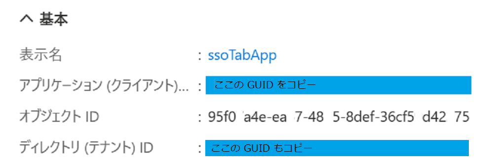

# タブのシングルサインオン (SSO)
Microsoft Teams を使用する際、ユーザーは Microsoft アカウントで Microsoft Teams にサインインします。デスクトップやモバイルのクライアントでTeams タブやタスクモジュールを認証するためのシングルサインオンを可能にすることで、アプリ毎にサインインする必要が無くなり、機能的な統一感が保たれるだけでなくパフォーマンスとロードタイムが向上します。

## この演習で実装するシングルサインオンの仕組み

Microsoft Teams のタブ アプリでは、Azure Active Directory とアプリ マニフェストを適切に設定し、タブ アプリのコードから [Teams Client JavaSctipt SDK](https://docs.microsoft.com/en-us/javascript/api/@microsoft/teams-js/?view=msteams-client-js-latest) の [getAuthToken メソッド](https://docs.microsoft.com/en-us/javascript/api/@microsoft/teams-js/microsoftteams.authentication?view=msteams-client-js-latest#getAuthToken_AuthTokenRequest_)を呼び出すことでユーザーのメール アドレスなど情報を抽出することのできるアクセストークンを取得できます。

しかし、getAuthToken メソッドで取得できるアクセス トークンは、ユーザーレベルの Graph API パーミッション（email、profile、offline_access、OpenId）しかサポートしていないため、User.Read や Mail.Read など、他の Graph スコープへのアクセスが必要な場合は、このトークンを必要なスコープを含むトークンに交換する必要があります。

この演習では、Teams Client JavaSctipt SDK を使用して入手したトークンを、他のGraph API (の Mail.Read)を呼び出すことのできるスコープを持ったトークンに交換し、一覧を取得する機能を実装します。

## 前提条件

この演習を行うには、[**演習 2**](Ex02.md) で**タブ アプリケーション**の作成方法を学習済みであるか、同等の知識を有していることが大前提となります。

学習済みでない場合、最低限[**パーソナル タブ**の作り方の演習](Ex02.md#%E3%82%BF%E3%82%B9%E3%82%AF-1--%E3%83%91%E3%83%BC%E3%82%BD%E3%83%8A%E3%83%AB-%E9%9D%99%E7%9A%84-%E3%82%BF%E3%83%96%E3%81%AE%E8%BF%BD%E5%8A%A0)を行ってからこの演習に取り掛かってください。


## 演習の流れ
今回の処理は、Azure Active Directory へのアプリの登録、アプリマニフェストの設定を適切に行い、静的ページで動作するシンプルなプライベート タブ アプリを作成します。

同タブ アプリ内の JavaScript コードから Teams JavaScript Clienrt SDK の getAuthToken メソッドを呼び出してアクセス トークンを取得し、それを OAuth2.0 の [**On-Behalf-Of(代理) フロー**](https://docs.microsoft.com/ja-jp/azure/active-directory/develop/v2-oauth2-on-behalf-of-flow)を使用して異なるスコープを持ったトークンに交換します。

この代理フロー処理はクライアント側の JavaScript では行えないため、簡単な REAST API を作成してこれを呼び出して行い、交換後のアクセストークンを使用して Graph API が呼び出せることを確認します。

具体的には以下のような順序で演習を進めます。

1. [**シンプルなプライベート タブ アプリの作成**](#sso-%E3%81%AE%E3%81%9F%E3%82%81%E3%81%AE%E3%82%B7%E3%83%B3%E3%83%97%E3%83%AB%E3%81%AA%E3%82%BF%E3%83%96-%E3%82%A2%E3%83%97%E3%83%AA%E3%81%AE%E4%BD)
2. [**タブ アプリの Azure Active Directory への登録**](#azure-active-directory-%E3%81%B8%E3%81%AE%E7%99%BB%E9%8C%B2)

    ⇒ Teams 上でタブ アプリを実行し Teams Client JavaScript SDK を使用してトークンが取得できることを確認

3. [**トークンの交換を行うための REST API を作成**](#%E3%83%88%E3%83%BC%E3%82%AF%E3%83%B3%E3%82%92%E4%BA%A4%E6%8F%9B%E3%81%99%E3%82%8B%E3%81%9F%E3%82%81%E3%81%AE%E3%82%B5%E3%83%BC%E3%83%93%E3%82%B9%E3%81%AE%E4%BD%9C%E6%88%90)

    ⇒ 交換したトークンと Graph API を使用してメールの一覧が取得できることを確認

**RSET API の開発について**

トークンを交換するための REST API の開発は Microsoft ID Platform のエンドポイントに対し適切な HTTP リクエストを送信できればどのような開発言語でもかまいませんが、今回はクライアント サイドのコードと同じ JavaScript が使用できる Node.js を使用します。

Web アプリケーション開発のフレームワークとして [express](http://expressjs.com/ja/) を使用しますので以下のコマンドを実行してどのディレクトリからでも実行できるようにしておくか、特定のディレクトでのみ使用したい場合は、目的のディレクトリで -g を指定せずにコマンドをします。

```
npm install -g express
```

同様にアプリケーションのスケルトンを生成する [express-generator](https://expressjs.com/ja/starter/generator.html) もインストールします。

```
npm install -g express-generator
```


<br>

## SSO のためのシンプルなタブ アプリの作成

演習のためのシンプルなタブ アプリを作成します。

今回の演習で使用するアプリは静的な html ファイルなので、http-server (開発用の Web サーバー) でホストすることができますが、今回はトークンを交換するための REST API も作成するので Express を使用して Node.js プロジェクトを作成し、それを実行してタブアプリの html ファイルをホストします。

(※) express-generatort が生成するプロジェクトはサーバーサイドで HTML を描画するテンプレートエンジンとして [jade](https://jade-lang.com/) をサポートしていますが、今回の演習ではサーバーサイドとクライアントサイドの処理を別けて理解していただく目的でクライアントサイドは静的 html ファイルを使用します。

プロジェクト作成からパーソナルタブの追加までの具体的な手順は以下のとおりです。

1. コマンドプロンプトで、作業用のディレクトリに切り替えたら以下のコマンドを実行し、プロジェクトの雛形を生成します

    ```
    express ssoTabApp
    ```

2. プロジェクト用の **ssoTabApp** という名前のディレクトリが生成されるので、cd コマンドで作業ディレクトリを切り替え

    ```
    cd ssoTabApp
    ```

    npm install コマンドを実行して依存関係のあるモジュールをインストールします

    ```
    npm install
    ```

3. プロジェクトが正しく構成されたことを確認するために以下のコマンドを実行し、

    ```
    npm start
    ```

    Web ブラウザーのアドレスバーに以下のアドレスを入力してブラウズします

    ```
    http://localhost:3000/
    ```

    Web ブラウザーに「**Express**」と表示されることを確認後、コマンド プロンプトに戻り、キーボードの \[Ctrl\]+\[C\] キーを押下してプロジェクトの実行を停止します。

4. 作業中のコマンドプロンプトで以下のコマンドを実行し、Visual Studio Code を起動します

    ```
    code .
    ```
5. Visual Studio Code の画面左の \[エクスプローラー\] にプロジェクトを構成するフォルダとファイルがツリー表示されているので、\/**public** フォルダを右クリックし、表示されたコンテキストメニューから\[**新しいファイル**\]を選択し、**index.html** と言う名前でファイルを作成します

    

6. Visual Studio Code の編集画面に、作成した index.html が開かれた状態になっているので、**!** (エクスクラメーションマーク)を入力したらすぐにキーボードの \[Tab\] キーを押下します

7. html の基本的なタグが自動で挿入されるので、\<**html**\> タグの **lang** 属性を "en" から "**ja**" に変更し、body タグの中に以下のタグを貼り付けます

    ```
    <h1>Teams SSO タブ</h1>
    <button id="logOnButton">ログオン</button>
    <br><br>
    <div id="display"></div>
    <br><br>
    <div id="mailItems"></div>
    ```

8. Visual Studio Code のメニュー \[**ターミナル**\]-\[**新しいターミナル**\]をクリックし、表示されたターミナル画面で以下のコマンド実行します

    ```
    npm start
    ```

    Web ブラウザーのアドレスバーに以下のアドレスを入力します

    ```
    http://localhost:3000/index.html
    ```

    Web ブラウザーに作成した index.html の内容が表示されていることを確認します。

9. 現在プロジェクトがホストしている index.html に Teams から参照できるように ngrok を起動します

    このプロジェクトはポートの **3000** 番でリスンしているので、以下のコマンドを使用します。

    ```
    ngrok http 3000 --host-header=localhost
    ```

    以下のように ngrok が返すドメイン名 Web ブラウザーのアドレスバーを書き換え、作成した index.html の内容が表示されることを確認します。

    ```
    https://ngrok が返したドメイン名/index.html
    ```

    ngrok が返したドメイン名は、**以降の手順で頻繁に使用するのでテキストエディタに貼り付けるなどして保持してください**。

    なお、ngrok は全ての演習の内容が完了するまで**終了しないでください。**(ドメイン名が変わってしまうので)


10. 前の手順で確認した ngrok でトンネリングされた URL を使用し、[**演習 2-1 : パーソナル タブの追加**](Ex02.md#%E3%82%BF%E3%82%B9%E3%82%AF-1--%E3%83%91%E3%83%BC%E3%82%BD%E3%83%8A%E3%83%AB-%E9%9D%99%E7%9A%84-%E3%82%BF%E3%83%96%E3%81%AE%E8%BF%BD%E5%8A%A0) の手順に従い、手元の環境でホストされている index.html を Teams のパーソナルタブ アプリとして追加し、正しく表示されるか確認してください。

なお、ページに表示されている\[ログオン\]ボタンはこの時点では動作しません。

    
## Azure Active Directory への登録

作成したタブ アプリが Teams の SSO を使用できるように Azure Active Directory にアプリケーションとして登録し、API のアクセス許可を設定します。

手順は以下のとおりです。

1.  [Azure のポータル](https://portal.azure.com/)にログインします

2. 左上にあるハンバーガーメニューをクリックしてメニュー ブレードを表示し **[Azure Active Directory]** を選択します

    

3. Azure Active Directory のブレードより **\[アプリの登録\]** をクリックします

4. アプリの登録画面が表示されるので画面上部の **\[+ 新規登録\]** メニューをクリックします

    

5. アプリケーションの登録画面が表示されるので **\[名前\]** にアプリケーション名を入力します

    この演習では "**ssoTabApp**" という名前を使用します。なお、この名前は後で変更することができます

6. \[サポートされているアカウントの種類] で、 **\[任意の組織ディレクトリ内のアカウント (任意の Azure AD ディレクトリ - マルチテナント) と個人の Microsoft アカウント (Skype、Xbox など)]** を選択します

7. \[リダイレクト URI (省略可能)] のドロップダウンリストから 「**Web**」 を選択し、右側のテキストボックスに以下の URL を記述します

    ```
    https://ngrok が生成したドメイン名/index.html
    ```

8. \[登録] ボタンをクリックします。

9. 画面左のメニューの \[概要\] をクリックし、表示された画面で **\[アプリケーション (クライアント)\]** と　**\[ディレクトリ (テナント) ID\]**　の内容をコピーし、**テキストファイルなどにメモします**

    

10. 画面左のメニューで \[**API の公開**] を選択します

11. \[**設定**\]リンクをクリックすると、api://{AppID} の形式でアプリケーションIDのURIが生成されるので、api://の後ろに ngrok が生成したドメイン名を挿入して以下の形式の URI を設定します

    ```
    api://ngrok が生成したドメイン名/AppIDのGUID
    ```

    **この URI はアプリ マニフェストの設定で使用するのでメモ帳などの貼り付けて保持します。**

12. \[**+ Scope の追加**]をクリックして\[スコープ名*] に **access_as_user** と入力します

13. \[**同意できるのはだれですか?**\] トグルボタンで \[**管理者とユーザー**]を選択します。

14. 他の項目を以下のように設定します。

    |項目|値|
    |---|---|
    | 管理者の同意の表示名 | Teams は、ユーザーのプロファイルにアクセスできます。 |
    | 管理者の同意の説明 | Teams は、アプリの Web API を現在のユーザーとして呼び出します。|
    | ユーザーの同意の表示名 | Teams はユーザー プロファイルにアクセスし、ユーザーの代わりに要求を行うことができます。|
    | ユーザーの同意の説明 | Teams は、ユーザーと同じ権限でこのアプリの API を呼び出します。|

    実際の画面は以下のとおりです。

    

15. \[状態] トグルボタンが \[**有効**] になっていることを確認し、\[スコープの追加] ボタンをクリックします。

16. \[承認済 みクライアント アプリケーション] セクションで、\[**クライアント アプリケーションの追加**] をクリックし、以下の GUID をそれぞれ入力し \[アプリケーションの追加] ボタンをクリックして登録します。

    |クライアント ID|アプリケーション|
    |---|---|
    | 1fec8e78-bce4-4aaf-ab1b-5451cc387264 | Teams モバイル またはデスクトップ アプリケーション用 |
    | 5e3ce6c0-2b1f-4285-8d4b-75ee78787346 | Teams Web アプリケーション用|

    登録の際、\[承認済みのスコープ] に api://で始まるアプリケーション URI のチェックボックスがリストされるので必ずチェックをつけます。

    実際の画面は以下のとおりです。
    
    

17. 画面左のメニューで \[**API のアクセス許可**] をクリックします

18. 遷移した画面で \[**+ アクセス許可の追加**] をクリックし、

    

    画面右に表示されたブレード内の \[Microsoft Graph]-\[委任されたアクセス許可]ボックスをクリックし、
    
    
    
    以下の権限にチェックをつけ \[アクセス許可の追加] ボタンをクリックします
    - User.Read (既定で有効)
    - email
    - offline_access
    - openId
    - profile
    - Mail.Read

    \[+ アクセス許可の追加] の右隣にある\[**(ドメイン名) に管理者の同意を与えます**] をクリックし、同意を与えます。

    (※)もし、\[(ドメイン名) に管理者の同意を与えます]がグレーアウトしていてクリックできない場合は、管理者権限をもつアカウントで作業するか、別途 Azure Active Directory テナントを作成し、そちらで作業する必要があります。
    
    リストされたアクセス許可の \[状態] に緑色のアイコンが表示されるのを確認します

    

19. 画面左のメニューで \[**認証**] をクリックします

20. 項目\[**暗黙的な許可およびハイブリッド フロー**]で以下のチェックボックスにチェックをつけ、画面上部の \[保存] をクリックします

    - **アクセス トークン (暗黙的なフローに使用)**
    - **ID トークン (暗黙的およびハイブリッド フローに使用)**

21. 画面左のメニューで \[**証明書とシークレット**] をクリックします

22. \[**+新しいクライアント シークレット**]をクリックすると、\[クライアント シークレットの追加] ダイアログボックスが表示されるので、\[説明] のボックスに用途について分かり易い説明を記述し、\[有効期限] ドロップボックスで \[**推奨: 6か月**] を選択して\[追加] ボタンをクリックします

23. クライアントシークレットが生成されるので \[**値**] の内容をメモ帳などにコピーして保持します。

    **なお、このシークレットの値は生成直後でないとコピーすることができませんので必ずこのタイミングで取得しておいてください。**

    

    ここまでで Azure Active Directory 側の設定は完了です

<br>

## Teams Client JavaScript SDK を使用したトークンの取得

作成した Teams タブ アプリ内のコードから Teams Client JavaScript SDK を使用してアクセストークンを取り出します。

このアクセストークンはユーザーレベルのパーミッションしか持っていませんが、サーバーサイドのコードに渡して他のスコープをもつトークンと交換する重要なものです。そして、このアクセストークンは Azure Active Directory への登録が正しく行えていないと取得できません。

ここで、サーバーサイド(REST API)の開発を開始する前にこのトークンが正しく取得できるか確認します。

はじめに作成したタブ アプリにコードを追加し、次に Teams のアプリマニフェストに追加の設定を行いデバッグ実行します。

### タブ アプリへのコードの追加

タブ アプリに Teams からの認証情報を取得して表示するためのコードを追加します。

具体的な手順は以下のとおりです。

1. Visual Studio Code でタブ アプリのプロジェクトから **\/public/index.html** を開きます

2. **title** タグ(\<title\>)の下の行に以下のタグを貼り付けます

    ```
    <!--Teams Client JavaScript SDK を参照-->
    <script src="https://unpkg.com/@microsoft/teams-js@1.5.0/dist/MicrosoftTeams.min.js"
        crossorigin="anonymous"></script>
    <script src="javascripts/ui.js"></script>
    <script src="javascripts/auth.js"></script>
    ```

    貼り付け終えたらキーボードの \[Alt\] + \[Shift\] + \[F\] を押下して書式を整えます。

3. キーボードの \[Ctrl\] キーを押下しながら前の手順で貼り付けた script タグの src 属性の **"javascripts/ui.js"** をマウスでクリックします。

    「ファイルを開くことができません」とメッセージが表示されるので、同メッセージボックスの \[**ファイルを作成**\] ボタンをクリックします。

4. プロジェクトの javascripts フォルダに空のファイル **ui.js** が作成されるので、以下のコードを貼り付けます

    ```
    var $id = (id) => { return document.getElementById(id) };
    var display = null,
    tabContent = null;

    window.addEventListener('DOMContentLoaded', () => {
        display = $id('display'),
            tabContent = $id('mailItems');

        $id('logOnButton').addEventListener('click', () => {
            logon();
        });
    });

    //情報表示用のエレメントを追加
    function showItem(text) {
        let elm = document.createElement('div');
        elm.innerText = text;
        display.appendChild(elm);
    }

    //メールの一覧を描画
    function renderMailList(data) {
        data.value.map((d, i) => {
            try {
                if (i < 10) {
                    const contentItem = document.createElement('div');
                    contentItem.appendChild(document.createElement('hr'));
                    const subject = document.createElement('div');
                    subject.innerText = `[タイトル]\n${d.subject}`;
                    contentItem.appendChild(subject);
                    const from = document.createElement('div');
                    from.innerText = `[送信者]\n${d.from.emailAddress.address}`;
                    contentItem.appendChild(from);
                    const body = document.createElement('div');
                    body.innerText = `[本文]\n${d.bodyPreview}...`;
                    contentItem.appendChild(body);
                    tabContent.appendChild(contentItem);
                }
            }
            catch (err) {
                showItem(err.message);
            }
        })
    }
    ```
     貼り付け終えたらキーボードの \[Alt\] + \[Shift\] + \[F\] を押下して書式を整え、続けて \[Alt\] + \[S\] を押下して変更内容を保存します。

5.  **index.html** を開き、キーボードの \[Ctrl\] キーを押下しながら前の手順で貼り付けた script タグの src 属性の **"javascripts/auth.js"** をマウスでクリックします。

    「ファイルを開くことができません」とメッセージが表示されるので、同メッセージボックスの \[**ファイルを作成**\] ボタンをクリックします。

6. プロジェクトの javascripts フォルダに空のファイル **auth.js** が作成されるので、以下のコードを貼り付けます

    ```
    //Teams Client SDK を初期化
    microsoftTeams.initialize();

    function logon() {
        //Teams Client SDK でトークンを取得
        microsoftTeams.authentication.getAuthToken({
            successCallback: (result) => {
                //result に Teams Client SDK で取得したトークンが返る
                showItem(`Teams Client SDK から取得したトークン : ${result}`);

                /*トークンを交換しメール一覧を描画するコードと置き換え*/
            },
            failureCallback: function (error) {
                showItem(error);
            }
        });
    }

    /*トークン交換用の REST APIを呼び出すコードと置き換え */
    ```
    貼り付け終えたらキーボードの \[Alt\] + \[Shift\] + \[F\] を押下して書式を整え、続けて \[Alt\] + \[S\] を押下して変更内容を保存します。

ここまでの手順で Teams Client JavaSCript SDK を使用したトークンを取得するためのコードの追加は完了です。


### アプリ マニフェストへの設定追加

Azure Active Dirctory に設定した情報を Teams のアプリ マニフェストに追加します。なお、

この演習では [AppStudio](https://docs.microsoft.com/ja-jp/microsoftteams/platform/concepts/build-and-test/app-studio-overview) を使用して行う手順を紹介します。

具体的な手順は以下のとおりです。

1. Microsoft Teams から AppStudio を起動します

2. アプリの一覧が表示されるので、この演習で作成したアプリのタイルをクリックして設定画面を開きます

3. アプリの設定画面左のメニュー項目 **Complete these steps** の下にある \[**③ Finish**\] - \[**Domain and permissions**\] をクリックします

    

4. 表示された画面で、\[**Domains from your tabs**\] 、 \[**AAD App ID**] 、\[**Single-Sign-On**\] 、それぞれの項目を以下のように設定します


    |項目|設定値|
    |---|---|
    |Domains from your tabs|ngrok が生成したドメイン名|
    | AAD App ID | Azure Active Directory に登録した際にメモした**アプリケーション (クライアント) ID**|
    | Single-Sign-On | Azure Active Directory に登録する際、**\[API の公開\]で指定した URI** (api://ngrok が生成したドメイン名/AppIDのGUID)|

    実際の画面は以下のとおりです。

    

5. アプリの設定画面左のメニュー項目 **Complete these steps** の下にある \[**③ Finish**\] - \[**Teat and distibute**\] をクリックし、遷移した画面内の \[**Install**\] ボタンをクリックしてアプリをインストールします


6. タブ アプリがインストールされ、画面が表示されたらタブ内の \[**ログオン**\]ボタンをクリックします

    アプリが正しく Azure Active Directory に登録されており、コードが正しく動作していれば、以下のように JSON Web Token (jwt) 形式のトークンが表示されます。

    

    なお、ここで取得したトークンは [**jwt.ms**](https://jwt.ms/) でデコードして内容を確認することができます。

ここまでの手順でクライアント側のアプリケーション コードの作成と、Azure Active Directory の設定は完了です。

うまく行かない場合は以下のドキュメントを参考にデバッグするか[**それぞれのファイルのサンプル**](samples/ssoTab/01)の内容を確認してください。

- [**Teams タブ アプリとしてロードされた Web ページのデバッグ**](opt/JS_vscode-dbg.md)

次のステップでは Teams Client JavaScript SDK の機能で入手したトークンを、他のスコープを持った Graph API (今回はメールの一覧を取得する) を使用可能なトークンに交換するための REST API を作成します。

<br>

## トークンを交換するためのサービスの作成

トークンを交換するための OAuth2.0 On-Behalf-Of フローは Web ブラウザー上のアプリケーションでは実行できないので、サーバーサイドに REST API としてアプリケーションを作成し処理を行います。よって、この演習では Node.js を使用しますが同様の HTTP リクエストを送信して結果が受信できるものであれば、開発言語は問いません。

ここで作成する処理は、v2 Graphエンドポイントに対し、Azure Active Directory に登録されているアプリケーションの情報を使用したパラメーターを POST して結果を受け取るものです。

具体的な処理内容については以下のドキュメントの内容を参照してください。

- [Microsoft ID プラットフォームと OAuth2.0 On-Behalf-Of フロー : **最初のケース:共有シークレットを使ったアクセス トークン要求**](https://docs.microsoft.com/ja-jp/azure/active-directory/develop/v2-oauth2-on-behalf-of-flow#first-case-access-token-request-with-a-shared-secret)

ここから Node.js を使用してトークンを交換するための REST API を作成します。

具体的な手順は以下のとおりです。

1. 演習で使用しているプロジェクトを Visual Studio Code でオープンします。

2. サーバーサイドの開発に必要なモジュールをインストールします。
    
    メニュー \[**ターミナル**\] - \[**新しいターミナル**\] をクリックし、表示されたターミナル ウィンドウで以下のそれぞれのコマンドを実行します。

    - 環境変数を使用するためのモジュール [**dotenv**](https://www.npmjs.com/package/dotenv) をインストールします。コマンドは以下です。

        ```
        npm install dotenv --save
        ```

    - HTTP リクエストを送受信するためのモジュール [**axios**](https://www.npmjs.com/package/axios) をインストールします。コマンドは以下です。
    　
        ```
        npm install axios --save
        ```
3. プロジェクトのルートに **.env** と言う名前のファイルを作成します。

    以下の内容を記述し、% で囲まれている箇所はアプリを Azure Active Directory に登録した際にメモした内容に置き換えて、保存します。

    ```
    client_id=%アプリケーション (クライアント) ID%
    tenant_id=%テナント ID%
    client_secret=%シークレット%
    ```
4. プロジェクトの **/routes** ディレクトリの下に **getToken.js** という名前のファイルを作成し、以下のコードを貼り付けます。

    ```
    const { urlencoded, json } = require('express');
    var express = require('express');
    var router = express.Router();
    const axios = require('axios');
    require('dotenv').config();

    // クライアント側で Teams Client SDK で取得したトークンをPOSTで受け取る
    router.post('/', function (req, res, next) {
        console.log(req.body)
        getAccessToken(req.body.token).then((response)=>{
            res.json(response.data);
        });
    })

    //AAD on-behalf-Graph of flow を使用してトークンを Graph API を使用できるものに交換する 
    function getAccessToken(token) {
        const entPointUrl = "https://login.microsoftonline.com/" + process.env.tenant_id + "/oauth2/v2.0/token";
    let scopes = ["https://graph.microsoft.com/User.Read"];

    const formData = 'grant_type=urn:ietf:params:oauth:grant-type:jwt-bearer'
        + '&client_id=' + process.env.client_id
        + '&client_secret=' + process.env.client_secret
        + '&assertion=' + token
        + '&scope=https://graph.microsoft.com/user.read+offline_access'
        + '&requested_token_use=on_behalf_of';

        return axios.post(entPointUrl, encodeURI(formData), {
            headers: {
                'Content-Type': 'application/x-www-form-urlencoded'
            }
        });
    }
    module.exports = router;
    ```
5. プロジェクトのルートにある **apps.js** を開きコードを追加します

    追加する箇所とコードは以下のとおりです。

    ```
    var indexRouter = require('./routes/index');
    var usersRouter = require('./routes/users');
    //上記↑は既存のコード。以下のコードを追加して getToken.js の内容を require します
    var getTokenRouter = require('./routes/getToken');
    ```

    ```
    app.use('/', indexRouter);
    app.use('/users', usersRouter);
    //上記↑は既存のコード。以下のコードを追加して作成したモジュールにルーティングします
    app.use('/getToken', getTokenRouter);
    ```

    キーボードの \[Ctrl\] + \[S\] キーを押下して保存します。

以上、REST API 側の作業は完了です。

<br>

## 交換されたトークンを受け取り Graph API を呼び出すコードの追加

REST API から返されたトークンを使用して Graph API を呼び出し、メールの一覧を描画するコードをクライアント側のコードに追加します。

具体的な手順は以下のとおりです。

1. 演習で使用しているプロジェクトを Visual Studio Code でオープンします

2. ファイル **/public/index.html** を開き、**head** の閉じタグ (\<\/head>)の上に以下のタグを貼り付けます

    ```
    <script src="javascripts/graph.js"></script>
    ```
3. キーボードの \[Ctrl\] キーを押下しながら、前の手順で貼り付けた script タグの src 属性の **"javascripts/graph.js"** をマウスでクリックします。

    「ファイルを開くことができません」とメッセージが表示されるので、同メッセージボックスの \[**ファイルを作成**\] ボタンをクリックします。

4. プロジェクトの javascripts フォルダに空のファイル **graph.js** が作成されるので、以下のコードを貼り付けます

    ```
    const graphConfig = {
        graphMeEndpoint: 'https://graph.microsoft.com/v1.0/me',
        graphMailEndpoint: 'https://graph.microsoft.com/v1.0/me/messages'
    };

    function seeProfile() {
        const accessToken = sessionStorage.getItem('accessToken');
        callGraphAPI(graphConfig.graphMeEndpoint, accessToken, showPropertyName_and_Value);
    }

    //HTTP リクエストを送信
    async function callGraphAPI(endpoint, token) {
        const headers = new Headers();
        //Authorization ヘッダーに Bearer + アクセス Token で API にアクセス
        const bearer = `Bearer ${token}`;
        headers.append('Authorization', bearer);
        const options = {
            method: 'GET',
            headers: headers
        };
        const res = await fetch(endpoint, options);
        return res.json();
    }
    ```

    キーボードの \[Shit\] + \[alt\] + \[F\] キーを押下して書式を整え、キーボードの \[Ctrl\] + \[S\] キーを押下して保存します。

5. トークンを交換する REST API を呼び出す処理を  **auth.js** に追加します

     **auth.js** 内のコメント "**/\*トークン交換用の REST APIを呼び出すコードと置き換え \*/**" を以下のコードで置き換えます。

     ```
    //Teams Client SDK で取得したトークンを 
    //Graph API が使用できるアクセストークンに変換するための
    //サーバーサイドのサービスを呼び出す
    async function getValidTokenforGraph(clientToken) {
        const endPointUrl = '/getToken';
        const data = {
            token: clientToken
        }

        const opt = {
            method: 'POST',
            headers: {
                'Content-Type': 'application/json'
            },
            body: JSON.stringify(data)
        }

        const res = await fetch(endPointUrl, opt);
        return res.json();
    }
    ```

    続けて、コメント "**/\*トークンを交換しメール一覧を描画するコードと置き換え \*/**" を以下のコードで置き換えます。

    ```
    //Teams Client SDK で取得したトークンを 
    //Graph API が使用できるアクセストークンに変換する
    getValidTokenforGraph(result).then(data=>{
        const accessToken = data.access_token;

        //アクセストークンを使用して Graph API を呼び出す
        callGraphAPI(graphConfig.graphMailEndpoint, accessToken).then(data=>{
            //取得されたメールの一覧を描画
            renderMailList(data);
        });
    });
    ```
    キーボードの \[Shit\] + \[alt\] + \[F\] キーを押下して書式を整え、キーボードの \[Ctrl\] + \[S\] キーを押下して保存します。

以上で REST API で交換されたトークンを受け取り Graph API を呼び出してメールの一覧を取得するコードの追加は完了です。

Teams の AppStudio からタブ アプリを再度インストールしなおし、タブ内の \[**ログオン**\] ボタンをクリックするとメールの一覧が表示されます。


ここまでの手順で Teams タブ アプリの SSO 機能の実装方法は完了です。

上手くいかない場合は以下のドキュメントを参考にデバッグを行うか、各ファイルの[サンプル](samples/ssoTab/02)を参考にしてください。

- [**Visual Studio Code での Node.js アプリケーションのデバッグ**](opt/JS_vscode-dbg.md#visual-studio-code-%E3%81%A7%E3%81%AE-nodejs-%E3%82%A2%E3%83%97%E3%83%AA%E3%82%B1%E3%83%BC%E3%82%B7%E3%83%A7%E3%83%B3%E3%81%AE%E3%83%87%E3%83%90%E3%83%83%E3%82%B0)

Microsoft Graph Toolkit を向けに Teams タブアプリの SSO を実装する場合は以下のドキュメントを参照してください。

- [**Build a Microsoft Teams SSO tab with the Microsoft Graph Toolkit**](https://docs.microsoft.com/en-us/graph/toolkit/get-started/build-a-microsoft-teams-sso-tab?tabs=unpkg%2CHTML)

(※)上記のドキュメントの URL 中の **en-us** を **ja-jp** に変更することで日本語ドキュメントが表示されますが、機械翻訳の精度がいまひとつのため英字ドキュメントを参照することをおすすめします、
<br>

## 【重要】アクセス トークンの扱いについて

演習ではアクセストークンの取得状況を分かり易く説明するために**アクセストークンを画面に表示したり、クライアント サイドのコードから直接 Graph API を呼び出していますが、この方法は実際のアプリケーション開発にはお勧めできません。**

なぜならば、ブラザー上で動作する Web アプリケーションはユーザーが開発者ツールを使ってアプリケーションの内部動作が確認可能であるためアクセストークンを不正に取得され、**意図しない Graph API などを直接使用される可能性があるためです。**

たしかに、Azure Active Directory の設定でトークンのスコープを絞ることができますが、とはいえアプリケーションが想定していない機能の呼び出しをユーザーが行えることはセキュリティリスクに繋がらないとはいえません(※)。

(※)もちろん、企業の部門内のようなクローズド環境での使用で、最低限の読み取りしか許可しないようなものはこの限りではありません。

よって、実際にアプリケーションを開発する際には、Web ブラウザー上のアプリケーションで直接アクセストークンを扱うようなことは極力避け、**Graph API の呼び出しなどはサーバーサイドのバックグラウンドで行うにすることをお勧めします**。


<br>

**⇒【 3. [ボット](Ex03.md) 】へ**

## 参考

- [**タブのシングル サインオン (SSO) のサポート**](https://docs.microsoft.com/ja-jp/microsoftteams/platform/tabs/how-to/authentication/auth-aad-sso)

<br>

## 目次
0. [**Microsoft Teams アプリケーション開発について**](Intro.md)

1. [**Microsoft Teams アプリケーションの新規作成**](Ex01.md)
    * [**App Studio を使用したマニフェストファイルの作成**](Ex01.md#app-studio-を使用した-teams-アプリケーションの登録)
    * [**Microsoft Teams 用 開発者ポータルを使用した Teams アプリケーションの登録**](Ex01.md#microsoft-teams-%E7%94%A8-%E9%96%8B%E7%99%BA%E8%80%85%E3%83%9D%E3%83%BC%E3%82%BF%E3%83%AB%E3%81%AE%E4%BD%BF%E7%94%A8)
    
2. [**タブ アプリケーション**](Ex02.md)
    * [**パーソナル タブ**](Ex02.md#%E3%82%BF%E3%82%B9%E3%82%AF-1--%E3%83%91%E3%83%BC%E3%82%BD%E3%83%8A%E3%83%AB-%E9%9D%99%E7%9A%84-%E3%82%BF%E3%83%96%E3%81%AE%E8%BF%BD%E5%8A%A0)
        * [**App Studio を使用した方法**](Ex02.md#app-studio-%E3%82%92%E4%BD%BF%E7%94%A8%E3%81%97%E3%81%9F%E3%83%91%E3%83%BC%E3%82%BD%E3%83%8A%E3%83%AB-%E3%82%BF%E3%83%96%E3%81%AE%E8%BF%BD%E5%8A%A0)
        * [**Microsoft Teams 用 開発者ポータルを使用した方法**](Ex02.md#microsoft-teams-%E7%94%A8-%E9%96%8B%E7%99%BA%E8%80%85%E3%83%9D%E3%83%BC%E3%82%BF%E3%83%AB-%E3%82%92%E4%BD%BF%E7%94%A8%E3%81%97%E3%81%9F%E3%83%91%E3%83%BC%E3%82%BD%E3%83%8A%E3%83%AB-%E3%82%BF%E3%83%96%E3%81%AE%E8%BF%BD%E5%8A%A0)


    * [**チーム タブ**](Ex02.md#%E3%82%BF%E3%82%B9%E3%82%AF-2--%E3%83%81%E3%83%BC%E3%83%A0-%E6%A7%8B%E6%88%90%E5%8F%AF%E8%83%BD-%E3%82%BF%E3%83%96%E3%81%AE%E8%BF%BD%E5%8A%A0)
        * [**App Studio を使用した方法**](Ex02.md#app-studio-%E3%81%A7%E3%81%AE%E3%83%81%E3%83%BC%E3%83%A0-%E3%82%BF%E3%83%96%E3%81%AE%E8%BF%BD%E5%8A%A0)
        * [**Microsoft Teams 用 開発者ポータルを使用した方法**](Ex02.md#microsoft-teams-%E7%94%A8-%E9%96%8B%E7%99%BA%E8%80%85%E3%83%9D%E3%83%BC%E3%82%BF%E3%83%AB-%E3%82%92%E4%BD%BF%E7%94%A8%E3%81%97%E3%81%9F%E3%83%91%E3%83%BC%E3%82%BD%E3%83%8A%E3%83%AB-%E3%82%BF%E3%83%96%E3%81%AE%E8%BF%BD%E5%8A%A0)

    * [**タブ : タスクモジュールの表示**](Ex02.md#%E3%82%BF%E3%82%B9%E3%82%AF-3-%E3%82%BF%E3%83%96%E3%81%A7%E3%81%AE%E3%82%BF%E3%82%B9%E3%82%AF-%E3%83%A2%E3%82%B8%E3%83%A5%E3%83%BC%E3%83%AB%E3%81%AE%E8%A1%A8%E7%A4%BA)

        * [**外部の HTML フォームをタスクモジュールとしてタブに追加**](Ex02.md#%E3%82%BF%E3%82%B9%E3%82%AF-3-1--%E5%A4%96%E9%83%A8%E3%81%AE-html-%E3%83%95%E3%82%A9%E3%83%BC%E3%83%A0%E3%82%92%E3%82%BF%E3%82%B9%E3%82%AF%E3%83%A2%E3%82%B8%E3%83%A5%E3%83%BC%E3%83%AB%E3%81%A8%E3%81%97%E3%81%A6%E3%82%BF%E3%83%96%E3%81%AB%E8%BF%BD%E5%8A%A0)

        * [**アダプティブ カードをタスクモジュールとしてタブに追加**](Ex02.md#%E3%82%BF%E3%82%B9%E3%82%AF-3-2--actibity-card-%E3%82%92%E3%82%BF%E3%82%B9%E3%82%AF%E3%83%A2%E3%82%B8%E3%83%A5%E3%83%BC%E3%83%AB%E3%81%A8%E3%81%97%E3%81%A6%E3%82%BF%E3%83%96%E3%81%AB%E8%BF%BD%E5%8A%A0)
    
    * [**タブのシングルサインオン(SSO)**](Ex02-SSO.md)

    
3. [**ボット**](Ex03.md)
    * [**ボットの登録**](Ex03.md#%E3%83%9C%E3%83%83%E3%83%88%E3%81%AE%E7%99%BB%E9%8C%B2)
    * [**App Studio を使用したボットの追加**](Ex03.md#app-studio-%E3%82%92%E4%BD%BF%E7%94%A8%E3%81%97%E3%81%9F%E3%83%9C%E3%83%83%E3%83%88%E3%81%AE%E8%BF%BD%E5%8A%A0)
    * [**Microsoft Teams 用 開発者ポータルを使用したボットの追加**](Ex03.md#microsoft-teams-%E7%94%A8-%E9%96%8B%E7%99%BA%E8%80%85%E3%83%9D%E3%83%BC%E3%82%BF%E3%83%AB%E3%82%92%E4%BD%BF%E7%94%A8%E3%81%97%E3%81%9F%E3%83%9C%E3%83%83%E3%83%88%E3%81%AE%E8%BF%BD%E5%8A%A0)
    
4. [**メッセージング拡張**](Ex04.md)
    * [**検索機能の実装**](Ex04.md#%E3%82%BF%E3%82%B9%E3%82%AF-1--%E3%83%A1%E3%83%83%E3%82%BB%E3%83%BC%E3%82%B8%E3%83%B3%E3%82%B0%E6%8B%A1%E5%BC%B5---wikipedia-%E6%A4%9C%E7%B4%A2%E6%A9%9F%E8%83%BD%E3%81%AE%E5%AE%9F%E8%A3%85)
    * [**操作機能の実装**](Ex04.md#%E3%82%BF%E3%82%B9%E3%82%AF-2--%E3%83%A1%E3%83%83%E3%82%BB%E3%83%BC%E3%82%B8%E3%83%B3%E3%82%B0%E6%8B%A1%E5%BC%B5---%E6%93%8D%E4%BD%9C%E3%82%A2%E3%82%AF%E3%82%B7%E3%83%A7%E3%83%B3%E3%82%B3%E3%83%9E%E3%83%B3%E3%83%89%E3%81%AB%E3%82%88%E3%82%8B%E5%A4%96%E9%83%A8%E3%82%B5%E3%83%BC%E3%83%93%E3%82%B9%E3%81%AE%E9%80%A3%E6%90%BA)
    
5. [**コネクタ**](Ex06.md)
    * [**受信 Webhook を利用したチャネルへの通知**](https://github.com/osamum/Easyway-for-MSTeamsAppDev/blob/master/Ex06.md#%E3%82%BF%E3%82%B9%E3%82%AF-1--incomming-webhook-%E3%82%92%E5%88%A9%E7%94%A8%E3%81%97%E3%81%9F%E3%83%81%E3%83%A3%E3%83%8D%E3%83%AB%E3%81%B8%E3%81%AE%E9%80%9A%E7%9F%A5)
    * [**送信Webhook を利用した外部サービスの呼び出し**](https://github.com/osamum/Easyway-for-MSTeamsAppDev/blob/master/Ex06.md#%E3%82%BF%E3%82%B9%E3%82%AF-2--%E9%80%81%E4%BF%A1outgoing-webhook-%E3%82%92%E5%88%A9%E7%94%A8%E3%81%97%E3%81%9F%E5%A4%96%E9%83%A8%E3%82%B5%E3%83%BC%E3%83%93%E3%82%B9%E3%81%AE%E5%91%BC%E3%81%B3%E5%87%BA%E3%81%97)

