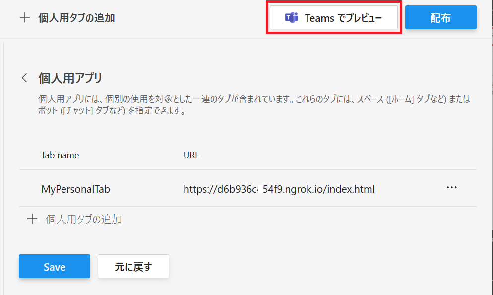

# 演習 2 : タブ アプリケーション
Microsoft Teams のタブは豊富なコンテンツに接続することができます。

タブを使用すると、用途に合わせた適切なツールやサービスをチャネルやプライベートチャットに取り込むことができます。
豊富なダッシュボードとデータビジュアライゼーションの追加、ドキュメントの共同作業、ノートの取得、グループ全体でのタスクの管理、デザインの共有などが行えます。

Microsoft Teams のタブには以下の 2 種類のタブがあります。

* **静的(パーソナル)タブ**

    パーソナルなスコープのタブです。個々のユーザーをサポートします。

    たとえば、職位や給与に関する情報や有給休暇の所得状況、トレーニングの受講状況など、他者と共有しないユーザー毎のパーソナルな情報を扱うアプリに向いています。パーソナル タブを使用すると、ユーザーは自分だけの情報をチーム全体で共有することなく利用できます。

* **構成可能タブ**

    チャネル単位のスコープのタブです。静的タブがユーザーごと利用であるのに対し、構成可能タブはチャネルの一部になり、チャネルを参照可能なチームのメンバーにおなじ情報を提供します。構成可能タブには、コンテンツページに加えてタブとして追加されるページの初期設定を行う構成ページがあります。

## タブのスコープ
Microsoft Teams は、そのスコープに基づいてタブを使用できる場所を決定します。スコープはアプリ マニフェストで設定され、次の値のいずれかになります。

* **チーム (team)**

    チャネルの一部として、チームのメンバーから共有されます。

    現在、チャネル内のすべてのタブは構成可能タブです。ユーザーがタブを最初にチャネルに追加するときに、タブエクスペリエンスのコンテンツを構成します。
* **グループ チャット (groupchat)**

    構成可能タブはグループチャットでも使用できます。これらは、2人以上のユーザー間の会話です。

* **ミーティング (meeting)**

    Teams 会議用のアプリを作成する際に[指定](https://docs.microsoft.com/ja-jp/microsoftteams/platform/apps-in-teams-meetings/create-apps-for-teams-meetings?tabs=json#update-your-app-manifest)します。

    Teams 会議用のアプリの作成については以下のドキュメントをご参照ください。

    * [**Teams 会議用のアプリを作成する**](https://docs.microsoft.com/ja-jp/microsoftteams/platform/apps-in-teams-meetings/create-apps-for-teams-meetings)


* **パーソナル (personal)**

    パーソナルスコープのタブを使用すると、ユーザーはプライベートな自分のエクスペリエンスと対話できます。現在、このようなタブはすべて静的タブです。

## Web ページをタブ アプリケーションとして追加するための要件と注意
Microsoft Teams には Web ページをタブとして追加できますが、すべての Web ページがタブに適切に表示できるわけではありません。
カスタムタブ内に読み込まれたページは以下の要件を満たす必要があります。

* **Web ページで iframe での表示を許可**

    多くの標準的な Web ページはコンテンツの盗用やセキュリティのリスクを考慮し iframe での表示を許可していません。

    その場合は [X-Frame-Options](https://developer.mozilla.org/ja/docs/Web/HTTP/X-Frame-Options) および/または [Content-Security-Policy](https://developer.mozilla.org/ja/docs/Web/HTTP/Headers/Content-Security-Policy) ヘッダーを設定して Microsoft Teams のドメインに対してのみ適切な許可を与えます。

* **Web ページで使用されている認証を別の方法で処理**
    
    多くの Web サイトの認証では認証処理をログイン プロバイダーにリダイレクトして行いますが、ログインページはクリックジャッキング攻撃を防止するために iframe でレンダリングされないようになっています。そのため Microsoft Teams のタブ内から Web ページにログインすることはできません。
    これを解決するには[ポップアップを使用するか、トークンを取得する](https://docs.microsoft.com/ja-jp/microsoftteams/platform/tabs/how-to/authentication/auth-flow-tab)ための呼び出しを行います。
    
* **クロスドメイン処理**

    Microsoft Teams クライアントは、タブの読み込み時または通信時に、アプリ マニフェストの静的 [validDomains](https://docs.microsoft.com/ja-jp/microsoftteams/platform/resources/schema/manifest-schema#validdomains) リストに対してオリジンを検証する必要があるため、[クロスドメイン ナビゲーション](https://docs.microsoft.com/ja-jp/microsoftteams/platform/tabs/how-to/tab-requirements)を異なる方法で処理します。

\<参考>

* [**Microsoft Teams タブとは**](https://docs.microsoft.com/ja-jp/microsoftteams/platform/concepts/tabs/tabs-overview)


## タスク 1 : パーソナル (静的) タブの追加
パーソナル タブは個々のユーザーをサポートしています。追加したタブを第三者に公開することなく自分だけで使用することができます。

このチュートリアルでは静的な Web ページで [Microsoft Teams JavaScript client SDK](https://docs.microsoft.com/en-us/javascript/api/overview/msteams-client?view=msteams-client-js-latest) を使用して現在のユーザーの簡易的な情報を表示するページ作成し、パーソナル タブとして追加します。


### ユーザーの情報を表示する Web ページの作成

Microsoft Teams にパーソナル タブとして表示する Web ページを作成します。
このページは Teams のタブとして開かれたときだけ現在のユーザーの情報を返します。

具体的な手順は以下のとおりです。

(*) Visual Studio Code で紹介しますが、Visual Studio をお使いの方は、そちらの作業手順に読み替えてください。

1. コマンドプロンプトを起動し、cd コマンドで作業ディレクトリを任意の場所に切り替えます

2. mkdir コマンドを使用してディレクトリ teamsTab を作成します 
    ```
    mkdir teamsTab
    ```
3. cd コマンドを使用して、作業ディレクトリを teamsTab に切り替えます 
    ```
    cd teamsTab
    ```

4. 以下のコマンドを使用して Visual Studio Code を起動します。 
    ```
    code .
    ```
5. Visual Studio Code のメニュー [File] - [New File] クリックします。

6. メニュー [File] - [Save As...] クリックし、ファイルを index.html という名前で保存します。(※ファイルを保存する際、保存ダイアログボックスで \[ファイルの種類] を HTML を指定するようにしてください )

7. Visual Studio Code で開かれている index.html に以下の内容をコピーして貼り付けます。
    ```
    <!DOCTYPE html>
    <html>
    <head>
        <meta charset="utf-8" />
        <title>Teams Tab App Sample</title>
        <style>
            table {
                font-weight: bold;
                font-size: 20px;
            }
            .context-data {
                color:blue;
            }

            /*ここに演習 2 のタスク 3-2 で CSS を追加*/

        </style>
    <!-- Microsoft Teams JavaScript API (via CDN) -->
        <script src="https://statics.teams.microsoft.com/sdk/v1.5.2/js/MicrosoftTeams.min.js"
        crossorigin="anonymous"></script>
        <script>
        let $id = (id) => { return document.getElementById(id); }
        let display,videoFrame,videoContainer;
       
        //microsoftTeams クラスの初期化
        microsoftTeams.initialize();
      
        //DOM がロードされてから
        document.addEventListener('DOMContentLoaded', () => {
            //Microsoft Teams のユーザーコンテキストを取得
            microsoftTeams.getContext((context) => {
                $id('showUpn').innerText = context.upn;
                $id('showObjectId').innerText = context.userObjectId;
                $id('showTheme').innerText = context.theme;
                $id('showLocale').innerText = context.locale;
            });
            display = $id('display');
            /*ここに演習 2 のタスク 2 でコードを追加*/
            /*ここに演習 2 のタスク 3-2 のステップ 2 で コードを追加*/
        });
        /*ここに演習 2 のタスク 3-1 で コードを追加*/
        /*ここに演習 2 のタスク 3-2 の ステップ 3 で コードを追加*/
        </script>
    </head>
    <body>
        <h1>Microsoft Teams Tab App サンプル</h1>
        <h2>Teams のユーザーとチャネルコンテキスト</h2>
        <p>以下にはプラグインされた Teams の Tab SDK で取得されたユーザーのコンテキスト情報が表示されます。 </p>
        <table>
            <tr><td>UPN</td><td id="showUpn" class="context-data"></td></tr>
            <tr><td>userObjectId</td><td id="showObjectId" class="context-data"></td></tr>
            <tr><td>Theme</td><td id="showTheme" class="context-data"></td></tr>
            <tr><td>Locale</td><td id="showLocale" class="context-data"></td></tr>
        </table>

        <!-- ここに演習 2 のタスク 3-1 でタグを追加-->
        <!-- ここに演習 2 のタスク 3-2 でタグを追加-->
        <div id="display"></div>
        </body>
    </html>
    ```
    [Ctrl] + [S] キーを押下して変更を保存します。

8. Visual Studio Code のメニュー [Terminal] - [New Terminal] をクリックします。

9. 画面下部にターミナルウインドウが表示されるので、同ウィンドウ内で以下のコマンドを実行してシェルを Command Prompt に変更します。
    ```
    cmd
    ```
10. ターミナルウインドウで以下のコマンドを実行します。
    ```
    http-server
    ```
    もし、http-server が起動しない場合は Readme の \[[要件](Readme.md#要件)] の内容を確認してください。

11. Web ブラウザーを起動し、以下の URL にアクセスします。
    ```
    http://localhost:8080/index.html
    ```
    以下の内容が表示されることを確認してください。

    

    Teams のタブでロードされていないので、ユーザーの情報がロードされていません。
<br>

### インターネットへのトンネリング
ローカルで動作している Web サーバーに Microsoft Teams がアクセスできるよう、ngrok を使用してトンネリングをおこないます。

1. Visual Studio Code のメニュー \[Terminal\] - \[New Terminal\] をクリックします。

2. 画面下部にターミナルウインドウが表示されるので、同ウィンドウ内で以下のコマンドを実行します。

    ```
    ngrok http 8080 --host-header=localhost
    ```

    (※)もし、ngrok を npm でなく、ダウンロードして使用する場合はコマンドプロンプトで作業ディレクトリを ngrok.exe のあるディレクトリとし、cmd コマンドでシェルを切り替えたあとコマンドを実行してください。

3. エコーされた内容の Forwarding の横に表示された **https** のドメイン名を使用してアクセスします。

    

    たとえば、ngrok から返されたドメイン名が https://9fcf38b6.engrok.io だった場合は以下の URL でインターネットからローカルの default.html にアクセスすることができます。 

    https://9fcf38b6.engrok.io/index.html

    ローカル アドレスでアクセスしたときと同じコンテンツが表示されることを確認してください。

    **なお、engrok は終了すると、次回起動したときにドメイン名が変わってしまうので注意してください。**

ここまでの手順で、作成した Web ページに Microsoft Teams からアクセスできるようになりました。

<br />

## Teams パーソナルタブとして追加
ローカル環境でホストされている Web コンテンツを Microsoft Teams にパーソナル タブとして追加します。

この手順は App Studio の後継である Microsoft Teams 用 開発者ポータルで行います。

なお、App Studio の利用は 2021 年 11 月から非推奨となっています。もしなんらかの理由で App Studio を利用してパーソナル タブの追加を行う必要がある場合は[この手順](opt/use_appStudio.md#app-studio-%E3%82%92%E4%BD%BF%E7%94%A8%E3%81%97%E3%81%9F%E3%83%91%E3%83%BC%E3%82%BD%E3%83%8A%E3%83%AB-%E3%82%BF%E3%83%96%E3%81%AE%E8%BF%BD%E5%8A%A0)を参照してください。

<br>

### Microsoft Teams 用 開発者ポータル を使用したパーソナル タブの追加

Web サイトである Microsoft Teams 用 開発者ポータルを使用してパーソナル タブの追加を行います。

具体的な手順は以下のとおりです。

1. Web ブラウザーから [**Microsoft Teams 用 開発者ポータル**](https://dev.teams.microsoft.com/) にアクセスし、Teams アプリ開発に使用するアカウントでログインします

2. 画面左のメニューバーの\[**Apps**\] をクリックしすると、アプリの一覧が表示されるので、一覧から[演習 1](Ex01.md) で登録したアプリ **My first app** をクリックします

3. アプリの設定画面に遷移するので、画面左のメニューから \[**構成する**\]-\[**アプリの機能**\] を選択します

4. 機能の一覧が表示されるので \[**個人用アプリ**\] のタイルをクリックします

    

5. 遷移した先の画面で \[**最初の個人用アプリ タブを作成する**\] アイコンか、画面上部の　\[**+ 個人用タブの追加**\] メニューをクリックします

    

6. **個人用アプリにタブを追加**ダイアログボックスが表示されるので、各項目を以下のように設定します

    |項目|値|
    |---|---|
    | 名前* | MyPersonalTab |
    | エンティティ ID* | 既定で設定されているGUID |
    | コンテンツ* | ngrok でホストされている URL |
    | Web サイト URL | 入力なし |

    実際の画面は以下の通りです。

    

    <!--
    メモ
    https://marketplace.visualstudio.com/items?itemName=ms-vscode.live-server
    -->

    \[**追加**\] ボタンをクリックします

7. **個人用アプリ** 画面に遷移するので、同画面の \[**Save**\]ボタンをクリック後、上部にある \[**Teams でプレビュー**\] ボタンをクリックします

    

8. Web ブラウザーが起動し、アラート ボックスに「**このサイトは、Microsoft Teams を開こうとしています。**」と表示されるので、デスクトップ アプリで試す場合は同アラート ボックス内の \[開く\] ボタンをクリックします。 Web ブラウザーに Teams をロードして試す場合は、同アラート ボックスの \[**キャンセル**\] ボタンをクリック後、Web ブラウザーのドキュメント ウィンドウ内の \[**代わりに Web アプリを使用**\] ボタンをクリックします

9. **My first app** のダイアログボックスが表示されるので \[追加] ボタンをクリックします。

    Teams 内にタブとして作成した Web ページが表示され、以下のように現在 Teams を使用しているユーザーの情報が表示されていることを確認してください。

    


\<参考>

* [**Microsoft Teams タブのコンテキストを取得する**](https://docs.microsoft.com/ja-jp/microsoftteams/platform/concepts/tabs/tabs-context)

* [**Microsoft Teams の個人用タブを作成する**](https://docs.microsoft.com/ja-jp/microsoftteams/platform/concepts/tabs/tabs-static)

<br><br>


## タスク 2 : チーム (構成可能) タブの追加
ローカル環境でホストされている Web コンテンツを Microsoft Teams にチーム タブとして追加します。

パーソナル タブの追加方法とは異なり、タブとして追加される Web ページ以外に設定 (構成) 用のページを作り、その中から Microsoft Teams JavaScript client SDK の [microsoftTeams.settings.setSettings メソッド](https://docs.microsoft.com/en-us/javascript/api/@microsoft/teams-js/microsoftteams.settings?view=msteams-client-js-latest#setsettings-settings-) を使用して登録を行います。

なお、以降の手順はタスク 1 でパーソナル タブ用として作成した Web ページを使用しますので、作成していない場合はタスク 1 の内容を参考に作成しておいてください。

### チームタブ 設定ページの作成
Microsoft Teams にチーム タブを追加する際に表示される設定ダイアログボックス用の Web ページを作成します。

なお、開発者ポータルでのチーム タブの登録に使用するのは、この設定ページの URL です。

手順は以下のとおりです。

1. タスク 1 で作成したパーソナル タブ用の Web ページのフォルダを Visual Studio Code でオープンします。

2. Visual Studio Code のメニュー \[File\] - \[New File\] クリックします。

3. メニュー \[File\] - \[Save As...\] クリックし、ファイルを **config.html** という名前で保存します。(※ファイルを保存する際、保存ダイアログボックスで \[ファイルの種類] を HTML を指定するようにしてください )

4. Visual Studio Code で開かれている config.html に以下の内容をコピーして貼り付けます。

    ```
    <!DOCTYPE html>
    <html>
    <head>
        <meta charset="utf-8" />
        <title>Team Tab Config.</title>
        <!-- Microsoft Teams JavaScript API (via CDN) -->
        <script src="https://statics.teams.microsoft.com/sdk/v1.5.2/js/MicrosoftTeams.min.js"
        crossorigin="anonymous"></script>
    </head>
    <body>
        <h1>Microsoft Teams チーム タブ<br>設定ページ サンプル</h1>

        タブの背景色 : 
        <!--タブとして追加されるページの背景色を指定-->
        <select id="colorSelector" >
            <option value="white" >白</option>
            <option value="gainsboro">灰</option>
            <option value="skyblue">青</option>
            <option value="yellow">黄</option>
        </select>
        <script>
            let colorName = '';
            microsoftTeams.initialize();
            microsoftTeams.settings.registerOnSaveHandler(function (saveEvent) {
                microsoftTeams.settings.setSettings({
                    entityId: 'myteamtab',
                    contentUrl: 'ngrok の ドメイン名/index.html' + colorName,
                    suggestedDisplayName: 'My first Team Tab',
                    websiteUrl: '',
                    removeUrl: 'ngrok の ドメイン名/config.html',
                });
                saveEvent.notifySuccess();
            });
            microsoftTeams.settings.setValidityState(true);
            document.getElementById('colorSelector').addEventListener('change',(evnt)=>{
                colorName = '?' + evnt.target.value;
            });
        </script>
    </body>
    </html>
    ```
    \[Ctrl\] + \[S\] キーを押下して変更を保存します。

5. Visual Studio Code のメニュー \[Terminal\] - \[New Terminal\] をクリックします。

6. 画面下部にターミナルウインドウが表示されるので、同ウィンドウ内で以下のコマンドを実行してシェルを Command Prompt に変更します。
    ```
    cmd
    ```
7. ターミナルウインドウで以下のコマンドを実行します。
    ```
    http-server
    ```
    もし、http-server が起動しない場合は Readme の \[[要件](Readme.md#要件)] の内容を確認してください。

8. Web ブラウザーを起動し、以下の URL にアクセスします。
    ```
    http://localhost:8080/config.html
    ```
    以下の内容が表示されることを確認してください。

    

9. Visual Studio Code のメニュー \[Terminal\] - \[New Terminal\] をクリックします。

10. 画面下部にターミナルウインドウが表示されるので、同ウィンドウ内で以下のコマンドを実行します。

    ```
    ngrok http 8080 --host-header=localhost
    ```

    (※)もし、ngrok を npm でなく、ダウンロードして使用する場合はコマンドプロンプトで作業ディレクトリを ngrok.exe のあるディレクトリとし、cmd コマンドでシェルを切り替えたあとコマンドを実行してください。

11. エコーされた内容の Forwarding の横に表示された **https** のドメイン名を使用してアクセスします。

    

    たとえば、ngrok から返されたドメイン名が https://9fcf38b6.engrok.io だった場合は以下の URL でインターネットからローカルの default.html にアクセスすることができます。 

    https://9fcf38b6.engrok.io/config.html

    ローカル アドレスでアクセスしたのと同じコンテンツが表示されることを確認してください。

    なお、ngrok はこの手順が完了するまで絶対に終了しないでください。

13. Visual Studio Code で開かれている **config.html** の \<script\> タグ内のコード中の「**ngrok の ドメイン名**」と書かれている箇所を ngrok の **https** のドメイン名に書き換え、キーボードの \[Ctrl] + \[S] キーを押下して保存します。

14. Visual Studio Code でタスク 1 で作成した **index.html** を開きます。

15. \<script\> タグの中のコードにあるコメント「**\/* ここに演習 2 のタスク 2 でコードを追加*/**」を以下のコードで置き換えます。
    ```
    // URL に付加された色名から背景色を設定
    ((qString)=>{
        document.body.style.backgroundColor = (qString)? (qString.substr(1,qString.length -1)):''; 
    })(window.location.search);
    ```

    キーボードの \[Shift\] + \[Alt\] + \[F\] を押下してコードのインデントを整えます。

    \[Ctrl\] + \[S\] キーを押下して変更を保存します。

ここまでの作業で、チーム タブの設定画面の作成は完了です。


## Teams チーム タブとして追加
ローカル環境でホストされている Web コンテンツを Microsoft Teams にチーム タブとして追加します。

この手順は Microsoft Teams 用 開発者ポータルで行います。

もしなんらかの理由で AppS tudio を使用する場合は[この手順](https://github.com/osamum/Easyway-for-MSTeamsAppDev/blob/update2021November/opt/use_appStudio.md#app-studio-%E3%81%A7%E3%81%AE%E3%83%81%E3%83%BC%E3%83%A0-%E3%82%BF%E3%83%96%E3%81%AE%E8%BF%BD%E5%8A%A0)を参照してください。


### **Microsoft Teams 用 開発者ポータル を使用したチーム タブの追加**

Web サイトである **Microsoft Teams 用 開発者ポータル**を使用してチーム タブの追加を行います。

具体的な手順は以下のとおりです。

1. Web ブラウザーから [Microsoft Teams 用 開発者ポータル](https://dev.teams.microsoft.com/) にアクセスし、Teams アプリ開発に使用するアカウントでログインします

2. 画面左のメニューバーの\[**Apps**\] をクリックしすると、アプリの一覧が表示されるので、一覧から演習 1 で登録したアプリ **My first app** をクリックします

3. アプリの設定画面に遷移するので、画面左のメニューから \[**構成する**\]-\[**アプリの機能** \] を選択します

4. 機能の一覧が表示されるので \[**グループとチャネルアプリ**\] のタイルをクリックします

    

5. **グループとチャネル アプリ**の設定ページが表示されるので、各項目を以下のように設定します

    |項目|値|
    |---|---|
    | 構成 URL | ngrok でホストされている config.html の URL |
    |Users can reconfigure the app| チェック|
    | 範囲 | チャット : チェック <br>チャネル : チェック |
    | SharePoint の設定 (該当する場合) | チェックしない|

    \[**Save**\] ボタンをクリックします。

6. 同画面上部にある\[**Teams でプレビュー**\] ボタンをクリックします

7. Web ブラウザーが起動し、アラート ボックスに「**このサイトは、Microsoft Teams を開こうとしています。**」と表示されるので、デスクトップ アプリで試す場合は同アラート ボックス内の \[開く\] ボタンをクリックします。 Web ブラウザーに Teams をロードして試す場合は、同アラート ボックスの \[**キャンセル**\] ボタンをクリック後、Web ブラウザーのドキュメント ウィンドウ内の \[**代わりに Web アプリを使用**\] ボタンをクリックします

8. My first app のダイアログボックスが表示されるので \[**チームに追加**\] ボタンをクリックします。
    
    

9. チームタブを追加するチームの一覧がドロップダウンされるので、任意のチーム名を選択し\[**タブを設定**\]ボタンをクリックします

    


10. 前述の手順で作成した config.html が設定ダイアログボックスとして表示されるので、config.html 内の \[タブの背景色] ドロップダウンリストボックスから任意の色名を選択して \[保存] ボタンをクリックします。

    

以上で、チーム タブの追加は完了です。

選択したチャネルにタブが追加され、表示されたタブの背景色が以下のように設定ダイアログボックスで指定した色になっていることを確認してください。


\<参考>

* [**構成ページを作成する**](https://docs.microsoft.com/ja-jp/microsoftteams/platform/concepts/tabs/tabs-configurable)


<br />

## 会議 タブとして追加

ここまでの手順で作成した構成可能タブを使用して会議にタブ アプリを追加します。

なお、タブ アプリを追加する Teams 会議は以下の条件を満たしている必要があります。

1. **参加者が指定されている**
2. **チャネルミーティングではい**

会議の作成から会議タブのインストールまでの手順は以下のとおりです。

**会議の作成**

1. Teams の画面左のメニューより \[カレンダー\] をクリックします

2. 左ペインにカレンダーが表示されるので、カレンダー内の任意の日時のグリッドをクリックします

3. \[**新しい会議**\] の作成フォームが表示されるので、各項目を以下のように設定します


    |項目(フォーターマーク)|値|
    |---|---|
    |タイトルを追加| "Teams 会議タブの追加テスト" |
    |必須出席者を追加| (1名以上の自分以外のメンバーを指定) |
    |日時| (既定のまま) |
    |繰り返し|(既定のまま)|
    |チャネルを追加|(既定のまま:追加しない)|
    |この新しい会議の詳細を入力します|"これは会議にタブアプリを追加する演習用です。"|
    
    


4. ページ右上の \[**送信**\] ボタンをクリックします

以上で Teams 会議の作成は完了です。


**Teams 会議へのタブ アプリのインストール**

会議に前の手順で作成したタブ アプリをインストールします。これには[チーム (構成可能) タブ](https://github.com/osamum/Easyway-for-MSTeamsAppDev/blob/master/Ex02.md#%E3%82%BF%E3%82%B9%E3%82%AF-2--%E3%83%81%E3%83%BC%E3%83%A0-%E6%A7%8B%E6%88%90%E5%8F%AF%E8%83%BD-%E3%82%BF%E3%83%96%E3%81%AE%E8%BF%BD%E5%8A%A0) を使用します。

会議にインストール可能なタブ アプリとするためには、アプリ マニフェストに以下のドキュメントにある追加の設定を行う必要があります。

* [Teams 会議で使用するアプリの有効化 - マニフェストを更新する](https://docs.microsoft.com/ja-jp/microsoftteams/platform/apps-in-teams-meetings/enable-and-configure-your-app-for-teams-meetings#update-your-app-manifest)

この設定について、開発者ポータルは現在(2022年1月)はまだサポートされていないので、アプリ パッケージをダウンロードして取り出し manifest.json の内容を編集し戻し、同アプリ パッケージをインストールしてアプリの動作を確認する必要があります。

ただし、現在、非推奨となっている AppStudio には同設定を行うための UI が追加されていますので手早く確認したい場合は AppStudio を使用してもいいかもしれません。

AppStudio を使用した Teams 会議へのタブ アプリの追加手順については以下の内容をご参照ください。

* [**App Studio での会議 タブの追加**](opt/use_appStudio.md#app-studio-%E3%81%A7%E3%81%AE%E4%BC%9A%E8%AD%B0%E3%82%BF%E3%83%96%E3%81%AE%E8%BF%BD%E5%8A%A0)

開発者ポータルを使用する手順は以下のとおりです。

1. [開発者ポータル](dev.teams.microsoft.com/) にログインします

2. 画面左のメニューバーより\[[**Apps**](https://dev.teams.microsoft.com/apps)\] をクリックし、表示されたアプリの一覧から前の手順で作成したチーム (構成可能) タブ アプリをクリックします

3. アプリの設定画面内左のツリーメニューより \[**Publish**\]-\[**App package**\] をクリックします

4. 遷移した画面上部の \[**Download app package**\] をクリックして *(アプリ名)*.zip と名前のついたアプリ マニフェストファイルをダウンロードし、同 zip ファイルより **manifest.json** ファイルを取り出します 

    

5. 取り出した manifest.json ファイルを任意のテキストエディタで開き、configurableTabs 内の **context** に以下のように"**privateChatTab**","**meetingSidePanel**","**meetingDetailsTab**","**meetingChatTab**","**meetingStage**" を追記して保存します

    ```
    "configurableTabs": [
        {
            "configurationUrl": 
                "https://ngrokのドメイン名/config.html",
            "canUpdateConfiguration": true,
            "scopes": [
                "team",
                "groupchat"
            ],
            "context": [
                "channelTab",
                "privateChatTab",
                "meetingSidePanel",
                "meetingDetailsTab",
                "meetingChatTab",
                "meetingStage"
            ]
        }
    ],
    ```

6. ダウンロードした *(アプリ名)*.zip 内の manifest.json ファイルを、前のステップで編集したものと入れ替えます

7. Microsoft Teams の画面左のメニューで \[**アプリ**\]をクリックし、遷移した画面のメニューで\[**アプリの管理**\] します。

    左ペインに表示される \[**カスタム アプリをアップロード**\] ボタンをクリックし、表示されるファイル選択ダイアログボックスで編集した *(アプリ名)*.zipファイルを選択します

    

8. **Test and Distribute** の画面が表示されるので同画面の \[**Install**\] ボタンをクリックします。

9. アプリのインストールダイアログボックスが表示されるので、\[**チームに追加**\] ボタン右横の **▼** マークをクリックし、表示されたドロップダウンリストから\[**会議に追加する**\] をクリックします

    

10. 会議の検索画面が表示されるので、会議のタイトルに含まれるキーワードで目的の会議を検索し、選択して \[**タブを設定**\]ボタンをクリックします

    

上記の手順でタブ アプリを Teams 会議に追加することができます。


<br />

\<参考>

* [**Teams 会議で使用するアプリの有効化**](https://docs.microsoft.com/ja-jp/microsoftteams/platform/apps-in-teams-meetings/enable-and-configure-your-app-for-teams-meetings)

<br />

## タスク 3: タブでのタスク モジュールの表示

タスクモジュールを使用すると、Teams アプリケーションでモーダル ポップアップエクスペリエンスを作成できます。

ポップアップ内で、独自のカスタム HTML/JavaScript コードを実行したり\<iframe\> タブを使用して、YouTube や [Microsoft Stream](https://products.office.com/ja-jp/microsoft-stream) ビデオなどをベースにしてウィジェットを表示したり、アダプティブカードを表示したりできます。

タスク モジュール機能をサポートするために、Microsoft Teams クライアント SDK に 2 つの新しい[機能が追加されました。](https://docs.microsoft.com/ja-jp/javascript/api/overview/msteams-client?view=msteams-client-js-latest)

タブ上にタスクモジュールを表示するための **microsoftTeams.tasks.startTask** メソッドと、表示したタスクモジュールをクローズし、ユーザーが設定したタスクモジュールの値を呼び出し元に返す **microsoftTeams.tasks.submitTask** メソッドです。

```
[TypeScript]
    microsoftTeams.tasks.startTask(
        taskInfo: TaskInfo,
        submitHandler?: (err: string, result: string | any) => void
        ): void;

    microsoftTeams.tasks.submitTask(
        result?: string | any,
        appIds?: string | string[]
        ): void;
```
この演習ではこの 2 つのメソッドを利用して以下の機能を実装します。

- 外部の HTML 内のフォームを使用したタスクモジュール
- アダプティブ カードを使用したタスクモジュール

### タスク 3-1 : 外部の HTML フォームをタスクモジュールとしてタブに追加

これまでの手順で作成したタブに、外部の html ファイルを入力フォームとして使用するタスクモジュールを追加します。

手順は以下のとおりです。

1. タスク 1、タスク 2 で作成したタブ用の Web ページのフォルダを Visual Studio Code でオープンします。

2. メニューバーの\[File\]-\[New File\]をクリックし、**inputform.html** という名前でファイルを新規に追加します。

3. ファイル**inputform.html**に以下の内容をコピーして貼り付けます。

    ```
    <!DOCTYPE html>
    <html lang="ja">
    <head>
        <meta charset="UTF-8">
        <meta http-equiv="X-UA-Compatible" content="IE=edge">
        <meta name="viewport" content="width=device-width, initial-scale=1.0">
        <title>Document</title>
        <!-- Microsoft Teams JavaScript API (via CDN) -->
        <script src="https://statics.teams.microsoft.com/sdk/v1.5.2/js/MicrosoftTeams.min.js"
        crossorigin="anonymous"></script>
    </head>
    <body>
        <h1>新規顧客情報の入力 : </h1>
        <form method="POST" id="customerForm" action="https://httprequestchecker2.azurewebsites.net/api/Values"
        onSubmit="return validateForm()">
        <!-- form の action 属性に設定されている URL は POST された内容を JSON で返すだけの検証用のサービスです。 
            POST された情報は保存されないので、このまま演習に使用してください。
        -->
            <div id="infoBox" style="width: 380px;height: 400px;">
                <div>Name:</div>
                <div>
                    <input type="text" name="name" style="width: 100%;">
                </div>
                <div>Email:</div>
                <div>
                    <input type="text" name="email" style="width: 100%;">
                </div>
                <div>Favorite book:</div>
                <div>
                    <input type="text" name="favoriteBook" style="width: 100%;">
                </div>
                <div>
                    <input type="submit" value="登録">
                </div>
            </div>
        </form>
    </body>
    <script>
        microsoftTeams.initialize();
        //タスクモジュールの呼び出し元に返す情報をセット
        function validateForm() {
            let customerInfo = {
                name: document.forms['customerForm']['name'].value,
                email: document.forms['customerForm']['email'].value,
                favoriteBook: document.forms['customerForm']['favoriteBook'].value
            }
            //タスクモジュールを閉じ、情報を呼び出し元に送る
            microsoftTeams.tasks.submitTask(customerInfo, 'ここに Teams アプリのApp IDを記述');
            return true;
        }
    </script>

    </html>
    ```
4. 貼り付けたページ内の script タグ内の **microsoftTeams.tasks.submitTask メソッド** の第二引数にセットされている文字列 **'ここに Teams アプリのApp IDを記述'** を検証用 Teams アプリの App ID (演習 1 で App Studio で自動生成したGUID) で置き換えます。

5. index.html をオープンし、script タグ内のコメント **\/\*ここに演習 2 のタスク 3-1 で コードを追加\*\/** を以下のコードで置き換えます。
    ```
    function displayInfo(infoText) {
        let div = document.createElement('div');
        div.innerText = infoText;
        display.appendChild(div);
    }

    function showGetUserInfoTaskMod() {
        //url プロパティにタスクモジュールとして表示する html を指定
        const taskModuleInfo = {
            title: "Custom Form",
            height: 510,
            width: 430,
            url: `https://${document.domain}/inputform.html`,
                card: null,
                fallbackUrl: null,
                completionBotId: null,
            };

        let submitHandler = (err, result) => {
            displayInfo('----- Submit handler Info -----');
            displayInfo(`Submit handler - err: ${err}`);
            displayInfo(`Submit handler - result\rName: ${result.name}\rEmail: ${result.email}\rFavorite book: ${result.favoriteBook}`);
        };
        microsoftTeams.tasks.startTask(taskModuleInfo, submitHandler);
    }
    ```

    キーボードの\[Shift\]+\[Alt\]+\[F\] キーを押下してコードのインデントを整えます。 

6. index.html の body タグ内 **\<\!-- ここに演習 2 のタスク 3-1 でタグを追加--\>** のコメントタグを以下のタグで置き換えます。
    ```
    <button onclick="showGetUserInfoTaskMod()">別 html のフォームをタスクモジュールとして表示</button>
    <br><br>
    ```

 7. 以前のタスクで Microsoft Teams に追加されたタブをそれぞれ以下の方法で削除します。

    * **パーソナル タブ**

        1. Microsoft Teams の左側のメニュー \[・・・\](さらに追加されたアプリ) をクリックします。

        2. インストールされているアプリケーションのタイルの一覧の中から **My first app** を右クリックし、表示されたコンテキストメニューから\[アンインストール]を選択します。

        3. アンインストールの確認ダイアログボックスが表示されるので \[アンインストール\] ボタンをクリックします。

    *   **チーム タブ**
        1. Microsoft Teams の左側のメニュー \[チーム\]をクリックします。

        2. チームの一覧で、任意のチーム名の右側にある \[・・・\](その他のオプション)をクリックし、\[チームを管理\]メニューをクリックします。

        3. チャネル名の下に \[メンバー\]、\[チャネル\]、\[設定\]、\[分析\]、\[アプリ\] のタブが横に並んで表示されるので \[アプリ\] をクリックします。

        4. チャネルにインストールされているアプリの一覧が表示されるので **My first app** の行の右端にあるごみ箱のアイコンをクリックします。

        5. アンインストールの確認ダイアログボックスが表示されるので \[アンインストール\] ボタンをクリックします。

8.  以前の タスク 1, 2 の手順に従い App Studio から再度タブをインストールします。

    この演習の結果を確認するにはパーソナルタブ、チームタブ、どちらでもかまいません。
    
    また、キャッシュの影響でページが更新されないことがあるので App Studio でタブとして指定している Web ページの URL (\[Content URL\]) に以下のようにダミーのクエリーストリングを付加してください。

    Ex) https://xxxxxx.ngrok.io/index.html?id=dummy

9. インストールが完了すると、タブの中に \[別 html のフォームをタスクモジュールとして表示\] ボタンが表示されるのでクリックしします。

10. inputform.htmlがタスクモジュールとしてモーダル表示されるので、フォームの各項目に任意の値を入力して\[登録\] ボタンをクリックします。

    

11. タスクモジュールがクローズされ、タブ上にタスクモジュールのフォームに入力した情報が表示されるのを確認してください。

この演習では外部の html ファイル内のフォームをタスクモジュールとして使用する方法について機能を実装しました。

演習用で使用した inputform.html の form タグの action 属性には、POST 先として、検証用のダミーサービスの URL を指定していますが、実際にアプリケーションを開発する際には
そのアプリケーションが使用するサービスの URL を指定してください。


### タスク 3-2 : アダプティブ カードをタスクモジュールとしてタブに追加

これまで作成したタブに、アダプティブ カードで定義したタスクモジュールを表示してユーザーに Youtube のビデオ ID の入力を促し、任意の Youtube ビデオを表示する機能を実装します。

手順は以下のとおりです。


1. index.html の \<style\> タグ内のコメント「**/\*ここに演習 2 のタスク 3 で CSS を追加\*/**」を以下のマークアップで置き換えます。

    ```
    #embed-container iframe {
            position: absolute;
            top: 0;
            left: 0;
            width: 95%;
            height: 95%;
            padding-left: 20px;
            padding-right: 20px;
            padding-top: 10px;
            padding-bottom: 10px;
            border-style: none;
        }
    ```

2. \<script\> タグ内のコメント「**/\*ここに演習 2 のタスク 3-2 のステップ 2 で コードを追加\*/**」を以下のコードで置き換えます。

    ```
    videoFrame = $id('videoFrame');
    videoContainer = $id('embed-container');
    document.body.addEventListener('click', () => {
        videoContainer.style.display = 'none';
    });
    ```
    キーボードの\[Shift\]+\[Alt\]+\[F\] キーを押下してコードのインデントを整えます。

2. \<script\> タグ内のコメント「**/\*ここに演習 2 のタスク 3-2 のステップ 3 でコードを追加します\*/**」を以下のコードで置き換えます。

    ```
    const adptvCard = {
        "$schema": "http://adaptivecards.io/schemas/adaptive-card.json",
        "type": "AdaptiveCard",
        "version": "1.0",
        "body": [
            {
                "type": "Container",
                "items": [
                    {
                        "type": "TextBlock",
                        "text": "YouTube Video Selector",
                        "weight": "bolder",
                        "size": "extraLarge"
                    }
                ]
            },{
                "type": "Container",
                "items": [
                    {
                        "type": "TextBlock",
                        "text": "タスクモジュールのプレーヤーに表示するYouTube動画のIDを入力してください。",
                        "wrap": true
                    },{
                        "type": "Input.Text",
                        "id": "youTubeVideoId",
                        "value": "rd0Rd8w3FZ0"
                    }
                ]
            }
        ],
        "actions": [
            {
                "type": "Action.Submit",
                "title": "Update"
            }
        ]
    };

    function showSetVidoCodeTaskMod() {
        const taskModuleInfo = {
            title: "YouTube Video Selector",
            card: adptvCard,
            width: 350,
            height: 250
        };

        let submitHandler = (err, result) => {
            displayInfo('----- Submit handler info -----');
            displayInfo(`Submit handler - err: ${err}`);
            displayInfo(`Submit handler - result\r YouTube Video ID: ${result.youTubeVideoId}`);

            videoFrame.src = `https://www.youtube.com/embed/${result.youTubeVideoId}`;
            videoContainer.style.display = 'block';

        };
        microsoftTeams.tasks.startTask(taskModuleInfo, submitHandler);
    }

    ```

5. \</body\> タグの内のコメント「**\<!-- ここに演習 2 のタスク 3-2 でタグを追加--\>**」を以下のタグで置き換えます。
    ```
    <button onclick="showSetVidoCodeTaskMod()">AdaptiveCard をタスクモジュールとして表示</button>
    <div id="embed-container" style="display: none">
        <iframe id="videoFrame" width="1000" height="700" src="https://www.youtube.com/"
            frameborder="0" allow="autoplay; encrypted-media" allowfullscreen=""></iframe>
    </div>
    ```

6. 以前のタスクで Microsoft Teams に追加されたタブをそれぞれ以下の方法で削除します。

    * **パーソナル タブ**

        1. Microsoft Teams の左側のメニュー \[・・・\](さらに追加されたアプリ) をクリックします。

        2. インストールされているアプリケーションのタイルの一覧の中から **My first app** を右クリックし、表示されたコンテキストメニューから\[アンインストール]を選択します。

        3. アンインストールの確認ダイアログボックスが表示されるので \[アンインストール\] ボタンをクリックします。

    *   **チーム タブ**
        1. Microsoft Teams の左側のメニュー \[チーム\]をクリックします。

        2. チームの一覧で、任意のチーム名の右側にある \[・・・\](その他のオプション)をクリックし、\[チームを管理\]メニューをクリックします。

        3. チャネル名の下に \[メンバー\]、\[チャネル\]、\[設定\]、\[分析\]、\[アプリ\] のタブが横に並んで表示されるので \[アプリ\] をクリックします。

        4. チャネルにインストールされているアプリの一覧が表示されるので **My first app** の行の右端にあるごみ箱のアイコンをクリックします。

        5. アンインストールの確認ダイアログボックスが表示されるので \[アンインストール\] ボタンをクリックします。

7.  以前の タスク 1, 2 の手順に従い開発者ポータルから再度タブをインストールします。

     この演習の結果を確認するにはパーソナルタブ、チームタブ、どちらでもかまいません。
    
    また、キャッシュの影響でページが更新されないことがあるので 開発者ポータルでタブとして指定している Web ページの URL (\[Content URL\]) に以下のようにダミーのクエリーストリングを付加してください。

    Ex) https://xxxxxx.ngrok.io/index.html?id=dummy2

8. タブの中に \[AdaptiveCard をタスクモジュールとして表示\] ボタンがクリックされるのクリックします。

9. Adaptive Card の JSON で定義されたタスクモジュールが表示され、YouTube動画のIDの入力を促すので、任意の YouTube 動画の URL に含まれる動画 ID を入力するか、既定のまま \[Update\] ボタンをクリックします。

    

10. Youtube のプレイヤーがモーダル ポップアップとして表示され、指定した ID の動画が表示されているのを確認してください。
    
    なお、タブの余白部分をクリックするとタスクモジュールを消すことができます。

    

<br><br>

# まとめ

この演習では Teams のタブアプリとして以下の機能を実装しました。

* プライベート&nbsp;タブ (静的タブ)
* チーム&nbsp;タブ (構成可能タブ)
* タブへのタスクモジュールの追加
    * 外部の html のフォームを使用
    * Adaptive Card を使用

演習用アプリがうまく動作しない場合は、**[サンプル](samples/Ex02)** の内容を参照してください。

\<参考>

* [**タブでタスク モジュールを使用する**](https://docs.microsoft.com/ja-jp/microsoftteams/platform/concepts/task-modules/task-modules-tabs)

**⇒【 3. [タブのシングルサインオン(SSO)](Ex02-SSO.md) 】へ**

<br>


## 目次
0. [**Microsoft Teams アプリケーション開発について**](Intro.md)

1. [**Microsoft Teams アプリケーションの新規作成**](Ex01.md)

    
2. [**タブ アプリケーション**](Ex02.md)
    * [**パーソナル タブ**](Ex02.md#%E3%82%BF%E3%82%B9%E3%82%AF-1--%E3%83%91%E3%83%BC%E3%82%BD%E3%83%8A%E3%83%AB-%E9%9D%99%E7%9A%84-%E3%82%BF%E3%83%96%E3%81%AE%E8%BF%BD%E5%8A%A0)


    * [**チーム タブ**](Ex02.md#%E3%82%BF%E3%82%B9%E3%82%AF-2--%E3%83%81%E3%83%BC%E3%83%A0-%E6%A7%8B%E6%88%90%E5%8F%AF%E8%83%BD-%E3%82%BF%E3%83%96%E3%81%AE%E8%BF%BD%E5%8A%A0)

    * [**会議 タブ**](Ex02.md#%E4%BC%9A%E8%AD%B0-%E3%82%BF%E3%83%96%E3%81%A8%E3%81%97%E3%81%A6%E8%BF%BD%E5%8A%A0)


    * [**タブ : タスクモジュールの表示**](Ex02.md#%E3%82%BF%E3%82%B9%E3%82%AF-3-%E3%82%BF%E3%83%96%E3%81%A7%E3%81%AE%E3%82%BF%E3%82%B9%E3%82%AF-%E3%83%A2%E3%82%B8%E3%83%A5%E3%83%BC%E3%83%AB%E3%81%AE%E8%A1%A8%E7%A4%BA)

        * [**外部の HTML フォームをタスクモジュールとしてタブに追加**](Ex02.md#%E3%82%BF%E3%82%B9%E3%82%AF-3-1--%E5%A4%96%E9%83%A8%E3%81%AE-html-%E3%83%95%E3%82%A9%E3%83%BC%E3%83%A0%E3%82%92%E3%82%BF%E3%82%B9%E3%82%AF%E3%83%A2%E3%82%B8%E3%83%A5%E3%83%BC%E3%83%AB%E3%81%A8%E3%81%97%E3%81%A6%E3%82%BF%E3%83%96%E3%81%AB%E8%BF%BD%E5%8A%A0)

        * [**アダプティブ カードをタスクモジュールとしてタブに追加**](Ex02.md#%E3%82%BF%E3%82%B9%E3%82%AF-3-2--actibity-card-%E3%82%92%E3%82%BF%E3%82%B9%E3%82%AF%E3%83%A2%E3%82%B8%E3%83%A5%E3%83%BC%E3%83%AB%E3%81%A8%E3%81%97%E3%81%A6%E3%82%BF%E3%83%96%E3%81%AB%E8%BF%BD%E5%8A%A0)
    
    * [**タブのシングルサインオン(SSO)**](Ex02-SSO.md)

    
3. [**ボット**](Ex03.md)
    * [**ボットの登録**](Ex03.md#%E3%83%9C%E3%83%83%E3%83%88%E3%81%AE%E7%99%BB%E9%8C%B2)

    * [**ボットのシングル サインオン (SSO)**](Ex03-SSO.md)
    
4. [**メッセージング拡張**](Ex04.md)
    * [**検索機能の実装**](Ex04.md#%E3%82%BF%E3%82%B9%E3%82%AF-1--%E3%83%A1%E3%83%83%E3%82%BB%E3%83%BC%E3%82%B8%E3%83%B3%E3%82%B0%E6%8B%A1%E5%BC%B5---wikipedia-%E6%A4%9C%E7%B4%A2%E6%A9%9F%E8%83%BD%E3%81%AE%E5%AE%9F%E8%A3%85)
    * [**操作機能の実装**](Ex04.md#%E3%82%BF%E3%82%B9%E3%82%AF-2--%E3%83%A1%E3%83%83%E3%82%BB%E3%83%BC%E3%82%B8%E3%83%B3%E3%82%B0%E6%8B%A1%E5%BC%B5---%E6%93%8D%E4%BD%9C%E3%82%A2%E3%82%AF%E3%82%B7%E3%83%A7%E3%83%B3%E3%82%B3%E3%83%9E%E3%83%B3%E3%83%89%E3%81%AB%E3%82%88%E3%82%8B%E5%A4%96%E9%83%A8%E3%82%B5%E3%83%BC%E3%83%93%E3%82%B9%E3%81%AE%E9%80%A3%E6%90%BA)
    
5. [**コネクタ**](Ex06.md)
    * [**受信 Webhook を利用したチャネルへの通知**](Ex06.md#%E3%82%BF%E3%82%B9%E3%82%AF-1--incomming-webhook-%E3%82%92%E5%88%A9%E7%94%A8%E3%81%97%E3%81%9F%E3%83%81%E3%83%A3%E3%83%8D%E3%83%AB%E3%81%B8%E3%81%AE%E9%80%9A%E7%9F%A5)
    * [**送信Webhook を利用した外部サービスの呼び出し**](Ex06.md#%E3%82%BF%E3%82%B9%E3%82%AF-2--%E9%80%81%E4%BF%A1outgoing-webhook-%E3%82%92%E5%88%A9%E7%94%A8%E3%81%97%E3%81%9F%E5%A4%96%E9%83%A8%E3%82%B5%E3%83%BC%E3%83%93%E3%82%B9%E3%81%AE%E5%91%BC%E3%81%B3%E5%87%BA%E3%81%97)