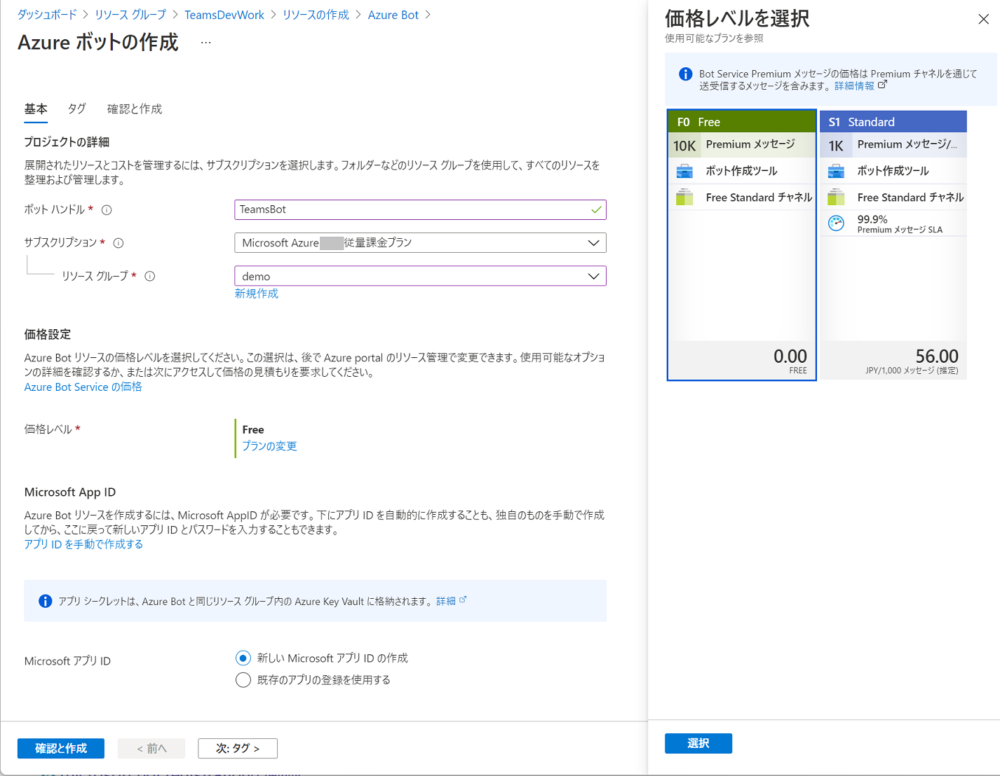
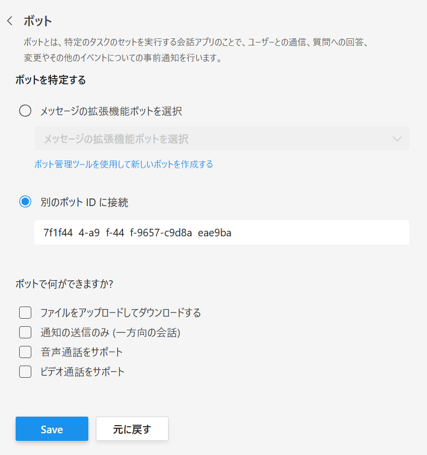
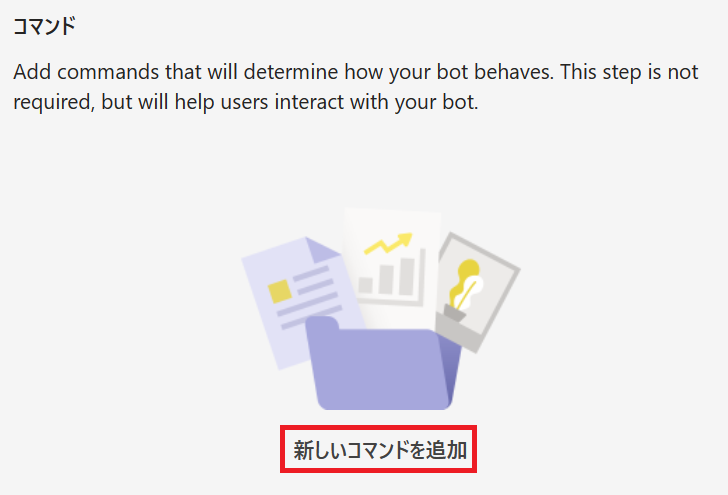
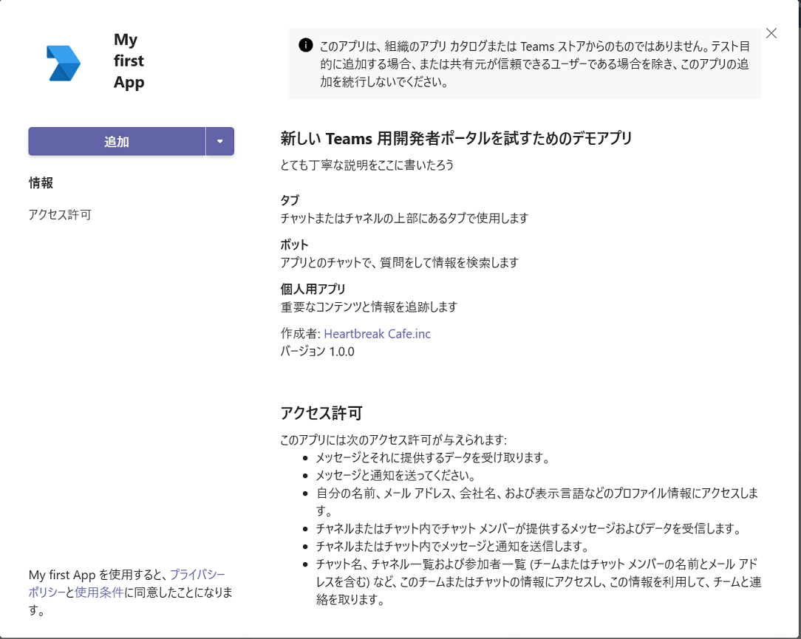
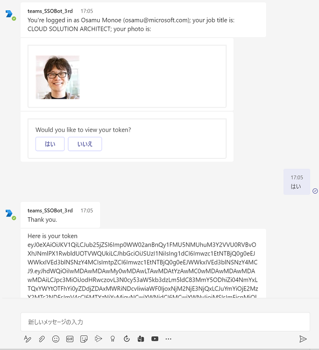

# Teams ボットのシングル　サインオン (SSO)
Azure Active Directory (AAD) のシングル サインオン (SSO) 認証を使用すると、サインインが必要なボットを使用する際の資格情報の入力を省略することができ、ユーザーにシームレスな利用体験を提供できます。

この演習では Teams ボットのシングル サインオン (SSO) に必要な設定を Azure Active Directory、Azure ボット、アプリ マニフェストに行い、 GitHub に用意されている[サンプル プロジェクト](https://github.com/OfficeDev/Microsoft-Teams-Samples/tree/main/samples/bot-conversation-sso-quickstart/js)を実行し、動作を確認します。
(※)

(※) Echo ボットのようなシンプルなボット アプリに Teams の SSO の機能をゼロから実装するとなると、コーディング量が非常に多くなるためサンプルアプリのコードを適宜利用することをお勧めします。 

なお、この演習には Microsoft Azure のサブスクリプションが必要です。

<br />

## 演習の準備

この演習では、これまでの演習で使用したサブスクリプションやツールの他に以下のものが必要になります。

* GitHub リポジトリ [**OfficeDev/Microsoft-Teams-SamplesPublic**](https://github.com/OfficeDev/Microsoft-Teams-Samples) をローカルに clone するか zip ファイルとしてダウンロードしておいてください(※)

    (※) clone するとしてもリポジトリ全体のイメージを取得することになるので、zip ファイルとして取得して、用途に合わせて必要なプロジェクトを取り出したほうが使い勝手が良いかもしれません。

* Azure のサブスクリプションをご準備ください

    現在の Teams ボットの SSO では、Azure Bot のインスタンスを使用するので Azure のサブスクリプションが必要です。

    開発用 Office 365 サブスクリプションを使用されている場合、Azure Active Directory は使用できますが、Azure の機能は使用できないので、同 Azure Active Directory に紐づいた試用アカウントをご用意ください(※)

    (※) 開発用 Office 365 サブスクリプションで使用しているアカウントで[Azure ポータル](https://portal.azure.com)に ログインし、なんからの Azure のリソースを作成しようとすると、試用アカウント作成のリンクか案内されるのでその案内に従ってください。

<br />

## サンプル プロジェクトの入手

SSO の機能が実装された Teams ボットアプリのサンプル プロジェクトを取得します。

以下のリポジトリを Clone するか、zip ファイルとしてダウンロードします。 

* [**OfficeDev/Microsoft-Teams-Samples**](https://github.com/OfficeDev/Microsoft-Teams-Samples)


クローンしたフォルダ、あるいは zip ファイルから以下のフォルダの内容を作業用フォルダにコピーしてください。

```
Microsoft-Teams-Samples-main\samples\bot-conversation-sso-quickstart\js
```

コピー先の作業用のフォルダを Visual Studio Code で開き、ターミナルウィンドウで以下のコマンドを実行して依存関係のあるモジュールをインストールします。

```
npm install
```

ここまでの手順でサンプル　プロジェクトの作業準備は完了です。

<br />


## Azure ボットの作成

Azure 上に Azure Bot のインスタンスを作成し、紐づけられた Azure Active Directory のアプリのエントリーに SSO で必要になる設定を行います。

具体的な手順は以下のとおりです。


1. Web ブラウザーで http://portal.azure.com にアクセスし [**Azure ポータル**](https://portal.azure.com)にサインインします

2. ポータル画面左上端のハンバーカーメニューをクリックし、\[**＋ リソースの作成**\]をクリックします

3. 遷移した画面の検索ボックスに "**bot**" と入力し \[Enter\] キーを押下します

4. 検索された結果から **Azure Bot** のカードをクリックします

    

    遷移した画面で \[**作成**\] ボタンをクリックします

5. ボットの作成画面が表示されるので各項目を以下のように設定します

    |項目|値|
    | ---- | ---- |
    |ボット ハンドル*|(ボットの一意の識別名)|
    |サブスクリプション*|(Azure のリソースを作成することのできるサブスクリプション)|
    |リソースグループ*|(任意のリソースグループ)|
    |価格レベル*|(既定では **Standard** ですが\[**プランの変更**\]リンクをクリックして **Free** を選択することもできます)|
    |Microsoft アプリ ID|**新しい Microsoft アプリ ID の作成**にチェック|

    実際の画面は以下のとおりです。

    

    各項目を設定後、\[**確認と作成**\] ボタンをクリックし、\[**作成**\] ボタンが表示されたらクリックしてデプロイを開始します。

6. デプロイが完了すると「**デプロイが完了しました**」と画面に表示されるので、同画面の\[**リソースに移動**\]ボタンをクリックします

7. 作成した Azure Bot の**概要**画面に遷移するので、画面左のメニューより \[**構成**\]をクリックします

8. \[**構成**\] の画面に遷移するので、\[**メッセージング エンドポイント**\] に以下の URL を設定します (※)

    ```
    https://ngrokが生成したドメイン名/api/messages
    ```
    (※) このタイミングではまだプロジェクトがホストされていないので仮の URL でも良いですし、ここで ngrok を起動しておいても可です。

9. 同画面の \[**Microsoft App ID**\] の下の GUID をコピーしてテキストエディタなどに貼り付けてメモします

10. \[**Microsoft App ID**\] の隣にある \[**管理**\] リンクをクリックします

    

11. Azure Active Directory の \[**証明書とシークレット**\] 画面に遷移するので、\[**+新しいクライアント シークレット**\]をクリックします (※)

    (※)じつは Azure Bot のインスタンスが生成された時点でシークレットが作られており、このシークレットは作成した Azure Bot とおなじリソースグループ内の Key Vault 内に保存されています。しかし、確認するための手順が多いので公式のドキュメントでもこの方法が紹介されています。

12. \[**クライアント シークレットの追加**\] ダイアログボックスが表示されるので、\[**説明**\] のボックスに用途について分かり易い説明を記述し、\[**有効期限**\] ドロップボックスで \[**推奨: 6か月**\] を選択して\[**追加**\] ボタンをクリックします 

13. クライアントシークレットが生成されるので \[**値**\] の内容をメモ帳などにコピーして保持します。

    **なお、このシークレットの値は生成直後でないとコピーすることができませんので必ずこのタイミングで取得しておいてください。**

    

14. ローカル開発環境のボット プロジェクト内のファイル **.env** を開き、ここまでの手順でメモした App ID とシークレットを使用して内容を以下のように書き換えます

    ```
    MicrosoftAppId=メモしておいた App ID
    MicrosoftAppPassword=メモしておいたクライアント シークレット
    ```

    ローカル開発環境のターミナル画面で以下のコマンドを実行してボット プロジェクトを起動します

    ```
    npm start
    ```

15. Azure の画面に戻り、画面上部のパンくずリストにある作成した Azure Bot の名前をクリックし、Azure Bot インスタンスの概要画面に戻ります

16. 画面左の\[**チャンネル**\] メニューをクリックし、表示された画面の \[**使用可能なチャネル**\] リストで **Micosoft Teams** をクリックします

17. \[**サービス条件**\] の確認ダイアログボックスが表示されるので内容を確認し、チェックボックスにチェックをつけ \[**同意**\] ボタンをクリックします

18. \[**Microsoft Teams を構成**\] 画面が表示されるので \[**保存**\] ボタンをクリックします

    

19. 画面左の \[**Web チャットでテスト**\] メニューをクリックします

    登録したボットと Web チャットで会話できるか確認します


ここまでで Azure Bot の設定は完了です。

この状態で、Teams 側のアプリ マニフェストに登録してインストールすれば、Teams ボットとして動作状態になっています。

<br />

## Teams との SSO に必要な Azure Active Directory の設定

Teams とボット アプリケーションとの SSO に必要なAzure Active Directory の設定を行います。

手順は以下のとおりです。

1. Azure ポータルにて、作成した Azure Bot インスタンスの\[**構成**\] 画面を表示し、 \[**Microsoft App ID**\] の隣にある \[**管理**\] リンクをクリックします

2. Azure Active Directory の \[**証明書とシークレット**\] 画面に遷移するので、左側のメニューから \[**認証**\] をクリックします

3. \[**認証**\] 画面の **プラットフォームの構成** で、\[**+プラットフォームの追加**\] をクリックし、表示されたブレードで \[**Web**\] のカードをクリックします

     

4. \[**Web の構成**\] ブレードが表示されるので \[**\* リダイレクト URL**\] に以下の URL を設定し、

    ```
    https://token.botframework.com/.auth/web/redirect
    ```

    \[**アクセス トークン (暗黙的なフローに使用)**\]、\[**ID トークン (暗黙的およびハイブリッド フローに使用)**\] チェックボックスにチェックをつけ \[**構成**\] ボタンをクリックします

    

5. 画面左のメニューで \[**API の公開**\] を選択し、遷移した画面で \[**設定**\]リンクをクリックすると、
    
    
    
    api://{AppID} の形式でアプリケーションID の URI が生成されるので、App ID の前に **botid-** を記述して以下の形式の URI を設定し \[**保存**\] ボタンをクリックします

    ```
    api://botid-ボットの App ID 
    ```
    **この URI はアプリ マニフェストの設定で使用するのでメモ帳などに貼り付けて保持します。**

6. \[**+ Scope の追加**]をクリックして\[スコープ名*] に **access_as_user** と入力します

7. \[**同意できるのはだれですか?**\] トグルボタンで \[**管理者とユーザー**]を選択します。

8. 他の項目を以下のように設定します。

    |項目|値|
    |---|---|
    | 管理者の同意の表示名 | Teams は、ユーザーのプロファイルにアクセスできます。 |
    | 管理者の同意の説明 | Teams は、アプリの Web API を現在のユーザーとして呼び出します。|
    | ユーザーの同意の表示名 | Teams はユーザー プロファイルにアクセスし、ユーザーの代わりに要求を行うことができます。|
    | ユーザーの同意の説明 | Teams は、ユーザーと同じ権限でこのアプリの API を呼び出します。|

    実際の画面は以下のとおりです。

    

9. \[状態] トグルボタンが \[**有効**] になっていることを確認し、\[スコープの追加] ボタンをクリックします。

10. \[承認済 みクライアント アプリケーション] セクションで、\[**クライアント アプリケーションの追加**] をクリックし、以下の GUID をそれぞれ入力し \[アプリケーションの追加] ボタンをクリックして登録します。

    |クライアント ID|アプリケーション|
    |---|---|
    | 1fec8e78-bce4-4aaf-ab1b-5451cc387264 | Teams モバイル またはデスクトップ アプリケーション用 |
    | 5e3ce6c0-2b1f-4285-8d4b-75ee78787346 | Teams Web アプリケーション用|

    登録の際、\[承認済みのスコープ] に api://で始まるアプリケーション URI のチェックボックスがリストされるので必ずチェックをつけます。

    実際の画面は以下のとおりです。
    
    

11. 画面左のメニューで \[**API のアクセス許可**] をクリックします

12. 遷移した画面で \[**+ アクセス許可の追加**] をクリックし、

    

    画面右に表示されたブレード内の \[Microsoft Graph]-\[委任されたアクセス許可]ボックスをクリックし、
    
    
    
    以下の権限にチェックをつけ \[アクセス許可の追加] ボタンをクリックします
    - User.Read (既定で有効)
    - email
    - offline_access
    - openId
    - profile
    - Mail.Read

以上で Teams との SSO に必要な Azure Active Directory の設定は完了です。

次に、前の手順で作成した Azure Bot のインスタンスに上記の内容を OAuth 接続の設定として追加します。

<br />

## Azure Bot への OAuth 接続の追加

Azure Bot インスタンスに OAuth 接続の設定を追加します。

手順は以下のとおりです。

1. [Azure ポータル](https://portal.azure.com)で、目的の Azure Bot インスタンスの \[**構成**\] メニューを開きます

2. \[**構成**\] 画面内の \[**OAuth 接続設定の追加**\] ボタンをクリックします

3. 画面右に \[**新しい接続設定**\] ブレードが表示されるので、同ブレードの各項目を以下のように設定し\[**保存**\]ボタンをクリックします

    |**フィールド**|**値または説明***|
    |---|---|
    | 名前 * | **TeamsBotSSO_Connect**(※任意のもので可) |
    | サービス プロバイダー * | **V2 Azure Active Directory**|
    | Client id *| メモしてある App ID|
    | Client secret *| メモしてあるクライアント シークレット|
    | Token Exchange URL | メモしてあるアプリケーションID の URI (api://botid-～)|
    | Tenant ID | **common**|
    | スコープ | **Mail.Read openid profile User.Read** |

    ここまでの手順で OAuth 接続の追加は完了していますが、正しく動作しているか確認したい場合には以降の手順を実行してください。

4. \[**構成**\] 画面内の \[**OAuth 接続設定の追加**\] ボタンの上に、こまでの手順で追加したOAuth 接続の名前 (**TeamsBotSSO_Connect**) がリストされているのでクリックします

5. クリックしたOAuth 接続設定の内容が画面右のブレードに表示されるので、OAuth 接続名の下にある \[\**接続テスト**\] リンクをクリックします

    

6. Web ブラウザーの新規タブが開き、サインイン ページが表示されるので目的のアカウントを選択してサインインします

7. サインインに成功すると、**"Test Connection to 'TeamsBotSSO_Connect**(※OAuth 接続名)' **Succeeded**" というメッセージが書かれたページが表示されるので、同ページの \[**Copy Token**\] ボタンをクリックしてトークンをコピーします

    

8. Web ブラウザーで新規にタブを開き、https://jwt.ms/ にアクセスします

    ページ上部の **Enter token below (it never leaves your browser):** テキストボックスにコピーしたトークンを貼り付けます。

    トークンが正しいものであれば \[**Decode Token**\] タブのテキストボックスに JSON が表示され、\[**Claims**\] タブの中で各プロパティ毎の値を確認することができます。

ここまでの手順で Azure Bot と Azure Active Directry の設定は完了です。

ここからは、ボットアプリケーションに SSO に必要となるコードを追加し、Teams のアプリマニフェストに必要な設定を追加します。

<br />

## アプリマニフェストへの設定の追加

Teams ボットのアプリ マニフェストに SSO に必要な設定を追加します。

まず最初に、[**Microsoft Teams 用 開発者ポータルを使用した Teams アプリケーションの登録**](Ex01.md#microsoft-teams-%E7%94%A8-%E9%96%8B%E7%99%BA%E8%80%85%E3%83%9D%E3%83%BC%E3%82%BF%E3%83%AB%E3%81%AE%E4%BD%BF%E7%94%A8) の内容を参考に、基本的な Teams アプリの登録を完了してください。

Teams アプリの基本的な登録が完了したら、以下の手順で作業を行います。

1. [開発者ポータル](https://dev.teams.microsoft.com/) にログインし、画面左のメニューより \[**Apps**\] メニューをクリックします

2. 登録されているアプリの一覧が表示されるので、目的のアプリをクリックします

3. アプリの設定画面に遷移するので、画面左のメニューから \[**構成する**\]-\[**アプリの機能** \] を選択します

4. 機能の一覧が表示されるので \[**ボット**] のタイルをクリックします

    

5. ボットの設定画面の**ボットを特定する** で \[**別のボット ID に接続**\](英語表記:\[**Enter a bot ID**\]) オプションボタンを選択し、その直下のテキストボックスに Azure Bot の登録の際にメモした **Microsoft App ID を指定し**、\[Save\] ボタンをクリックします

    

6. 保存が完了すると**コマンド**という項目が表示されるのでアイコンの下の **新しいコマンドを追加** リンクをクリックします

    

8. **ボットコマンドを追加する** ダイアログボックスが表示されるので各項目を以下のように設定します

    |項目|値|
    | ---- | ---- |
    |コマンド*|**hello**|
    |説明(ヘルプ テキスト)*|**Greeting**|
    |ユーザーがこのコマンドを使用できるようにする範囲を選択してください|**Personal**にのみチェック|
  
    \[**追加**\] ボタンをクリックします。

3. 選択したアプリの画面内の左のメニューより \[**Configure**\] - \[**Single sign-on**\] をクリックします

4. **Single sign-on** の設定画面が表示されるので、\[**Application ID URI***\] に Azure Active Directory で設定した Application ID URI を指定し、\[**Save**\] ボタンをクリックします

    書式は以下のとおりです。

    ```
    api://botid-ボットの Application ID
    ```

    

5. 画面左のメニューより \[**Domains**\] をクリックし、表示れた画面の \[**+Add a domain**\] をクリックし、表示されたダイアログボックスで以下の URL を指定し \[**Add**\] ボタンをクリックします

    ```
    token.botframework.com
    ```
    

以上でマニフェストへのボットアプリ用 SSO の設定は完了です。 

<br />

## 開発者ポータルからのアプリのテスト実行

この演習で設定したボット アプリを開発者ポータルからアプリをテスト実行して SSO の機能を確認します。

手順は以下のとおりです。

1. [開発者ポータル](https://dev.teams.microsoft.com/) で目的のアプリを選択します

2. 画面上部の \[**Teamsでプレビュー**\](英語表記:\[**Preview in Teams**\]) ボタンをクリックします

3. Web ブラウザーが起動してきて Teams デスクトップアプリを起動して良いか確認されるので、問題なければ \[**開く**\] ボタンをクリックします。デスクトップアプリを使用したくない場合は \[**キャンセル**\] ボタンをクリックし、Web ブラウザーのドキュメント部分の \[**代わりに Web アプリを使用**\] ボタンをクリックします

4. Teams が起動し、アプリの追加ダイアログボックスが表示されるので同ダイアログボックス中の \[**追加**\] ボタンをクリックします

    

5. ボットとのチャット画面が表示され、ボットからの "Welcome to TeamsBot. Type anything to get logged in. Type 'logout' to sign-out." とメッセージか送られてくるので 'hello' とメッセージを送ります

    


6. メッセージにユーザーのプロファイル情報と「Would you like to view your token?」と書かれたアクションカードが返るので \[**はい**\] ボタンをクリックし、Token が返されることを確認します。

    

    返された Token を使用して Microsoft Graph API を呼び出したり、Azure Active Directory で管理されたページにアクセスすることができます。

    Microsoft Graph API の使い方については、わかりやすいハンズオンを用意していますので、こちらもぜひご利用ください。

    * [**Microsoft Graph API を使用するための簡易チュートリアル**](https://github.com/osamum/Firstway_to_MSTeamsGraphAPI)


<br />

## Teams SSO ボットの仕組みについて

サンプル SSO ボットのサインインの処理ステップは、Bot Framework の[**ダイアログ**](https://docs.microsoft.com/ja-jp/azure/bot-service/bot-builder-concept-dialog?view=azure-bot-service-4.0)を使用して実装されています。ダイアログは、ユーザーとの長時間の会話を管理するための状態ベースのモデルを提供するものです。

この演習で使用したサンプル プロジェクトでは [/dialogs/mainDialog.js](https://github.com/OfficeDev/Microsoft-Teams-Samples/blob/main/samples/bot-conversation-sso-quickstart/js/dialogs/mainDialog.js) で定義された MainDialog クラスのコンストラクター内に、サインインの際に必要となる一連の処理の流れがダイアログセットとして定義されています。


[ウォーターフォール ダイアログ](https://docs.microsoft.com/ja-jp/azure/bot-service/bot-builder-concept-waterfall-dialogs?view=azure-bot-service-4.0#waterfall-dialogs)の最初の手順では、ユーザーとボットに認証を求めます。これには同クラスの **promptStep** を介してシングル サインオン (SSO) サービスを使用してサインインするようにユーザーに求める新しいプロンプトを作成する [**OAuthPrompt**](https://docs.microsoft.com/en-us/javascript/api/botbuilder-dialogs/oauthprompt?view=botbuilder-ts-latest) を使用します。

次の **loginStep** では前のステップで取得したトークンが正しいか確認し、取得できていなければ "Login was not successful please try again." というメッセージを返し、取得できていれば **SimpleGraphClient** メソッドを使用してユーザーの写真などのプロファイル情報を返し、ユーザーに Token を表示するかどうかの \[はい\]\[いいえ\]ボタン付きのメッセージ("Would you like to view your token?") を [**ConfirmPrompt**](https://docs.microsoft.com/ja-jp/javascript/api/botbuilder-dialogs/confirmprompt?view=botbuilder-ts-latest) を使用して送信します。

**ensureOAuth** でユーザーからの返答を確認し、"はい" であればトークンを再度取得します。

**displayToken** ではトークンが取得できいするかどうかを確認し、取得できていればトークンを表示します。

その他、プロジェクトを構成する SsoOAuthHelper.js、MsGraphHelper.js、ssoOauthPrompt.js といった SSO 用のモジュールの説明については、以下のドキュメントの **ボットにヘルパーを追加する** 以降をご確認ください。 

(※)ここで紹介されているプロジェクトのコード自体は、この演習で使用しているものと異なりますが、モジュールの構成と役割は同じです。

* [**演習 - Microsoft Teams ボットを使用したシングル サインオン (SSO)**](https://docs.microsoft.com/ja-jp/learn/modules/msteams-sso/7-exercise-bots-sso)

また、サンプル アプリをデバッグ実行することでコードの実際の動作を確認することができます。

Visual Studio Code を使用したボット アプリ (Node.js)のデバッグ方法については以下を参照してください。

* [**Visual Studio Code での Node.js アプリケーションのデバッグ**](opt/JS_vscode-dbg.md#visual-studio-code-%E3%81%A7%E3%81%AE-nodejs-%E3%82%A2%E3%83%97%E3%83%AA%E3%82%B1%E3%83%BC%E3%82%B7%E3%83%A7%E3%83%B3%E3%81%AE%E3%83%87%E3%83%90%E3%83%83%E3%82%B0)


<br />


## 参考

* [**ボットのシングル サインオン (SSO) のサポート**](https://docs.microsoft.com/ja-jp/microsoftteams/platform/bots/how-to/authentication/auth-aad-sso-bots)

* [**Teamsシングル サインオンを持つボット**](https://docs.microsoft.com/ja-jp/microsoftteams/platform/sbs-bots-with-sso) (※C# のサンプルを動作させるステップ バイ ステップガイド)

* [**Microsoft Teams ボットを使用したシングル サインオン (SSO)**](https://docs.microsoft.com/ja-jp/learn/modules/msteams-sso/6-bots-sso)

<br />

**⇒【 4. [メッセージング拡張](Ex04.md) 】へ**

<br />


## 目次
0. [**Microsoft Teams アプリケーション開発について**](Intro.md)

1. [**Microsoft Teams アプリケーションの新規作成**](Ex01.md)
    * [**App Studio を使用したマニフェストファイルの作成**](Ex01.md#app-studio-を使用した-teams-アプリケーションの登録)
    * [**Microsoft Teams 用 開発者ポータルを使用した Teams アプリケーションの登録**](Ex01.md#microsoft-teams-%E7%94%A8-%E9%96%8B%E7%99%BA%E8%80%85%E3%83%9D%E3%83%BC%E3%82%BF%E3%83%AB%E3%81%AE%E4%BD%BF%E7%94%A8)
    
2. [**タブ アプリケーション**](Ex02.md)
    * [**パーソナル タブ**](Ex02.md#%E3%82%BF%E3%82%B9%E3%82%AF-1--%E3%83%91%E3%83%BC%E3%82%BD%E3%83%8A%E3%83%AB-%E9%9D%99%E7%9A%84-%E3%82%BF%E3%83%96%E3%81%AE%E8%BF%BD%E5%8A%A0)
        * [**App Studio を使用した方法**](Ex02.md#app-studio-%E3%82%92%E4%BD%BF%E7%94%A8%E3%81%97%E3%81%9F%E3%83%91%E3%83%BC%E3%82%BD%E3%83%8A%E3%83%AB-%E3%82%BF%E3%83%96%E3%81%AE%E8%BF%BD%E5%8A%A0)
        * [**Microsoft Teams 用 開発者ポータルを使用した方法**](Ex02.md#microsoft-teams-%E7%94%A8-%E9%96%8B%E7%99%BA%E8%80%85%E3%83%9D%E3%83%BC%E3%82%BF%E3%83%AB-%E3%82%92%E4%BD%BF%E7%94%A8%E3%81%97%E3%81%9F%E3%83%91%E3%83%BC%E3%82%BD%E3%83%8A%E3%83%AB-%E3%82%BF%E3%83%96%E3%81%AE%E8%BF%BD%E5%8A%A0)


    * [**チーム タブ**](Ex02.md#%E3%82%BF%E3%82%B9%E3%82%AF-2--%E3%83%81%E3%83%BC%E3%83%A0-%E6%A7%8B%E6%88%90%E5%8F%AF%E8%83%BD-%E3%82%BF%E3%83%96%E3%81%AE%E8%BF%BD%E5%8A%A0)
        * [**App Studio を使用した方法**](Ex02.md#app-studio-%E3%81%A7%E3%81%AE%E3%83%81%E3%83%BC%E3%83%A0-%E3%82%BF%E3%83%96%E3%81%AE%E8%BF%BD%E5%8A%A0)
        * [**Microsoft Teams 用 開発者ポータルを使用した方法**](Ex02.md#microsoft-teams-%E7%94%A8-%E9%96%8B%E7%99%BA%E8%80%85%E3%83%9D%E3%83%BC%E3%82%BF%E3%83%AB-%E3%82%92%E4%BD%BF%E7%94%A8%E3%81%97%E3%81%9F%E3%83%91%E3%83%BC%E3%82%BD%E3%83%8A%E3%83%AB-%E3%82%BF%E3%83%96%E3%81%AE%E8%BF%BD%E5%8A%A0)

    * [**タブ : タスクモジュールの表示**](Ex02.md#%E3%82%BF%E3%82%B9%E3%82%AF-3-%E3%82%BF%E3%83%96%E3%81%A7%E3%81%AE%E3%82%BF%E3%82%B9%E3%82%AF-%E3%83%A2%E3%82%B8%E3%83%A5%E3%83%BC%E3%83%AB%E3%81%AE%E8%A1%A8%E7%A4%BA)

        * [**外部の HTML フォームをタスクモジュールとしてタブに追加**](Ex02.md#%E3%82%BF%E3%82%B9%E3%82%AF-3-1--%E5%A4%96%E9%83%A8%E3%81%AE-html-%E3%83%95%E3%82%A9%E3%83%BC%E3%83%A0%E3%82%92%E3%82%BF%E3%82%B9%E3%82%AF%E3%83%A2%E3%82%B8%E3%83%A5%E3%83%BC%E3%83%AB%E3%81%A8%E3%81%97%E3%81%A6%E3%82%BF%E3%83%96%E3%81%AB%E8%BF%BD%E5%8A%A0)

        * [**アダプティブ カードをタスクモジュールとしてタブに追加**](Ex02.md#%E3%82%BF%E3%82%B9%E3%82%AF-3-2--actibity-card-%E3%82%92%E3%82%BF%E3%82%B9%E3%82%AF%E3%83%A2%E3%82%B8%E3%83%A5%E3%83%BC%E3%83%AB%E3%81%A8%E3%81%97%E3%81%A6%E3%82%BF%E3%83%96%E3%81%AB%E8%BF%BD%E5%8A%A0)
    
    * [**タブのシングルサインオン(SSO)**](Ex02-SSO.md)

    
3. [**ボット**](Ex03.md)
    * [**ボットの登録**](Ex03.md#%E3%83%9C%E3%83%83%E3%83%88%E3%81%AE%E7%99%BB%E9%8C%B2)
    * [**App Studio を使用したボットの追加**](Ex03.md#app-studio-%E3%82%92%E4%BD%BF%E7%94%A8%E3%81%97%E3%81%9F%E3%83%9C%E3%83%83%E3%83%88%E3%81%AE%E8%BF%BD%E5%8A%A0)
    * [**Microsoft Teams 用 開発者ポータルを使用したボットの追加**](Ex03.md#microsoft-teams-%E7%94%A8-%E9%96%8B%E7%99%BA%E8%80%85%E3%83%9D%E3%83%BC%E3%82%BF%E3%83%AB%E3%82%92%E4%BD%BF%E7%94%A8%E3%81%97%E3%81%9F%E3%83%9C%E3%83%83%E3%83%88%E3%81%AE%E8%BF%BD%E5%8A%A0)

    * [**ボットのシングル サインオン (SSO)**](Ex03-SSO.md)
    
4. [**メッセージング拡張**](Ex04.md)
    * [**検索機能の実装**](Ex04.md#%E3%82%BF%E3%82%B9%E3%82%AF-1--%E3%83%A1%E3%83%83%E3%82%BB%E3%83%BC%E3%82%B8%E3%83%B3%E3%82%B0%E6%8B%A1%E5%BC%B5---wikipedia-%E6%A4%9C%E7%B4%A2%E6%A9%9F%E8%83%BD%E3%81%AE%E5%AE%9F%E8%A3%85)
    * [**操作機能の実装**](Ex04.md#%E3%82%BF%E3%82%B9%E3%82%AF-2--%E3%83%A1%E3%83%83%E3%82%BB%E3%83%BC%E3%82%B8%E3%83%B3%E3%82%B0%E6%8B%A1%E5%BC%B5---%E6%93%8D%E4%BD%9C%E3%82%A2%E3%82%AF%E3%82%B7%E3%83%A7%E3%83%B3%E3%82%B3%E3%83%9E%E3%83%B3%E3%83%89%E3%81%AB%E3%82%88%E3%82%8B%E5%A4%96%E9%83%A8%E3%82%B5%E3%83%BC%E3%83%93%E3%82%B9%E3%81%AE%E9%80%A3%E6%90%BA)
    
5. [**コネクタ**](Ex06.md)
    * [**受信 Webhook を利用したチャネルへの通知**](Ex06.md#%E3%82%BF%E3%82%B9%E3%82%AF-1--incomming-webhook-%E3%82%92%E5%88%A9%E7%94%A8%E3%81%97%E3%81%9F%E3%83%81%E3%83%A3%E3%83%8D%E3%83%AB%E3%81%B8%E3%81%AE%E9%80%9A%E7%9F%A5)
    * [**送信Webhook を利用した外部サービスの呼び出し**](Ex06.md#%E3%82%BF%E3%82%B9%E3%82%AF-2--%E9%80%81%E4%BF%A1outgoing-webhook-%E3%82%92%E5%88%A9%E7%94%A8%E3%81%97%E3%81%9F%E5%A4%96%E9%83%A8%E3%82%B5%E3%83%BC%E3%83%93%E3%82%B9%E3%81%AE%E5%91%BC%E3%81%B3%E5%87%BA%E3%81%97)


    
