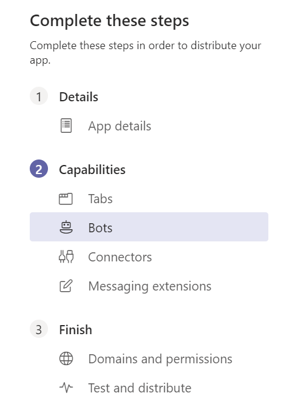
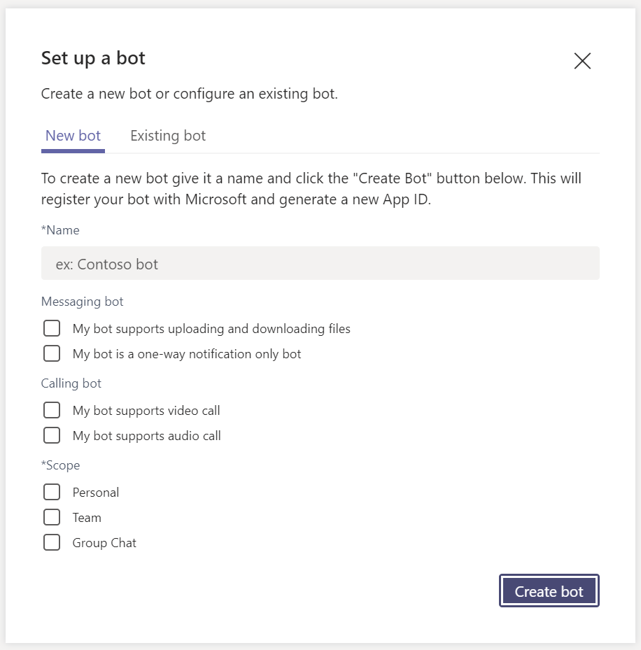
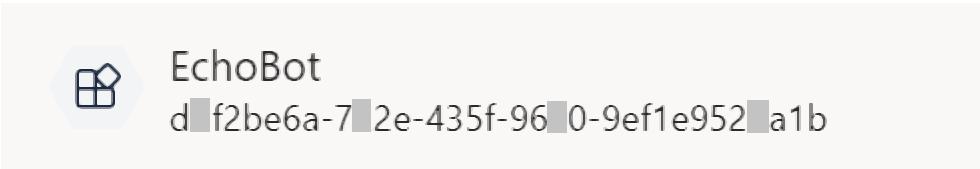
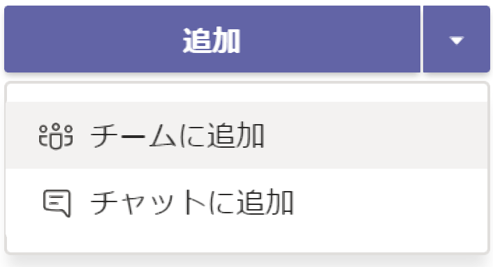

# 演習 3 : ボット
Microsoft Teams では [**Microsoft Bot Framework**](https://dev.botframework.com/) で作られたチャットボットをサポートします。

ボットは、ユーザーが会話で行うタスクを取得するのに役立ちます。

ボットは、ワークフローを開始してステータスを提供したり、軽量なアンケートを作成したり、販売や顧客の使用状況データに関する自然言語の質問に答えたりすることができます。

また単純にさまざまな機能を呼び出すためのコマンドライン インタへフェースとしても使用できます。

また、[**Bot Builder Microsoft Teams Extensions**](https://github.com/OfficeDev/BotBuilder-MicrosoftTeams) を使用してボットに[メッセージ拡張](https://docs.microsoft.com/en-us/microsoftteams/platform/concepts/messaging-extensions/messaging-extensions-overview)や[メッセージアクション](https://docs.microsoft.com/en-us/microsoftteams/platform/concepts/messaging-extensions/create-extensions?tabs=typescript)の機能を追加することもできます。

## ボットのスコープ
ボットもタブ と同じく以下の 3 つのスコープを持ち、これらは Microsoft Teams にボットを登録する際に指定することができます。

* **チーム**

    チャネルに参加しているメンバー全体に公開されます。メンバーは会話の最初に **@ボット名** を記述することによりボットを呼び出すことができます。

* **グループ チャット**

    ボットはグループチャットでも使用できます。これらは、2人以上のユーザー間の会話です。

* **パーソナル**
    
    パーソナルスコープのボットを使用すると、ユーザーはボットとの 1 対のプライベートな会話を行えます。パーソナル ボットと会話する際はメッセージの最初に **@ボット名** を記述する必要はありません。


## ボットの開発
ボットを開発するための SDK として、[Microsoft Bot Framework](https://dev.botframework.com/) では以下の言語の [SDK](https://github.com/Microsoft/botframework-sdk) が用意されています。

* [**C#**](https://github.com/Microsoft/botbuilder-dotnet/#packages) - .Net Core
* [**JavaScript**](https://github.com/Microsoft/botbuilder-js#packages) - Node.js
* [**Python**](https://github.com/Microsoft/botbuilder-python#packages) (preaview)
* [**Java**](https://github.com/Microsoft/botbuilder-java#packages) (preview)

実際の Bot Framework を使用した基本的なボットの開発方法については以下のドキュメントを参考にしてください。

* [**チュートリアル:基本的なボットを作成してデプロイする**](https://docs.microsoft.com/ja-jp/azure/bot-service/bot-builder-tutorial-basic-deploy?view=azure-bot-service-4.0)

この演習では Microsoft Teams へのボットの登録方法のみ扱います。

## Microsoft Teams へのボットの登録
Microsoft Teams へ Bot Framework SDK で作成したボットを登録します。

### 準備
登録の前にシンプルなボットを作成し、Microsoft Teams から参照可能な状態にします。

具体的な準備の内容は以下です。

* [**このドキュメント**](https://docs.microsoft.com/ja-jp/azure/bot-service/bot-builder-tutorial-basic-deploy?view=azure-bot-service-4.0)の内容に従い C# もしくは JavaSctipt でオウム返しボットを作成し、ローカル環境でホストします。

* ngrok でローカル環境で稼働しているボットのサービスをインターネットへトンネリングします。

    手順は以下のとおりです。

    1. コマンドプロンプトを起動し、cd コマンドで作業ディレクトリを ngrok.exe が配置されているディレクトリに切り替えます。

        もし、ngrok をインストールしていない場合は Readme の \[[要件](Readme.md#要件)] の内容を確認してください。

    2. 以下のコマンドを実行して cmd にシェルを切り替えます。
        ```
        cmd
        ```

    3. 以下のコマンドを実行します。
        ```
        ngrok http 3978 --host-header=localhost
        ```
    4. エコーされた内容の Forwarding の横に表示された **https** のドメイン名を使用してアクセスします。
       
        たとえば、ngrok から返されたドメイン名が https://9fcf38b6.engrok.io だった場合は以下の URL でインターネットからローカルで稼働しているボットのエンドポイントにアクセスすることができます。 

        https://9fcf38b6.engrok.io/api/messages

        ローカル アドレスでアクセスしたときと同じコンテンツが表示されることを確認してください。

        **なお、engrok は終了すると、次回起動したときにドメイン名が変わってしまうので注意してください。**

## ボットの登録

上の手順で準備したボットを Microsoft Teams に登録します。

具体的な手順は以下のとおりです。

1. 以下のドキュメントの内容に従い App Studio を使用して Teams アプリケーションの Details を作成します。 

    * [**Microsoft Teams アプリケーションの新規作成**](Ex01.md)

2. App Studio の左側のツリーメニューより \[Capabilities\] - \[Bots\] を選択します。

    

3. 右側に **Bots** ペインが表示されるので \[**Set up**\] ボタンをクリックします。

4. **Set up s bot** ダイアログボックスが表示されるので、各項目を以下のように設定します。

    * *Name

        **EchoBot**

    * Massaging bot

        **My bot supports uploading and downloading files** にチェック

    * Calling bot

        なにもチェックしない

    * *Scope

        **Personal**, **Team**, **Group Chat** にチェック

    実際の画面は以下のとおりです。

    


    設定後、\[**Create bot**\] ボタンをクリックします。

5. 生成されたボットの設定画面が表示されるので \[**Generate new password**\] ボタンをクリックします。

    **New password generated** ダイアログ ボックスに生成されたパスワードが表示されるのでコピーしてテキスト エディタ等に貼り付けます。

    

    パスワードは一度しか表示されないので必ず保存してください。

    >パスワードに ￥ マークや \ が含まれているとボットの設定ファイルに張り付けた際に正しく動作しないので一旦削除してからパスワードを再生成してください。

    >なお、パスワードの削除は **Password** リストの右端にある \[・・・\] メニューより行います。

6. 項目 **Messaging endpoint** の \[**Bot endpoint address**\] テキストボックスに以下のようにアドレスを指定します。
    ```
    https://ngrokが生成したドメイン名/api/messages
    ```

7. 項目 **Commands** の [**Add**] ボタンをクリックします。

8. **New command** ダイアログボックスが表示されるので、各項目を以下のように設定

    |項目|値|
    | ---- | ---- |
    |*Command text|**hello**|
    |*Help text|**挨拶です**|
    |*Scope|すべてにチェック|

9. \[Sava\] ボタンをクリックしてダイアログボックスを閉じます。

10. ボット名の下に表示されている GUID をコピーします。

    

11. ボットのプロジェクトに含まれる以下のファイルを開き、前の手順でコピーしたボットの ID と、保存しておいたパワードをそれぞれ設定します。

    * C# プロジェクトの場合

        ファイル : **appsettings.json** 
        ```
        {
            "MicrosoftAppId": "ここにボットの Id",
            "MicrosoftAppPassword": "ここにパワード"
        }
        ```
    * JavaScript (Node.js) プロジェクトの場合

        ファイル : **.env**
        ```
        MicrosoftAppId=ここにボットの Id
        MicrosoftAppPassword=ここにパワード
        ```

    ファイルを保存してボットを再起動します。

12. App Studio の左側のツリーメニュー \[**3 Finish**\] - \[**Test ans distribute**\] をクリックします。

13. **Test and Distribute** の画面が表示されるので同画面の \[Install\] ボタンをクリックします。

9. **EchoBot** のダイアログボックスが表示されるので \[追加] ボタンの下矢印をクリックしインストール先を選択してインストールを行います

    

10. インストールが完了するとインストール先のチャット画面が表示されるのでボットにメッセージを送信し、送信した内容がオウム返しにボットから返ることを確認してください。

\<参考\>

* [**Add bots to Microsoft Teams apps**](https://docs.microsoft.com/ja-jp/microsoftteams/platform/concepts/bots/bots-overview)


**⇒【 4. [タブとボットのシングルサインオン](Ex04.md) 】へ**

## 目次
0. [**Microsoft Teams アプリケーション開発について**](Intro.md)

1. [**Microsoft Teams アプリケーションの新規作成**](Ex01.md)
    * [**App Studio を使用したマニフェストファイルの作成**](Tut02.md#app-studio-を使用した-teams-アプリケーションの登録)
2. [**タブ アプリケーション**](Ex02.md)
    * [**パーソナル タブ**](Ex02.md#%E3%82%BF%E3%82%B9%E3%82%AF-1--%E3%83%91%E3%83%BC%E3%82%BD%E3%83%8A%E3%83%AB-%E9%9D%99%E7%9A%84-%E3%82%BF%E3%83%96%E3%81%AE%E8%BF%BD%E5%8A%A0)
    * [**チーム タブ**](Ex02.md#%E3%83%81%E3%83%BC%E3%83%A0-%E6%A7%8B%E6%88%90%E5%8F%AF%E8%83%BD-%E3%82%BF%E3%83%96%E3%81%AE%E8%BF%BD%E5%8A%A0)

    * [**タブ : タスクモジュールの表示**](https://github.com/osamum/Easyway-for-MSTeamsAppDev/blob/master/Ex02.md#タスク-3-タブでのタスク-モジュールの表示)
    
3. [**ボット**](Ex03.md)
    * [**ボットの登録**](https://github.com/osamum/Easyway-for-MSTeamsAppDev/blob/master/Ex03.md#microsoft-teams-へのボットの登録)
    * Teams Bot Builder SDK を使用した拡張
4. [**タブとボットのシングルサインオン**](Ex04.md)
5. [**メッセージ拡張とメッセージアクション**](Ex05.md)
6. [**コネクタ**](Ex06.md)

