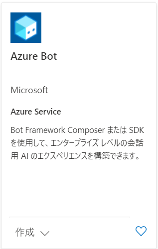
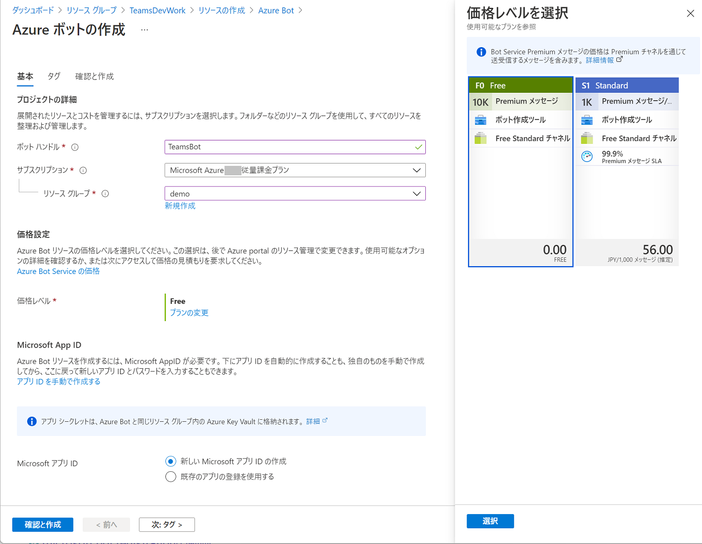
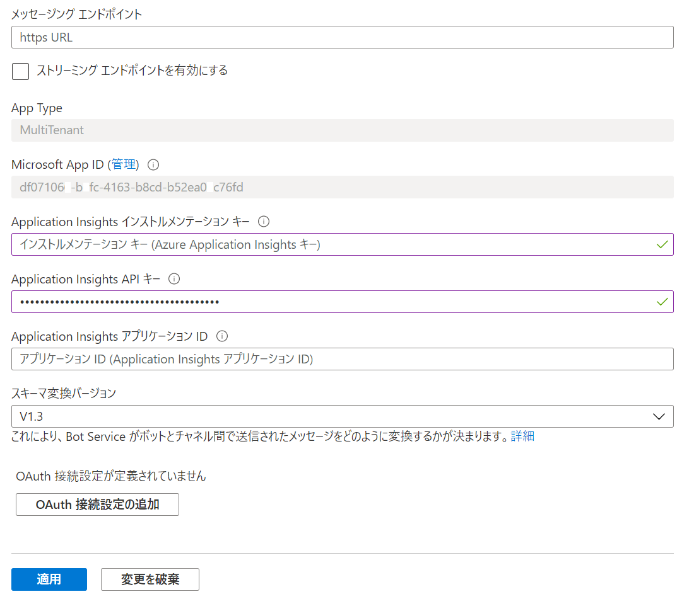
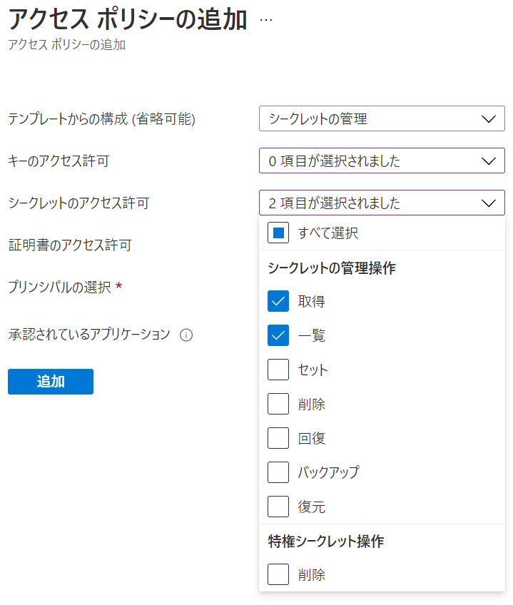
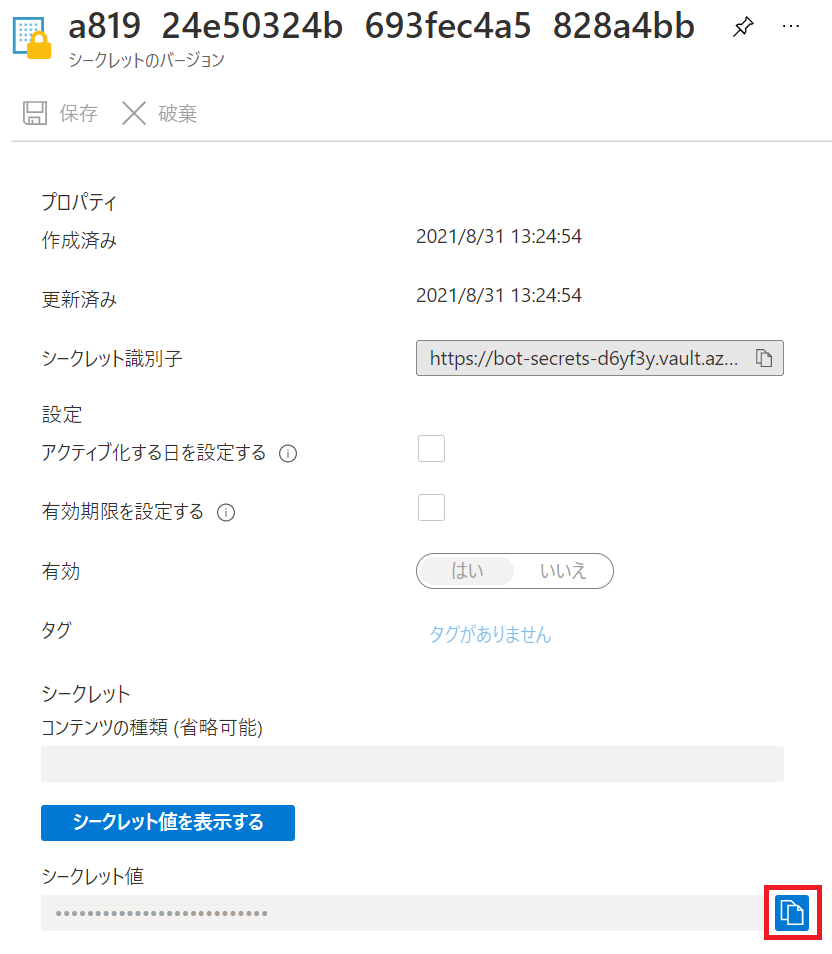
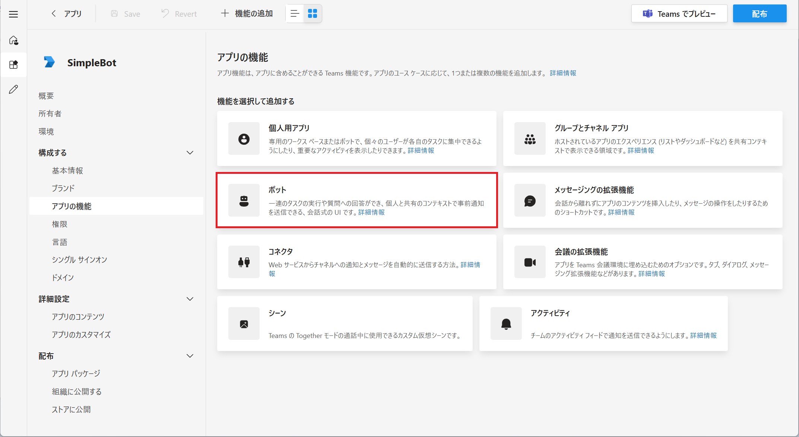
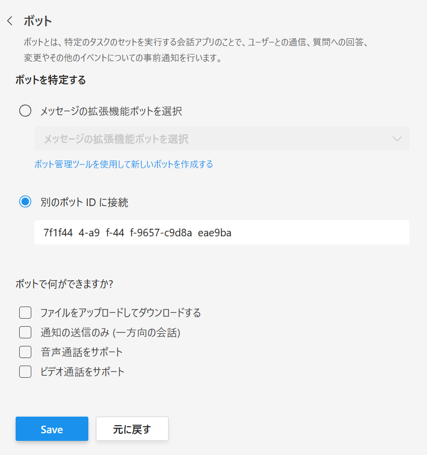
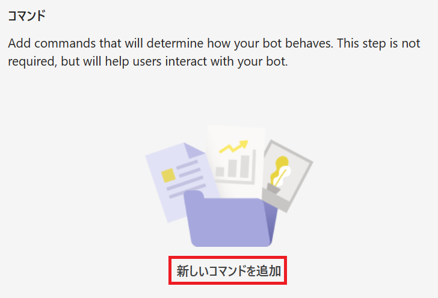
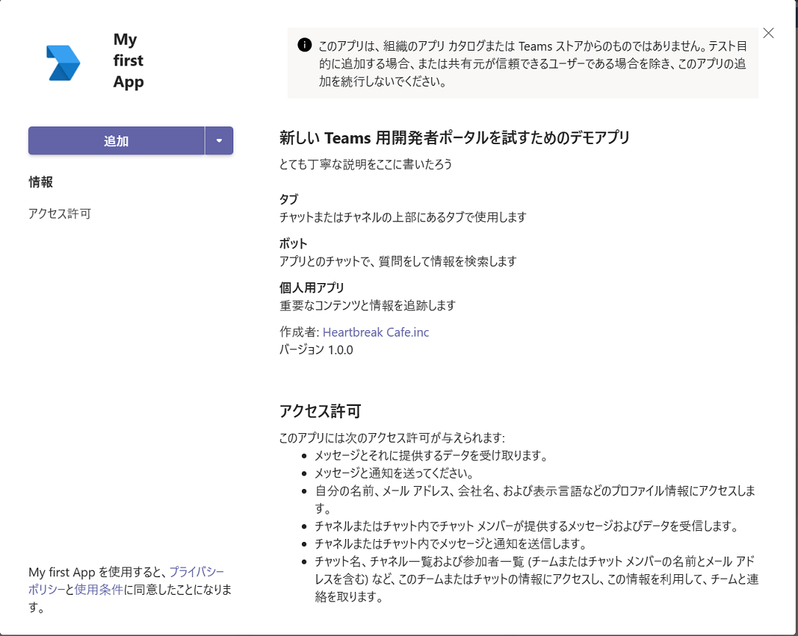

# 演習 3 : ボット
Microsoft Teams では [**Microsoft Bot Framework**](https://dev.botframework.com/) で作られたチャットボットをサポートします。

ボットは、ユーザーが会話で行うタスクを取得するのに役立ちます。

ボットは、ワークフローを開始してステータスを提供したり、軽量なアンケートを作成したり、販売や顧客の使用状況データに関する自然言語の質問に答えたりすることができます。

また単純にさまざまな機能を呼び出すためのコマンドライン インタへフェースとしても使用できます。

また、Bot Framework SDK 4.6 からは、それまでBot Builder Microsoft Teams Extensionsが提供していた機能も統合されており、別途ライブラリの追加など必要なしに Microsoft Teams の[メッセージ拡張](https://docs.microsoft.com/en-us/microsoftteams/platform/concepts/messaging-extensions/messaging-extensions-overview)や[メッセージアクション](https://docs.microsoft.com/en-us/microsoftteams/platform/concepts/messaging-extensions/create-extensions?tabs=typescript)を開発することもできます。

## ボットのスコープ
ボットもタブ と同じく以下の 3 つのスコープを持ち、これらは Microsoft Teams にボットを登録する際に指定することができます。

* **チーム**

    チャネルに参加しているメンバー全体に公開されます。メンバーは会話の最初に **@ボット名** を記述することによりボットを呼び出すことができます。

* **グループ チャット**

    ボットはグループチャットでも使用できます。これらは、2人以上のユーザー間の会話です。

* **パーソナル**
    
    パーソナルスコープのボットを使用すると、ユーザーはボットとの 1 対のプライベートな会話を行えます。パーソナル ボットと会話する際はメッセージの最初に **@ボット名** を記述する必要はありません。


## ボットの開発
ボットを開発するための SDK として、[Microsoft Bot Framework](https://dev.botframework.com/) では以下の言語の [SDK](https://github.com/Microsoft/botframework-sdk) が用意されています。

* [**C#**](https://github.com/Microsoft/botbuilder-dotnet/#packages) - .Net Core
* [**JavaScript**](https://github.com/Microsoft/botbuilder-js#packages) - Node.js
* [**Python**](https://github.com/Microsoft/botbuilder-python#packages) 
* [**Java**](https://github.com/Microsoft/botbuilder-java#packages) (preview)

実際の Bot Framework を使用した基本的なボットの開発方法については以下のドキュメントを参考にしてください。

* [**チュートリアル:基本的なボットを作成してデプロイする**](https://docs.microsoft.com/ja-jp/azure/bot-service/bot-builder-tutorial-basic-deploy?view=azure-bot-service-4.0)

この演習では Microsoft Teams へのボットの登録方法のみ扱います。

## Microsoft Teams へのボットの登録
Microsoft Teams へ Bot Framework SDK で作成したボットを登録します。

### 準備
登録の前にシンプルなボットを作成し、Microsoft Teams から参照可能な状態にします。

具体的な準備の内容は以下です。

* [**このドキュメント**](https://docs.microsoft.com/ja-jp/azure/bot-service/bot-builder-tutorial-basic-deploy?view=azure-bot-service-4.0)の内容に従い C# もしくは JavaSctipt でオウム返しボットを作成し、ローカル環境でホストします。

* ngrok でローカル環境で稼働しているボットのサービスをインターネットへトンネリングします。

    手順は以下のとおりです。

    1. コマンドプロンプトを起動し、cd コマンドで作業ディレクトリを ngrok.exe が配置されているディレクトリに切り替えます。

        もし、ngrok をインストールしていない場合は Readme の \[[要件](Readme.md#要件)] の内容を確認してください。

    2. 以下のコマンドを実行して cmd にシェルを切り替えます。
        ```
        cmd
        ```

    3. 以下のコマンドを実行します。
        ```
        ngrok http 3978 --host-header=localhost
        ```
    4. エコーされた内容の Forwarding の横に表示された **https** のドメイン名を使用してアクセスします。
       
        たとえば、ngrok から返されたドメイン名が https://9fcf38b6.engrok.io だった場合は以下の URL でインターネットからローカルで稼働しているボットのエンドポイントにアクセスすることができます。 

        https://9fcf38b6.engrok.io/api/messages

        ローカル アドレスでアクセスしたときと同じコンテンツが表示されることを確認してください。

        **なお、engrok は終了すると、次回起動したときにドメイン名が変わってしまうので注意してください。**

## ボットの登録

上の手順で準備したボットを Microsoft Teams に登録します。

はじめに、以下のドキュメントの内容に従い App Studio を使用して Teams アプリケーションの Details を作成します。 

* [**Microsoft Teams アプリケーションの新規作成**](Ex01.md)

Teams アプリケーションの Details が作成できたら、アプリの機能としてボットを登録します。

ボットの登録に使用するツールは Teams アプリケーションの登録したのと同じく **App Studio** と、その後継である [**Microsoft Teams 用 開発者ポータル**](https://dev.teams.microsoft.com/)を使用した方法があるので、以下のいずれかの方法で行います。

* [**App Studio を使用したボットの追加**](#app-studio-%E3%82%92%E4%BD%BF%E7%94%A8%E3%81%97%E3%81%9F%E3%83%9C%E3%83%83%E3%83%88%E3%81%AE%E8%BF%BD%E5%8A%A0)
* [**Microsoft Teams 用 開発者ポータル を使用ボットの追加**](#microsoft-teams-%E7%94%A8-%E9%96%8B%E7%99%BA%E8%80%85%E3%83%9D%E3%83%BC%E3%82%BF%E3%83%AB%E3%82%92%E4%BD%BF%E7%94%A8%E3%81%97%E3%81%9F%E3%83%9C%E3%83%83%E3%83%88%E3%81%AE%E8%BF%BD%E5%8A%A0)


### App Studio を使用したボットの追加

App Studio を使用して ボットを Teams アプリとして登録する具体的な手順は以下のとおりです。

1. 以下のドキュメントの内容に従い App Studio を使用して Teams アプリケーションの Details を作成します。 

    * [**App Studio を使用した Teams アプリケーションの登録**](Ex01.md#app-studio-%E3%82%92%E4%BD%BF%E7%94%A8%E3%81%97%E3%81%9F-teams-%E3%82%A2%E3%83%97%E3%83%AA%E3%82%B1%E3%83%BC%E3%82%B7%E3%83%A7%E3%83%B3%E3%81%AE%E7%99%BB%E9%8C%B2)

2. App Studio の左側のツリーメニューより \[Capabilities\] - \[Bots\] を選択します。

    

3. 右側に **Bots** ペインが表示されるので \[**Set up**\] ボタンをクリックします。

4. **Set up s bot** ダイアログボックスが表示されるので、各項目を以下のように設定します。

    * *Name

        **EchoBot**

    * Massaging bot

        **My bot supports uploading and downloading files** にチェック

    * Calling bot

        なにもチェックしない

    * *Scope

        **Personal**, **Team**, **Group Chat** にチェック

    実際の画面は以下のとおりです。

    


    設定後、\[**Create bot**\] ボタンをクリックします。

5. 生成されたボットの設定画面が表示されるので \[**Generate new password**\] ボタンをクリックします。

    **New password generated** ダイアログ ボックスに生成されたパスワードが表示されるのでコピーしてテキスト エディタ等に貼り付けます。

    

    パスワードは一度しか表示されないので必ず保存してください。

    >パスワードに ￥ マークや \ が含まれているとボットの設定ファイルに張り付けた際に正しく動作しないので一旦削除してからパスワードを再生成してください。

    >なお、パスワードの削除は **Password** リストの右端にある \[・・・\] メニューより行います。

6. 項目 **Messaging endpoint** の \[**Bot endpoint address**\] テキストボックスに以下のようにアドレスを指定します。
    ```
    https://ngrokが生成したドメイン名/api/messages
    ```

7. 項目 **Commands** の [**Add**] ボタンをクリックします。

8. **New command** ダイアログボックスが表示されるので、各項目を以下のように設定

    |項目|値|
    | ---- | ---- |
    |*Command text|**hello**|
    |*Help text|**挨拶です**|
    |*Scope|すべてにチェック|

9. \[Sava\] ボタンをクリックしてダイアログボックスを閉じます。

10. ボット名の下に表示されている GUID をコピーします。

    

11. ボットのプロジェクトに含まれる以下のファイルを開き、前の手順でコピーしたボットの ID と、保存しておいたパワードをそれぞれ設定します。

    * C# プロジェクトの場合

        ファイル : **appsettings.json** 
        ```
        {
            "MicrosoftAppId": "ここにボットの Id",
            "MicrosoftAppPassword": "ここにパワード"
        }
        ```
    * JavaScript (Node.js) プロジェクトの場合

        ファイル : **.env**
        ```
        MicrosoftAppId=ここにボットの Id
        MicrosoftAppPassword=ここにパワード
        ```

    ファイルを保存してボットを再起動します。

12. App Studio の左側のツリーメニュー \[**3 Finish**\] - \[**Test ans distribute**\] をクリックします。

13. **Test and Distribute** の画面が表示されるので同画面の \[Install\] ボタンをクリックします。

9. **EchoBot** のダイアログボックスが表示されるので \[追加] ボタンの下矢印をクリックしインストール先を選択してインストールを行います

    

10. インストールが完了するとインストール先のチャット画面が表示されるのでボットにメッセージを送信し、送信した内容がオウム返しにボットから返ることを確認してください。

<br />

### Microsoft Teams 用 開発者ポータルを使用したボットの追加

App Studio を使用してボットを Teams アプリに登録する場合、ボットの登録や、Bot ID と Bot パスワードの取得は App Studio 内で行えますが、Microsoft Teams 用 開発者ポータルには現在のところ同様の機能は提供されていません。

そのため、事前に Azure に Azure Bot のインスタンスを作ってボットを登録し、ボットの Application ID とパスワードを入手しておく必要があります。

**ローカル環境で動作するボットを Azure Bot に設定する方法**

ローカルの開発環境で動作するボットを Azure Bot として登録し、Application ID とパスワードを入手する手順は以下のとおりです。

1. [**Azure ポータル**](https://portal.azure.com)にサインインします

2. ポータル画面左上端のハンバーカーメニューをクリックし、\[**＋ リソースの作成**\]をクリックします

3. 遷移した画面の検索ボックスに **bot** と入力し \[Enter\] キーを押下します

4. 検索された結果から **Azure Bot** のカードをクリックします

    

    遷移した画面で \[**作成**\] ボタンをクリックします

5. ボットの作成画面が表示されるので各項目を以下のように設定します

    |項目|値|
    | ---- | ---- |
    |ボット ハンドル*|(ボットの一意の識別名)|
    |サブスクリプション*|(Azure のリソースを作成することのできるサブスクリプション)|
    |リソースグループ*|(任意のリソースグループ)|
    |価格レベル*|(既定では **Standard** ですが\[**プランの変更**\]リンクをクリックして **Free** を選択することもできます)|
    |Microsoft アプリ ID|**新しい Microsoft アプリ ID の作成**にチェック|

    実際の画面は以下のとおりです。

    

    各項目を設定後、\[**確認と作成**\] ボタンをクリックし、\[**作成**\] ボタンが表示されたらクリックしデプロイを開始します。

6. デプロイが完了すると**デプロイが完了しました**と画面に表示されるので、同画面の\[**リソースに移動**\]ボタンをクリックします

7. 作成した Azure Bot の**概要**画面に遷移するので、画面左のメニューより \[**構成**\]をクリックします

8. **構成** 画面に遷移するので \[**メッセージング エンドポイント**\] に ngrok が生成したインターネットからアクセス可能な開発環境の URL を入力し、 \[**Microsoft App ID**\] の内容をテキストエディタなどに貼り付けてメモします

    


9. \[**適用**\] ボタンをクリックして設定を保存します

    もし、Application Insights 関連の項目のところに赤字でエラーメッセージが表示され\[**適用**\] ボタンが有効にならない場合は以下のように設定してみてください。

    |項目|値|
    | ---- | ---- |
    |Application Insights インストルメンテーション キー|空白|
    |Application Insights API キー|なんらかの40桁の数字(すべて0でも可)|
    |Application Insights アプリケーション ID|空白|

10. Key Vault 内に格納されているボットのパスワードを入手します。Azure Bot と同じリソースグループ内に生成されている、キーコンテナーのアイコンをクリックします。
    このキーコンテナーの名前は **bot-secrets-** の後ろに数字とアルファベットの混じった 5 桁のコードが付いたものになっています

11. キーコンテナー画面で左側のメニューより \[**アクセスポリシー**\] をクリックします。(これは、作業中の Azure アカウントにキーコンテナーに格納されたシークレットを参照する権限を付与するためです)

12. **アクセスポリシー** の画面に遷移するので、同画面内の \[**＋ アクセスポリシーの追加**] リンクをクリックします

13. **アクセス ポリシーの追加** 画面に遷移するので各項目を以下のように設定します

    |項目|値|
    | ---- | ---- |
    |テンプレートからの構成|**シークレットの管理**|
    |キーアクセスの許可|(なにも選択しない)|
    |シークレットのアクセスの許可|**取得**,**一覧**|
    |証明書ののアクセスの許可|(なにも選択しない)|
    |プリンシパルの選択*|(現在作業を行っている Azure アカウント)|

    実際の画面は以下のとおりです。

    

    \[**追加**\] ボタンをクリックします

14. **アクセスポリシー** の画面の戻るので、忘れずに画面上部の \[**保存**\] をクリックします。

15. 画面左のメニューより \[シークレット\] をクリックし、表示されたシークレットの一覧から作成したボットの名前のついたシークレットをクリックします

16. **現在のバージョン** リストに表示されるシークレットをクリックします

17. 表示された画面の \[**シークレット値**\]の右側にあるコピーボタンをクリックし、コピーされた内容をテキストエディタなどに貼り付けてメモします

    

18. ここまでの手順で入手したボットの Microsoft App ID とパスワードを開発中のボットに反映します。

    ボットのプロジェクトに含まれる **.env** ファイルをオープンし、以下のように入手した ID とパスワードを記述して保存します

    ```
    MicrosoftAppId=入手したMicrosoft App ID
    MicrosoftAppPassword=入手したパスワード
    ```

    ボットのプロジェクトがデバッグ実行されている実行しなおします。なお、egrok は再起動すると生成したドメイン名が変わってしまうので起動したままにしておいてください。

19. ボットが正しく Azure Bot に登録されたかを確認するために Web チャットでテストします。

    [Azure Portal](https://portal.azure.com) で作成した Azure Bot の画面を開き、画面左のメニューバーより \[**Web チャットでテスト**\] をクリックします

    Web チャット画面でボットと会話ができるかどうか確認します。

20. 画面左のメニューバーより \[**チャンネル**\] をクリックします

21. **チャンネルに接続** 画面に遷移するので、チャンネルの一覧から **Microsoft Teams** をクリックして追加します

ここまでの手順で Azure 側の設定は完了です。

<br />

**Microsoft Teams 用 開発者ポータルを使用した Teams へのボットの追加**

Azure で Azure Bot としてホストされているボットをMicrosoft Teams 用 開発者ポータルを使用して Teams にアプリケーションとして追加します。

具体的な手順は以下のとおりです。

1. 以下のドキュメントの内容に従い App Studio を使用して Teams アプリケーションの Details を作成します。 

    * [**Microsoft Teams 用 開発者ポータルを使用した Teams アプリケーションの登録**](Ex01.md#microsoft-teams-%E7%94%A8-%E9%96%8B%E7%99%BA%E8%80%85%E3%83%9D%E3%83%BC%E3%82%BF%E3%83%AB%E3%82%92%E4%BD%BF%E7%94%A8%E3%81%97%E3%81%9F-teams-%E3%82%A2%E3%83%97%E3%83%AA%E3%82%B1%E3%83%BC%E3%82%B7%E3%83%A7%E3%83%B3%E3%81%AE%E7%99%BB%E9%8C%B2)

2. Web ブラウザーから [Microsoft Teams 用 開発者ポータル](https://dev.teams.microsoft.com/) にアクセスし、Teams アプリ開発に使用するアカウントでログインします

3. 画面左のメニューバーの\[**Apps**\] をクリックしすると、アプリの一覧が表示されるので、一覧から演習 1 で登録したアプリ My first app をクリックします

4. アプリの設定画面に遷移するので、画面左のメニューから \[**構成する**\]-\[**アプリの機能** \] を選択します

5. 機能の一覧が表示されるので \[**ボット**] のタイルをクリックします

    

6. ボットの設定画面の**ボットを特定する** で **別のボット ID に接続** オプションボタンを選択し、その直下のテキストボックスに Azure Bot の登録の際にメモした Microsoft App ID を指定し、\[**Save**\] ボタンをクリックします

    

7. 保存が完了すると**コマンド**という項目が表示されるのでアイコンの下の **新しいコマンドを追加** をクリックします

    なお、アイコンの説明に "This step is not required," と書いてありますが、現状、その手順を省くとボットのスコープが設定されず、インストールが失敗するので必ず行います。

    

8. **ボットコマンドを追加する** ダイアログボックスが表示されるので各項目を以下のように設定します

    |項目|値|
    | ---- | ---- |
    |コマンド*|**hello**|
    |説明(ヘルプ テキスト)*|**Greeting**|
    |ユーザーがこのコマンドを使用できるようにする範囲を選択してください|**Personal**にのみチェック|
  
    \[**追加**\] ボタンをクリックします。

9. 画面上部の \[**Teamsでプレビュー**\] ボタンをクリックします

10. Web ブラウザーが起動してきて Teams デスクトップアプリを起動して良いか確認されるので、問題なければ \[**開く**\] ボタンをクリックします。デスクトップアプリを使用したくない場合は \[**キャンセル**\] ボタンをクリックし、Web ブラウザーのドキュメント部分の \[**代わりに Web アプリを使用**\] ボタンをクリックします

11. Teams が起動し、アプリの追加ダイアログボックスが表示されるので同ダイアログボックス中の \[**追加**\] ボタンをクリックします

    

以上で、Microsoft Teams 用 開発者ポータルを使用した Teams へのボットの追加の作業は完了です。

<br />

\<参考\>

* [**Microsoft Teams のボット**](https://docs.microsoft.com/ja-jp/microsoftteams/platform/concepts/bots/bots-overview)


**⇒【 4. [メッセージング拡張](Ex04.md) 】へ**

## 目次
0. [**Microsoft Teams アプリケーション開発について**](Intro.md)

1. [**Microsoft Teams アプリケーションの新規作成**](Ex01.md)
    * [**App Studio を使用したマニフェストファイルの作成**](Ex01.md#app-studio-を使用した-teams-アプリケーションの登録)
    * [**Microsoft Teams 用 開発者ポータルを使用した Teams アプリケーションの登録**](Ex01.md#microsoft-teams-%E7%94%A8-%E9%96%8B%E7%99%BA%E8%80%85%E3%83%9D%E3%83%BC%E3%82%BF%E3%83%AB%E3%81%AE%E4%BD%BF%E7%94%A8)
    
2. [**タブ アプリケーション**](Ex02.md)

    * [**パーソナル タブ**](Ex02.md#%E3%82%BF%E3%82%B9%E3%82%AF-1--%E3%83%91%E3%83%BC%E3%82%BD%E3%83%8A%E3%83%AB-%E9%9D%99%E7%9A%84-%E3%82%BF%E3%83%96%E3%81%AE%E8%BF%BD%E5%8A%A0)
        * [**App Studio を使用した方法**](Ex02.md#app-studio-%E3%82%92%E4%BD%BF%E7%94%A8%E3%81%97%E3%81%9F%E3%83%91%E3%83%BC%E3%82%BD%E3%83%8A%E3%83%AB-%E3%82%BF%E3%83%96%E3%81%AE%E8%BF%BD%E5%8A%A0)
        * [**Microsoft Teams 用 開発者ポータルを使用した方法**](Ex02.md#microsoft-teams-%E7%94%A8-%E9%96%8B%E7%99%BA%E8%80%85%E3%83%9D%E3%83%BC%E3%82%BF%E3%83%AB-%E3%82%92%E4%BD%BF%E7%94%A8%E3%81%97%E3%81%9F%E3%83%91%E3%83%BC%E3%82%BD%E3%83%8A%E3%83%AB-%E3%82%BF%E3%83%96%E3%81%AE%E8%BF%BD%E5%8A%A0)


    * [**チーム タブ**](Ex02.md#%E3%82%BF%E3%82%B9%E3%82%AF-2--%E3%83%81%E3%83%BC%E3%83%A0-%E6%A7%8B%E6%88%90%E5%8F%AF%E8%83%BD-%E3%82%BF%E3%83%96%E3%81%AE%E8%BF%BD%E5%8A%A0)
        * [**App Studio を使用した方法**](Ex02.md#app-studio-%E3%81%A7%E3%81%AE%E3%83%81%E3%83%BC%E3%83%A0-%E3%82%BF%E3%83%96%E3%81%AE%E8%BF%BD%E5%8A%A0)
        * [**Microsoft Teams 用 開発者ポータルを使用した方法**](Ex02.md#microsoft-teams-%E7%94%A8-%E9%96%8B%E7%99%BA%E8%80%85%E3%83%9D%E3%83%BC%E3%82%BF%E3%83%AB-%E3%82%92%E4%BD%BF%E7%94%A8%E3%81%97%E3%81%9F%E3%83%91%E3%83%BC%E3%82%BD%E3%83%8A%E3%83%AB-%E3%82%BF%E3%83%96%E3%81%AE%E8%BF%BD%E5%8A%A0)


    * [**タブ : タスクモジュールの表示**](Ex02.md#%E3%82%BF%E3%82%B9%E3%82%AF-3-%E3%82%BF%E3%83%96%E3%81%A7%E3%81%AE%E3%82%BF%E3%82%B9%E3%82%AF-%E3%83%A2%E3%82%B8%E3%83%A5%E3%83%BC%E3%83%AB%E3%81%AE%E8%A1%A8%E7%A4%BA)

        * [**外部の HTML フォームをタスクモジュールとしてタブに追加**](Ex02.md#%E3%82%BF%E3%82%B9%E3%82%AF-3-1--%E5%A4%96%E9%83%A8%E3%81%AE-html-%E3%83%95%E3%82%A9%E3%83%BC%E3%83%A0%E3%82%92%E3%82%BF%E3%82%B9%E3%82%AF%E3%83%A2%E3%82%B8%E3%83%A5%E3%83%BC%E3%83%AB%E3%81%A8%E3%81%97%E3%81%A6%E3%82%BF%E3%83%96%E3%81%AB%E8%BF%BD%E5%8A%A0)

        * [**アダプティブ カードをタスクモジュールとしてタブに追加**](Ex02.md#%E3%82%BF%E3%82%B9%E3%82%AF-3-2--actibity-card-%E3%82%92%E3%82%BF%E3%82%B9%E3%82%AF%E3%83%A2%E3%82%B8%E3%83%A5%E3%83%BC%E3%83%AB%E3%81%A8%E3%81%97%E3%81%A6%E3%82%BF%E3%83%96%E3%81%AB%E8%BF%BD%E5%8A%A0)
    
    
3. [**ボット**](Ex03.md)
    * [**ボットの登録**](Ex03.md#%E3%83%9C%E3%83%83%E3%83%88%E3%81%AE%E7%99%BB%E9%8C%B2)
    * [**App Studio を使用したボットの追加**](Ex03.md#app-studio-%E3%82%92%E4%BD%BF%E7%94%A8%E3%81%97%E3%81%9F%E3%83%9C%E3%83%83%E3%83%88%E3%81%AE%E8%BF%BD%E5%8A%A0)
    * [**Microsoft Teams 用 開発者ポータルを使用したボットの追加**](Ex03.md#microsoft-teams-%E7%94%A8-%E9%96%8B%E7%99%BA%E8%80%85%E3%83%9D%E3%83%BC%E3%82%BF%E3%83%AB%E3%82%92%E4%BD%BF%E7%94%A8%E3%81%97%E3%81%9F%E3%83%9C%E3%83%83%E3%83%88%E3%81%AE%E8%BF%BD%E5%8A%A0)


4. [**メッセージング拡張**](Ex04.md)
    * [**検索機能の実装**](Ex04.md#%E3%82%BF%E3%82%B9%E3%82%AF-1--%E3%83%A1%E3%83%83%E3%82%BB%E3%83%BC%E3%82%B8%E3%83%B3%E3%82%B0%E6%8B%A1%E5%BC%B5---wikipedia-%E6%A4%9C%E7%B4%A2%E6%A9%9F%E8%83%BD%E3%81%AE%E5%AE%9F%E8%A3%85)
    * [**操作機能の実装**](Ex04.md#%E3%82%BF%E3%82%B9%E3%82%AF-2--%E3%83%A1%E3%83%83%E3%82%BB%E3%83%BC%E3%82%B8%E3%83%B3%E3%82%B0%E6%8B%A1%E5%BC%B5---%E6%93%8D%E4%BD%9C%E3%82%A2%E3%82%AF%E3%82%B7%E3%83%A7%E3%83%B3%E3%82%B3%E3%83%9E%E3%83%B3%E3%83%89%E3%81%AB%E3%82%88%E3%82%8B%E5%A4%96%E9%83%A8%E3%82%B5%E3%83%BC%E3%83%93%E3%82%B9%E3%81%AE%E9%80%A3%E6%90%BA)
    
5. [**タブとボットのシングルサインオン**](Ex05.md)
6. [**コネクタ**](Ex06.md)
    * [**受信 Webhook を利用したチャネルへの通知**](https://github.com/osamum/Easyway-for-MSTeamsAppDev/blob/master/Ex06.md#%E3%82%BF%E3%82%B9%E3%82%AF-1--incomming-webhook-%E3%82%92%E5%88%A9%E7%94%A8%E3%81%97%E3%81%9F%E3%83%81%E3%83%A3%E3%83%8D%E3%83%AB%E3%81%B8%E3%81%AE%E9%80%9A%E7%9F%A5)
    * [**送信Webhook を利用した外部サービスの呼び出し**](https://github.com/osamum/Easyway-for-MSTeamsAppDev/blob/master/Ex06.md#%E3%82%BF%E3%82%B9%E3%82%AF-2--%E9%80%81%E4%BF%A1outgoing-webhook-%E3%82%92%E5%88%A9%E7%94%A8%E3%81%97%E3%81%9F%E5%A4%96%E9%83%A8%E3%82%B5%E3%83%BC%E3%83%93%E3%82%B9%E3%81%AE%E5%91%BC%E3%81%B3%E5%87%BA%E3%81%97)
