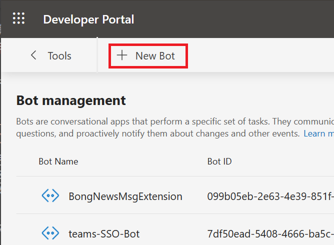

# 演習 3 : ボット
Microsoft Teams では [**Microsoft Bot Framework**](https://dev.botframework.com/) で作られたチャットボットをサポートします。

ボットは、ユーザーが会話で行うタスクを取得するのに役立ちます。

ボットは、ワークフローを開始してステータスを提供したり、軽量なアンケートを作成したり、販売や顧客の使用状況データに関する自然言語の質問に答えたりすることができます。

また単純にさまざまな機能を呼び出すためのコマンドライン インタへフェースとしても使用できます。

また、Bot Framework SDK 4.6 からは、それまでBot Builder Microsoft Teams Extensionsが提供していた機能も統合されており、別途ライブラリの追加など必要なしに Microsoft Teams の[メッセージ拡張](https://docs.microsoft.com/en-us/microsoftteams/platform/concepts/messaging-extensions/messaging-extensions-overview)や[メッセージアクション](https://docs.microsoft.com/en-us/microsoftteams/platform/concepts/messaging-extensions/create-extensions?tabs=typescript)を開発することもできます。

## ボットのスコープ
ボットもタブ と同じく以下の 3 つのスコープを持ち、これらは Microsoft Teams にボットを登録する際に指定することができます。

* **チーム**

    チャネルに参加しているメンバー全体に公開されます。メンバーは会話の最初に **@ボット名** を記述することによりボットを呼び出すことができます。

* **グループ チャット**

    ボットはグループチャットでも使用できます。これらは、2人以上のユーザー間の会話です。

* **パーソナル**
    
    パーソナルスコープのボットを使用すると、ユーザーはボットとの 1 対のプライベートな会話を行えます。パーソナル ボットと会話する際はメッセージの最初に **@ボット名** を記述する必要はありません。


## ボットの開発
ボットを開発するための SDK として、[Microsoft Bot Framework](https://dev.botframework.com/) では以下の言語の [SDK](https://github.com/Microsoft/botframework-sdk) が用意されています。

* [**C#**](https://github.com/Microsoft/botbuilder-dotnet/#packages) - .Net Core
* [**JavaScript**](https://github.com/Microsoft/botbuilder-js#packages) - Node.js
* [**Python**](https://github.com/Microsoft/botbuilder-python#packages) 
* [**Java**](https://github.com/Microsoft/botbuilder-java#packages) (preview)

実際の Bot Framework を使用した基本的なボットの開発方法については以下のドキュメントを参考にしてください。

* [**チュートリアル:基本的なボットを作成してデプロイする**](https://docs.microsoft.com/ja-jp/azure/bot-service/bot-builder-tutorial-basic-deploy?view=azure-bot-service-4.0)

この演習では Microsoft Teams へのボットの登録方法のみ扱います。

## Microsoft Teams へのボットの登録
Microsoft Teams へ Bot Framework SDK で作成したボットを登録します。

### 準備
登録の前にシンプルなボットを作成し、Microsoft Teams から参照可能な状態にします。

具体的な準備の内容は以下です。

* [**このドキュメント**](https://docs.microsoft.com/ja-jp/azure/bot-service/bot-builder-tutorial-basic-deploy?view=azure-bot-service-4.0)の内容に従い C# もしくは JavaSctipt でオウム返しボットを作成し、ローカル環境でホストします。

* ngrok でローカル環境で稼働しているボットのサービスをインターネットへトンネリングします。

    手順は以下のとおりです。

    1. Visual Studio Code のメニュー\[**ターミナル**\] - \[**新しいターミナル**\] をクリックします。

    3. 新しいターミナル画面が表示されるので以下のコマンドを実行します

        ```
        ngrok http 3978 --host-header=localhost
        ```
    4. エコーされた内容の Forwarding の横に表示された **https** のドメイン名をメモします

        **なお、engrok は終了すると、次回起動したときにドメイン名が変わってしまうので注意してください。**

## ボットの登録

上の手順で準備したボットを Microsoft Teams に登録します。

はじめに、以下のドキュメントの内容に従い App Studio を使用して Teams アプリケーションの Details を作成します。 

* [**Microsoft Teams アプリケーションの新規作成**](Ex01.md)

Teams アプリケーションの Details が作成できたら、アプリの機能としてボットを登録します。

ボットの登録に使用するツールは Teams アプリケーションの登録したのと同じく **App Studio** の後継である [**Microsoft Teams 用 開発者ポータル**](https://dev.teams.microsoft.com/)を使用します。

なお、App Studio の利用は 2021 年 11 月から非推奨となっています。もしなんらかの理由で App Studio を使用してボットの登録を行う必要がある場合は[この手順](opt/use_appStudio.md#app-studio-%E3%82%92%E4%BD%BF%E7%94%A8%E3%81%97%E3%81%9F%E3%83%9C%E3%83%83%E3%83%88%E3%81%AE%E8%BF%BD%E5%8A%A0)を参照してください。

<br />


### Microsoft Teams 用 開発者ポータルを使用したボットの追加 (Azure Bot の作成)

ローカルの開発環境でホストされているボットを Microsoft Teams 用 開発者ポータルを使用して Teams にアプリケーションとして追加します。

具体的な手順は以下のとおりです。

まず最初に、[**Microsoft Teams 用 開発者ポータルを使用した Teams アプリケーションの登録**](Ex01.md#microsoft-teams-%E7%94%A8-%E9%96%8B%E7%99%BA%E8%80%85%E3%83%9D%E3%83%BC%E3%82%BF%E3%83%AB%E3%81%AE%E4%BD%BF%E7%94%A8) の内容を参考に、基本的な Teams アプリの登録を完了してください。

Teams アプリの基本的な登録が完了したら、以下の手順で作業を行います。

1. [開発者ポータル](https://dev.teams.microsoft.com/) にログインし、画面左のメニューより \[**Tools**\] メニューをクリックします

2. \[**Tools**\] 画面が表示されるので \[**Bot management**\] タイルをクリックします

    

3. **Bot managiment** の画面が表示されるので \[**+ NewBot**\] をクリックします

    

4. \[**Add bot**\] ダイアログボックスが表示されるので任意のボットの名前を指定し \[**Add**\] ボタンをクリックします

5. \[**Configure**\] 画面が表示されるので **Endpoint address** に以下の形式で URL を指定して \[**Save**\] ボタンをクリックします

    ```
    https://ngrokが生成したドメイン名/api/messages
    ```
    <image src="images/21Nov_DevPortal_BotEndPoint.png" width="500px">

6. 画面左のメニューから \[**Client secrets**\] をクリックし、右側のペインに表示されたアイコンの下の \[**Add a client secret for your bot**\] ボタンをクリックします

    <image src="images/21Nov_DevPortal_ClientSecret.png" width="400px">

    (※)もし、\[**Add a client secret for your bot**\] ボタンをクリックしてもなにも起こらない場合は他の Web ブラウザーでお試しください。

7. 生成されたシークレットが表示されるのでコピーアイコンをクリックして、テキストエディタなどに貼り付けて保持します。なお、シークレットは以降二度と確認することはできませんので必ずメモします。

    <image src="images/21Nov_DevPortal_secretGenerated.png" width="500px">

    \[**OK**\] ボタンをクリックしてダイアログボックスを閉じます。 

8. 画面上部の \[**< Bots**\] ボタンをクリックすると、ボットの一覧に登録したボットがリストされるので、\[**Bot ID**\] をコピーしてテキストエディタなどに貼り付けます

9. Visual Studio Code でボットアプリのプロジェクトを開き **\*.env** ファイルの内容を以下のように指定して保存します

    ```
    MicrosoftAppId=コピーしておいた Bot ID
    MicrosoftAppPassword=コピーしておいたシークレット
    ```

10. Visual Studio Code のメニュー\[**ターミナル**\] - \[**新しいターミナル**\] をクリックします。

11. 新しいターミナル画面が表示されるので以下のコマンドを実行し、プロジェクトのサービスを開始します

    ```
    npm start
    ```

12. 開発者ポータルの画面左のメニューより \[**Apps**\] メニューをクリックします

13. 登録されているアプリの一覧が表示されるので、目的のアプリをクリックします

14. アプリの設定画面に遷移するので、画面左のメニューから \[**構成する**(英語表記 : Configure)\]-\[**アプリの機能**(英語表記 : App features) \] を選択します


15. 機能の一覧が表示されるので \[**ボット**] のタイルをクリックします

    


16. ボットの設定画面の **Identify your bot** で \[**Select an existing bot**] オプションボタンを選択し、登録したボットを選択し \[**Save**\] ボタンをクリックします

    

17. 保存が完了すると**コマンド**という項目が表示されるのでアイコンの下の **新しいコマンドを追加** リンクをクリックします

    なお、アイコンの説明に "This step is not required," と書いてありますが、現状、その手順を省くとボットのスコープが設定されず、インストールが失敗する場合があるので念のために設定を行います。

    

18. **ボットコマンドを追加する** ダイアログボックスが表示されるので各項目を以下のように設定します

    |項目|値|
    | ---- | ---- |
    |コマンド*|**hello**|
    |説明(ヘルプ テキスト)*|**Greeting**|
    |ユーザーがこのコマンドを使用できるようにする範囲を選択してください|**Personal**にのみチェック|
  
    \[**追加**\] ボタンをクリックします。

19. 画面上部の \[**Teamsでプレビュー**(英語表記 : Preview in Teams)\] ボタンをクリックします

20. Web ブラウザーが起動してきて Teams デスクトップアプリを起動して良いか確認されるので、問題なければ \[**開く**\] ボタンをクリックします。デスクトップアプリを使用したくない場合は \[**キャンセル**\] ボタンをクリックし、Web ブラウザーのドキュメント部分の \[**代わりに Web アプリを使用**\] ボタンをクリックします

21. Teams が起動し、アプリの追加ダイアログボックスが表示されるので同ダイアログボックス中の \[**追加**\] ボタンをクリックします

    

22. インストールが完了するとインストール先のチャット画面が表示されるのでボットにメッセージを送信し、送信した内容がオウム返しにボットから返ることを確認してください。

以上で、Microsoft Teams 用 開発者ポータルを使用した Teams へのボットの追加の作業は完了です。

<br />

\<参考\>

* [**Microsoft Teams のボット**](https://docs.microsoft.com/ja-jp/microsoftteams/platform/concepts/bots/bots-overview)

<br />

**⇒【 [**ボットのシングル サインオン (SSO)**](Ex03-SSO.md) 】へ**

<br />

## 目次
0. [**Microsoft Teams アプリ開発について**](Intro.md)

1. [**Microsoft Teams アプリの新規作成**](Ex01.md)

    
2. [**タブ アプリ**](Ex02.md)
    * [**パーソナル タブ**](Ex02.md#%E3%82%BF%E3%82%B9%E3%82%AF-1--%E3%83%91%E3%83%BC%E3%82%BD%E3%83%8A%E3%83%AB-%E9%9D%99%E7%9A%84-%E3%82%BF%E3%83%96%E3%81%AE%E8%BF%BD%E5%8A%A0)


    * [**チーム タブ**](Ex02.md#%E3%82%BF%E3%82%B9%E3%82%AF-2--%E3%83%81%E3%83%BC%E3%83%A0-%E6%A7%8B%E6%88%90%E5%8F%AF%E8%83%BD-%E3%82%BF%E3%83%96%E3%81%AE%E8%BF%BD%E5%8A%A0)


    * [**タブ : タスクモジュールの表示**](Ex02.md#%E3%82%BF%E3%82%B9%E3%82%AF-3-%E3%82%BF%E3%83%96%E3%81%A7%E3%81%AE%E3%82%BF%E3%82%B9%E3%82%AF-%E3%83%A2%E3%82%B8%E3%83%A5%E3%83%BC%E3%83%AB%E3%81%AE%E8%A1%A8%E7%A4%BA)

        * [**外部の HTML フォームをタスクモジュールとしてタブに追加**](Ex02.md#%E3%82%BF%E3%82%B9%E3%82%AF-3-1--%E5%A4%96%E9%83%A8%E3%81%AE-html-%E3%83%95%E3%82%A9%E3%83%BC%E3%83%A0%E3%82%92%E3%82%BF%E3%82%B9%E3%82%AF%E3%83%A2%E3%82%B8%E3%83%A5%E3%83%BC%E3%83%AB%E3%81%A8%E3%81%97%E3%81%A6%E3%82%BF%E3%83%96%E3%81%AB%E8%BF%BD%E5%8A%A0)

        * [**アダプティブ カードをタスクモジュールとしてタブに追加**](Ex02.md#%E3%82%BF%E3%82%B9%E3%82%AF-3-2--actibity-card-%E3%82%92%E3%82%BF%E3%82%B9%E3%82%AF%E3%83%A2%E3%82%B8%E3%83%A5%E3%83%BC%E3%83%AB%E3%81%A8%E3%81%97%E3%81%A6%E3%82%BF%E3%83%96%E3%81%AB%E8%BF%BD%E5%8A%A0)
    
    * [**タブのシングルサインオン(SSO)**](Ex02-SSO.md)

    
3. [**ボット**](Ex03.md)
    * [**ボットの登録**](Ex03.md#%E3%83%9C%E3%83%83%E3%83%88%E3%81%AE%E7%99%BB%E9%8C%B2)

    * [**ボットのシングル サインオン (SSO)**](Ex03-SSO.md)
    
4. [**メッセージング拡張**](Ex04.md)
    * [**検索機能の実装**](Ex04.md#%E3%82%BF%E3%82%B9%E3%82%AF-1--%E3%83%A1%E3%83%83%E3%82%BB%E3%83%BC%E3%82%B8%E3%83%B3%E3%82%B0%E6%8B%A1%E5%BC%B5---wikipedia-%E6%A4%9C%E7%B4%A2%E6%A9%9F%E8%83%BD%E3%81%AE%E5%AE%9F%E8%A3%85)
    * [**操作機能の実装**](Ex04.md#%E3%82%BF%E3%82%B9%E3%82%AF-2--%E3%83%A1%E3%83%83%E3%82%BB%E3%83%BC%E3%82%B8%E3%83%B3%E3%82%B0%E6%8B%A1%E5%BC%B5---%E6%93%8D%E4%BD%9C%E3%82%A2%E3%82%AF%E3%82%B7%E3%83%A7%E3%83%B3%E3%82%B3%E3%83%9E%E3%83%B3%E3%83%89%E3%81%AB%E3%82%88%E3%82%8B%E5%A4%96%E9%83%A8%E3%82%B5%E3%83%BC%E3%83%93%E3%82%B9%E3%81%AE%E9%80%A3%E6%90%BA)
    
5. [**コネクタ**](Ex06.md)
    * [**受信 Webhook を利用したチャネルへの通知**](Ex06.md#%E3%82%BF%E3%82%B9%E3%82%AF-1--incomming-webhook-%E3%82%92%E5%88%A9%E7%94%A8%E3%81%97%E3%81%9F%E3%83%81%E3%83%A3%E3%83%8D%E3%83%AB%E3%81%B8%E3%81%AE%E9%80%9A%E7%9F%A5)
    * [**送信Webhook を利用した外部サービスの呼び出し**](Ex06.md#%E3%82%BF%E3%82%B9%E3%82%AF-2--%E9%80%81%E4%BF%A1outgoing-webhook-%E3%82%92%E5%88%A9%E7%94%A8%E3%81%97%E3%81%9F%E5%A4%96%E9%83%A8%E3%82%B5%E3%83%BC%E3%83%93%E3%82%B9%E3%81%AE%E5%91%BC%E3%81%B3%E5%87%BA%E3%81%97)


