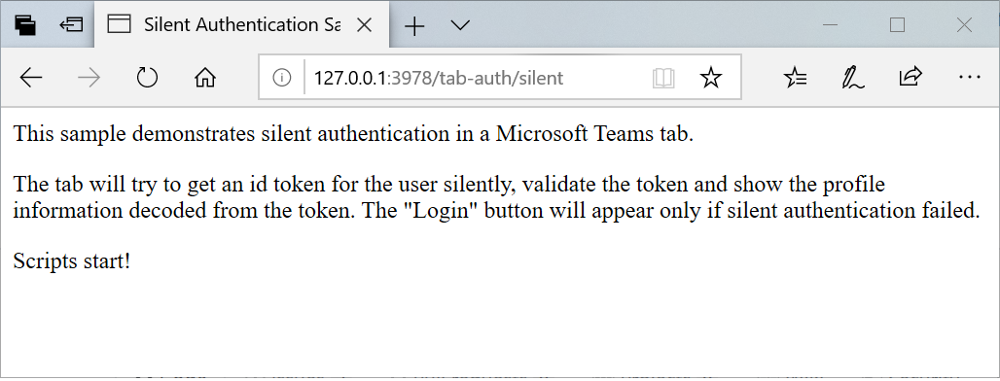
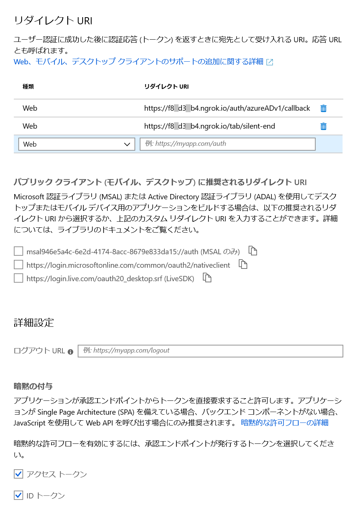
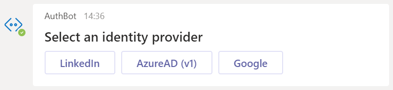
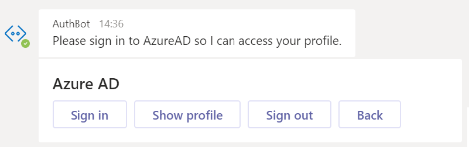
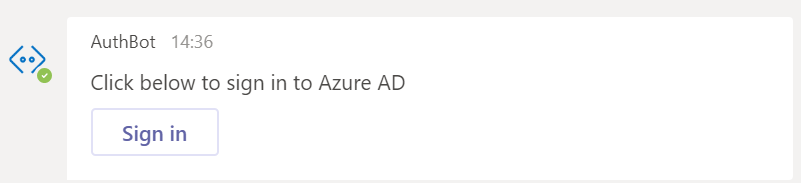
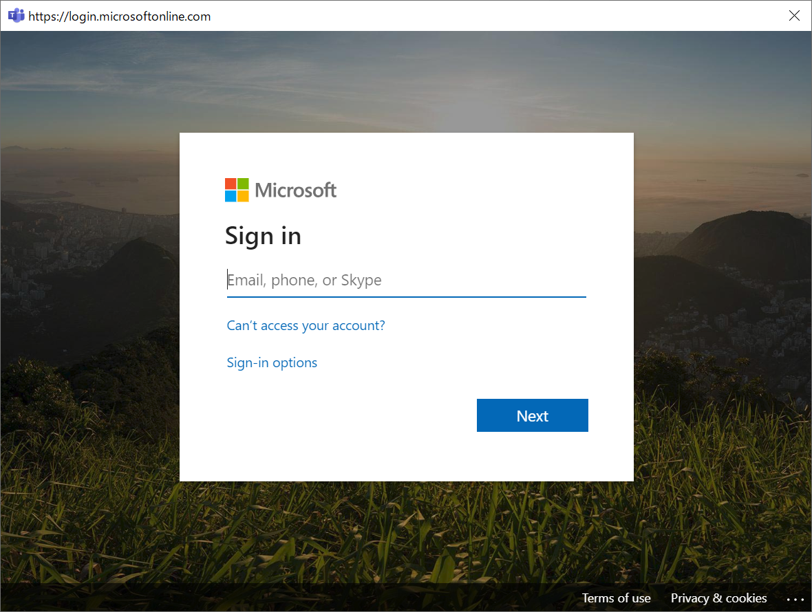
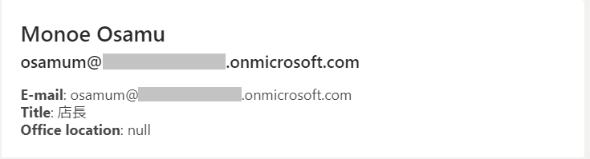

# 演習 4 : タブとボットのシングルサインオン
GitHub に用意されているサンプル プロジェクトを使用して Microsoft Teams のタブ アプリケーションとボットにシングルサインオン (Single Singon : SSO) を設定します。

## サンプル プロジェクトの入手
GitHib リポジトリ [**OfficeDev/microsoft-teams-sample-auth-node**](https://github.com/OfficeDev/microsoft-teams-sample-auth-node) からサンプル プロジェクトを Clone するか zip ファイルとして入手します。

なお、サンプル プロジェクトは JavaScript で記述されており Node.js で動作します。

サンプルプロジェクトの具体的な入手方法は以下の通りです。

* **Clone (※ [**git**](https://git-scm.com/downloads) がインストールされている必要があります)**
    
    コマンドプロンプトで任意のディレクトリに移動して以下のコマンドを実行します。

    `git clone https://github.com/OfficeDev/microsoft-teams-sample-auth-node.git`

* **zip ファイルとして入手**

    サンプルの[**リポジトリ**](https://github.com/OfficeDev/microsoft-teams-sample-auth-node)にアクセスして緑色の \[**Clone  or download**\] ボタンをクリック

    表示されたダイアログボックスの \[**Download ZIP**\] ボタンをクリックします。

    

    ダウンロードされた zip ファイルの内容を任意のフォルダに展開してください。

## サンプル プロジェクトの準備

サンプル プロジェクトが必要とするさまざまなモジュールをダウンロードしてインストールします。この作業は **npm** コマンドを使用して一括して行われます。

手順は以下のとおりです。

1. コマンドプロンプトを起動し、作業ディレクトリをダウンロードしたプロジェクトのフォルダ **microsoft-teams-sample-complete-node** に切り替えます。

2. 以下のコマンドを実行します。
    ```
    npm install
    ```
    プロジェクトのビルドや実行に必要となるモジュールがダウンロードされるので完了するまで待ちます。

3. 以下のコマンドを実行して Visual Studio Code 起動します。

    ```
    code .
    ```

4. Visual Studio Code のメニュー\[**Debug**\] - \[**Start Debugging**\] をクリックするか、キーボードの \[**F5**\] キーを押下してデバック実行を開始します。

    画面下部にターミナルウィンドウが表示され以下のメッセージが最後に表示されれはプロジェクトを動かす準備は完了です。
    ```
    Express server listening on port 3978

    Server running successfully
    ```
    起動の確認ができたら \[**Debug**\] - \[**Stop Debugging**\] をクリックするか、キーボードの \[**Shift**\] + \[**F5**\] キーを押下してデバック実行を終了します。

    もし、上記の出力がなく、エラーも発生している様子がない場合は、以下の URL にアクセスし、

    ```
    http://127.0.0.1:3978/tab-auth/silent
    ```
    以下のページが表示されれば問題ありません。

    


## インターネットへのトンネリング
ローカル環境で動作するサンプル アプリケーションを Microsoft Teams から参照可能にするために、ngrok を使用してインターネットへのトンネリングを構成します。

手順は以下の通りです。

1. コマンドプロンプトを起動し、以下のコマンドを実行してシェルを cmd.exe に切り替えます。

    ```
    cmd
    ```

2. 作業ディレクトリを ngrok.exe のあるディレクトリに切り替え以下のコマンドを実行します。

    ```
    ngrok http 3978 --host-header=localhost
    ```
3. ローカル環境でサンプル アプリケーションが動作している状態で、Web ブラウザーから ngrok が返す https のドメイン名を使用して以下のようにアクセスします。

    ```
    https://ngrokが返したランダムな数字.ngrok.io/tab/silent
    ```

    ローカルアドレスで接続したのと同じページが表示されれば完了です。


## サンプル プロジェクトのアプリケーション登録

入手したサンプルプロジェクトを Microsoft Teams にタブとボット アプリケーションとして登録します。

### タブ アプリケーション ##

[演習 2](Ex02.md) の内容を参考にして パーソナル タブ アプリケーションとして登録します。

**Personal Tab** ダイアログボックスの \[**\*Name**\]、\[**\*Entity ID**\] に指定するものは任意の値でかまいません。

同ダイアログボックスの \[**\*Content URL**\] には以下の URL を指定します。

```
https://ngrok が生成したドメイン名/tab/silent
```


### ボット アプリケーション

[演習 3](Ex03.md) の内容を参考にしてボット アプリケーションとして登録します。

ボットを作成すると、Azure AD 上にアプリケーションの登録が自動で行われます。

Microsoft Teams へのボットの登録が完了したら、App Studio の左側のツリーメニュー \[**③ Finish**\] - \[**Domain and permissions**\] をクリックし、画面右の **Valid domains** を確認して ngrok が生成したドメイン名が登録されていることを確認してください。

この設定は Teams アプリケーションの SSO 処理に必要ですが、ボットの登録だけでは行われません。もし、SSO 処理が必要なボット アプリケーションだけを登録する場合、この設定は手動で行う必要があります。


なお、ここで行う作業はあくまでも Microsoft Teams へのアプリケーションの登録のみで、インストールは行わないでください。

## サンプル アプリケーションへの認証処理に必要な情報の追加

サンプル アプリケーションに SSO 処理に必要な情報を追加します。

手順は以下のとおりです。

1. Visual Studio Code でサンプルアプリケーションのプロジェクトを開きます

2. Visual Studio Code の左側にあるプロジェクトのツリービューで .vscode フォルダの下にある **launch_example.json** ファイルの名前を **launch.json** に変更します

3. **launch.json** 内の JSON のプロパテを以下のようにすべて変更します

    |プロパティ|値|
    | ---- | ---- |
    |BASE_URI|**ngrok が生成したドメイン名**|
    |MICROSOFT_APP_ID|**ボットを登録するときに生成された ボットID**|
    |MICROSOFT_APP_PASSWORD|**ボットを登録するときに生成したパスワード**|

4. サンプルアプリケーションのプロジェクト内、**./src/views/tab** ディレクトリ配下にあるファイル **silent.hbs**、**silent-start.hbs**、**silent-end.hbs** のコードを編集します。

    各ファイル中のコード内の **{{appId}}** を **ボットを登録するときに生成された ボットID** に書き換えます。

## Azure AD へのアプリケーションの登録
前の手順てサンプル プロジェクトが Azure AD (Active Directory) にアプリケーションとして登録されているので認証処理を有効にするための設定を行います。

**なお、この方法は Microsoft Azure のサブスクリプションを持っていなくても Office 365 のサブスクリプションがあれば行うことできます。**

手順は以下のとおりです。

### アプリケーションの Azure AD への登録
1. [Azure のポータル](https://portal.azure.com/)にログインします。

2. 左のメニューより \[**Azure Active Directory**\] を選択します。

3. Azure AD のブレードより \[**アプリの登録**\] をクリックします。

4. 画面右に表示されたアプリケーションのリストから、サンプル アプリケーションの名前をダブル クリックします。

    今回はボットを登録したのでアプリケーションの名前が一覧に表示されますが、タブ アプリケーションだけの場合は自動でアプリケーションの登録は行われません。その場合は画面上の \[**+新規登録**] ボタンをクリックして手動でアプリケーションの登録を行います。

5. 選択したアプリケーションの設定画面に遷移するので、画面左のメニューより\[**認証**\] をクリックします。

6. 各項目を以下のよう設定して \[登録\] ボタンをクリックします。

    **リダイレクト URI**    

    |種類|リダイレクト URI|
    | ---- | ---- |
    |Web|https://ngrok のドメイン名/auth/azureADv1/callback|
    |Web|https://ngrok のドメイン名/tab/silent-end|


    **暗黙の付与**

    以下のチェックボックスにチェック
    
    * **アクセス トークン**
    * **ID トークン**

    以下は実際の画面です。

    

7. 画面上の \[**保存**\] ボタンをクリックして保存します。

8. 左側のブレードの \[**証明書とシークレット**\] をクリックします。

9. \[**+新しいクライアント シークレット**\] ボタンをクリックすると、\[**クライアント シークレットの追加**\] ダイアログボックスが表示されるので、項目を以下のように設定します。

    |項目|値|
    | ---- | ---- |
    | 説明 | Forever |
    |有効期限|なし|

10. \[**追加**\] ボタンをクリックして保存します。

11. 左側のブレードの \[**API のアクセス許可**\] をクリックします。

12. 画面右側に \[API のアクセス許可\] ペインが表示されるので \[ **+ アクセス許可の追加**\] ボタンをクリックします。

13. 画面右に \[API アクセス許可の要求\] ブレードが表示されるので、同ブレード内の \[**所属している組織で使用している API**\] リンクをクリック

14. API を公開しているアプリの一覧から **Microsoft Graph** をクリックします。

15. 項目 \[アプリケーションに必要なアクセス許可の種類\] で \[**委任されたアクセス許可**\] ボタンをクリックします。 

16. 項目 \[アクセス許可を選択する\] にアクセス許可の一覧が表示されるので、**User.Read** のチェックボックスにチェックをつけ \[**アクセス許可の追加**\] ボタンをクリックします。

17. 同画面下部にある \[**管理者の同意を与えます**\] ボタンをクリックします。

以上でアプリケーションの Azure AD への登録は完了です。
　
　
## アプリケーションの SSO 処理の動作の確認

サンプルアプリケーションをインストールして SSO 処理の動作を確認します。

なお、この手順を実行する前に Visual Studio Code でデバッグ実行を開始し、ngrok が動作していることを確認してください。

サンプルアプリケーションの SSO 処理の動作を確認する手順は以下のとおりです。

1. App Studio で Manifest editor メニューを選択し、登録されているアプリケーションのリストからサンプルアプリケーションのタイルをクリックします。

2. 左側のツリーメニューより \[**③ Finish**\] - \[**Test and Distribute**\] をクリックします。

3. Test and Distribute の画面内の \[**Install**\] ボタンをクリックします。

4. 表示されたダイアログボックスで \[**追加**\] ボタンをクリックします。

5. インストールが完了すると、ボットとのチャット画面に遷移するので Hi と入力して送信します。

6. ボットの返信の中に「Select an identity provider」といメッセージ、\[LinkedIn\]、\[AzureAD (v1)\]、\[Google\] の 3 つのボタンが表示されるので \[**AzureAD (v1)**\]をクリックします。

    

7. 「Please sign in to AzureAD so I can access your profile.」というメッセージに続き Azure AD についての \[Sign in\]、\[Show profile\]、\[Sign out\]、\[Back\] ボタンが表示されるので \[**Sign in**\] ボタンをクリックします。

    

8. 「Click below to sign in to Azure AD」というメッセージに続き \[**Sign in**\]　ボタンが表示されるのでクリックします。

    

9. Sign in ダイアログボックスが表示されるのでアカウント情報を入力して認証処理を行います。

    

10. サインインの成功すると以下のようなプロファイル情報が表示されます。

    

    続いて、タブ アプリケーションの SSO の動作を確認します。

11. ボットとの会話チャネルにサンプル アプリケーションのタブが追加されているのでアクティブにします。

12. タブ内の \[**Login to Azure AD**\] ボタンをクリックします。

    

13. ボット側でログイン済みの場合はログイン用のポップアップは表示されず、ボットよりもより詳しいユーザーのプロファイル情報が表示されます。

    ボット側でログインがされていない場合は、Sign in ダイアログボックスが表示されるのでアカウント情報を入力して認証処理を行ってください。

   ボット、タブ問わず、ログインが成功した場合は、再度タブを表示した場合に \[**Login to Azure AD**\] ボタンは表示されず、ユーザーのプロファイル情報が取得されていることを確認してください。

**⇒【 5. [メッセージ拡張とメッセージアクション](Ex05.md) 】へ**

\<参考\>

* [**Authentication in Teams**](https://docs.microsoft.com/en-us/microsoftteams/platform/concepts/authentication/authentication)

## 目次
0. [**Microsoft Teams アプリケーション開発について**](Intro.md)

1. [**Microsoft Teams アプリケーションの新規作成**](Ex01.md)
    * [**App Studio を使用したマニフェストファイルの作成**](Tut02.md#app-studio-を使用した-teams-アプリケーションの登録)
2. [**タブ アプリケーション**](Ex02.md)
    * [**パーソナル タブ**](Ex02.md#%E3%82%BF%E3%82%B9%E3%82%AF-1--%E3%83%91%E3%83%BC%E3%82%BD%E3%83%8A%E3%83%AB-%E9%9D%99%E7%9A%84-%E3%82%BF%E3%83%96%E3%81%AE%E8%BF%BD%E5%8A%A0)
    * [**チーム タブ**](Ex02.md#%E3%83%81%E3%83%BC%E3%83%A0-%E6%A7%8B%E6%88%90%E5%8F%AF%E8%83%BD-%E3%82%BF%E3%83%96%E3%81%AE%E8%BF%BD%E5%8A%A0)

    * [**タブ : タスクモジュールの表示**](https://github.com/osamum/Easyway-for-MSTeamsAppDev/blob/master/Ex02.md#タスク-3-タブでのタスク-モジュールの表示)
    
3. [**ボット**](Ex03.md)
    * [**ボットの登録**](https://github.com/osamum/Easyway-for-MSTeamsAppDev/blob/master/Ex03.md#microsoft-teams-へのボットの登録)
    * Teams Bot Builder SDK を使用した拡張
4. [**タブとボットのシングルサインオン**](Ex04.md)
5. [**メッセージ拡張とメッセージアクション**](Ex05.md)
6. [**コネクタ**](Ex06.md)


