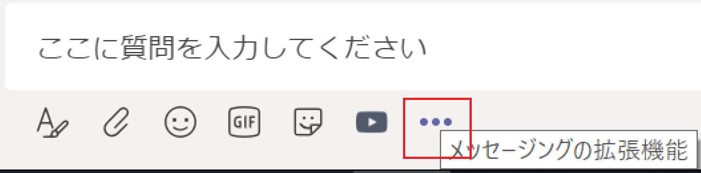
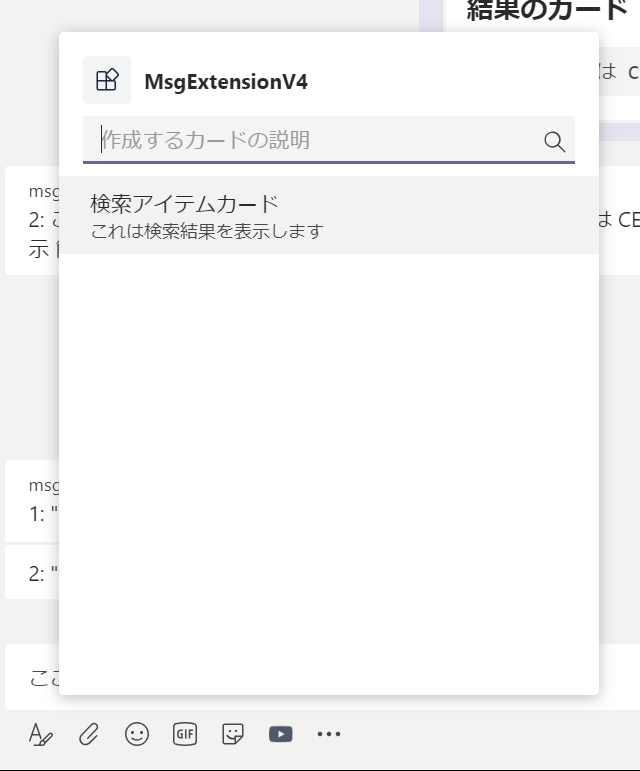
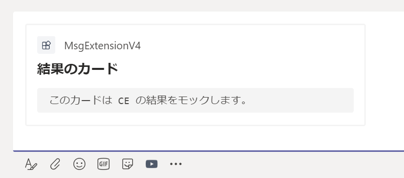

# 演習 4 : メッセージング拡張

メッセージング拡張を使用すると、ユーザーは、メッセージ作成領域、コマンド ボックスから、またはメッセージから直接、操作するアクションを検索したり、もしくはただのテキストの入力とは異なるアクションを開始したりできます。 

その操作の結果を、通常はリッチに書式設定されたカードとして Microsoft Teams クライアントに送信できます。

たとえば、以下画面ショットの赤枠にある検索ボックスや、メッセージの \[...\](その他のオプション)メニュー、メッセージ投稿ボタンの左横にならんだアイコンをクリックすると、さまざまな機能を実行することができます。


## メッセージング拡張機能の仕組み
[メッセージング拡張](https://docs.microsoft.com/ja-jp/microsoftteams/platform/concepts/messaging-extensions/messaging-extensions-overview)機能は、ホストする Web サービスと、メッセージング拡張の UI や呼び出し箇所を定義するアプリのマニフェストによって構成されています。


メッセージング拡張用の Web サービスは、Bot Framework を使用して開発しボットとして登録する必要があります。

Web サービス側の開発について、以前は Bot Framework SDK に Teams の拡張を追加する必要がありましたが、Microsoft Bot Framework SDK 4.6 からはそれらの機能は統合されており、現在では Bot Framework SDK だけで開発することができます。

メッセージング拡張の機能は Microsoft Bot Framework のアクティビティ ハンドラーから派生したTeams アクティビティ ハンドラーを使用して処理します。Teams アクティビティ ハンドラーは、すべての Teams アクティビティをルーティングします。

メッセージング拡張の呼び出し時の UI や機能を定義する Microsoft Teams アプリのアプリ マニフェストでは、最大 10 種類の異なるコマンドを使用して 1 つのメッセージング拡張機能を定義します。 それぞれのコマンドは、種類 (アクションや検索) と、それが呼び出されるクライアント内の場所 (メッセージ作成領域、コマンド バー、および/またはメッセージ) を定義します。 


## メッセージング拡張機能の種類

メッセージング拡張機能のコマンドの種類の機能には以下のものがあります。

* 検索コマンド

    検索コマンドを使用すると、ユーザーは 外部システムの情報を検索し、検索結果をメッセージに挿入できます。

* 操作コマンド

    操作コマンドでは、情報を収集または表示するためのモーダル ポップアップをユーザーに表示できます。 ユーザーがフォームを送信すると、Web サービスはメッセージを会話に直接挿入するか、またはメッセージ作成領域にメッセージを挿入し、ユーザーがメッセージを送信できるようにすることで応答します。

* その他 : リンク展開

    リンク展開オプションを使用すると、メッセージ作成領域に URL が貼り付けられたときにサービスを呼び出すことができます。たとえば、特定のドメインを含む URL がメッセージ作成領域に貼り付けられたときに、呼び出しを受け取るように構成することができます。

## 演習の準備

この演習では Visual Studio、Visual Studio Code 用の Teams Toolkit を使用しますので、以下から使用する IDE 用の Teams Toolkit を入手してインストールします。

* **[Microsoft Teams Toolkit for Visual Studio Code](https://marketplace.visualstudio.com/items?itemName=TeamsDevApp.ms-teams-vscode-extension)**
* **[Microsoft Teams Toolkit for Visual Studio](https://marketplace.visualstudio.com/items?itemName=TeamsDevApp.vsteamstemplate)**


### App Studio ではなく Teams Toolkit を使用する理由

Teams Toolkit 拡張を使用すると、タブやボットやメッセージ拡張の半完成品のひな型を生成してくれるので、開発の工数を削減することができます。

ただし、自動で設定がされてしまうためマニフェストの細かい設定が JSON を読まないと分からなかったり、タブの場合は JavaScript フレームワークの React の使用が前提になるなど、ある程度 Teams アプリの開発に慣れていないと使いこなすのが難しい部分があります。

また、Teams アプリを新規に作成する目的のツールであるため既存の Web サイトやボットを Teams のアプリとして登録する目的には向いていません。

しかし、メッセージング拡張のような Teams 固有の機能を新規で作成するのには有効です。

理由としては、Bot Builder が生成する素のプロジェクトをメッセージング拡張用に手動で書き換えるのはけっこう面倒であり、また、App Studio もメッセージング拡張の開発についてはアプリの登録程度の機能しかないためです。

Teams Toolkit 拡張は、メッセージング拡張の基本的な機能を実装したプロジェクトとマニフェスト ファイルを生成し、テスト環境も提供します。


## タスク 1 : メッセージング拡張 - 検索機能の実装

Visual Studio Code の Teams Toolkit 拡張を使用して検索機能をもつメッセージング拡張を作成します。

具体的な手順は以下のとおりです。

1. Visual Studio Code を起動します。

2. 画面左のアクティビティ バーで\[Microsoft Teams\]アイコン(※)をクリックします。 
    
    (※)アクティビティ バー\[Microsoft Teams\]アイコンは Teams Toolkit 拡張がインストールされていないと表示されませんので、表示されていない場合はインストールしてください。

3. 認証ダイアログボックスが表示されるので、目的にのテナントのMicrosoft 365 開発アカウントでサインインします。

4.  メニューが表示されるので\[Create a new Teams app\] をクリックします。


5. \[Microsoft Teams Toolkit\] タブ内、 **Messaging Extensions** とラベルの付いた囲みの中にある **Search** 横の \[JS\] ボックスをクリックします。 
    

6. **Configure project** 画面に遷移するので各項目を以下のように設定します。
    
    |項目|値|
    |---|---|
    | Application Name | Search-Extension  |

    **Configure bot**

    |項目|値|
    |---|---|
    | Create a new bot | チェック |
    | Use an existing bot registerd with Bot Framework| チェックしない |

6.  \[Create Bot Registration\] ボタンをクリックします。

    ボットの登録が開始され、完了すると**Creating Bot**にボット ID が、**Creating Bot Password**にボット パスワードが表示されるので、メモ帳などに貼り付け、忘れないように保持します。

    とくにパスワードは二度と表示されないので重要です。
    
7. \[Finish\] ボタンをクリックするとプロジェクトを保存するフォルダを選択するダイアログボックスが表示されるので、任意のフォルダを選択し、ダイアログボックスの\[Choose workspace folder\] ボタンをクリックします。

8. プロジェクトの生成が完了したら、メニュー\[Terminal\]-\[New Terminal\] をクリックしてターミナル ウィンドウを開き、以下のコマンドを入力して依存関係のあるモジュールをインストールします。

    ```
    npm install
    ```

    赤文字でなにかしら表示された場合は以下のコマンドを実行します。

    ```
    npm audit fix --force
    ```

9. 以下のコマンドを実行し、正常にサービスが開始できることを確認します。

    ```
    npm start
    ```
    
    正常にサービスが開始できるとターミナル ウィンドウに以下のメッセージが表示されます。

    ```
    Bot/ME service listening at http://localhost:3978
    ```

10. OS のメニューからコマンドプロンプトを起動し、作業ディレクトリを　engrok のインストールされているディレクトリに切り替え、以下のコマンドを実行します、

    ```
    ngrok http -host-header=rewrite 3978
    ```

    ngrok が返す https のドメイン名をコピーしてメモ帳などに貼り付けて保持します。

11. Visual Studio Code の画面左のアクティビティ バーで\[Microsoft Teams\]アイコンをクリックし、表示されたメニューリストから\[Open Microsoft Teams Toolkit\] を選択します。

12. \[Microsoft Teams Toolkit\] タブが表示されるので、同タブ内の \[Bots\] ボタンをクリックします。

13. タブ画面右の項目 ***Existing bot registrations** の Choose Bot と表示されているドロップダウンリストボックスをクリックし、この演習で作成した **Toolkit Bot-Search-Extension** を選択します。

14. 選択したボットの設定項目が表示されるので、**Bot endpoint address** に以下の URL を設定します。

    ```
    https://ngrokが生成したドメイン/api/messages
    ```

    テキストボックスからフォーカスが外れると、エンドポイントの有効性がチェックされ、設定が保存されます。

15. 作成したメッセージング拡張をテストインストールして動作を確認します。

    Visual Studio Code のターミナル ウィンドウでサービスが稼働状態であることを確認します。

16. キーボードの \[F5\] キーを押下します。

    Web ブラウザーが起動し、認証ダイアログボックスが表示さるので、任意の Office 365 アカウントでログインします。

17. Teams アプリの追加画面が表示されるので、\[追加\] ボタンをクリックします。

18. アプリのインストールが完了されるとメッセージング拡張の検索 UI が表示されるので、適当なアルファベットを入力し、検索結果がリストされること、リストされたアイテムが投稿の編集画面に表示されることを確認してください。

    

    【重要】

    検索ボックスにキーワードを入力した際 "アプリに接続できません。"というエラーが返る場合は、以下の順番でトラブルシュートしてくたさい。

    1. ngrok が起動しているか、タイムアウトしていないか確認
    
    2. ngrok のウィンドウで、リクエストのログがあるか確認

        ある : Visual Studio Code のターミナル ウィンドウで、サービスが稼働しているか確認

        ない : 以下の手順でエンドポイントの設定を確認

            1. Visual Studio Code のアクティビティバーの Teams アイコンをクリックし、\[Open the Microsoft Teams developer Tools Windows] メニューを選択

            2. \[Microsoft Teams Toolkit \]タブ内の \[App Studio\] ボックスをクリック

            3. App Studio が表示されるので、\[Capabilities\]-\[Message extensions\] をクリック

            4. メッセージング拡張の設定画面が表示さるので \[Bot endpoint address\] に URL が設定されているか確認し、空の場合は正しい URL を設定
    

[**演習 3: Microsoft Teams へのボットの登録**](https://github.com/osamum/Easyway-for-MSTeamsAppDev/blob/master/Ex03.md#microsoft-teams-%E3%81%B8%E3%81%AE%E3%83%9C%E3%83%83%E3%83%88%E3%81%AE%E7%99%BB%E9%8C%B2) の手順に従い、作成したボットを Microsoft Teams にアプリケーションとして登録します。ただし、インストールは行わないでください。

## タスク 2 : メッセージング拡張の登録

作成したボットを Microsoft Teams への登録し終えたら、次にメッセージング拡張として登録します。なお、ボット アプリケーションとして登録を行わず、直接メッセージング拡張として登録することもできます。

Microsoft Teams へ登録されているボットをメッセージング拡張として登録する手順は以下のとおりです。

1. App Studio の左側のツリーメニューより \[**② Capabilities**\] - \[**Messaging extensions**\] をクリックします。

2. 画面右の Messaging Extensions ペインで \[**Set up**\] ボタンをクリックします。

3. Messaging Extensions ダイアログボックスが表示されるので、\[**Use existing bot**\] タブをクリックしてアクティブにします。

4. **\*BotID** で \[**Select from my existing bots**\] オプション ボタンをクリックします。

5. \[**Choose One**\] ドロップダウン リストボックスが表示されるのでクリックしてタスク 1 で登録したボットを選択します。

6. 同ダイアログボックスの \[**\*Bot name**\] に任意の名前を指定して \[Save\] ボタンをクリックして保存します。

7. メッセージング拡張に Command の登録が必須なので、ラベル Command のところにある \[**Add**\] ボタンをクリックします。

    なお、今回の実装では Command を処理する機能は実装していません。

8. \[New command\] ダイアログボックスが表示されるので、ボックス内上の \[**Allow users to query your service for information and insert that into a message**\] ボタンをクリックします。

9. コマンドの詳細設定ダイアログボックスが表示されるので、各項目を以下のように設定します。

    |項目|値|
    |---|---|
    | *Command Id | createcard |
    | *Title | Create card |
    | Description | 今回は実装していません |
    | Initial run? | チェック |
    | Command Box | チェック |
    | Compose Box | チェック |
    | Message | チェック |

    **Parameter**
    |項目|値|
    |---|---|
    | *Name | newcardname |
    | *Title | New card name |
    | Description | 作成するカードの説明 |
    | Set the type of input required | text |

    \[**Save**\] ボタンをクリックして保存します。

8. App Studio の左側のツリーメニューより \[**③ Finish**\] - \[**Test and distribute**\] をクリックします。

9. 画面右の Test and distribute ペインで \[**Install**\] ボタンをクリックします。

10. 表示されたダイアログボックスの \[追加\] ボタンをクリックします。

11. アプリケーションがインストールされチャット画面が表示されるので、コンポーズボックス (投稿するテキストを入力するところ) の下段の \[**・・・**\](メッセージング拡張機能)ボタンをクリックします。 

    

12. メッセージング拡張機能をサポートするアプリケーションの一覧が表示されるので、この演習で作成したアプリケーションをクリックします。

13. 検索ボックスが表示されると同時に \[検索アイテムカード\] というアイテムが表示されるのでクリックします。

    

14. メッセージの編集ボックス内にカードが表示され、入力したテキストと一緒に投稿できることを確認してください。

    

**⇒【 6. [コネクタ](Ex06.md) 】へ**

\<参考\>
* [**Develop messaging extensions for Microsoft Teams**](https://docs.microsoft.com/en-us/microsoftteams/platform/concepts/messaging-extensions/messaging-extensions-overview)

* [**This functionality is moving into the core Bot Framework SDK**](https://github.com/OfficeDev/BotBuilder-MicrosoftTeams-node)


## 目次
0. [**Microsoft Teams アプリケーション開発について**](Intro.md)

1. [**Microsoft Teams アプリケーションの新規作成**](Ex01.md)
    * [**App Studio を使用したマニフェストファイルの作成**](Tut02.md#app-studio-を使用した-teams-アプリケーションの登録)
2. [**タブ アプリケーション**](Ex02.md)
    * [**パーソナル タブ**](Ex02.md#%E3%82%BF%E3%82%B9%E3%82%AF-1--%E3%83%91%E3%83%BC%E3%82%BD%E3%83%8A%E3%83%AB-%E9%9D%99%E7%9A%84-%E3%82%BF%E3%83%96%E3%81%AE%E8%BF%BD%E5%8A%A0)
    * [**チーム タブ**](Ex02.md#%E3%83%81%E3%83%BC%E3%83%A0-%E6%A7%8B%E6%88%90%E5%8F%AF%E8%83%BD-%E3%82%BF%E3%83%96%E3%81%AE%E8%BF%BD%E5%8A%A0)

    * [**タブ : タスクモジュールの表示**](https://github.com/osamum/Easyway-for-MSTeamsAppDev/blob/master/Ex02.md#タスク-3-タブでのタスク-モジュールの表示)
    
3. [**ボット**](Ex03.md)
    * [**ボットの登録**](https://github.com/osamum/Easyway-for-MSTeamsAppDev/blob/master/Ex03.md#microsoft-teams-へのボットの登録)
4. [**メッセージング拡張**](Ex04.md)
5. [**タブとボットのシングルサインオン**](Ex05.md)
6. [**コネクタ**](Ex06.md)

