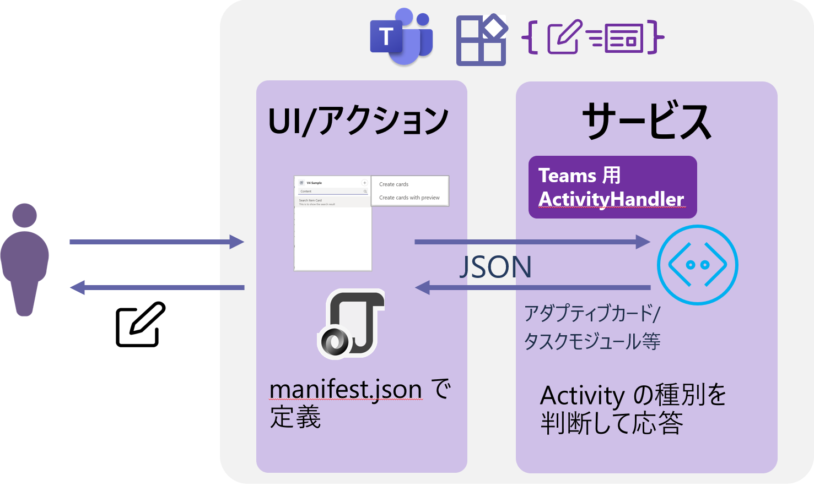
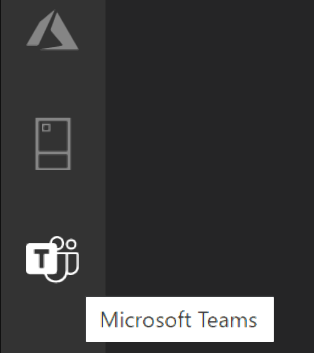
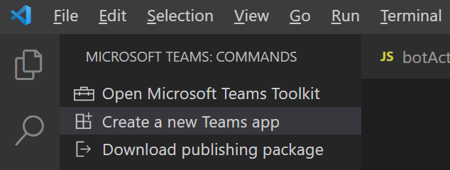
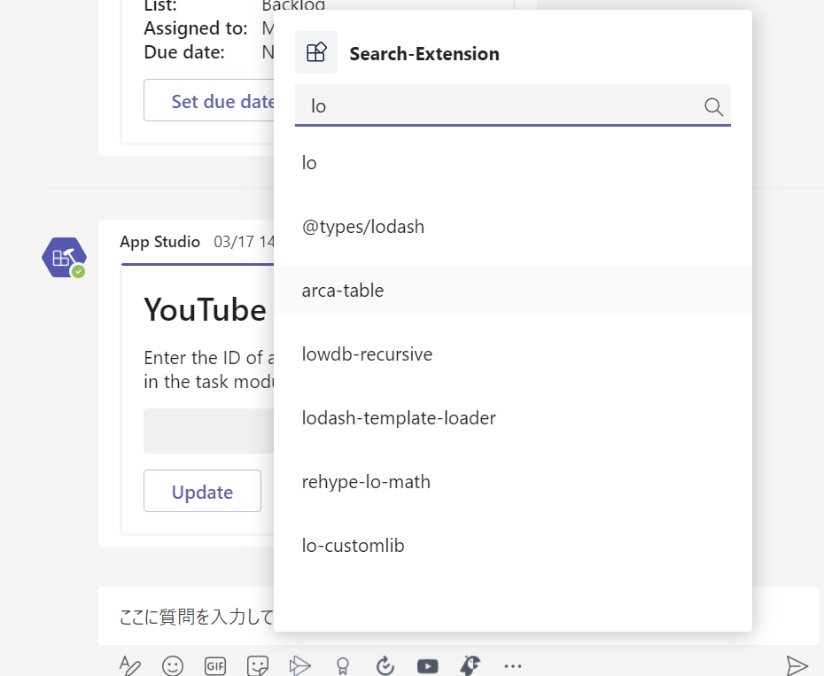
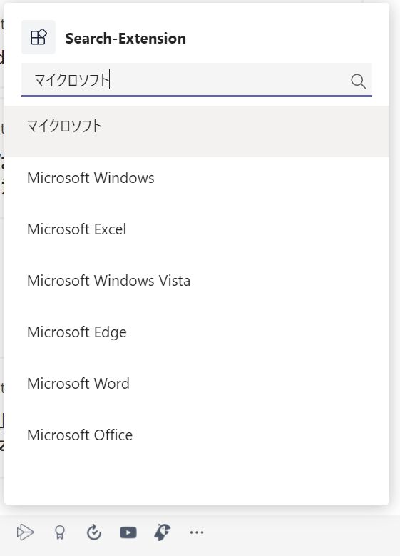
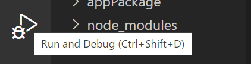
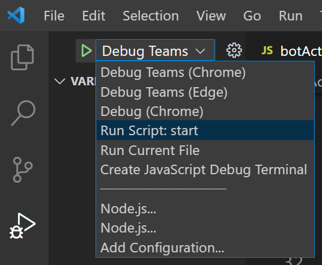
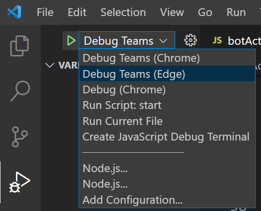
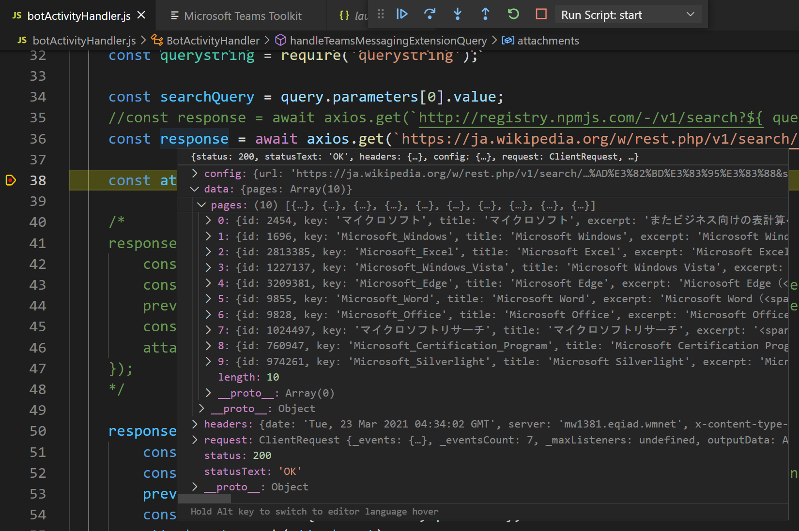

# 演習 4 : メッセージング拡張

メッセージング拡張を使用すると、ユーザーは、メッセージ作成領域、コマンド ボックスから、またはメッセージから直接、操作するアクションを検索したり、もしくはただのテキストの入力とは異なるアクションを開始したりできます。 

その操作の結果を、通常はリッチに書式設定されたカードとして Microsoft Teams クライアントに送信できます。

たとえば、以下画面ショットの赤枠にある検索ボックスや、メッセージの \[...\](その他のオプション)メニュー、メッセージ投稿ボタンの左横にならんだアイコンをクリックすると、さまざまな機能を実行することができます。


## メッセージング拡張機能の仕組み
[メッセージング拡張](https://docs.microsoft.com/ja-jp/microsoftteams/platform/concepts/messaging-extensions/messaging-extensions-overview)機能は、ホストする Web サービスと、メッセージング拡張の UI や呼び出し箇所を定義するアプリのマニフェストによって構成されています。



メッセージング拡張用の Web サービスは、Bot Framework を使用して開発しボットとして登録する必要があります。

Web サービス側の開発について、以前は Bot Framework SDK に Teams の拡張を追加する必要がありましたが、Microsoft Bot Framework SDK 4.6 からはそれらの機能は統合されており、現在では Bot Framework SDK だけで開発することができます。

メッセージング拡張の機能は Microsoft Bot Framework のアクティビティ ハンドラーから派生したTeams アクティビティ ハンドラーを使用して処理します。Teams アクティビティ ハンドラーは、すべての Teams アクティビティをルーティングします。

メッセージング拡張の呼び出し時の UI や機能を定義する Microsoft Teams アプリのアプリ マニフェストでは、最大 10 種類の異なるコマンドを使用して 1 つのメッセージング拡張機能を定義します。 それぞれのコマンドは、種類 (アクションや検索) と、それが呼び出されるクライアント内の場所 (メッセージ作成領域、コマンド バー、および/またはメッセージ) を定義します。 


## メッセージング拡張機能の種類

メッセージング拡張機能のコマンドの種類の機能には以下のものがあります。

* 検索コマンド

    検索コマンドを使用すると、ユーザーは 外部システムの情報を検索し、検索結果をメッセージに挿入できます。

* 操作コマンド

    操作コマンドでは、情報を収集または表示するためのモーダル ポップアップをユーザーに表示できます。 ユーザーがフォームを送信すると、Web サービスはメッセージを会話に直接挿入するか、またはメッセージ作成領域にメッセージを挿入し、ユーザーがメッセージを送信できるようにすることで応答します。

* その他 : リンク展開

    リンク展開オプションを使用すると、メッセージ作成領域に URL が貼り付けられたときにサービスを呼び出すことができます。たとえば、特定のドメインを含む URL がメッセージ作成領域に貼り付けられたときに、呼び出しを受け取るように構成することができます。

## 演習の準備

この演習では Visual Studio、Visual Studio Code 用の Teams Toolkit を使用しますので、以下から使用する IDE 用の Teams Toolkit を入手してインストールします。

* **[Microsoft Teams Toolkit for Visual Studio Code](https://marketplace.visualstudio.com/items?itemName=TeamsDevApp.ms-teams-vscode-extension)**
* **[Microsoft Teams Toolkit for Visual Studio](https://marketplace.visualstudio.com/items?itemName=TeamsDevApp.vsteamstemplate)**


### App Studio ではなく Teams Toolkit を使用する理由

Teams Toolkit 拡張を使用すると、タブやボットやメッセージ拡張の半完成品のひな型を生成してくれるので、開発の工数を削減することができます。

ただし、自動で設定がされてしまうためマニフェストの細かい設定が JSON を読まないと分からなかったり、タブの場合は JavaScript フレームワークの React の使用が前提になるなど、ある程度 Teams アプリの開発に慣れていないと使いこなすのが難しい部分があります。

また、Teams アプリを新規に作成する目的のツールであるため既存の Web サイトやボットを Teams のアプリとして登録する目的には向いていません。

しかし、メッセージング拡張のような Teams 固有の機能を新規で作成するのには有効です。

理由としては、Bot Builder が生成する素のプロジェクトをメッセージング拡張用に手動で書き換えるのはけっこう面倒であり、また、App Studio もメッセージング拡張の開発についてはアプリの登録程度の機能しかないためです。

Teams Toolkit 拡張は、メッセージング拡張の基本的な機能を実装したプロジェクトとマニフェスト ファイルを生成し、テスト環境も提供します。


## タスク 1 : メッセージング拡張 - Wikipedia 検索機能の実装

Visual Studio Code の Teams Toolkit 拡張を使用して検索機能をもつメッセージング拡張を作成し、Wikipedia を検索できるようにします。

具体的な手順は以下のとおりです。

1. Visual Studio Code を起動します。

2. 画面左のアクティビティ バーで\[Microsoft Teams\]アイコン(※)をクリックします。 
    
    

    (※)アクティビティ バー\[Microsoft Teams\]アイコンは Teams Toolkit 拡張がインストールされていないと表示されませんので、表示されていない場合はインストールしてください。

3. 認証ダイアログボックスが表示されるので、目的のテナントのMicrosoft 365 開発アカウントでサインインします。

4.  メニューが表示されるので\[**Create a new Teams app**\] をクリックします。

    

5. \[Microsoft Teams Toolkit\] タブ内、 **Messaging Extensions** とラベルの付いた囲みの中にある **Search** 横の \[JS\] ボックスをクリックします。 

        

6. **Configure project** 画面に遷移するので各項目を以下のように設定します。
    
    |項目|値|
    |---|---|
    | Application Name | Search-Extension  |

    **Configure bot**

    |項目|値|
    |---|---|
    | Create a new bot | チェック |
    | Use an existing bot registerd with Bot Framework| チェックしない |

7.  \[Create Bot Registration\] ボタンをクリックします。

    ボットの登録が開始され、完了すると**Creating Bot**にボット ID が、**Creating Bot Password**にボット パスワードが表示されます。

    App Studio で作業する際はこれらの情報をメモしておく必要がありましたが Teams Toolkit を使用した作業では生成されるプロジェクトに含まれる .env ファイルに自動で記述されています。
    
8. \[Finish\] ボタンをクリックするとプロジェクトを保存するフォルダを選択するダイアログボックスが表示されるので、任意のフォルダを選択し、ダイアログボックスの\[Choose workspace folder\] ボタンをクリックします。

9. プロジェクトの生成が完了したら、メニュー\[Terminal\]-\[New Terminal\] をクリックしてターミナル ウィンドウを開き、以下のコマンドを入力して依存関係のあるモジュールをインストールします。

    ```
    npm install
    ```

    赤文字でなにかしら表示された場合は以下のコマンドを実行します。

    ```
    npm audit fix --force
    ```

10. 以下のコマンドを実行し、正常にサービスが開始できることを確認します。

    ```
    npm start
    ```
    
    正常にサービスが開始できるとターミナル ウィンドウに以下のメッセージが表示されます。

    Bot/ME service listening at http://localhost:3978
    

11. OS のメニューからコマンドプロンプトを起動し、作業ディレクトリを　engrok のインストールされているディレクトリに切り替え、以下のコマンドを実行します、

    ```
    ngrok http -host-header=rewrite 3978
    ```

    ngrok が返す https のドメイン名をコピーしてメモ帳などに貼り付けて保持します。

12. Visual Studio Code の画面左のアクティビティ バーで\[Microsoft Teams\]アイコンをクリックし、表示されたメニューリストから\[Open Microsoft Teams Toolkit\] を選択します。

13. \[Microsoft Teams Toolkit\] タブが表示されるので、同タブ内の \[Bots\] ボタンをクリックします。

14. タブ画面右の項目 ***Existing bot registrations** の Choose Bot と表示されているドロップダウンリストボックスをクリックし、この演習で作成した **Toolkit Bot-Search-Extension** を選択します。

15. 選択したボットの設定項目が表示されるので、**Bot endpoint address** に以下の URL を設定します。

    ```
    https://ngrokが生成したドメイン/api/messages
    ```

    テキストボックスからフォーカスが外れると、エンドポイントの有効性がチェックされ、設定が保存されます。

16. 作成したメッセージング拡張をテストインストールして動作を確認します。

    Visual Studio Code のターミナル ウィンドウでサービスが稼働状態であることを確認します。

17. キーボードの \[F5\] キーを押下します。

    Web ブラウザーが起動し、認証ダイアログボックスが表示さるので、任意の Office 365 アカウントでログインします。

18. Teams アプリの追加画面が表示されるので、\[追加\] ボタンをクリックします。

19. アプリのインストールが完了されるとメッセージング拡張の検索 UI が表示されるので、適当なアルファベットを入力し、検索結果がリストされること、リストされたアイテムが投稿の編集画面に表示されることを確認してください。

    

    ### **【重要】**

    検索ボックスにキーワードを入力した際 " **アプリに接続できません。** "というエラーが返る場合は、以下の順番でトラブルシュートしてくたさい。

    1. ngrok が起動しているか、タイムアウトしていないか確認
    
    2. ngrok のウィンドウで、リクエストのログがあるか確認

        ある : Visual Studio Code のターミナル ウィンドウで、サービスが稼働しているか確認

        ない : 以下の手順でエンドポイントの設定を確認

        1. Visual Studio Code のアクティビティバーの Teams アイコンをクリックし、\[Open the Microsoft Teams developer Tools Windows] メニューを選択

        2. \[Microsoft Teams Toolkit \]タブ内の \[App Studio\] ボックスをクリック

        3. App Studio が表示されるので、\[Capabilities\]-\[Message extensions\] をクリック

        4. メッセージング拡張の設定画面が表示さるので \[Bot endpoint address\] に URL が設定されているか確認し、空の場合は正しい URL を設定

    Microsoft Teams Toolkit が生成したメッセージング拡張が生成したプロジェクトが正常に動作することが確認できたら、Wikipedia を検索できるようにコードを変更します。

20. Visual Studio Code に表示されているデバッグツールバーのデバッグ停止ボタン(赤い ■ マーク)をクリックしてデバッガを停止します。

21. ターミナルウィンドウの \[TARMINAL\] タブがアクティブになっていることを確認し、キーボードの \[Ctrl\] + \[C\] を押下してサービスを停止します。

22. Teams からのアクティビティを処理するコードが記述されている **botActivityHandler.js** を開きます。

23. **handleTeamsMessagingExtensionQuery** メソッド中の以下のコードを、

    ```
    const response = await axios.get(`http://registry.npmjs.com/-/v1/search?${ querystring.stringify({ text: searchQuery, size: 8 }) }`);
    ```

    Wikipedia API のエンドポイントを指すように以下のように書き換えます。

    ```
    const response = await axios.get(`https://ja.wikipedia.org/w/rest.php/v1/search/page?${querystring.stringify({ q: searchQuery, size: 8 })}&limit=10`);
    ```
24. 同様に同メソッドの以下のコードを、

    ```
     response.data.objects.forEach(obj => {
            const heroCard = CardFactory.heroCard(obj.package.name);
            const preview = CardFactory.heroCard(obj.package.name); // Preview cards are optional for Hero card. You need them for Adaptive Cards.
            preview.content.tap = { type: 'invoke', value: { description: obj.package.description } };
            const attachment = { ...heroCard, preview };
            attachments.push(attachment);
        });
    ```

    Wikipedia API が返す JSON の構造に合わせ、以下のように書き換えます。

    ```
    response.data.pages.forEach(obj => {
            const heroCard = CardFactory.heroCard(obj.title);
            const preview = CardFactory.heroCard(obj.title); // Preview cards are optional for Hero card. You need them for Adaptive Cards.
            preview.content.tap = { type: 'invoke', value: { description: obj.excerpt } };
            const attachment = { ...heroCard, preview };
            attachments.push(attachment);
        });
    ```

25. プロジェクトを実行し、表示されたメッセージング拡張の検索ボックスに日本語のキーワードを入力します。

    正常に動作していれば以下の図のように Wikipedia の検索結果がリストされ、アイテムを選択することにより投稿画面に内容が貼り付けられます。

    

    コードの変更がうまくいかない場合は、[このサンプル](Ex04/samples/botActivityHandler.js)を参考にしてください。

以上で Microsoft Teams Toolkit を使用したメッセージング拡張(検索) の作成は完了です。

## 【Tips : Visual Sudio Code Teams Toolkit でのデバッグ方法について】

Visual Sudio Code の Teams Toolkit 拡張を使用した開発を行う場合、通常であればそのままコードへのブレークポイントの設定やステップ実行が使えますか、ツールのアップデート時のリグレッションや、その他の原因によりこれらの機能が使用できない場合があります。

その場合、コードのデバッグプロセスと Web ブラウザーの Teams のエミュレーションを別々に開始することで、ブレークポイントの設定やステップ実行が行えるようになります。

具体的な方法は以下のとおりです。

1. Visual Studio Code の \[Run and Debug\] アイコンをクリックするか、キーボードの\[Ctrl]-\[Shift]-\[D] を押下します。

    

2. 画面左上の \[▶]\(Start Debugging) ボタン右横のドロップダウンリストをクリックし、\[**Run Script: start**] を選択し、\[▶]ボタンをクリックしてデバッガのアタッチされたサービスを開始します。

    

    \[DEBUG CONSOLE] に以下のメッセージが表示されるのを待ちます。

    ```
    Bot/ME service listening at http://localhost:3978
    ```

3. 画面左上の \[▶]\(Start Debugging) ボタン右横のドロップダウンリストをクリックし、\[**Debug Teams(Edge**)]もしくは\[**Debug Teams(Chrome**)]を選択し、\[▶]ボタンをクリックします。

    

    Web ブラウザー中に Teams がロードされます。

    この状態で、Visual Studio Code 側からデバッグ可能になっているので、エディタ画面の行番号の左側をクリックしてブレークポイントを設定し、\[F11]キーでのステップ実行などが可能です。

    

## まとめ

この演習では Visual Studio Code 用の Teams Toolkit 拡張を使用して、検索機能をもつメッセージング拡張を作成しました。

Teams Toolkit を使用すると、基本的なアクション機能を持ったメッセージング拡張も簡単に作成することができます。

Teams Toolkit が生成するアクション機能を持ったメッセージング拡張では、ユーザーの入力によるードの作成と、メッセージの共有機能がサポートされています。

これを改造するには今回の演習と同じく、botActivityHandler.js 内のコードを編集します。

具体的には、同ファイルの **handleTeamsMessagingExtensionSubmitAction** メソッド内でユーザーの選択したコマンドが"カードの貼り付け"であるか、"メッセージの共有"であるかを判断し、それぞれに対応した createCardCommandメソッド、shareMessageCommand メソッドに振り分けているので、それらのメソッドの内容を目的に合わせて書き換えてください。

(※)時間が取れましたら、アクション機能を持ったメッセージング拡張についてもコンテンツを追加したいと思います。


**⇒【 5. [タブとボットのシングルサインオン](Ex05.md) 】へ**

\<参考\>
* [**メッセージング拡張機能について**](https://docs.microsoft.com/ja-jp/microsoftteams/platform/messaging-extensions/what-are-messaging-extensions)


## 目次
0. [**Microsoft Teams アプリケーション開発について**](Intro.md)

1. [**Microsoft Teams アプリケーションの新規作成**](Ex01.md)
    * [**App Studio を使用したマニフェストファイルの作成**](Tut02.md#app-studio-を使用した-teams-アプリケーションの登録)
2. [**タブ アプリケーション**](Ex02.md)
    * [**パーソナル タブ**](Ex02.md#%E3%82%BF%E3%82%B9%E3%82%AF-1--%E3%83%91%E3%83%BC%E3%82%BD%E3%83%8A%E3%83%AB-%E9%9D%99%E7%9A%84-%E3%82%BF%E3%83%96%E3%81%AE%E8%BF%BD%E5%8A%A0)
    * [**チーム タブ**](Ex02.md#%E3%83%81%E3%83%BC%E3%83%A0-%E6%A7%8B%E6%88%90%E5%8F%AF%E8%83%BD-%E3%82%BF%E3%83%96%E3%81%AE%E8%BF%BD%E5%8A%A0)

    * [**タブ : タスクモジュールの表示**](https://github.com/osamum/Easyway-for-MSTeamsAppDev/blob/master/Ex02.md#タスク-3-タブでのタスク-モジュールの表示)
    
3. [**ボット**](Ex03.md)
    * [**ボットの登録**](https://github.com/osamum/Easyway-for-MSTeamsAppDev/blob/master/Ex03.md#microsoft-teams-へのボットの登録)
4. [**メッセージング拡張**](Ex04.md)
5. [**タブとボットのシングルサインオン**](Ex05.md)
6. [**コネクタ**](Ex06.md)

