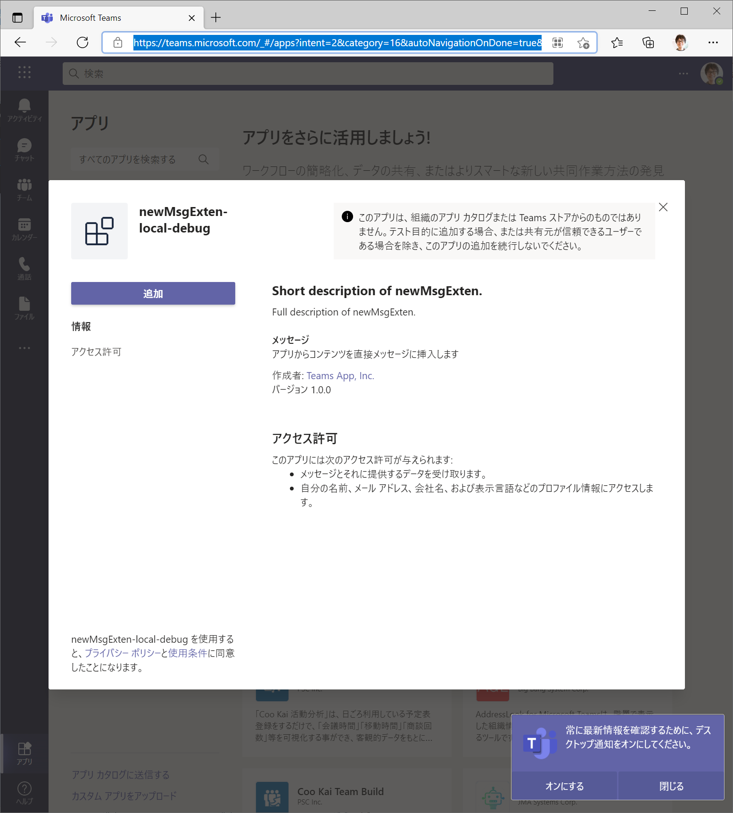
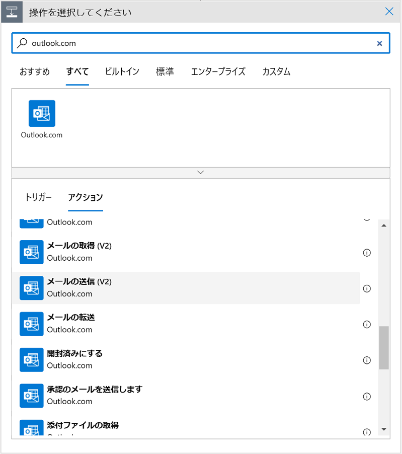

# 演習 4 : メッセージング拡張

メッセージング拡張を使用すると、ユーザーは、メッセージ作成領域、コマンド ボックスから、またはメッセージから直接、操作するアクションを検索したり、もしくはただのテキストの入力とは異なるアクションを開始したりできます。 

その操作の結果を、通常はリッチに書式設定されたカードとして Microsoft Teams クライアントに送信できます。

たとえば、以下画面ショットの赤枠にある検索ボックスや、メッセージの \[...\](その他のオプション)メニュー、メッセージ投稿ボタンの左横にならんだアイコンをクリックすると、さまざまな機能を実行することができます。


## メッセージング拡張機能の仕組み
[メッセージング拡張](https://docs.microsoft.com/ja-jp/microsoftteams/platform/concepts/messaging-extensions/messaging-extensions-overview)機能は、ホストする Web サービスと、メッセージング拡張の UI や呼び出し箇所を定義するアプリのマニフェストによって構成されています。


メッセージング拡張用の Web サービスは、Bot Framework を使用して開発しボットとして登録する必要があります。

Web サービス側の開発について、以前は Bot Framework SDK に Teams の拡張を追加する必要がありましたが、Microsoft Bot Framework SDK 4.6 からはそれらの機能は統合されており、現在では Bot Framework SDK だけで開発することができます。

メッセージング拡張の機能は Microsoft Bot Framework のアクティビティ ハンドラーから派生したTeams アクティビティ ハンドラーを使用して処理します。Teams アクティビティ ハンドラーは、すべての Teams アクティビティをルーティングします。

メッセージング拡張の呼び出し時の UI や機能を定義する Microsoft Teams アプリのアプリ マニフェストでは、最大 10 種類の異なるコマンドを使用して 1 つのメッセージング拡張機能を定義します。 それぞれのコマンドは、種類 (アクションや検索) と、それが呼び出されるクライアント内の場所 (メッセージ作成領域、コマンド バー、および/またはメッセージ) を定義します。 


## メッセージング拡張機能の種類

メッセージング拡張機能のコマンドの種類の機能には以下のものがあります。

* 検索コマンド

    検索コマンドを使用すると、ユーザーは 外部システムの情報を検索し、検索結果をメッセージに挿入できます。

* 操作コマンド

    操作コマンドでは、情報を収集または表示するためのモーダル ポップアップをユーザーに表示できます。 ユーザーがフォームを送信すると、Web サービスはメッセージを会話に直接挿入するか、またはメッセージ作成領域にメッセージを挿入し、ユーザーがメッセージを送信できるようにすることで応答します。

* その他 : リンク展開

    リンク展開オプションを使用すると、メッセージ作成領域に URL が貼り付けられたときにサービスを呼び出すことができます。たとえば、特定のドメインを含む URL がメッセージ作成領域に貼り付けられたときに、呼び出しを受け取るように構成することができます。

## 演習の準備

この演習では Visual Studio、Visual Studio Code 用の Teams Toolkit を使用しますので、以下から使用する IDE 用の Teams Toolkit を入手してインストールします。

* **[Microsoft Teams Toolkit for Visual Studio Code](https://marketplace.visualstudio.com/items?itemName=TeamsDevApp.ms-teams-vscode-extension)**
* **[Microsoft Teams Toolkit for Visual Studio](https://marketplace.visualstudio.com/items?itemName=TeamsDevApp.vsteamstemplate)**


### App Studio ではなく Teams Toolkit を使用する理由

Teams Toolkit 拡張を使用すると、タブやボットやメッセージ拡張の半完成品のひな型を生成してくれるので、開発の工数を削減することができます。

ただし、自動で設定がされてしまうためマニフェストの細かい設定が JSON を読まないと分からなかったり、タブの場合は JavaScript フレームワークの React の使用が前提になるなど、ある程度 Teams アプリの開発に慣れていないと使いこなすのが難しい部分があります。

また、Teams アプリを新規に作成する目的のツールであるため既存の Web サイトやボットを Teams のアプリとして登録する目的には向いていません。

しかし、メッセージング拡張のような Teams 固有の機能を新規で作成するのには有効です。

理由としては、Bot Builder が生成する素のプロジェクトをメッセージング拡張用に手動で書き換えるのはけっこう面倒であり、また、App Studio もメッセージング拡張の開発についてはアプリの登録程度の機能しかないためです。

Teams Toolkit 拡張は、メッセージング拡張の基本的な機能を実装したプロジェクトとマニフェスト ファイルを生成し、テスト環境も提供します。

[Microsoft Build 2021](https://mybuild.microsoft.com/home) のタイミングで公開されたTeams Toolkit 拡張の[バージョン 2](https://marketplace.visualstudio.com/items/TeamsDevApp.ms-teams-vscode-extension/changelog) からは "ゼロ構成" アプローチにより、以前のバージョンまでプロジェクトを作成した後に個別に作業する必要があった依存関係のあるモジュールのインストールや ngrok を使用した設定が自動で行われるようになりました。

この更新により、バージョン 2 からの Teams Toolkit 拡張ではプロジェクトの作成後にキーボードの \[F5\] キーを押下するだけでプロジェクトを実行することができるようになっています。


## タスク 1 : メッセージング拡張 - Wikipedia 検索機能の実装

Visual Studio Code の Teams Toolkit 拡張を使用して検索機能をもつメッセージング拡張を作成し、Wikipedia を検索できるようにします。

具体的な手順は以下のとおりです。

1. Visual Studio Code を起動します。

2. 画面左のアクティビティ バーで\[Microsoft Teams\]アイコン(※)をクリックします。 
    
    

    (※)アクティビティ バー\[Microsoft Teams\]アイコンは Teams Toolkit 拡張がインストールされていないと表示されませんので、表示されていない場合はインストールしてください。

    認証ダイアログボックスが表示される場合は、目的のテナントのMicrosoft 365 開発アカウントでサインインします。

3.  メニューが表示されるので\[**Create New Project**\] をクリックします。

    

4. コマンドパレットがドロップダウンし、メニューが表示されるので\[**Create a new Teams app**\] をクリックします。

    

5. コマンドパレットに新しいメニューがドロップダウンされるので、**Messaging Extension** のチェックボックスにチェックをつけ、ドロップダウン上部の \[OK\] ボタンをクリックします。

        

6. コマンドパレットに新しいメニューがドロップダウンされるので、**Create a new bot registration** を選択します。

      

7. コマンドパレットに開発に使用する言語を選択するメニューがドロップダウンされるので、**JavaScript** を選択します。

     

8. 作成するプロジェクトを保存するためのフォルダを選択するダイアログボックスが表示されるので、任意のフォルダーを選択します。

9. コマンドパレットに作成するアプリケーションの名前の入力を促されるので、**msgExtension**と入力して\[Enter\] キーを押下します。

    

    プロジェクトの作成が開始され、完了するとプロジェクトに含まれる README.md ファイルの内容が表示されます。

    この README にはプロジェクトの作成からビルド、デバッグの方法について説明されているので一読することをお勧めします。

10. プロジェクトの作成が完了したらキーボードの \[F5\] キーを押下します。

    Teams Toolkit 拡張のバージョン 2 からは "ゼロ構成" アプローチにより、プロジェクトの起動に必要な構成は自動で行われます。

11. Web ブラウザーが自動起動し、その中に Microsoft Teams が表示されます。

    アプリのインストール画面に遷移するので表示されたダイアログボックス中の \[**追加**\] ボタンをクリックします。

    
    
12. アプリのインストールが完了するとメッセージング拡張の検索 UI が表示されるので、適当なアルファベットを入力し、検索結果がリストされること、リストされたアイテムが投稿の編集画面に表示されることを確認してください。

    

    ### **【重要】**

    検索ボックスにキーワードを入力した際  **アプリに接続できません。** というエラーが返る場合は、以下の順番でトラブルシュートしてくたさい。

    Web ブラウザーから http://localhost:4040 に接続し、その後、作成したメッセージング拡張を操作してリクエストのログが表示されるか確認

        される : プロジェクトの実行を停止し、再度実行してみる

        されない : 以下の手順でエンドポイントの設定を確認

    1. プロジェクトの実行中、Web ブラウザーで表示されている Teams で App Studio を表示

    2. App Studio のアプリのリストの中から、デバッグ中のアプリのタイルをクリックして設定を表示

    3. App Studio 画面左のツリーから \[Capabilities\]-\[Message extensions\] をクリック

    4. メッセージング拡張の設定画面が表示さるので \[Bot endpoint address\] に URL が設定されているか確認し、空の場合は http://localhost:4040 に接続した際に表示される URL (※表示するログが無い場合に表示される)を設定

    Microsoft Teams Toolkit が生成したメッセージング拡張が生成したプロジェクトが正常に動作することが確認できたら、Wikipedia を検索できるようにコードを変更します。

20. Visual Studio Code に表示されているデバッグツールバーのデバッグ停止ボタン(赤い ■ マーク)をクリックしてデバッガを停止します。

21. Teams からのアクティビティを処理するコードが記述されている **bot** フォルダにある **messageExtensionBot.js** を開きます。

23. **handleTeamsMessagingExtensionQuery** メソッド中の以下のコードを、

    ```
    const response = await axios.get(`http://registry.npmjs.com/-/v1/search?${ querystring.stringify({ text: searchQuery, size: 8 }) }`);
    ```

    Wikipedia API のエンドポイントを指すように以下のように書き換えます。

    ```
    const response = await axios.get(`https://ja.wikipedia.org/w/rest.php/v1/search/page?${querystring.stringify({ q: searchQuery, size: 8 })}&limit=10`);
    ```
24. 同様に同メソッドの以下のコードを、

    ```
     response.data.objects.forEach(obj => {
            const heroCard = CardFactory.heroCard(obj.package.name);
            const preview = CardFactory.heroCard(obj.package.name); // Preview cards are optional for Hero card. You need them for Adaptive Cards.
            preview.content.tap = { type: 'invoke', value: { description: obj.package.description } };
            const attachment = { ...heroCard, preview };
            attachments.push(attachment);
        });
    ```

    Wikipedia API が返す JSON の構造に合わせ、かつ、サムネイル画像とページを開くボタンが表示されるよう以下のように書き換えます。

    ```
    //Wikipedia API が返すデータの構造に合わせた変更
    response.data.pages.forEach(obj => {
      const heroCard = CardFactory.heroCard(obj.title);
      const preview = CardFactory.heroCard(obj.title); // Preview cards are optional for Hero card. You need them for Adaptive Cards.
      const url = 'https://ja.wikipedia.org/wiki/' + obj.title;
      preview.content.tap = {
        type: 'invoke', value: {
          title: obj.title,
          description: obj.excerpt,
          images: this.getThumbnailUrl(obj),
          buttons: {
            'type' : 'openUrl',
            'title' : '詳細',
            'value' : url
          }
        }
      };
      const attachment = { ...heroCard, preview };
      attachments.push(attachment);
    });
    ```

25. 同ファイル中のメソッド **handleTeamsMessagingExtensionSelectItem**中に以下のコードを、

    ```
    attachments: [CardFactory.thumbnailCard(obj.description)],
    ```

    チャット欄に heroCard が投稿されるように以下のコードに書き換えます。

    ```
    attachments: [CardFactory.heroCard(obj.title, obj.description, [obj.images], [obj.buttons])],
    ```

26. 同ファイルの適当な場所に Wikipedia API から返された結果にサムネイル画像が含まれている場合に画像を取得するための以下の関数を貼り付けます。

    ```
    // サムネイル画像の URL を抽出
    getThumbnailUrl(item) {
        if (item.thumbnail) {
        return 'https:' + item.thumbnail.url;
        } else {
        return 'https://upload.wikimedia.org/wikipedia/commons/thumb/b/b3/Wikipedia-logo-v2-en.svg/256px-Wikipedia-logo-v2-ja.svg.png';
        }
    }
    ```

27. キーボードの\[F5\]キーを押下してプロジェクトを実行し、表示されたメッセージング拡張の検索ボックスに日本語のキーワードを入力します。

    正常に動作していれば以下の図のように Wikipedia の検索結果がリストされ、

    

    アイテムを選択することにより投稿画面にヒーローカードが貼り付けられます。

    

    ヒーローカードの\[詳細\]ボタンをクリックすると Web ブラウザーでページが表示されます。

    コードの変更がうまくいかない場合は、[このサンプル](samples/Ex04/messageExtensionBot.js)を参考にしてください。

以上で Microsoft Teams Toolkit を使用したメッセージング拡張(検索) の作成は完了です。


<br>

## タスク 2 : メッセージング拡張 - 操作(アクション)コマンドによる外部サービスの連携

Visual Studio Code の Teams Toolkit 拡張を使用して操作コマンドのメッセージング拡張を作成し、外部サービスを呼び出します。

具体的には、情報を収集するためのモーダル ポップアップをユーザーに表示し、ユーザーがフォームを送信すると入力された内容をメールで送信し、同時にメッセージ作成領域にメッセージを挿入します。

メッセージング拡張から呼び出されるサービスは、 [Azure Logic Apps](https://docs.microsoft.com/ja-jp/azure/logic-apps/logic-apps-overview) もしくは [Power Automate](https://docs.microsoft.com/ja-jp/power-automate/getting-started) を使用して作成しますが、お持ちのサブスクリプションの状況に合わせどちらを選択してもかまいません。たとえば、Azure のサブスクリプションを持っておらず Azure Logic Apps が使用できない場合は Power Automate を使用してこのタスクを行うことができます、

なお、Power Automate が Azure Logic Apps をベースとしている関係上、ワークフローの作成手順はほとんど同じです。

まずは、Azure Logic Apps/Power Automate で、HTTP で POST された内容を outlook.com を使用して任意の宛先にメールを送信するサービスを作成します。よって、Microsoft アカウントが必要になるので、お持ちでない方は [**Outlook.com**](https://outlook.com) にアクセスし、無料アカウントを作成しておいてください。

Outlook.com のアカウントの用意が出来たら以下の**いずれかの**手順に従いメール送信サービスを作成します。

<br>


**タスク2 の準備 : メール送信サービスの作成**
- [Azure Logic Apps 編](#azure-logic-apps%E7%B7%A8)
- [Power Automate 編](#power-automate-%E7%B7%A8)

<br>


### **Azure Logic Apps編**

Azure Logic Apps を使用するには [Microsoft Azure](https://azure.microsoft.com/ja-jp/) のサブスクリプションが必要です。Azure サブスクリプションをお持ちでない方はサブスクリプションを[契約](https://azure.microsoft.com/ja-jp/pricing/purchase-options/pay-as-you-go/)するか[無料の試用アカウント](https://azure.microsoft.com/ja-jp/free/)を使用することができます。

Azure Logic Apps を使用したメール送信サービスの作成手順は以下のとおりです。

1. Azure アカウントの資格情報で [Azure Portal](https://portal.azure.com) にサインインし、画面左上のハンバーガーメニューをクリックして、 \[+リソースの作成\] を選択します

2. **リソースの作成** 画面に遷移するので、画面左の Azure Marketplace メニューで、 \[統合\] - \[Logic Apps\] をクリックします

    

3. **ロジック アプリの作成** 画面で、以下の **\* マークの付いた必須項目のみ**設定し、\[確認および作成\] ボタンをクリックして遷移した画面で \[作成\] ボタンをクリックしてデプロイを開始します

    - サブスクリプション
    - リソースグループ
    - ロジック アプリ名
    - リージョン

    デプロイが完了したら \[リソースへ移動\] ボタンをクリックします

4. **Logic Apps デザイナー** の画面に遷移するので、同画面の **テンプレート** の一覧から\[空のロジック アプリ\] と書かれた **+** マークのタイルをクリックします

5. **ロジック アプリ デザイナー** の画面で、\[**ビルトイン**\] タブをアクティブにし、リスト内の\[要求\] をクリックします

    

6. \[**トリガー**\] タブ内のリストから \[**HTTP 要求の受信時**\] をクリックします

7. トリガー **HTTP 要求の受信時** の設定画面が表示されるので、\[**サンプルのペイロードを使用してスキーマを生成する**\] リンクをクリックします

    

8. 「**サンプルの JSON ペイロードを入力するか、貼り付けます。**」と書かれたダイアログボックスが表示されるので、同ダイアログボックスのテキスト エリア部分に以下のサンプル JSON を貼り付け、\[完了\] ボタンをクリックします

    ```
    {
        "title" : "タイトル",
        "subTitle" : "副タイトル",
        "text" : "本文"
    }
    ```

    なお、この JSON はメッセージング拡張が送信するデータの構造を表すサンプルです

9. **HTTP 要求の受信時** の設定画面の\[**要求本文の JSON スキーマ**\] にスキーマの JSON が設定されたのを確認し、同画面下の \[**新しいステップ**\] をクリックします

10. \[**操作を選択してください**\] ボックスの検索窓に "outlook.com" と入力して検索し、検索結果から **メールの送信(V2)** をクリックします

    

11. \[Outlook.com\] のボックス内に \[**サイン イン**\] ボタンが表示されるのでクリックし、Outlook.com で使用できる Microsoft アカウントでログインします

12. ログインが成功すると、\[**メールの送信(V2)**\] ボックスが表示されるので \[\*宛先\] にメールを送る、メールが受信したことが確認することのできる任意のメールアドレスを指定します

13. \[\*件名\] には **動的なコンテンツの追加** リンクをクリックし、表示されたリストより **title** をクリックして指定します

    \[\*本文\] にも同じく、**動的なコンテンツの追加**リストより、**subTitle** と **text** をクリックして指定します

    

    
14. 画面上部の \[保存\] メニューをクリックし、再度 \[**HTTP 要求の受信時**\]ボックスをオープンすると、\[**HTTP POST の URL**\] が生成されているので、これをメモしておきます。

    

以上で Logic Apps でのメール送信サービスの作成は完了です。

以降 [**メッセージング拡張 - 操作(アクション)コマンドによるメールの送信**](#%E3%83%A1%E3%83%83%E3%82%BB%E3%83%BC%E3%82%B8%E3%83%B3%E3%82%B0%E6%8B%A1%E5%BC%B5---%E6%93%8D%E4%BD%9C%E3%82%A2%E3%82%AF%E3%82%B7%E3%83%A7%E3%83%B3%E3%82%B3%E3%83%9E%E3%83%B3%E3%83%89%E3%81%AB%E3%82%88%E3%82%8B%E3%83%A1%E3%83%BC%E3%83%AB%E3%81%AE%E9%80%81%E4%BF%A1)の内容に従い手順を実行します。

<br>


### **Power Automate 編**

Power Automate を使用するにはライセンスが必要です。詳しくは、[こちらのドキュメント](https://docs.microsoft.com/ja-jp/power-platform/admin/powerapps-flow-licensing-faq)をご参照ください。 

[無料トライアル](https://flow.microsoft.com/ja-jp/) のライセンス、[開発者向けプラン](https://powerapps.microsoft.com/ja-jp/developerplan/) などもありますのでこれらを利用しても良いでしょう。

**Teams への Power Automate のインストール**

Power Automate は Teams にインストールして使用することもできるようになっています。

Power Automate を Teams にインストールするには、Teams 画面の左側の縦のメニューバーから\[・・・\](さらに追加されたアプリ)をクリックし、表示されたコンテキストメニューの検索ボックスに "power automate" と入力します。


検索結果に Power Automate がリストされるので、クリックしてインストールします。

これで Teams のメニューから Power Automate が使用できるようになりました。

なんらかの事情で Power Automate を Teams にインストールできない場合、Web ブラウザーから [flow.microsoft.com](https://flow.microsoft.com) にアクセスして Power Automate を使用することができます。

なお、Power Automate についての以降の説明は、Teams にインストールされた Power Automate を前提として記述していますので Web ブラウザーからお使いの方は適宜メニューを読み替えてご利用ください。

**Power Automate を使用したメール送信サービスの作成**

Power Automate を使用して、POST された情報をメールとして送信するサービスを作成します。

具体的な手順は以下のとおりです。

1. Power Automate 画面上部のメニュー \[**作成**\] か、画面右上にある \[**+新しいフロー**\] ボタンをクリックします

2. \[すべてのテンプレート\] 画面に遷移するので、同画面の右上にある \[**＋ 一から作成**\] ボタンをクリックします

3. ワークフロー デザイナーの画面に遷移し、ワークフローを開始するためのトリガーの選択画面が表示さるので、\[**組み込み**\] タブをアクティブにし、トリガーの一覧から \[**要求**\] をクリックします。

    

4. トリガー **HTTP 要求の受信時** の設定画面が表示されるので、\[サンプルのペイロードを使用してスキーマを生成する\] リンクをクリックします

    

8. \[**サンプルの JSON ペイロードを入力するか、貼り付けます。**\] ダイアログボックスが表示されるので、同ダイアログボックスのテキスト エリア部分に以下のサンプル JSON を貼り付け、\[完了\] ボタンをクリックします

    ```
    {
        "title" : "タイトル",
        "subTitle" : "副タイトル",
        "text" : "本文"
    }
    ```

    **HTTP 要求の受信時** の設定画面の\[**要求本文の JSON スキーマ**\] にスキーマの JSON が設定されたのを確認し、同画面下の \[**新しいステップ**\] をクリックします

9. \[**操作を選択してください**\] ボックスの検索窓に "outlook.com" と入力して検索し、検索結果から **メールの送信(V2)** をクリックします

    

10. \[Outlook.com\] のボックス内に \[**サイン イン**\] ボタンが表示されるのでクリックし、Outlook.com で使用できる Microsoft アカウントでログインします

11. ログインが成功すると、\[**メールの送信(V2)\] ボックスが表示されるので \[\*宛先\] にメールを送る、メールが受信したことが確認することのできる任意のメールアドレスを指定します

12. \[\*件名\] には **動的なコンテンツの追加** リンクをクリックし、表示されたリストより **title** をクリックして指定します

    \[\*本文\] にも同じく、**動的なコンテンツの追加**リストより、**subTitle** と **text** をクリックして指定します

    

    
13. 画面上部の \[保存\] メニューをクリックし、再度 \[**HTTP 要求の受信時**\]ボックスをオープンすると、\[**HTTP POST の URL**\] が生成されているので、これをメモしておきます。

    

以上で Logic Apps でのメール送信サービスの作成は完了です。

以降 [**メッセージング拡張 - 操作(アクション)コマンドによるメールの送信**](#%E3%83%A1%E3%83%83%E3%82%BB%E3%83%BC%E3%82%B8%E3%83%B3%E3%82%B0%E6%8B%A1%E5%BC%B5---%E6%93%8D%E4%BD%9C%E3%82%A2%E3%82%AF%E3%82%B7%E3%83%A7%E3%83%B3%E3%82%B3%E3%83%9E%E3%83%B3%E3%83%89%E3%81%AB%E3%82%88%E3%82%8B%E3%83%A1%E3%83%BC%E3%83%AB%E3%81%AE%E9%80%81%E4%BF%A1)の内容に従い手順を実行します。

<br >

### メッセージング拡張 - 操作(アクション)コマンドによるメールの送信 ###

メッセージング拡張の操作コマンドから前出の手順で作成したメール送信サービスを呼び出し、入力フォームに入力された内容をメールするメッセージング拡張を作成します。

具体的な手順は以下のとおりです。

1. 前出の [**タスク 1 : メッセージング拡張 - Wikipedia 検索機能の実装**](https://github.com/osamum/Easyway-for-MSTeamsAppDev/blob/master/Ex04.md#%E3%82%BF%E3%82%B9%E3%82%AF-1--%E3%83%A1%E3%83%83%E3%82%BB%E3%83%BC%E3%82%B8%E3%83%B3%E3%82%B0%E6%8B%A1%E5%BC%B5---wikipedia-%E6%A4%9C%E7%B4%A2%E6%A9%9F%E8%83%BD%E3%81%AE%E5%AE%9F%E8%A3%85)の手順 1 から 12 の内容に従い、検索コマンドのメッセージング拡張を新規に作成し、作成したプロジェクトが正常に動作することを確認します。

2. Visual Studio Code でプロジェクト内の .fx フォルダの下のファイル **manifest.source.json** をオープンします

3. 同ファイルの JSON のスキーマ内 composeExtensions/commands の配列の中から以下のエントリーを**削除**します

    ```
    {
        "id": "shareMessage",
        "context": [
            "message"
            ],
        "description": "Test command to run action on message context (message sharing)",
        "title": "Share Message",
        "type": "action",
        "parameters": [
            {
                "name": "includeImage",
                "title": "Include Image",
                "description": "Include image in Hero Card",
                "inputType": "toggle"
            }
        ]
    },
    {
        "id": "searchQuery",
        "context": [
            "compose",
            "commandBox"
            ],
        "description": "Test command to run query",
        "title": "Search",
        "type": "query",
        "parameters": [
            {
                "name": "searchQuery",
                "title": "Search Query",
                "description": "Your search query",
                "inputType": "text"
            }
        ]
    } 
    ```
    
    キーボードの \[Ctrl\] + \[S\] を押下して変更内容を保存します

4. キーボードの \[F5\] キーを押下してプロジェクトをデバッグ実行し、入力用のフォームが表示されるのを確認します

    

5. 入力フォームから投稿された情報がどのように取得されるのか、プロジェクトをデバッグ実行状態のままソースコードにブレークポイントを設定して確認します

    Visual Studio Code でプロジェクト内のファイル **messageExtensionBot.js** をオープンし、関数 **createCardCommand** 内の以下のステートメントの行にブレークポイントを設定します。

    ```
    const heroCard = CardFactory.heroCard(data.title, data.text);
    ```

6. デバッグ実行中の Teams の画面で、表示されているメッセージング拡張の入力フォームの各項目になにがしかの文字列の入力を行い \[送信\] ボタンをクリックします

7. Visual Studio Code に切り替えるとブレークポイントを設定した行で、実行が停止しているので、CardFactory.heroCard メソッドの引数にマウスポインターをホバーすると、**data** オブジェクトの各プロパティにフォームに入力した文字列が格納されているのが確認できます

    

    また、**data** オブジェクトの各プロパティ名が、Logic Apps、Power Automate でメール送信サービスを作成する際に使用したサンプルの JSON と同じであることに注目してください。


8. デバッグ実行を終了し、前出の手順で Logic Apps、もしくは Power Automate で作成したメール送信サービス(API)を呼び出すようにコードを修正します。

    メール送信サービスを呼び出すための axios の post メソッド に **await** を使用するので関数 createCardCommand の名前の前に **async** を追記します。

    具体的には以下のようになります。

    変更前)

    ```
    function createCardCommand(context, action) {
    ```
    
    変更後)

    ```
    async　function createCardCommand(context, action) {
    ```

9. 同関数内の以下のコードの

    ```
    const data = action.data;
    ```

    下の行に以下のコードを追記します

    ```
    let result_call='<br>◎メールを送信しました。';
    const SERVICE_ENDPOINT_URI = 'ここにエンドポイントを記述';
    const config = {
        headers: {
        'Content-Type': 'application/json'
        }
    };

    try {
        const response = await axios.post(SERVICE_ENDPOINT_URI, data, config);
    } catch (error) {
        result_call = '<br>×メールを送信できませんでした。'
    }
    ```

    追記したコードの '**ここにエンドポイントを記述**' の文字列を、Logic Apps/Power Automate で作成したメール送信サービスの URL に書き換えます。

    同関数内の以下のコードを

    ```
    const heroCard = CardFactory.heroCard(data.title, data.text);
    ```

    以下に変更します。

    ```
    const heroCard = CardFactory.heroCard(data.title, data.text + result_call);
    ```

    変更後の createCardCommand 関数全体のコードは以下のようになります。

    ```
    async function createCardCommand(context, action) {
    // The user has chosen to create a card by choosing the 'Create Card' context menu command.
    const data = action.data;

    let result_call='<br>◎メールを送信しました。';
    const SERVICE_ENDPOINT_URI = 'ここにエンドポイントを記述';
    const config = {
        headers: {
        'Content-Type': 'application/json'
        }
    };

    try {
        const response = await axios.post(SERVICE_ENDPOINT_URI, data, config);
    } catch (error) {
        result_call = '<br>×メールを送信できませんでした。'
    }

    const heroCard = CardFactory.heroCard(data.title, data.text + result_call);
    heroCard.content.subtitle = data.subTitle;
    const attachment = {
        contentType: heroCard.contentType,
        content: heroCard.content,
        preview: heroCard,
    };

    return {
        composeExtension: {
            type: "result",
            attachmentLayout: "list",
            attachments: [attachment],
            },
        };
    }
    ```


10. \[F5\] キーを押下してプロジェクトをデバッグ実行します。

    メッセージング拡張の拡張の入力フォームに任意の値を入力し、\[送信\] ボタンをクリックすると Logic Apps/Power Automate で作成したメール送信サービスが呼び出されて、あらかじめサービス側で指定しておいた宛先に outlook.com からメールが送信されます。

    実行状況については、各 Logic Apps/Power Automate 側で確認することができます。

    以上で演習 4 タスク 2 の内容は完了です。

    このタスクではメールの送信しかしていませんが、Azure Logic Apps/Power Automate 側で、豊富に用意されているさまざまなコネクターを使用して処理の変更や追加をぜひお試しください。

<br>

### その他、補足

**【操作コマンドの入力フォームについて】**

 メッセージング拡張の操作コマンドを使用したときにモーダル ポップアップされる入力フォームは、今回使用したマニフェスト ファイルに記述するものを含め以下のものがあります。

 * マニフェストファイルへの定義
 * Adaptive Card
 * 埋め込み Web ビュー

 また、入力に使用可能な UI はテキストボックス以外でもトグルボタンやカレンダーコントロールなどさまざまなコントロールを指定することができます。

 

詳しくは以下のドキュメントを参照してください。

* [**メッセージング拡張機能アクション コマンドの定義**](https://docs.microsoft.com/ja-jp/microsoftteams/platform/messaging-extensions/how-to/action-commands/define-action-command)
 


**【外部サービスを Logic Apps や Power Automate を介して利用するメリット】**

メッセージング拡張から外部サービスを利用する際、Logic Apps や Power Apps を使用することにより以下のようなメリットがあります。

* Logic Apps/Power Automate に豊富に用意されているコネクタが使用できる
* Logic Apps/Power Automate 内のフローを変更しても呼び出し側 (メッセージング拡張) のコードの変更は不要
* ノンコード開発により要件の変更に対し柔軟な対応が可能

また、Logic Apps/Power Automate は REST API の呼び出しや、独自のサービスについてカスタムコネクターを開発して使用することもできるのでさまざまサービスを利用した柔軟な開発を行うことができます。

<br>


## まとめ

この演習では Visual Studio Code 用の Teams Toolkit 拡張を使用して、検索機能とアクション機能もつメッセージング拡張を作成しました。

Teams Toolkit を使用すると、基本的な機能を持ったメッセージング拡張を簡単に作成することができます。


**⇒【 5. [タブとボットのシングルサインオン](Ex05.md) 】へ**

\<参考\>
* [**メッセージング拡張機能について**](https://docs.microsoft.com/ja-jp/microsoftteams/platform/messaging-extensions/what-are-messaging-extensions)


## 目次
0. [**Microsoft Teams アプリケーション開発について**](Intro.md)

1. [**Microsoft Teams アプリケーションの新規作成**](Ex01.md)
    * [**App Studio を使用したマニフェストファイルの作成**](Ex01.md#app-studio-を使用した-teams-アプリケーションの登録)
    * [**Microsoft Teams 用 開発者ポータルを使用した Teams アプリケーションの登録**](Ex01.md#microsoft-teams-%E7%94%A8-%E9%96%8B%E7%99%BA%E8%80%85%E3%83%9D%E3%83%BC%E3%82%BF%E3%83%AB%E3%81%AE%E4%BD%BF%E7%94%A8)
    
2. [**タブ アプリケーション**](Ex02.md)
    * [**パーソナル タブ**](Ex02.md#%E3%82%BF%E3%82%B9%E3%82%AF-1--%E3%83%91%E3%83%BC%E3%82%BD%E3%83%8A%E3%83%AB-%E9%9D%99%E7%9A%84-%E3%82%BF%E3%83%96%E3%81%AE%E8%BF%BD%E5%8A%A0)
        * [**App Studio を使用した方法**](Ex02.md#app-studio-%E3%82%92%E4%BD%BF%E7%94%A8%E3%81%97%E3%81%9F%E3%83%91%E3%83%BC%E3%82%BD%E3%83%8A%E3%83%AB-%E3%82%BF%E3%83%96%E3%81%AE%E8%BF%BD%E5%8A%A0)
        * [**Microsoft Teams 用 開発者ポータルを使用した方法**](Ex02.md#microsoft-teams-%E7%94%A8-%E9%96%8B%E7%99%BA%E8%80%85%E3%83%9D%E3%83%BC%E3%82%BF%E3%83%AB-%E3%82%92%E4%BD%BF%E7%94%A8%E3%81%97%E3%81%9F%E3%83%91%E3%83%BC%E3%82%BD%E3%83%8A%E3%83%AB-%E3%82%BF%E3%83%96%E3%81%AE%E8%BF%BD%E5%8A%A0)


    * [**チーム タブ**](Ex02.md#%E3%82%BF%E3%82%B9%E3%82%AF-2--%E3%83%81%E3%83%BC%E3%83%A0-%E6%A7%8B%E6%88%90%E5%8F%AF%E8%83%BD-%E3%82%BF%E3%83%96%E3%81%AE%E8%BF%BD%E5%8A%A0)
        * [**App Studio を使用した方法**](Ex02.md#app-studio-%E3%81%A7%E3%81%AE%E3%83%81%E3%83%BC%E3%83%A0-%E3%82%BF%E3%83%96%E3%81%AE%E8%BF%BD%E5%8A%A0)
        * [**Microsoft Teams 用 開発者ポータルを使用した方法**](Ex02.md#microsoft-teams-%E7%94%A8-%E9%96%8B%E7%99%BA%E8%80%85%E3%83%9D%E3%83%BC%E3%82%BF%E3%83%AB-%E3%82%92%E4%BD%BF%E7%94%A8%E3%81%97%E3%81%9F%E3%83%91%E3%83%BC%E3%82%BD%E3%83%8A%E3%83%AB-%E3%82%BF%E3%83%96%E3%81%AE%E8%BF%BD%E5%8A%A0)

    * [**タブ : タスクモジュールの表示**](Ex02.md#%E3%82%BF%E3%82%B9%E3%82%AF-3-%E3%82%BF%E3%83%96%E3%81%A7%E3%81%AE%E3%82%BF%E3%82%B9%E3%82%AF-%E3%83%A2%E3%82%B8%E3%83%A5%E3%83%BC%E3%83%AB%E3%81%AE%E8%A1%A8%E7%A4%BA)

        * [**外部の HTML フォームをタスクモジュールとしてタブに追加**](Ex02.md#%E3%82%BF%E3%82%B9%E3%82%AF-3-1--%E5%A4%96%E9%83%A8%E3%81%AE-html-%E3%83%95%E3%82%A9%E3%83%BC%E3%83%A0%E3%82%92%E3%82%BF%E3%82%B9%E3%82%AF%E3%83%A2%E3%82%B8%E3%83%A5%E3%83%BC%E3%83%AB%E3%81%A8%E3%81%97%E3%81%A6%E3%82%BF%E3%83%96%E3%81%AB%E8%BF%BD%E5%8A%A0)

        * [**アダプティブ カードをタスクモジュールとしてタブに追加**](Ex02.md#%E3%82%BF%E3%82%B9%E3%82%AF-3-2--actibity-card-%E3%82%92%E3%82%BF%E3%82%B9%E3%82%AF%E3%83%A2%E3%82%B8%E3%83%A5%E3%83%BC%E3%83%AB%E3%81%A8%E3%81%97%E3%81%A6%E3%82%BF%E3%83%96%E3%81%AB%E8%BF%BD%E5%8A%A0)
    
    * [**タブのシングルサインオン(SSO)**](Ex02-SSO.md)
    
3. [**ボット**](Ex03.md)
    * [**ボットの登録**](Ex03.md#%E3%83%9C%E3%83%83%E3%83%88%E3%81%AE%E7%99%BB%E9%8C%B2)
    * [**App Studio を使用したボットの追加**](Ex03.md#app-studio-%E3%82%92%E4%BD%BF%E7%94%A8%E3%81%97%E3%81%9F%E3%83%9C%E3%83%83%E3%83%88%E3%81%AE%E8%BF%BD%E5%8A%A0)
    * [**Microsoft Teams 用 開発者ポータルを使用したボットの追加**](Ex03.md#microsoft-teams-%E7%94%A8-%E9%96%8B%E7%99%BA%E8%80%85%E3%83%9D%E3%83%BC%E3%82%BF%E3%83%AB%E3%82%92%E4%BD%BF%E7%94%A8%E3%81%97%E3%81%9F%E3%83%9C%E3%83%83%E3%83%88%E3%81%AE%E8%BF%BD%E5%8A%A0)
    * [**ボットのシングル サインオン (SSO)**](Ex03-SSO.md)
    
4. [**メッセージング拡張**](Ex04.md)
    * [**検索機能の実装**](#%E3%82%BF%E3%82%B9%E3%82%AF-1--%E3%83%A1%E3%83%83%E3%82%BB%E3%83%BC%E3%82%B8%E3%83%B3%E3%82%B0%E6%8B%A1%E5%BC%B5---wikipedia-%E6%A4%9C%E7%B4%A2%E6%A9%9F%E8%83%BD%E3%81%AE%E5%AE%9F%E8%A3%85)
    * [**操作機能の実装**](#%E3%82%BF%E3%82%B9%E3%82%AF-2--%E3%83%A1%E3%83%83%E3%82%BB%E3%83%BC%E3%82%B8%E3%83%B3%E3%82%B0%E6%8B%A1%E5%BC%B5---%E6%93%8D%E4%BD%9C%E3%82%A2%E3%82%AF%E3%82%B7%E3%83%A7%E3%83%B3%E3%82%B3%E3%83%9E%E3%83%B3%E3%83%89%E3%81%AB%E3%82%88%E3%82%8B%E5%A4%96%E9%83%A8%E3%82%B5%E3%83%BC%E3%83%93%E3%82%B9%E3%81%AE%E9%80%A3%E6%90%BA)

5.  [**コネクタ**](Ex06.md)
    * [**受信 Webhook を利用したチャネルへの通知**](Ex06.md#%E3%82%BF%E3%82%B9%E3%82%AF-1--incomming-webhook-%E3%82%92%E5%88%A9%E7%94%A8%E3%81%97%E3%81%9F%E3%83%81%E3%83%A3%E3%83%8D%E3%83%AB%E3%81%B8%E3%81%AE%E9%80%9A%E7%9F%A5)
    * [**送信Webhook を利用した外部サービスの呼び出し**](Ex06.md#%E3%82%BF%E3%82%B9%E3%82%AF-2--%E9%80%81%E4%BF%A1outgoing-webhook-%E3%82%92%E5%88%A9%E7%94%A8%E3%81%97%E3%81%9F%E5%A4%96%E9%83%A8%E3%82%B5%E3%83%BC%E3%83%93%E3%82%B9%E3%81%AE%E5%91%BC%E3%81%B3%E5%87%BA%E3%81%97)

