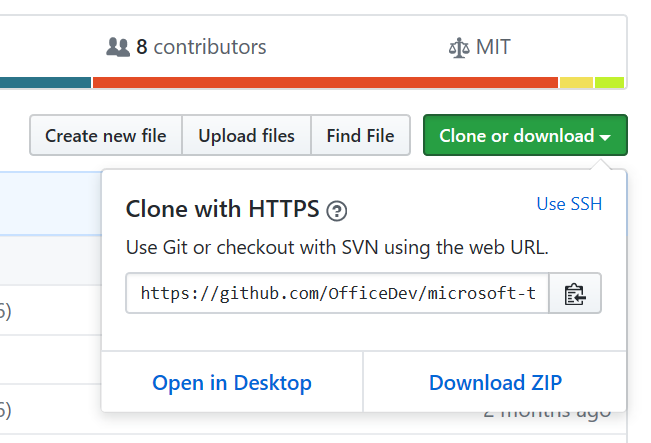
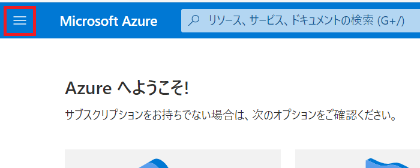
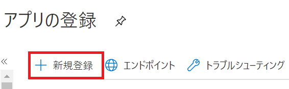
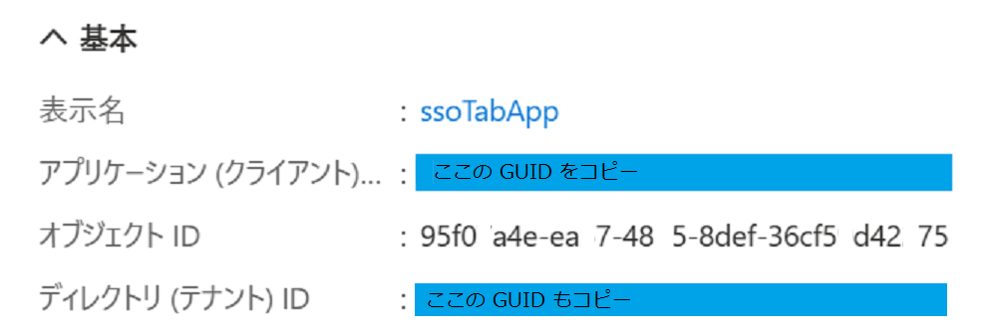
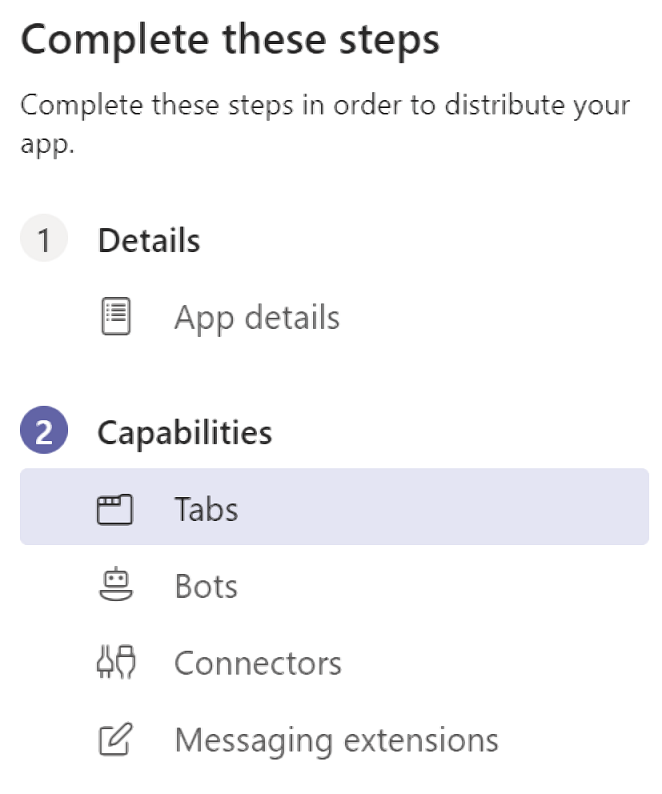
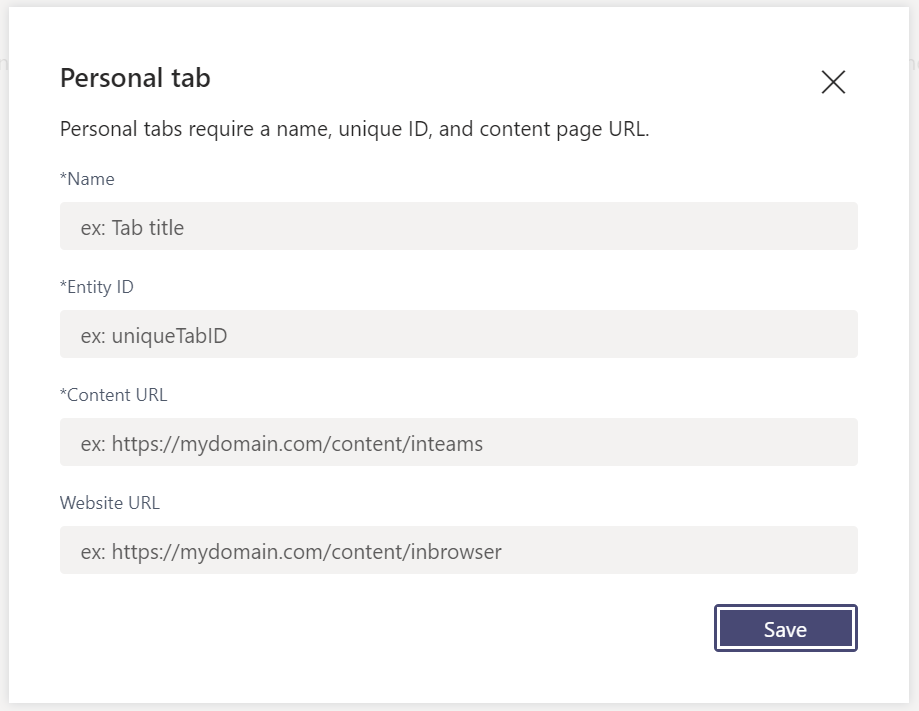
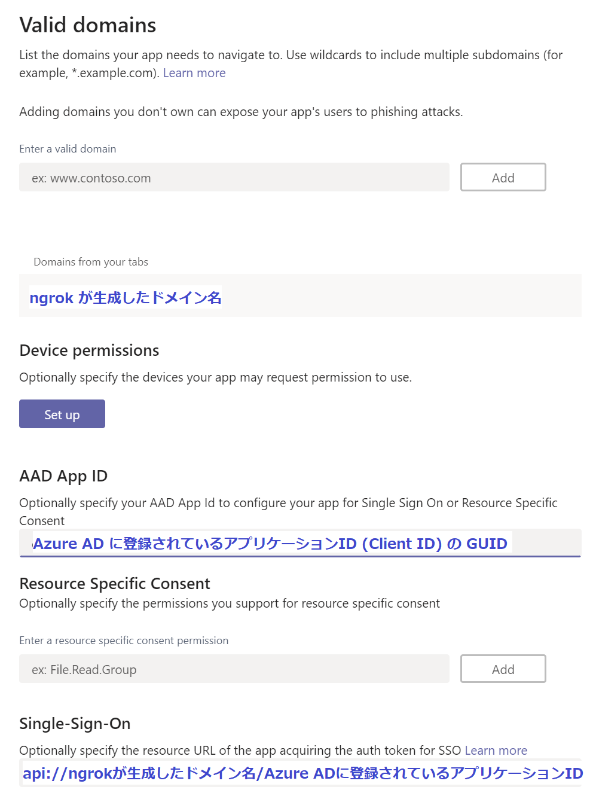
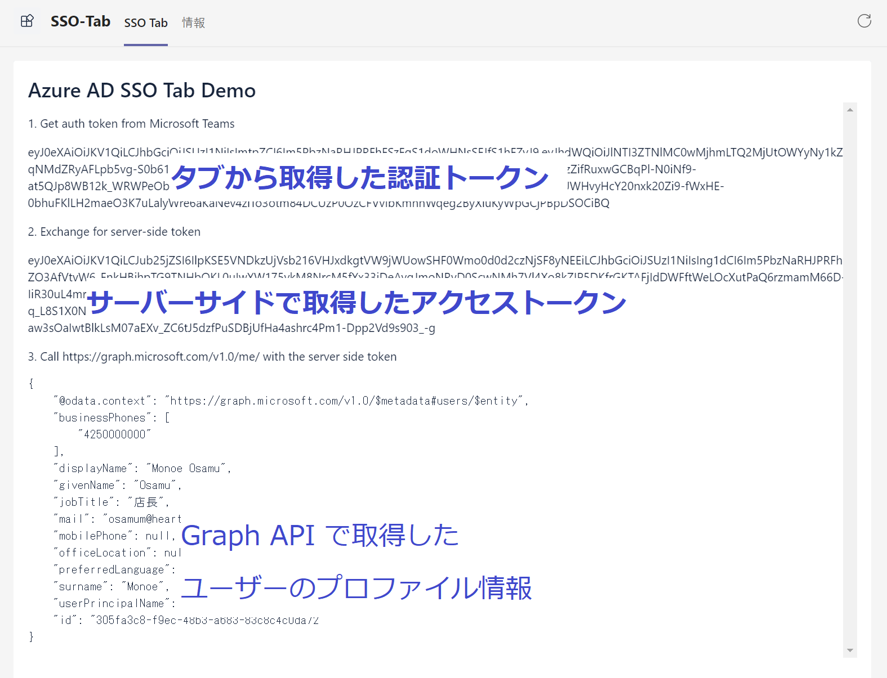

# 演習 5 : タブとボットのシングルサインオン
GitHub に用意されているサンプル プロジェクトを使用して Microsoft Teams のタブ アプリケーションとボットにシングルサインオン (Single Singon : SSO) を設定します。

## サンプル プロジェクトの入手

Visual Studio、もしくは Visual Studio Code 用 Teams Toolkit 拡張が生成する SSO を実現する機能を実装したプロジェクトを使用するか、GitHib リポジトリ[**Microsoft Teams Samples**](https://github.com/OfficeDev/Microsoft-Teams-Samples) から[タブ アプリ](https://github.com/OfficeDev/Microsoft-Teams-Samples/tree/main/samples/tab-sso/nodejs)、[ボット](https://github.com/OfficeDev/Microsoft-Teams-Samples/tree/main/samples/bot-conversation-sso-quickstart/js)のそれぞれのサンプル プロジェクトを Clone するか zip ファイルとして入手します。

なお、Clone も zip ファイルとしての入手も、リポジドリ全体が取得されるので、ディスク容量が気になる場合は、zip ファイルで取得して、必要なサンプル プロジェクトだけ解凍して使用したほうが良いかもしれません。

サンプルプロジェクトの具体的な入手方法は以下の通りです。

* **Clone (※ [**git**](https://git-scm.com/downloads) がインストールされている必要があります)**
    
    コマンドプロンプトで任意のディレクトリに移動して以下のコマンドを実行します。

    `git clone https://github.com/OfficeDev/Microsoft-Teams-Samples.git`

* **zip ファイルとして入手**

    サンプルの[**リポジトリ**](https://github.com/OfficeDev/Microsoft-Teams-Samples.git)にアクセスして緑色の \[**Clone  or download**\] ボタンをクリック

    表示されたダイアログボックスの \[**Download ZIP**\] ボタンをクリックします。

    

    ダウンロードされた zip ファイルから任意のプロジェクトのフォルダを解凍します。


## 演習 5-1 SSO (Single-SingOn ) をサポートするタブ アプリの実行

SSO をサポートするシンプルなタブ アプリのサンプルが動作するように構成します。

なお、この演習では Node.js のサンプルを使用します。

具体的な手順は以下のとおりです。

1. ローカルに Clone したリポジトリより Microsoft-Teams-Samples-main/samples/tab-sso/nodejs のプロジェクトを任意のフォルダにコピーし、Visual Studio Code でオープンします。

2. Visual Studio Codeのメニュー[Terminal]-[New Terminal] をクリックしてターミナル ウィンドウを開き、以下のコマンドを入力して依存関係のあるモジュールをインストールします。

    ```
    npm install
    ```
3. 赤文字でなにかしら表示された場合は以下のコマンドを実行します。

    ```
    npm audit fix --force
    ```

4. 以下のコマンドを実行し、正常にサービスが開始できることを確認します。

    ```
    npm start
    ```

    正常にサービスが開始できるとターミナル ウィンドウに以下のメッセージが表示されます

    App started listening on port 3333

5. Web ブラウザーから以下の URL にアクセスして「Azure AD SSO Tab Demo」と書かれたページが表示されるか確認してください。

    ```
    http://localhost:3333/ssoDemo
    ```
    
6. OS のメニューからコマンドプロンプトを起動し、作業ディレクトリを　ngrok のインストールされているディレクトリに切り替え、以下のコマンドを実行します、

    ```
    ngrok http 3333 -host-header=localhost
    ```

    ngrok が返す https のドメイン名をコピーしてメモ帳などに貼り付けて保持します。

    **ngrok はこの演習が完了するまで終了しないでください。**

7. Web ブラウザーから以下の URL にアクセスしてページが表示されるか確認します。

    ```
    https://ngrok が返すドメイン名/ssoDemo
    ```

    アプリケーションのサービスとネットワーク接続が正常に動作していることが確認できたら Azure Active Directory にアプリケーションの登録を行います。

8. [Azure のポータル](https://portal.azure.com/)にログインします

9. 左上にあるハンバーガーメニューをクリックしてメニュー ブレードを表示し **[Azure Active Directory]** を選択します

    

10. Azure Active Directory のブレードより **\[アプリの登録\]** をクリックします

11. アプリの登録画面が表示されるので画面上部の **\[+ 新規登録\]** メニューをクリックします

    

12. アプリケーションの登録画面が表示されるので **\[名前\]** にアプリケーション名を入力します

    この演習では "**SSO_teams_tab**" という名前を使用します。なお、この名前は後で変更することができます

13. \[サポートされているアカウントの種類] で、 **\[任意の組織ディレクトリ内のアカウント (任意の Azure AD ディレクトリ - マルチテナント) と個人の Microsoft アカウント (Skype、Xbox など)]** を選択します

14. \[リダイレクト URI (省略可能)] のドロップダウンリストから 「**Web**」 を選択し、右側のテキストボックスに以下の URL を記述します

    ```
    https://ngrok が生成したドメイン名/auth-end
    ```

15. \[登録] ボタンをクリックします。

16. 画面左のメニューの \[概要\] をクリックし、表示された画面で **\[アプリケーション (クライアント)\]** の内容をコピーし、テキストファイルなどにメモします

    

17. 画面左のメニューで \[**API の公開**] を選択します

18. \[設定]リンクをクリックすると、api://{AppID} の形式でアプリケーションIDのURIが生成されるので、api://の後ろに ngrok が生成したドメイン名を挿入して以下の形式の URI を設定します

    ```
    api://ngrok が生成したドメイン名/AppIDのGUID
    ```
19. \[**+ Scope の追加**]をクリックして\[スコープ名*] に **access_as_user** と入力します

20. \[同意できるのはだれですか?] トグルボタンで \[**管理者とユーザー**]を選択します。

21. 他の項目を以下のように設定します。

    |項目|値|
    |---|---|
    | 管理者の同意の表示名 | Teams は、ユーザーのプロファイルにアクセスできます。 |
    | 管理者の同意の説明 | Teams は、アプリの Web API を現在のユーザーとして呼び出します。|
    | ユーザーの同意タイトル | Teams はユーザー プロファイルにアクセスし、ユーザーの代わりに要求を行うことができます。|
    | ユーザーの同意の説明 | Teams は、ユーザーと同じ権限でこのアプリの API を呼び出します。|

22. \[状態] トグルボタンが \[**有効**] になっていることを確認し、\[スコープの追加] ボタンをクリックします。

23. \[承認済 みクライアント アプリケーション] セクションで、\[**クライアント アプリケーションの追加**] をクリックし、以下の GUID をそれぞれ入力し \[アプリケーションの追加] ボタンをクリックして登録します。

    |GUID|アプリケーション|
    |---|---|
    | 1fec8e78-bce4-4aaf-ab1b-5451cc387264 | Teams モバイル またはデスクトップ アプリケーション用 |
    | 5e3ce6c0-2b1f-4285-8d4b-75ee78787346 | Teams Web アプリケーション用|

    登録の際、\[承認済みのスコープ] に api://で始まるアプリケーション URI のチェックボックスがリストされるので必ずチェックをつけます。

24. 画面左のメニューで \[**API のアクセス許可**] をクリックします

25. \[**+ アクセス許可の追加**] をクリックし、画面右に表示されたブレード内の \[Microsoft Graph]-\[委任されたアクセス許可]ボックスをクリックし、以下の権限にチェックをつけ \[アクセス許可の追加] ボタンをクリックします
    - user.Read (既定で有効)
    - email
    - offline_access
    - openId
    - profile

    \[+ アクセス許可の追加] の右隣にある\[**(ドメイン名) に管理者の同意を与えます**] をクリックし、同意を与えます。

    (※)もし、\[(ドメイン名) に管理者の同意を与えます]がグレーアウトしていてクリックできない場合は、管理者権限をもつアカウントで作業するか、別途 Azure Active Directory テナントを作成し、そちらで作業する必要があります。
    
    リストされたアクセス許可の \[状態] に緑色のアイコンが表示されるのを確認します

26. 画面左のメニューで \[**認証**] をクリックします

27. 項目\[暗黙的な許可およびハイブリッド フロー]で以下のチェックボックスにチェックをつけ、画面上部の \[保存] をクリックします

    - **アクセス トークン (暗黙的なフローに使用)**
    - **ID トークン (暗黙的およびハイブリッド フローに使用)**

28. 画面左のメニューで \[**証明書とシークレット**] をクリックします

29. \[**+新しいクライアント シークレット**]をクリックすると、\[クライアント シークレットの追加] ダイアログボックスが表示されるので、\[説明] のボックスに用途について分かり易い説明を記述し、\[有効期限] オプションボタンで \[**なし**] を選択して\[追加] ボタンをクリックします

30. クライアントシークレットが生成されるので \[**値**] の内容をメモ帳などにコピーして保持します

    ここまでで Azure Active Directory 側の設定は完了です

31. Visual Studio Code で、開かれているサンプル アプリケーションの **/config/default.json** ファイルをオープンし、以下のように JSON を書き換えます
    ```
    {
        "tab": {
            "appId": "Azure Active Directory で設定した App ID",
            "appPassword": "クライアント シークレット"
        },
        "port": "3333"
    }
    ```

32. Visual Studio Code のターミナルウィンドウで、キーボードの \[Ctrl]-\[C] をクリックしてプロジェクトのサービスを終了し、再度、npm start を実行してサービスを再起動します

    アプリケーション側の設定はこれで完了です

33. Microsoft Teams で App Studio を起動し、[演習 1 の内容](Ex01.md#app-studio-%E3%82%92%E4%BD%BF%E7%94%A8%E3%81%97%E3%81%9F-teams-%E3%82%A2%E3%83%97%E3%83%AA%E3%82%B1%E3%83%BC%E3%82%B7%E3%83%A7%E3%83%B3%E3%81%AE%E7%99%BB%E9%8C%B2)の手順に従い、新規のアプリを作成するか、既存のアプリの設定を開きます

34. App Studio の画面左のメニューツリーで \[② Capabilities] - [Tabs] をクリックします

    

35. 右側に Tabs の画面が表示されるので、ラベル **Add a personal tab** の下の \[**Add**] ボタンをクリックします。

    (※)このサンプルアプリケーションは /configure を指定することでチームタブも設定できますが、結果がパーソナルタブとまった一緒なのでパーソナルタブで検証します。

36. Personal tab の設定ダイアログボックスが表示されるので、各項目を以下のように設定し、\[Save] ボタンをクリックします

     |項目|値|
    |---|---|
    | *Name | SSO Tab |
    | *Entity ID | ssotab |
    | *Content URL | https://ngrokのドメイン/ssoDemo |
    | Website URL | 入力なし |

    実際の画面は以下の通りです。

    

37. 画面左のメニューツリーで \[③ Finish] - \[Domain and permissions] をクリックします

38. \[AAD App ID] に Azure Active Directory にアプリケーションを登録した際のアプリケーション ID (Client ID) を指定し、\[Single-Sign-On]には Azure Active Directory メニュー \[API の公開] 画面の \[アプリケーション ID の URI] の値を指定します。

    具体的には以下のフォーマットの URL です。

    api://ngrokのドメイン名/Azure AD に登録されているアプリケーション ID

    実際の画面は以下のとおりです。

    

39. App Studio の左側のツリーメニュー [③ Finish] - [Test ans distribute] をクリックします。

40. Test and Distribute の画面が表示されるので同画面の \[Install] ボタンをクリックします。

41. 作成したアプリのダイアログボックスが表示されるので \[追加] ボタンをクリックします。

Teams 内にタブとして作成した Web ページが表示され、以下のように Teams タブから取得した認証トークンとサーバーサイドで取得したトークン、現在 Teams を使用しているユーザーの詳細なプロファイルが表示されていることを確認してください。



以上で、「演習 5-1 SSO (Single-SingOn ) をサポートする タブ アプリの実行」は完了です。

<br><br>

### サンプルアプリケーション内の動作

ここからは、サンプルアプリケーションが実装している SSO 機能を、既存の Web アプリを Teams タブ アプリとして開発する際に使用できるように内部の動作について簡単に紹介します。


このサンプルアプリでは内部で [Microsoft Teams JavaScript ライブラリ](https://docs.microsoft.com/ja-jp/microsoftteams/platform/tabs/how-to/using-teams-client-sdk) の getAuthToken メソッドを使用して、Teams タブ用の **認証トークン** を取得し、

```
//getAuthTokenメソッドによる認証トークンの取得 - ssoDemo.js より抜粋
microsoftTeams.authentication.getAuthToken({
    successCallback: (result) => {
        display(result)
        resolve(result);
    },
    failureCallback: function (error) {
        reject("Error getting token: " + error);
    }
});
```

取得した Teams タブ用の認証トークンを使用して、**アクセストークン**を取得し、

```
//アクセストークンの取得 - tabs.js より抜粋
app.post('/auth/token', function(req, res) {
    var tid = req.body.tid;
    var token = req.body.token;　//←認証トークン
    var scopes = ["https://graph.microsoft.com/User.Read"];

    var oboPromise = new Promise((resolve, reject) => {
        const url = "https://login.microsoftonline.com/" + tid + "/oauth2/v2.0/token";
        const params = {
            client_id: config.get("tab.appId"),
            client_secret: config.get("tab.appPassword"),
            grant_type: "urn:ietf:params:oauth:grant-type:jwt-bearer",
            assertion: token,
            requested_token_use: "on_behalf_of",
            scope: scopes.join(" ")
        };
        
    fetch(url, {
        method: "POST",
        body: querystring.stringify(params),
        headers: {
            Accept: "application/json",
            "Content-Type": "application/x-www-form-urlencoded"
            }
        }).then(result => {
            if (result.status !== 200) {
                result.json().then(json => {
                  // TODO: Check explicitly for invalid_grant or interaction_required
                  reject({"error":json.error});
                });
            } else {
                result.json().then(json => {
                  resolve(json.access_token);
                });
            }
        });
    });

    oboPromise.then(function(result) {
        res.json(result);
    }, function(err) {
        console.log(err); // Error: "It broke"
        res.json(err);
    });
});
```

取得したアクセストークンを使用して Graph API にアクセスします。

```
// Graph API の呼び出し - ssoDemo.js より抜粋
// 3. Get the server side token and use it to call the Graph API
function useServerSideToken(data) {
        display("3. Call https://graph.microsoft.com/v1.0/me/ with the server side token");
        return fetch("https://graph.microsoft.com/v1.0/me/",
            {
                method: 'GET',
                headers: {
                    "accept": "application/json",
                    "authorization": "bearer " + data 
                },
                mode: 'cors',
                cache: 'default'
            })
            .then((response) => {
                if (response.ok) {
                    return response.json();
                } else {
                    throw (`Error ${response.status}: ${response.statusText}`);
                }
            })
            .then((profile) => {
                display(JSON.stringify(profile, undefined, 4), 'pre');
            });
    }
```

よって、以下の内容を最低限把握できれば既存 Web アプリに対しても Teams タブ アプリの SSO 機能を実装することが可能です。

1. **Azure Active Directory へのアプリの登録方法**
2. **認証トークンの入手方法**
3. **アクセストークンの入手方法**

(※) Graph API の呼び出し方法についてご存じ無い方は[このハンズオン](https://github.com/osamum/Firstway_to_MSTeamsGraphAPI)を実施することをお勧めします。

上記の演習で紹介したサンプルプロジェクトは npm start 時にデバッガがアタッチされるので、任意の箇所それぞれにブレークポイントを設定し、ステップ実行してコードの動作を確認することをお勧めします。
<br><br>


## 演習 5-2 SSO (Single-SingOn ) をサポートするボット アプリの実行


**【お知らせ】**
**Teams と ボットの SSO については調査中です。動作の確認が取れ次第更新します。早めに更新の情報を受け取りたい方は [Twitter アカウント](https://twitter.com/osamum_MS) をフォローくださいませ。**

<br><br>

**⇒【 5. [コネクタ](Ex06.md) 】へ**

\<参考\>

* [**Authentication in Teams**](https://docs.microsoft.com/en-us/microsoftteams/platform/concepts/authentication/authentication)

## 目次
0. [**Microsoft Teams アプリケーション開発について**](Intro.md)

1. [**Microsoft Teams アプリケーションの新規作成**](Ex01.md)
    * [**App Studio を使用したマニフェストファイルの作成**](Ex01.md#app-studio-を使用した-teams-アプリケーションの登録)
    * [**Microsoft Teams 用 開発者ポータルを使用した Teams アプリケーションの登録**](Ex01.md#microsoft-teams-%E7%94%A8-%E9%96%8B%E7%99%BA%E8%80%85%E3%83%9D%E3%83%BC%E3%82%BF%E3%83%AB%E3%81%AE%E4%BD%BF%E7%94%A8)
    
2. [**タブ アプリケーション**](Ex02.md)
    * [**パーソナル タブ**](Ex02.md#%E3%82%BF%E3%82%B9%E3%82%AF-1--%E3%83%91%E3%83%BC%E3%82%BD%E3%83%8A%E3%83%AB-%E9%9D%99%E7%9A%84-%E3%82%BF%E3%83%96%E3%81%AE%E8%BF%BD%E5%8A%A0)
        * [**App Studio を使用した方法**](Ex02.md#app-studio-%E3%82%92%E4%BD%BF%E7%94%A8%E3%81%97%E3%81%9F%E3%83%91%E3%83%BC%E3%82%BD%E3%83%8A%E3%83%AB-%E3%82%BF%E3%83%96%E3%81%AE%E8%BF%BD%E5%8A%A0)
        * [**Microsoft Teams 用 開発者ポータルを使用した方法**](Ex02.md#microsoft-teams-%E7%94%A8-%E9%96%8B%E7%99%BA%E8%80%85%E3%83%9D%E3%83%BC%E3%82%BF%E3%83%AB-%E3%82%92%E4%BD%BF%E7%94%A8%E3%81%97%E3%81%9F%E3%83%91%E3%83%BC%E3%82%BD%E3%83%8A%E3%83%AB-%E3%82%BF%E3%83%96%E3%81%AE%E8%BF%BD%E5%8A%A0)


    * [**チーム タブ**](Ex02.md#%E3%82%BF%E3%82%B9%E3%82%AF-2--%E3%83%81%E3%83%BC%E3%83%A0-%E6%A7%8B%E6%88%90%E5%8F%AF%E8%83%BD-%E3%82%BF%E3%83%96%E3%81%AE%E8%BF%BD%E5%8A%A0)
        * [**App Studio を使用した方法**](Ex02.md#app-studio-%E3%81%A7%E3%81%AE%E3%83%81%E3%83%BC%E3%83%A0-%E3%82%BF%E3%83%96%E3%81%AE%E8%BF%BD%E5%8A%A0)
        * [**Microsoft Teams 用 開発者ポータルを使用した方法**](Ex02.md#microsoft-teams-%E7%94%A8-%E9%96%8B%E7%99%BA%E8%80%85%E3%83%9D%E3%83%BC%E3%82%BF%E3%83%AB-%E3%82%92%E4%BD%BF%E7%94%A8%E3%81%97%E3%81%9F%E3%83%91%E3%83%BC%E3%82%BD%E3%83%8A%E3%83%AB-%E3%82%BF%E3%83%96%E3%81%AE%E8%BF%BD%E5%8A%A0)

    * [**タブ : タスクモジュールの表示**](Ex02.md#%E3%82%BF%E3%82%B9%E3%82%AF-3-%E3%82%BF%E3%83%96%E3%81%A7%E3%81%AE%E3%82%BF%E3%82%B9%E3%82%AF-%E3%83%A2%E3%82%B8%E3%83%A5%E3%83%BC%E3%83%AB%E3%81%AE%E8%A1%A8%E7%A4%BA)

        * [**外部の HTML フォームをタスクモジュールとしてタブに追加**](Ex02.md#%E3%82%BF%E3%82%B9%E3%82%AF-3-1--%E5%A4%96%E9%83%A8%E3%81%AE-html-%E3%83%95%E3%82%A9%E3%83%BC%E3%83%A0%E3%82%92%E3%82%BF%E3%82%B9%E3%82%AF%E3%83%A2%E3%82%B8%E3%83%A5%E3%83%BC%E3%83%AB%E3%81%A8%E3%81%97%E3%81%A6%E3%82%BF%E3%83%96%E3%81%AB%E8%BF%BD%E5%8A%A0)

        * [**アダプティブ カードをタスクモジュールとしてタブに追加**](Ex02.md#%E3%82%BF%E3%82%B9%E3%82%AF-3-2--actibity-card-%E3%82%92%E3%82%BF%E3%82%B9%E3%82%AF%E3%83%A2%E3%82%B8%E3%83%A5%E3%83%BC%E3%83%AB%E3%81%A8%E3%81%97%E3%81%A6%E3%82%BF%E3%83%96%E3%81%AB%E8%BF%BD%E5%8A%A0)
    
    * [**タブのシングルサインオン(SSO)**](Ex02-SSO.md)
    
3. [**ボット**](Ex03.md)
    * [**ボットの登録**](Ex03.md#%E3%83%9C%E3%83%83%E3%83%88%E3%81%AE%E7%99%BB%E9%8C%B2)
    * [**App Studio を使用したボットの追加**](Ex03.md#app-studio-%E3%82%92%E4%BD%BF%E7%94%A8%E3%81%97%E3%81%9F%E3%83%9C%E3%83%83%E3%83%88%E3%81%AE%E8%BF%BD%E5%8A%A0)
    * [**Microsoft Teams 用 開発者ポータルを使用したボットの追加**](Ex03.md#microsoft-teams-%E7%94%A8-%E9%96%8B%E7%99%BA%E8%80%85%E3%83%9D%E3%83%BC%E3%82%BF%E3%83%AB%E3%82%92%E4%BD%BF%E7%94%A8%E3%81%97%E3%81%9F%E3%83%9C%E3%83%83%E3%83%88%E3%81%AE%E8%BF%BD%E5%8A%A0)

4. [**メッセージング拡張**](Ex04.md)
    * [**検索機能の実装**](Ex04.md#%E3%82%BF%E3%82%B9%E3%82%AF-1--%E3%83%A1%E3%83%83%E3%82%BB%E3%83%BC%E3%82%B8%E3%83%B3%E3%82%B0%E6%8B%A1%E5%BC%B5---wikipedia-%E6%A4%9C%E7%B4%A2%E6%A9%9F%E8%83%BD%E3%81%AE%E5%AE%9F%E8%A3%85)
    * [**操作機能の実装**](Ex04.md#%E3%82%BF%E3%82%B9%E3%82%AF-2--%E3%83%A1%E3%83%83%E3%82%BB%E3%83%BC%E3%82%B8%E3%83%B3%E3%82%B0%E6%8B%A1%E5%BC%B5---%E6%93%8D%E4%BD%9C%E3%82%A2%E3%82%AF%E3%82%B7%E3%83%A7%E3%83%B3%E3%82%B3%E3%83%9E%E3%83%B3%E3%83%89%E3%81%AB%E3%82%88%E3%82%8B%E5%A4%96%E9%83%A8%E3%82%B5%E3%83%BC%E3%83%93%E3%82%B9%E3%81%AE%E9%80%A3%E6%90%BA)
    
5. [**タブとボットのシングルサインオン**](Ex05.md)
6. [**コネクタ**](Ex06.md)
    * [**受信 Webhook を利用したチャネルへの通知**](https://github.com/osamum/Easyway-for-MSTeamsAppDev/blob/master/Ex06.md#%E3%82%BF%E3%82%B9%E3%82%AF-1--incomming-webhook-%E3%82%92%E5%88%A9%E7%94%A8%E3%81%97%E3%81%9F%E3%83%81%E3%83%A3%E3%83%8D%E3%83%AB%E3%81%B8%E3%81%AE%E9%80%9A%E7%9F%A5)
    * [**送信Webhook を利用した外部サービスの呼び出し**](https://github.com/osamum/Easyway-for-MSTeamsAppDev/blob/master/Ex06.md#%E3%82%BF%E3%82%B9%E3%82%AF-2--%E9%80%81%E4%BF%A1outgoing-webhook-%E3%82%92%E5%88%A9%E7%94%A8%E3%81%97%E3%81%9F%E5%A4%96%E9%83%A8%E3%82%B5%E3%83%BC%E3%83%93%E3%82%B9%E3%81%AE%E5%91%BC%E3%81%B3%E5%87%BA%E3%81%97)


