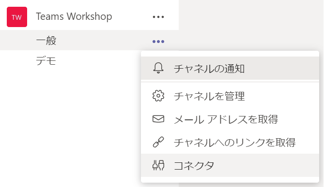
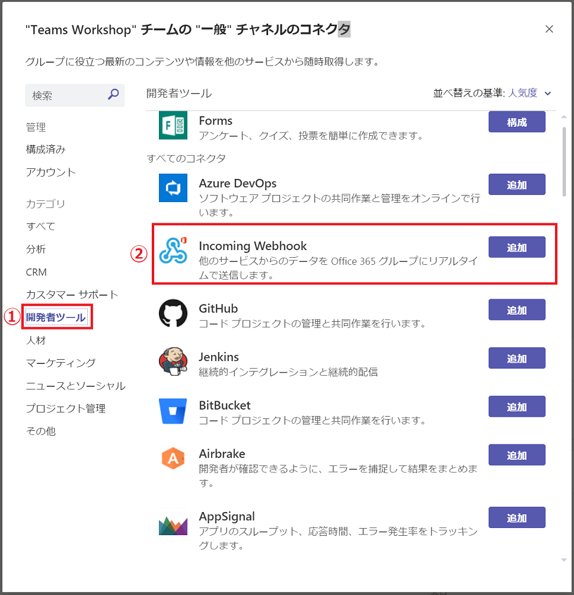
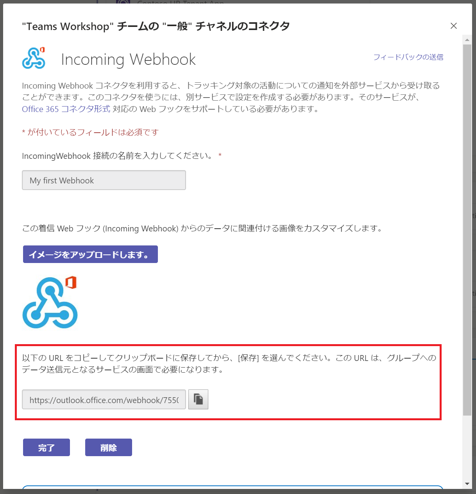
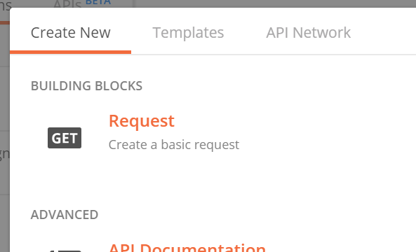
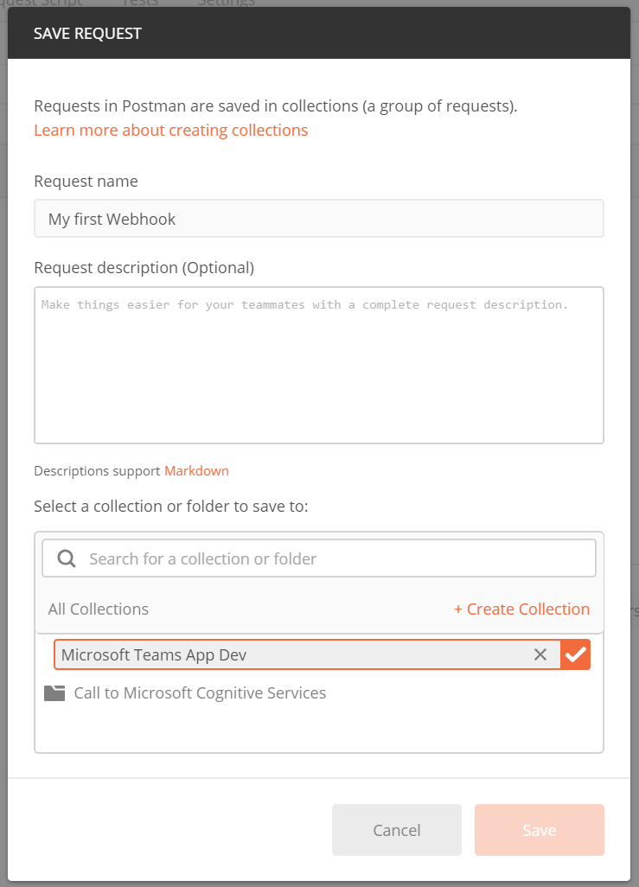
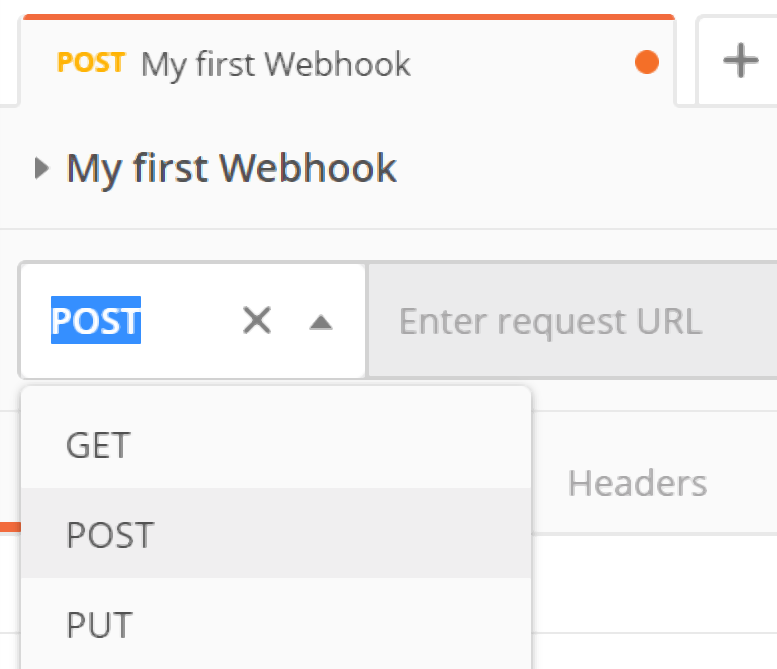

# 演習 6 : コネクタ
コネクタを使用すると外部アプリケーションの状態の変更などを Microsoft Teams のチャネルに通知することができます。

Microsoft Teams のチャネルには既定の状態でさまざまなアプリケーション向けのコネクタが用意されており、任意のアプリケーション向けのコネクタを使用することでコードの記述などを行うことなく状態の変化をチャネルへの投稿として受け取ることができます。

また、**Incomming Webhook** コネクタを利用すると、開発者が独自に作成したアプリケーションからの任意の通知を行うことができます。

さらには独自のコネクタを[コネクタ開発者ダッシュボード](https://outlook.office.com/connectors/home/login/#/new)から登録することにより Microsoft Teams に公開することができます。

## タスク 1 : Incomming Webhook を利用したチャネルへの通知

チャネルのコネクタ **Incomming Webhook** が生成した URL にメッセージ カードのフォーマットの JSON を POST し、外部のアプリケーションから任意のチャネルへ通知を行えるようにします。

送信するメッセージカードは[カードのプレイグラウンド](https://messagecardplayground.azurewebsites.net/)を使用してさまざまなカードのデザインを行うことができます。

この手順では Incoming Webhook コネクタが生成した通知用の URL に HTTP を送信するためのツールとして Postman を使用しますので、以下のサイトよりインストールを行い使用可能な状態としてください。

* [**Postman | The Collaboration Platform for API Development**](https://www.getpostman.com/)

 **Incomming Webhook** コネクタを使用して外部アプリケーションからの通知を可能にする手順は以下のとおりです。

1. Microsoft Teams の任意のチャネルの、チャネル名の右端にある \[・・・\]\(その他のオプション)メニューから \[コネクタ\] をクリックします。

    

2. コネクタの一覧画面が表示されるので、左側のメニューより \[開発者ツール\] を選択し、左側のコネクタのリストから  **Incomming Webhook** の横の \[追加\] ボタンをクリックします。
 
    

3. さらに **Incomming Webhook** の画面内の \[追加\] ボタンをクリックします。

4. **Incomming Webhook** の設定画面が表示されるので 「IncomingWebhook 接続の名前を入力してください。*」 に **My first Webhook** と入力し \[作成\] ボタンをクリックします。

5. 生成された Webhook 用の URL が表示されるのでコピーボタンをクリックして URL をクリップボードにコピーし、\[完了\] ボタンをクリックしてダイアログボックスを閉じます。

    

6. Postman を起動し、初期画面のダイアログボックスで **Request** をクリックします。

    

7. \[**SAVE REQUEST**\] ダイアログボックスが表示されるので、\[Request name\] のボックスに **My first Webhook** と入力します。

8. 同ダイアログボックス下の赤字で書かれている \[* Create Collention\] をクリックし、赤枠で囲まれたボックスに **Microsoft Teams App Dev** と記述し、右横の赤いチェック マークのボックスをクリックします。

    

9. **\[Save to Microsoft App Dev\]** という赤いボタンが表示されるのでクリックします。

8. リクエストの作成画面が表示されるので URL ボックスの前のドロップダウンリストをクリックし、HTTP メソッドを GET から **POST** に変更します。

    

9. URL ボックス (\[Enter request URL\] のウォーターマークがあります) に Microsoft Teams の Incomming Webhook コネクタが生成した URL を張り付けます。

10. URL ボックス下の \[Body\] タブをクリックします。

11. 同タブ内の \[raw\] オプションボタンをチェックし、下のテキストボックスに以下の JSON を張り付けます。

    ```
    {
        "@context": "https://schema.org/extensions",
        "@type": "MessageCard",
        "themeColor": "0072C6",
        "title": "これは Microsoft Teams のコネクタ機能で送信されました。",
        "text": "Microsoft Teams のコネクタ機能については **この通知の送信方法について** をクリックしてください。",
        "potentialAction": [
        {
            "@type": "ActionCard",
            "name": "フィードバックの送信",
            "inputs": [
                {
                    "@type": "TextInput",
                    "id": "feedback",
                    "isMultiline": true,
                    "title": "受信側を作っていないので実際には送信されませんけどね"
                }
            ],
            "actions": [
                {
                    "@type": "HttpPOST",
                    "name": "フィードバックを送る",
                    "isPrimary": true,
                    "target": "http://..."
                }
            ]
        },
        {
            "@type": "OpenUri",
            "name": "この通知の送信方法について",
            "targets": [
                { "os": "default", "uri": "https://github.com/osamum/Easyway-for-MSTeamsAppDev/blob/master/Ex06.md" }
                ]
        }]
    }
    ```

12. \[raw\] オプションボタンの同じ並びにある右端のドロップダウンリストで JSON を選択します。

13. URL ボックス横の \[Send\] ボタンをクリックします。

14. Incomming Webhook 設定した Microsoft Teams のチャネルに以下の投稿がされていることを確認してください。

    

\<参考\>

* [**How to add connectors in Microsoft Teams**](https://docs.microsoft.com/ja-jp/microsoftteams/platform/concepts/connectors/connectors-using)

* [**Actionable messages in Outlook and Office 365 Groups**](https://docs.microsoft.com/en-us/outlook/actionable-messages/#accessing-office-365-connectors-from-microsoft-teams)


## 目次
0. [**Microsoft Teams アプリケーション開発について**](Intro.md)

1. [**Microsoft Teams アプリケーションの新規作成**](Ex01.md)
    * [**App Studio を使用したマニフェストファイルの作成**](Ex01.md#app-studio-を使用した-teams-アプリケーションの登録)
2. [**タブ アプリケーション**](Ex02.md)
    * [**パーソナル タブ**](Ex02.md#%E3%82%BF%E3%82%B9%E3%82%AF-1--%E3%83%91%E3%83%BC%E3%82%BD%E3%83%8A%E3%83%AB-%E9%9D%99%E7%9A%84-%E3%82%BF%E3%83%96%E3%81%AE%E8%BF%BD%E5%8A%A0)
    * [**チーム タブ**](Ex02.md#%E3%83%81%E3%83%BC%E3%83%A0-%E6%A7%8B%E6%88%90%E5%8F%AF%E8%83%BD-%E3%82%BF%E3%83%96%E3%81%AE%E8%BF%BD%E5%8A%A0)

    * [**タブ : タスクモジュールの表示**](https://github.com/osamum/Easyway-for-MSTeamsAppDev/blob/master/Ex02.md#タスク-3-タブでのタスク-モジュールの表示)

        * [**外部の HTML フォームをタスクモジュールとしてタブに追加**](Ex02.md#%E3%82%BF%E3%82%B9%E3%82%AF-3-1--%E5%A4%96%E9%83%A8%E3%81%AE-html-%E3%83%95%E3%82%A9%E3%83%BC%E3%83%A0%E3%82%92%E3%82%BF%E3%82%B9%E3%82%AF%E3%83%A2%E3%82%B8%E3%83%A5%E3%83%BC%E3%83%AB%E3%81%A8%E3%81%97%E3%81%A6%E3%82%BF%E3%83%96%E3%81%AB%E8%BF%BD%E5%8A%A0)

        * [**Actibity Card をタスクモジュールとしてタブに追加**](Ex02.md#%E3%82%BF%E3%82%B9%E3%82%AF-3-2--actibity-card-%E3%82%92%E3%82%BF%E3%82%B9%E3%82%AF%E3%83%A2%E3%82%B8%E3%83%A5%E3%83%BC%E3%83%AB%E3%81%A8%E3%81%97%E3%81%A6%E3%82%BF%E3%83%96%E3%81%AB%E8%BF%BD%E5%8A%A0)
    
    
3. [**ボット**](Ex03.md)
    * [**ボットの登録**](https://github.com/osamum/Easyway-for-MSTeamsAppDev/blob/master/Ex03.md#microsoft-teams-へのボットの登録)
4. [**メッセージ拡張S**](Ex04.md)
5. [**タブとボットのシングルサインオン**](Ex05.md)
6. [**コネクタ**](Ex06.md)

