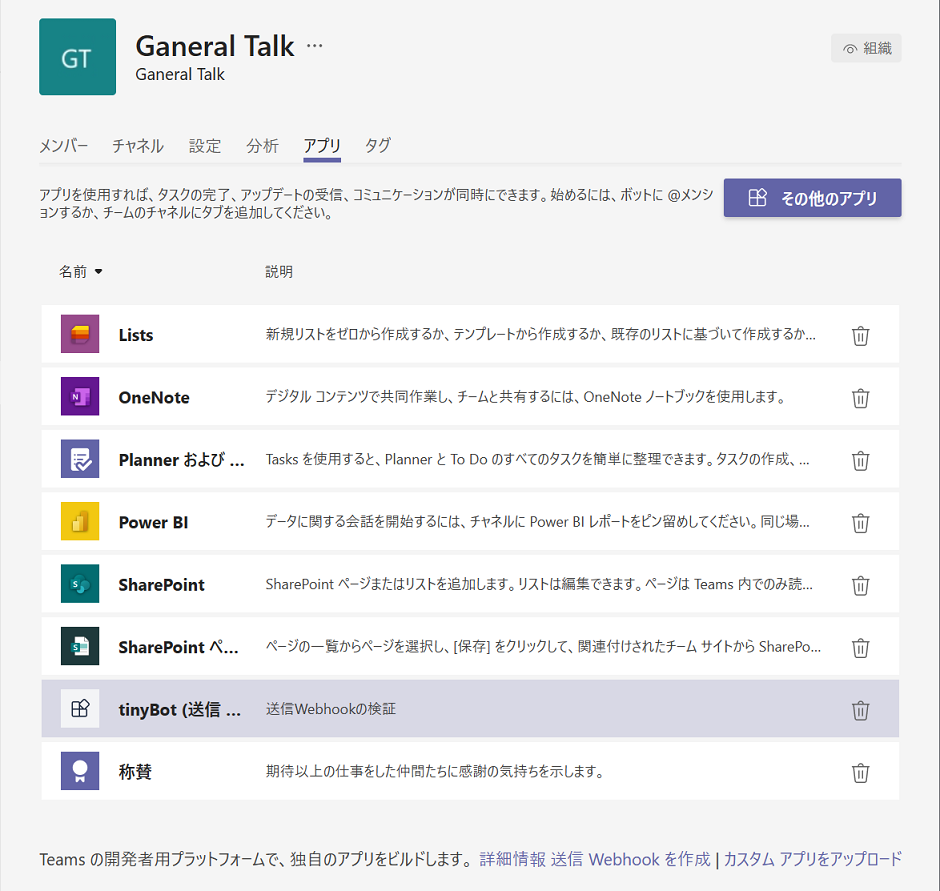

# 演習 6 : コネクタ
コネクタを使用すると外部アプリケーションの状態の変更などを Microsoft Teams のチャネルに通知することができます。

Microsoft Teams のチャネルには既定の状態でさまざまなアプリケーション向けのコネクタが用意されており、任意のアプリケーション向けのコネクタを使用することでコードの記述などを行うことなく状態の変化をチャネルへの投稿として受け取ることができます。

また、**Incomming Webhook** コネクタを利用すると、開発者が独自に作成したアプリケーションからの任意の通知を行うことができます。

さらには独自のコネクタを[コネクタ開発者ダッシュボード](https://outlook.office.com/connectors/home/login/#/new)から登録することにより Microsoft Teams に公開することができます。

## タスク 1 : Incomming Webhook を利用したチャネルへの通知

チャネルのコネクタ **Incomming Webhook** が生成した URL にメッセージ カードのフォーマットの JSON を POST し、外部のアプリケーションから任意のチャネルへ通知を行えるようにします。

送信するメッセージカードは[カードのプレイグラウンド](https://messagecardplayground.azurewebsites.net/)を使用してさまざまなカードのデザインを行うことができます。

この手順では Incoming Webhook コネクタが生成した通知用の URL に HTTP を送信するためのツールとして Postman を使用しますので、以下のサイトよりインストールを行い使用可能な状態としてください。

* [**Postman | The Collaboration Platform for API Development**](https://www.getpostman.com/)

 **Incomming Webhook** コネクタを使用して外部アプリケーションからの通知を可能にする手順は以下のとおりです。

1. Microsoft Teams の任意のチャネルの、チャネル名の右端にある \[・・・\]\(その他のオプション)メニューから \[コネクタ\] をクリックします。

    

2. コネクタの一覧画面が表示されるので、左側のメニューより \[開発者ツール\] を選択し、左側のコネクタのリストから  **Incomming Webhook** の横の \[追加\] ボタンをクリックします。
 
    

3. さらに **Incomming Webhook** の画面内の \[追加\] ボタンをクリックします。

4. **Incomming Webhook** の設定画面が表示されるので 「IncomingWebhook 接続の名前を入力してください。*」 に **My first Webhook** と入力し \[作成\] ボタンをクリックします。

5. 生成された Webhook 用の URL が表示されるのでコピーボタンをクリックして URL をクリップボードにコピーし、\[完了\] ボタンをクリックしてダイアログボックスを閉じます。

    

6. Postman を起動し、初期画面のダイアログボックスで **Request** をクリックします。

    

7. \[**SAVE REQUEST**\] ダイアログボックスが表示されるので、\[Request name\] のボックスに **My first Webhook** と入力します。

8. 同ダイアログボックス下の赤字で書かれている \[* Create Collention\] をクリックし、赤枠で囲まれたボックスに **Microsoft Teams App Dev** と記述し、右横の赤いチェック マークのボックスをクリックします。

    

9. **\[Save to Microsoft App Dev\]** という赤いボタンが表示されるのでクリックします。

8. リクエストの作成画面が表示されるので URL ボックスの前のドロップダウンリストをクリックし、HTTP メソッドを GET から **POST** に変更します。

    

9. URL ボックス (\[Enter request URL\] のウォーターマークがあります) に Microsoft Teams の Incomming Webhook コネクタが生成した URL を張り付けます。

10. URL ボックス下の \[Body\] タブをクリックします。

11. 同タブ内の \[raw\] オプションボタンをチェックし、下のテキストボックスに以下の JSON を張り付けます。

    ```
    {
        "@context": "https://schema.org/extensions",
        "@type": "MessageCard",
        "themeColor": "0072C6",
        "title": "これは Microsoft Teams のコネクタ機能で送信されました。",
        "text": "Microsoft Teams のコネクタ機能については **この通知の送信方法について** をクリックしてください。",
        "potentialAction": [
        {
            "@type": "ActionCard",
            "name": "フィードバックの送信",
            "inputs": [
                {
                    "@type": "TextInput",
                    "id": "feedback",
                    "isMultiline": true,
                    "title": "受信側を作っていないので実際には送信されませんけどね"
                }
            ],
            "actions": [
                {
                    "@type": "HttpPOST",
                    "name": "フィードバックを送る",
                    "isPrimary": true,
                    "target": "http://..."
                }
            ]
        },
        {
            "@type": "OpenUri",
            "name": "この通知の送信方法について",
            "targets": [
                { "os": "default", "uri": "https://github.com/osamum/Easyway-for-MSTeamsAppDev/blob/master/Ex06.md" }
                ]
        }]
    }
    ```

12. \[raw\] オプションボタンの同じ並びにある右端のドロップダウンリストで JSON を選択します。

13. URL ボックス横の \[Send\] ボタンをクリックします。

14. Incomming Webhook 設定した Microsoft Teams のチャネルに以下の投稿がされていることを確認してください。

    

    正しく送信ができたことが確認できたらこちらの[コネクタ メッセージの例](https://docs.microsoft.com/ja-jp/microsoftteams/platform/webhooks-and-connectors/how-to/connectors-using#example-connector-message)もお試しください。


<br>

## タスク 2 : 送信(Outgoing) Webhook を利用した外部サービスの呼び出し

送信 Webhook を使用すると、ユーザーはチャネルから@mentionを使用して外部サービスに情報を送信し、結果をチャット欄に表示することができます。

送信 Webhookは、アダプティブカード、ヒーローカード、テキストメッセージを添付ファイルもサポートしており、簡易的なボットとして使用することかできます。

### 演習の準備

送信 Webhook は、Microsoft Teams のチャネル側の設定だけでなく、チャネルから呼び出されるサービスを作成する必要があります。

このサービスは手動で作ることもできますが、Teams 用の Yeoman ジェネレーターにプロジェクトの雛形が用意されているのでいるのでこちらを使用します。

演習を開始する前に、以下のドキュメントの内容を参考に Teams 用 Yeoman ジェネレーターをインストールしておいてください。

- [**Yeoman ジェネレーターをMicrosoft Teams最初のアプリを作成する**](https://docs.microsoft.com/ja-jp/microsoftteams/platform/tutorials/get-started-yeoman)


### Teams 送信 Webhook からの呼び出しを受信するサービスの作成

Teams 用 Yeoman ジェネレーターを使用してチャネルからの呼び出しに応答するサービスを作成し、ローカル環境でホストします。

手順は以下のとおりてす。

1. 開発環境に Webhook 応答サービスのプロジェクト用のフォルダを作成し、コマンドプロンプトを起動して作業ディレクトリとします

2. 以下のコマンドを実行します

    ```
    yo teams
    ```
3. 「What is your solution name?(ソリューション名の候補)」とメッセージが表示されるのでソリューション名に問題がなければそのままキーボードの \[Enter\] キーを押下します

4. 「Where do you want to place the files? (Use arrow keys)」とプロンプトが表示されるので既定の **Use the current folder** のまま\[Enter\] キーを押下します

5. 「Title of your Microsoft Teams App project? (アプリタイトルの候補)」とメッセージが表示されるのでアプリのタイトルに問題がなければそのままキーボードの \[Enter\] キーを押下します

6. 「Your (company) name? (max 32 characters)」とメッセージが表示されますが、今回は演習なのでそのまま\[Enter\] キーを押下します

7. 「Which manifest version would you like to use? (Use arrow keys)」と、Teams のアプリ マニフェストのスキーマのバージョンを聞いてくるので、キーボードの上下矢印キーを使用して **>** マークを移動させ **V1.10** を指定して\[Enter\] キーを押下します

8. 「Quick scaffolding (Y/n)」とメッセージが表示されるので、そのまま\[Enter\] キーを押下します

9. 「What features do you want to add to your project? (Press \<space\> to select, \<a\> to toggle all, \<i\> to invert selection)」のところでは作成するプロジェクトの雛形を選択します。

    既定で **A Tab** が選択されているのでキーボードの \[Space\] キーで選択を外し、キーボードの上下矢印キーを使用して **>** マークを **An Outgoing Webhook** 移動させキーボードの \[Space\] キーで選択します。以下のように選択されたことを確認したら\[Enter\] キーを押下します

    ```
    >(*) An Outgoing Webhook
    ```

10. 「The URL where you will host this solution?」とメッセージが表示されますが、今回は演習なのでそのまま\[Enter\] キーを押下します

11. 「Would you like show a loading indicator when your app/tab loads?」とメッセージが表示されるので、ここでは **N** を入力してから\[Enter\] キーを押下します

12. 「What is the name of your outgoing webhook?」とメッセージが表示されるのでそのまま\[Enter\] キーを押下します

    プロジェクトの作成が開始されます。

    プロジェクトへの HMAC セキュリティトークンの追加と、サービスの実行は、Teams 側の設定が済んでから行います。

<br />

### チームへの 送信 Webhook の設定

チームのチャネルで 送信 Webhook が使用できるように設定を追加します。

手順は以下のとおりです。

1. Microsoft Teams の画面左側のチームの一覧から任意のチームを選択し、チーム名の右側にある \[...\]\(その他のオプション\) メニューをクリックして\[**チームを管理**\] を選択します

    

2. チームの管理画面が表示されるので \[**アプリ**\] タブをアクティブにし、同タブ右下にある\[**送信 Webhook を作成**\] リンクをクリックします

    

3. \[送信 Webhook を作成します\] ダイアログボックスが表示されるので、各項目を設定して \[作成\] ボタンをクリックします

    |項目|値|
    | ---- | ---- |
    |*名前|(任意の名前。チャットから@mentionで使用されます)|
    |*コールバック URL|(サービスのURL。この演習では後で書き換えるので https のなにか適当な URL を入れておきます)|
    |説明|(送信Webhookの説明を記述します)|

    

4. セキュリティ トークンが生成されて表示されるので、すみやかにコピーします

    セキュリティトークンはこのダイアログボックスを閉じてしまうと二度と表示されないので必ずコピーして保存してください。

    また、表示しているダイアログ ボックスの外側をクリックしてしまうと、ダイアログ ボックスが閉じてしまうので注意が必要です。

    

    セキュリティトークンをコピーし終えたら \[閉じる\] ボタンをクリックしてダイアログ ボックスを閉じます。

5. 前の手順で Teams 用 Yeoman ジェネレーターで生成した、送信 Webhook からの呼び出しに応答するサービスのプロジェクトを Visual Studio Code でオープンします

6. プロジェクト内の **.env** ファイルをオープンし、同ファイルで定義されている変数 **SECURITY_TOKEN** の値として、Teams で送信 Webhook を登録した際に生成されたセキュリティ トークンを貼り付け保存します

    例)
    ```
    # Security token for the default outgoing webhook
    SECURITY_TOKEN=ここにセキュリティトークンを貼り付ける
    ```
7. Visual Studio Code のメニュー \[Terminal\]-\[New Terminal\] をクリックし、表示されたターミナル ウィンドウで以下のコードを実行します。

    ```
    gulp ngrok-serve
    ```

8. プロジェクトのビルドが開始され、ターミナル ウィンドウに ngrok のドメイン名が表示されるのでメモします

    例)
    ```
    [17:53:20] [NGROK] Url: https://4e9a168788ae.ngrok.io
    [17:53:20] [NGROK] You have been assigned a random ngrok URL that will only be available for this session. You will need to re-upload the Teams manifest next time you run this command.
    [17:53:20] [NGROK] Public url: 4e9a168788ae.ngrok.io
    ```

9. サービスが起動したら、前の手順で登録を行った送信 Webhook の設定を開きます
    
    もし、送信 Webhook の設定画面を閉じてしまっていた場合は、チーム名の右側にある \[...\]\(その他のオプション\) メニューをクリックして\[**チームを管理**\] を選択し、遷移した画面で \[アプリ\]タブをアクティブにすると、アプリ一覧にリストされているので、それをクリックします。

    

10. \[送信 Webhook を編集します\] ダイアログボックスが表示されるので、同ダイアログ ボックス中の \[**コールバック URL**\] に指定してあるエンドポイントのドメイン名部分をプロジェクトをビルドした際に表示された ngrok の URL に書き換え\[保存\] ボタンをクリックします

ここまでの手順で送信 Webhook を試す準備ができました。

送信 Webhook を設定した任意のチャネルで以下のようにメッセージを投稿すると、外部サービスからオウム返しに入力したメッセージが返されます。

    ```
    @(送信 Webhook の名前) こんにちは　
    ```


<br>　

## その他の通知/連携方法

外部アプリケーションからの Teams チャネルへの投稿や、 Teams で行われたアクションをトリガーとする外部サービスの呼び出しなど、Teams の Webhook 機能や Microsoft Graph API 等を使用して開発しなくても [**Azure Logic Apps**](https://docs.microsoft.com/ja-jp/azure/logic-apps/logic-apps-overview) や [**Microsoft Power Automate**](https://docs.microsoft.com/ja-jp/power-automate/getting-started)から利用可能な Teams 用のコネクタを使用してノン・コーディングで機能の実装が可能な場合もあるので、こちらも合わせてぜひご検討ください。

* [**Microsoft Teams (Preview) | Microsoft Connectors**](https://docs.microsoft.com/ja-jp/connectors/teams/#post-adaptive-card-and-wait-for-a-response)
* [**アダプティブ カードをチームに投稿するクラウド フローを作成する**](https://docs.microsoft.com/ja-jp/power-automate/create-adaptive-cards-teams#create-a-cloud-flow-that-posts-adaptive-cards-to-a-team)
* [**Azure Monitor アラートによって複雑なアクションをトリガーする方法**](https://docs.microsoft.com/ja-jp/azure/azure-monitor/alerts/action-groups-logic-app)

<br>　

\<参考\>

* [**Webhook とコネクタとは**](https://docs.microsoft.com/ja-jp/microsoftteams/platform/webhooks-and-connectors/what-are-webhooks-and-connectors)

* [**受信 Webhook を使用して外部リクエストを Teams に投稿する**](https://docs.microsoft.com/ja-jp/microsoftteams/platform/webhooks-and-connectors/how-to/add-incoming-webhook)

* [**送信 Webhooks を使用してTeamsボットを追加する**](https://docs.microsoft.com/ja-jp/microsoftteams/platform/webhooks-and-connectors/how-to/add-outgoing-webhook)


* [**コネクタと Webhook にメッセージを送信する**](https://docs.microsoft.com/ja-jp/microsoftteams/platform/concepts/connectors/connectors-using)


## 目次
0. [**Microsoft Teams アプリケーション開発について**](Intro.md)

1. [**Microsoft Teams アプリケーションの新規作成**](Ex01.md)
    * [**App Studio を使用したマニフェストファイルの作成**](Ex01.md#app-studio-を使用した-teams-アプリケーションの登録)
    * [**Microsoft Teams 用 開発者ポータルを使用した Teams アプリケーションの登録**](Ex01.md#microsoft-teams-%E7%94%A8-%E9%96%8B%E7%99%BA%E8%80%85%E3%83%9D%E3%83%BC%E3%82%BF%E3%83%AB%E3%81%AE%E4%BD%BF%E7%94%A8)
    
2. [**タブ アプリケーション**](Ex02.md)
    * [**パーソナル タブ**](Ex02.md#%E3%82%BF%E3%82%B9%E3%82%AF-1--%E3%83%91%E3%83%BC%E3%82%BD%E3%83%8A%E3%83%AB-%E9%9D%99%E7%9A%84-%E3%82%BF%E3%83%96%E3%81%AE%E8%BF%BD%E5%8A%A0)
        * [**App Studio を使用した方法**](Ex02.md#app-studio-%E3%82%92%E4%BD%BF%E7%94%A8%E3%81%97%E3%81%9F%E3%83%91%E3%83%BC%E3%82%BD%E3%83%8A%E3%83%AB-%E3%82%BF%E3%83%96%E3%81%AE%E8%BF%BD%E5%8A%A0)
        * [**Microsoft Teams 用 開発者ポータルを使用した方法**](Ex02.md#microsoft-teams-%E7%94%A8-%E9%96%8B%E7%99%BA%E8%80%85%E3%83%9D%E3%83%BC%E3%82%BF%E3%83%AB-%E3%82%92%E4%BD%BF%E7%94%A8%E3%81%97%E3%81%9F%E3%83%91%E3%83%BC%E3%82%BD%E3%83%8A%E3%83%AB-%E3%82%BF%E3%83%96%E3%81%AE%E8%BF%BD%E5%8A%A0)


    * [**チーム タブ**](Ex02.md#%E3%82%BF%E3%82%B9%E3%82%AF-2--%E3%83%81%E3%83%BC%E3%83%A0-%E6%A7%8B%E6%88%90%E5%8F%AF%E8%83%BD-%E3%82%BF%E3%83%96%E3%81%AE%E8%BF%BD%E5%8A%A0)
        * [**App Studio を使用した方法**](Ex02.md#app-studio-%E3%81%A7%E3%81%AE%E3%83%81%E3%83%BC%E3%83%A0-%E3%82%BF%E3%83%96%E3%81%AE%E8%BF%BD%E5%8A%A0)
        * [**Microsoft Teams 用 開発者ポータルを使用した方法**](Ex02.md#microsoft-teams-%E7%94%A8-%E9%96%8B%E7%99%BA%E8%80%85%E3%83%9D%E3%83%BC%E3%82%BF%E3%83%AB-%E3%82%92%E4%BD%BF%E7%94%A8%E3%81%97%E3%81%9F%E3%83%91%E3%83%BC%E3%82%BD%E3%83%8A%E3%83%AB-%E3%82%BF%E3%83%96%E3%81%AE%E8%BF%BD%E5%8A%A0)

    * [**タブ : タスクモジュールの表示**](Ex02.md#%E3%82%BF%E3%82%B9%E3%82%AF-3-%E3%82%BF%E3%83%96%E3%81%A7%E3%81%AE%E3%82%BF%E3%82%B9%E3%82%AF-%E3%83%A2%E3%82%B8%E3%83%A5%E3%83%BC%E3%83%AB%E3%81%AE%E8%A1%A8%E7%A4%BA)

        * [**外部の HTML フォームをタスクモジュールとしてタブに追加**](Ex02.md#%E3%82%BF%E3%82%B9%E3%82%AF-3-1--%E5%A4%96%E9%83%A8%E3%81%AE-html-%E3%83%95%E3%82%A9%E3%83%BC%E3%83%A0%E3%82%92%E3%82%BF%E3%82%B9%E3%82%AF%E3%83%A2%E3%82%B8%E3%83%A5%E3%83%BC%E3%83%AB%E3%81%A8%E3%81%97%E3%81%A6%E3%82%BF%E3%83%96%E3%81%AB%E8%BF%BD%E5%8A%A0)

        * [**アダプティブ カードをタスクモジュールとしてタブに追加**](Ex02.md#%E3%82%BF%E3%82%B9%E3%82%AF-3-2--actibity-card-%E3%82%92%E3%82%BF%E3%82%B9%E3%82%AF%E3%83%A2%E3%82%B8%E3%83%A5%E3%83%BC%E3%83%AB%E3%81%A8%E3%81%97%E3%81%A6%E3%82%BF%E3%83%96%E3%81%AB%E8%BF%BD%E5%8A%A0)
    
    * [**タブのシングルサインオン(SSO)**](Ex02-SSO.md)

3. [**ボット**](Ex03.md)
    * [**ボットの登録**](Ex03.md#%E3%83%9C%E3%83%83%E3%83%88%E3%81%AE%E7%99%BB%E9%8C%B2)
    * [**App Studio を使用したボットの追加**](Ex03.md#app-studio-%E3%82%92%E4%BD%BF%E7%94%A8%E3%81%97%E3%81%9F%E3%83%9C%E3%83%83%E3%83%88%E3%81%AE%E8%BF%BD%E5%8A%A0)
    * [**Microsoft Teams 用 開発者ポータルを使用したボットの追加**](Ex03.md#microsoft-teams-%E7%94%A8-%E9%96%8B%E7%99%BA%E8%80%85%E3%83%9D%E3%83%BC%E3%82%BF%E3%83%AB%E3%82%92%E4%BD%BF%E7%94%A8%E3%81%97%E3%81%9F%E3%83%9C%E3%83%83%E3%83%88%E3%81%AE%E8%BF%BD%E5%8A%A0)
    
4. [**メッセージング拡張**](Ex04.md)
    * [**検索機能の実装**](Ex04.md#%E3%82%BF%E3%82%B9%E3%82%AF-1--%E3%83%A1%E3%83%83%E3%82%BB%E3%83%BC%E3%82%B8%E3%83%B3%E3%82%B0%E6%8B%A1%E5%BC%B5---wikipedia-%E6%A4%9C%E7%B4%A2%E6%A9%9F%E8%83%BD%E3%81%AE%E5%AE%9F%E8%A3%85)
    * [**操作機能の実装**](Ex04.md#%E3%82%BF%E3%82%B9%E3%82%AF-2--%E3%83%A1%E3%83%83%E3%82%BB%E3%83%BC%E3%82%B8%E3%83%B3%E3%82%B0%E6%8B%A1%E5%BC%B5---%E6%93%8D%E4%BD%9C%E3%82%A2%E3%82%AF%E3%82%B7%E3%83%A7%E3%83%B3%E3%82%B3%E3%83%9E%E3%83%B3%E3%83%89%E3%81%AB%E3%82%88%E3%82%8B%E5%A4%96%E9%83%A8%E3%82%B5%E3%83%BC%E3%83%93%E3%82%B9%E3%81%AE%E9%80%A3%E6%90%BA)
    
5. [**タブとボットのシングルサインオン**](Ex05.md)
6. [**コネクタ**](Ex06.md)
    * [**受信 Webhook を利用したチャネルへの通知**](Ex06.md#%E3%82%BF%E3%82%B9%E3%82%AF-1--incomming-webhook-%E3%82%92%E5%88%A9%E7%94%A8%E3%81%97%E3%81%9F%E3%83%81%E3%83%A3%E3%83%8D%E3%83%AB%E3%81%B8%E3%81%AE%E9%80%9A%E7%9F%A5)
    * [**送信Webhook を利用した外部サービスの呼び出し**](Ex06.md#%E3%82%BF%E3%82%B9%E3%82%AF-2--%E9%80%81%E4%BF%A1outgoing-webhook-%E3%82%92%E5%88%A9%E7%94%A8%E3%81%97%E3%81%9F%E5%A4%96%E9%83%A8%E3%82%B5%E3%83%BC%E3%83%93%E3%82%B9%E3%81%AE%E5%91%BC%E3%81%B3%E5%87%BA%E3%81%97)


