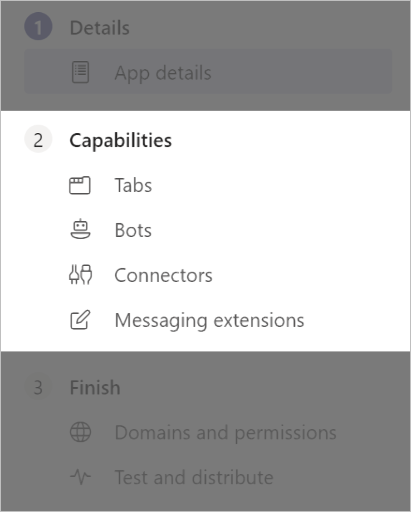
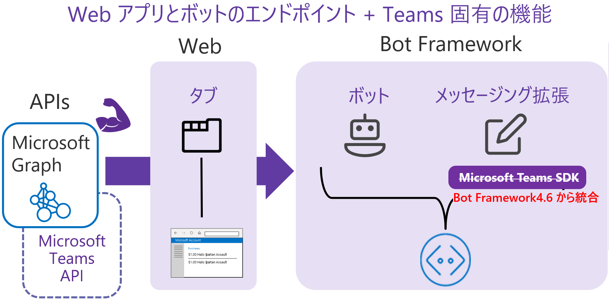

# 序 : Microsoft Teams アプリケーション開発について
開発方法について紹介する前に簡単に Microsoft Teams について紹介します。

## Microsoft Teams とは
Microsoft Teams は、Office 365 でのチーム コラボレーションのハブです。

チームが結束して成果をあげるのに必要な人、コンテンツ、ツールがここに集まります。

Teams ではチャットやファイル共有、ビデオ会議といった豊富な機能を提供しますが、アプリケーションを開発することによって、さらにその業務に最適なソリューションを提供できます。

## Microsoft Teams プラットフォームの特徴
Microsoft Teams はアプリケーションとしてだけでなく、サードパーティーのアプリやそれらを使用したプロセス、開発ツールも用意されており、単なるアプリケーションのカスタマイズではなく、開発のプラットフォームとして機能します。

このプラットフォームには 3 つの大きな特徴があります。

* **シームレスなコンテキストの切り替え**
* **場所に制限されないコミュニケーション**
* **エクスペリエンス (体験) の多様性**

### シームレスなコンテキストの切り替え
Microsoft Teams ではコンテキストを切り替えることなく、さまざまに異なるコンテキストを取得することができます。

たとえば業務で使用する複数の情報ツールからは、それぞれ異なる情報や重複する情報が入ってきます。それらの情報を一か所に統合し情報収集の無駄を減らす、いわばキュレーションの能力です。

組織が既に使用しているすべてのアプリとツールを 1 つのユーザーインターフェイスにまとめることができるので、情報収集や業務ツールの使用にかかる工数を減らすことができます。

### 場所に制限されないコミュニケーション
Microsoft Teams はマルチプラットフォーム、マルチデバイスで動作するアプリケーションを提供しているうえ、Web ブラウザーでも動作するのでユーザーのデバイスを制限しません。

インターネットを介し、世界中のどこからでも接続できるので、チームでリアルタイムなコミュニケーションを取るときに一か所に集合する必要はありません。各々のいる場所で、テキスト、音声、あるいはビデオでコミュニケーションすることができます。

### エクスペリエンス (体験) の多様性
前述したように Microsoft Teams はさまざまな OS、デバイスで動作します。

例えば、ひとつのアプリケーションを PC で作業を行うオフィスワーカーも、フィールド サービス エンジニアのように作業現場からスマートフォンなどのモバイルデバイスでコミュニケーションを行うメンバーも使用できます。

ユースケースに合わせてアプリケーションを正しくデザインすれば、これまでのようにデスクトップとモバイル、さらには iOS と Android といったように 1 つのアプリケーションをわざわざ個別に開発する必要はありません。

## アプリケーション開発に使用する特徴的な機能
アプリケーションの開発で使用する Microsoft Teams の代表的な機能は大まかに以下の 4 つです。

* タブ
* ボット
* コネクタ
* メッセージング拡張

これらの開発は既存の Web アプリケーションや、既存の Microsoft Bot Framework で作られたボットを統合するか、それぞれ向けに作られた Teams 用の SDK で拡張して行います。

## Microsoft Teams の SDK と API
既存の Web アプリケーションやボットを Microsoft Teams 用に拡張するために以下のような SDK が用意されています。

* **Web クライアント (タブ アプリケーション向け)**

    [Microsoft Teams JavaScript client SDK](https://docs.microsoft.com/en-us/javascript/api/overview/msteams-client)

* **ボット**

    ~~[Bot Builder SDK 4 - Microsoft Teams Extensions](https://github.com/OfficeDev/BotBuilder-MicrosoftTeams-dotnet)~~

    (※) Bot Framework 4.6 から Bot Framework SDK に統合され、個別のインストールは不要になりました。

    [C\#](https://github.com/OfficeDev/BotBuilder-MicrosoftTeams-dotnet)

    [Node.js](https://github.com/OfficeDev/BotBuilder-MicrosoftTeams-node)

上記に加え、Office 365 や Azure AD 内のユーザーに紐づく、アカウント情報やメールや予定表といったデータを取得するための Microsoft Graph API も使用できます。

* [**Microsoft Graph**](https://developer.microsoft.com/ja-jp/graph/)

また、Microsoft Graph には Microsoft Teams を API を介して操作するための Microsoft Teams API も含まれます。

* [**Microsoft Teams API の概要**](https://docs.microsoft.com/ja-jp/graph/teams-concept-overview)

この中には、Microsoft Teams のもう一つの大きな特色である通話やオンライン会議の API も含まれます。

* [**Microsoft Graph で通信 API を操作する**](https://docs.microsoft.com/ja-jp/graph/api/resources/communications-api-overview?view=graph-rest-1.0)

なお、このチュートリアルは、Microsoft Teams 初学者向けに Teams アプリの開発開始までのスピードアップを目的としているため Microsoft Graph 関連については扱いませんが、別途、初学者向けの簡易チュートリアルを用意しましたので[そちら](https://github.com/osamum/Firstway_to_MSTeamsGraphAPI)をご利用ください。

**⇒【 1. [Microsoft Teams アプリケーションの新規作成](Ex01.md) 】へ**

## 目次
0. [**Microsoft Teams アプリケーション開発について**](Intro.md)

1. [**Microsoft Teams アプリケーションの新規作成**](Ex01.md)
    * [**App Studio を使用したマニフェストファイルの作成**](Ex01.md#app-studio-を使用した-teams-アプリケーションの登録)
    * [**Microsoft Teams 用 開発者ポータルを使用した Teams アプリケーションの登録**](Ex01.md#microsoft-teams-%E7%94%A8-%E9%96%8B%E7%99%BA%E8%80%85%E3%83%9D%E3%83%BC%E3%82%BF%E3%83%AB%E3%81%AE%E4%BD%BF%E7%94%A8)

2. [**タブ アプリケーション**](Ex02.md)
    * [**パーソナル タブ**](Ex02.md#%E3%82%BF%E3%82%B9%E3%82%AF-1--%E3%83%91%E3%83%BC%E3%82%BD%E3%83%8A%E3%83%AB-%E9%9D%99%E7%9A%84-%E3%82%BF%E3%83%96%E3%81%AE%E8%BF%BD%E5%8A%A0)
    * [**チーム タブ**](Ex02.md#%E3%82%BF%E3%82%B9%E3%82%AF-2--%E3%83%81%E3%83%BC%E3%83%A0-%E6%A7%8B%E6%88%90%E5%8F%AF%E8%83%BD-%E3%82%BF%E3%83%96%E3%81%AE%E8%BF%BD%E5%8A%A0)

    * [**タブ : タスクモジュールの表示**](Ex02.md#%E3%82%BF%E3%82%B9%E3%82%AF-3-%E3%82%BF%E3%83%96%E3%81%A7%E3%81%AE%E3%82%BF%E3%82%B9%E3%82%AF-%E3%83%A2%E3%82%B8%E3%83%A5%E3%83%BC%E3%83%AB%E3%81%AE%E8%A1%A8%E7%A4%BA)

        * [**外部の HTML フォームをタスクモジュールとしてタブに追加**](Ex02.md#%E3%82%BF%E3%82%B9%E3%82%AF-3-1--%E5%A4%96%E9%83%A8%E3%81%AE-html-%E3%83%95%E3%82%A9%E3%83%BC%E3%83%A0%E3%82%92%E3%82%BF%E3%82%B9%E3%82%AF%E3%83%A2%E3%82%B8%E3%83%A5%E3%83%BC%E3%83%AB%E3%81%A8%E3%81%97%E3%81%A6%E3%82%BF%E3%83%96%E3%81%AB%E8%BF%BD%E5%8A%A0)

        * [**アダプティブ カードをタスクモジュールとしてタブに追加**](Ex02.md#%E3%82%BF%E3%82%B9%E3%82%AF-3-2--actibity-card-%E3%82%92%E3%82%BF%E3%82%B9%E3%82%AF%E3%83%A2%E3%82%B8%E3%83%A5%E3%83%BC%E3%83%AB%E3%81%A8%E3%81%97%E3%81%A6%E3%82%BF%E3%83%96%E3%81%AB%E8%BF%BD%E5%8A%A0)
    
    
3. [**ボット**](Ex03.md)
    * [**ボットの登録**](Ex03.md#%E3%83%9C%E3%83%83%E3%83%88%E3%81%AE%E7%99%BB%E9%8C%B2)
4. [**メッセージング拡張**](Ex04.md)
    * [**検索機能の実装**](Ex04.md#%E3%82%BF%E3%82%B9%E3%82%AF-1--%E3%83%A1%E3%83%83%E3%82%BB%E3%83%BC%E3%82%B8%E3%83%B3%E3%82%B0%E6%8B%A1%E5%BC%B5---wikipedia-%E6%A4%9C%E7%B4%A2%E6%A9%9F%E8%83%BD%E3%81%AE%E5%AE%9F%E8%A3%85)
    * [**操作機能の実装**](Ex04.md#%E3%82%BF%E3%82%B9%E3%82%AF-2--%E3%83%A1%E3%83%83%E3%82%BB%E3%83%BC%E3%82%B8%E3%83%B3%E3%82%B0%E6%8B%A1%E5%BC%B5---%E6%93%8D%E4%BD%9C%E3%82%A2%E3%82%AF%E3%82%B7%E3%83%A7%E3%83%B3%E3%82%B3%E3%83%9E%E3%83%B3%E3%83%89%E3%81%AB%E3%82%88%E3%82%8B%E5%A4%96%E9%83%A8%E3%82%B5%E3%83%BC%E3%83%93%E3%82%B9%E3%81%AE%E9%80%A3%E6%90%BA)
    
5. [**タブとボットのシングルサインオン**](Ex05.md)
6. [**コネクタ**](Ex06.md)
    * [**受信 Webhook を利用したチャネルへの通知**](https://github.com/osamum/Easyway-for-MSTeamsAppDev/blob/master/Ex06.md#%E3%82%BF%E3%82%B9%E3%82%AF-1--incomming-webhook-%E3%82%92%E5%88%A9%E7%94%A8%E3%81%97%E3%81%9F%E3%83%81%E3%83%A3%E3%83%8D%E3%83%AB%E3%81%B8%E3%81%AE%E9%80%9A%E7%9F%A5)
    * [**送信 Webhook を利用した外部サービスの呼び出し**](https://github.com/osamum/Easyway-for-MSTeamsAppDev/blob/master/Ex06.md#%E3%82%BF%E3%82%B9%E3%82%AF-2--%E9%80%81%E4%BF%A1outgoing-webhook-%E3%82%92%E5%88%A9%E7%94%A8%E3%81%97%E3%81%9F%E5%A4%96%E9%83%A8%E3%82%B5%E3%83%BC%E3%83%93%E3%82%B9%E3%81%AE%E5%91%BC%E3%81%B3%E5%87%BA%E3%81%97)

