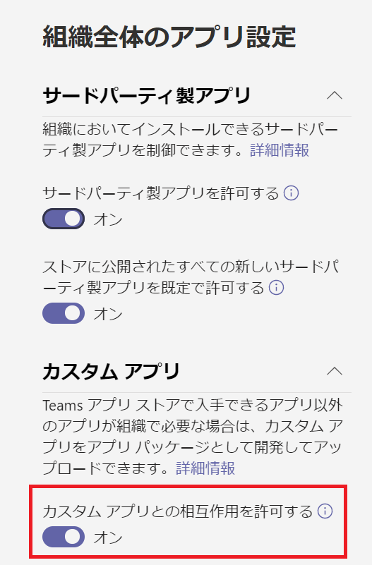

# Microsoft Teams 開発者向け簡易チュートリアル

2021 年 8 月 24 日版

## 更新内容
- [**Microsoft Teams アプリケーションの新規作成**](Ex01.md) と [**タブ アプリケーション**](Ex02.md) のページに以下の [**Microsoft Teams 用 開発者ポータル**](https://dev.teams.microsoft.com/) 関連の記述を追加しました。

    * [**Microsoft Teams 用 開発者ポータルを使用した Teams アプリケーションの登録**](Ex02.md#microsoft-teams-%E7%94%A8-%E9%96%8B%E7%99%BA%E8%80%85%E3%83%9D%E3%83%BC%E3%82%BF%E3%83%AB%E3%81%AE%E4%BD%BF%E7%94%A8)

    * [**Microsoft Teams 用 開発者ポータルを使用してパーソナルタブを追加する方法**](Ex02.md#microsoft-teams-%E7%94%A8-%E9%96%8B%E7%99%BA%E8%80%85%E3%83%9D%E3%83%BC%E3%82%BF%E3%83%AB-%E3%82%92%E4%BD%BF%E7%94%A8%E3%81%97%E3%81%9F%E3%83%91%E3%83%BC%E3%82%BD%E3%83%8A%E3%83%AB-%E3%82%BF%E3%83%96%E3%81%AE%E8%BF%BD%E5%8A%A0)

    * [**Microsoft Teams 用 開発者ポータルを使用してチームタブを追加する方法**](Ex02.md#microsoft-teams-%E7%94%A8-%E9%96%8B%E7%99%BA%E8%80%85%E3%83%9D%E3%83%BC%E3%82%BF%E3%83%AB-%E3%82%92%E4%BD%BF%E7%94%A8%E3%81%97%E3%81%9F%E3%83%91%E3%83%BC%E3%82%BD%E3%83%8A%E3%83%AB-%E3%82%BF%E3%83%96%E3%81%AE%E8%BF%BD%E5%8A%A0)


これまでの更新内容は[改訂履歴](changelog.md)を参照してください。

## 概要
このチュートリアルは、これから Microsoft Teams 向けのアプリケーションの開発を行う初学者のための簡易的なものであり、実際の開発に取り掛かるまでの学習期間の短縮を目的としています。

ここで紹介するのは以下の内容です。
* 開発で使用する Microsoft Teams の特徴的な機能 
* 上記それぞれの概念
* 上記それぞれのアプリケーションの実装方法

チュートリアルとして開発方法を説明するのは Microsoft Teams の以下の機能です。
* タブ
* ボット
* コネクタ
* メッセージング拡張

## 要件
このチュートリアルを実施するには以下の環境が必要です。

* **Microsoft Office 365 Business Premium 以上の[ライセンス](https://products.office.com/ja-JP/compare-all-microsoft-office-products-b?tab=2)**

    ライセンスを持っていない開発者は [Office 365 開発者プログラム](https://developer.microsoft.com/ja-JP/office/dev-program
)に参加して開発者用の無料の Office 365 のサブスクリプションを入手することもできます。このサブスクリプションでは [Office 365 Enterprise E3 Developer](https://docs.microsoft.com/ja-jp/office/developer-program/office-365-developer-program-get-started) が 90 日間無償で使用することができます。このライセンスを開発に積極的に使用している場合は、90 日ごとにサブスクリプションが自動的に更新されます。

    詳しくは以下のドキュメントをご参照ください。

    * [Microsoft 365 開発者プログラムの FAQ - 1 年間のサブスクリプションをなぜ提供しないのですか？](https://docs.microsoft.com/ja-jp/office/developer-program/microsoft-365-developer-program-faq#renew-subscription)

* **Microsoft Teams 管理センターでサイドローディングの許可**

    Microsoft Teams 管理センターにて、開発したアプリケーションがサイドローディングできるように許可を行ってください。
    
    具体的には [Microsoft Teams 管理センター](https://admin.teams.microsoft.com/)のメニュー\[Teams のアプリ\] - \[アプリの管理\] の画面内にある \[**組織全体のアプリ設定**\] ボタンをクリックし、表示されたブレード内の 「カスタム アプリとの相互作用を許可する」をオンにします。

    


* **[Visual Studio 2018 以上のエディション](https://visualstudio.microsoft.com/ja/vs/)、もしくは [Visual Studio Code](https://code.visualstudio.com/Download)**

    ボットとメッセージ拡張の開発のチュートリアルで使用します。

    ボットを C# で開発する場合は Visual Studio 201x を、JavaScript で開発する場合は Visual Studio Code と [Node.js](https://nodejs.org/en/) をインストールしてください。

    また、Visual Studio Code を使用する場合は、ローカル環境で Web サーバーを動かすために以下のコマンドを使用して http-server をインストールしてください。

    ```
    npm install http-server -g
    ```

    メッセージング拡張の開発のチュートリアルで使用する Microsoft Teams Toolkit もインストールしておいてください。

    * [Visual Studio Code 用 Microsoft Teams Toolkit](https://marketplace.visualstudio.com/items?itemName=TeamsDevApp.ms-teams-vscode-extension)

    * [Visual Studio 用 Microsoft Teams Toolkit](https://marketplace.visualstudio.com/items?itemName=TeamsDevApp.vsteamstemplate)


* **デスクトップ版 Microsoft Teams**

    アプリケーションの登録を行うにはデスクトップ版の Microsoft Teams が必要です。[Office 365 ポータル](https://www.office.com/?)からインストールしておいてください。

* **[ngrok](https://ngrok.com/download)**

    ローカル環境で動作させた開発中のアプリケーションをインターネットを介して一時的にアクセスできるようにするために使用します。

    また Node.js が使用可能な場合は、以下のコマンドを使用してインストールすることも可能です。

    ```
    npm install ngrok -g
    ```


## 目次
0. [**Microsoft Teams アプリケーション開発について**](Intro.md)

1. [**Microsoft Teams アプリケーションの新規作成**](Ex01.md)
    * [**App Studio を使用したマニフェストファイルの作成**](Ex01.md#app-studio-を使用した-teams-アプリケーションの登録)
    * [**Microsoft Teams 用 開発者ポータルを使用した Teams アプリケーションの登録**](Ex01.md#microsoft-teams-%E7%94%A8-%E9%96%8B%E7%99%BA%E8%80%85%E3%83%9D%E3%83%BC%E3%82%BF%E3%83%AB%E3%81%AE%E4%BD%BF%E7%94%A8)
2. [**タブ アプリケーション**](Ex02.md)
    * [**パーソナル タブ**](Ex02.md#%E3%82%BF%E3%82%B9%E3%82%AF-1--%E3%83%91%E3%83%BC%E3%82%BD%E3%83%8A%E3%83%AB-%E9%9D%99%E7%9A%84-%E3%82%BF%E3%83%96%E3%81%AE%E8%BF%BD%E5%8A%A0)
        * [**App Studio を使用した方法**](Ex02.md#app-studio-%E3%82%92%E4%BD%BF%E7%94%A8%E3%81%97%E3%81%9F%E3%83%91%E3%83%BC%E3%82%BD%E3%83%8A%E3%83%AB-%E3%82%BF%E3%83%96%E3%81%AE%E8%BF%BD%E5%8A%A0)
        * [**Microsoft Teams 用 開発者ポータルを使用した方法**](Ex02.md#microsoft-teams-%E7%94%A8-%E9%96%8B%E7%99%BA%E8%80%85%E3%83%9D%E3%83%BC%E3%82%BF%E3%83%AB-%E3%82%92%E4%BD%BF%E7%94%A8%E3%81%97%E3%81%9F%E3%83%91%E3%83%BC%E3%82%BD%E3%83%8A%E3%83%AB-%E3%82%BF%E3%83%96%E3%81%AE%E8%BF%BD%E5%8A%A0)


    * [**チーム タブ**](Ex02.md#%E3%82%BF%E3%82%B9%E3%82%AF-2--%E3%83%81%E3%83%BC%E3%83%A0-%E6%A7%8B%E6%88%90%E5%8F%AF%E8%83%BD-%E3%82%BF%E3%83%96%E3%81%AE%E8%BF%BD%E5%8A%A0)
        * [**App Studio を使用した方法**](Ex02.md#app-studio-%E3%81%A7%E3%81%AE%E3%83%81%E3%83%BC%E3%83%A0-%E3%82%BF%E3%83%96%E3%81%AE%E8%BF%BD%E5%8A%A0)
        * [**Microsoft Teams 用 開発者ポータルを使用した方法**](Ex02.md#microsoft-teams-%E7%94%A8-%E9%96%8B%E7%99%BA%E8%80%85%E3%83%9D%E3%83%BC%E3%82%BF%E3%83%AB-%E3%82%92%E4%BD%BF%E7%94%A8%E3%81%97%E3%81%9F%E3%83%91%E3%83%BC%E3%82%BD%E3%83%8A%E3%83%AB-%E3%82%BF%E3%83%96%E3%81%AE%E8%BF%BD%E5%8A%A0)

    * [**タブ : タスクモジュールの表示**](Ex02.md#%E3%82%BF%E3%82%B9%E3%82%AF-3-%E3%82%BF%E3%83%96%E3%81%A7%E3%81%AE%E3%82%BF%E3%82%B9%E3%82%AF-%E3%83%A2%E3%82%B8%E3%83%A5%E3%83%BC%E3%83%AB%E3%81%AE%E8%A1%A8%E7%A4%BA)

        * [**外部の HTML フォームをタスクモジュールとしてタブに追加**](Ex02.md#%E3%82%BF%E3%82%B9%E3%82%AF-3-1--%E5%A4%96%E9%83%A8%E3%81%AE-html-%E3%83%95%E3%82%A9%E3%83%BC%E3%83%A0%E3%82%92%E3%82%BF%E3%82%B9%E3%82%AF%E3%83%A2%E3%82%B8%E3%83%A5%E3%83%BC%E3%83%AB%E3%81%A8%E3%81%97%E3%81%A6%E3%82%BF%E3%83%96%E3%81%AB%E8%BF%BD%E5%8A%A0)

        * [**アダプティブ カードをタスクモジュールとしてタブに追加**](Ex02.md#%E3%82%BF%E3%82%B9%E3%82%AF-3-2--actibity-card-%E3%82%92%E3%82%BF%E3%82%B9%E3%82%AF%E3%83%A2%E3%82%B8%E3%83%A5%E3%83%BC%E3%83%AB%E3%81%A8%E3%81%97%E3%81%A6%E3%82%BF%E3%83%96%E3%81%AB%E8%BF%BD%E5%8A%A0)
    
    
3. [**ボット**](Ex03.md)
    * [**ボットの登録**](Ex03.md#%E3%83%9C%E3%83%83%E3%83%88%E3%81%AE%E7%99%BB%E9%8C%B2)
4. [**メッセージング拡張**](Ex04.md)
    * [**検索機能の実装**](Ex04.md#%E3%82%BF%E3%82%B9%E3%82%AF-1--%E3%83%A1%E3%83%83%E3%82%BB%E3%83%BC%E3%82%B8%E3%83%B3%E3%82%B0%E6%8B%A1%E5%BC%B5---wikipedia-%E6%A4%9C%E7%B4%A2%E6%A9%9F%E8%83%BD%E3%81%AE%E5%AE%9F%E8%A3%85)
    * [**操作機能の実装**](Ex04.md#%E3%82%BF%E3%82%B9%E3%82%AF-2--%E3%83%A1%E3%83%83%E3%82%BB%E3%83%BC%E3%82%B8%E3%83%B3%E3%82%B0%E6%8B%A1%E5%BC%B5---%E6%93%8D%E4%BD%9C%E3%82%A2%E3%82%AF%E3%82%B7%E3%83%A7%E3%83%B3%E3%82%B3%E3%83%9E%E3%83%B3%E3%83%89%E3%81%AB%E3%82%88%E3%82%8B%E5%A4%96%E9%83%A8%E3%82%B5%E3%83%BC%E3%83%93%E3%82%B9%E3%81%AE%E9%80%A3%E6%90%BA)
    
5. [**タブとボットのシングルサインオン**](Ex05.md)
6. [**コネクタ**](Ex06.md)
    * [**受信 Webhook を利用したチャネルへの通知**](Ex06.md#%E3%82%BF%E3%82%B9%E3%82%AF-1--incomming-webhook-%E3%82%92%E5%88%A9%E7%94%A8%E3%81%97%E3%81%9F%E3%83%81%E3%83%A3%E3%83%8D%E3%83%AB%E3%81%B8%E3%81%AE%E9%80%9A%E7%9F%A5)
    * [**送信 Webhook を利用した外部サービスの呼び出し**](Ex06.md#%E3%82%BF%E3%82%B9%E3%82%AF-2--%E9%80%81%E4%BF%A1outgoing-webhook-%E3%82%92%E5%88%A9%E7%94%A8%E3%81%97%E3%81%9F%E5%A4%96%E9%83%A8%E3%82%B5%E3%83%BC%E3%83%93%E3%82%B9%E3%81%AE%E5%91%BC%E3%81%B3%E5%87%BA%E3%81%97)

## 既知の問題

* タブ アプリの SSO サンプルプロジェクトで、クライアントサイドで ADAL.js が使用されていますが、ADAL は既にメンテナンスフェーズとなっており、[2020 年 6 月 30 日以降、ADAL に新機能は追加されなくなっています。またADAL の重要なセキュリティ修正プログラムは 2022 年 6 月 30 日までしか追加されません。](https://docs.microsoft.com/ja-jp/azure/active-directory/develop/msal-migration#frequently-asked-questions-faq)この日付以降も ADAL を使用しているアプリは引き続き機能しますが、最新の機能を利用し、セキュリティを維持するために、MSAL にアップグレードすることをお勧めします。

* Teams とボットアプリの SSO については、複数公開されている全ての手順を手元で試しましたがどれも正しく動作しませんでした。

    引き続き手順の確認を行い正常な手順が確認できしだいこちらのドキュメントを更新します。

    更新をいち早く受け取りたい方は Twitter アカウント [@osamum_MS](https://twitter.com/osamum_MS) をフォローくださいませ。 
