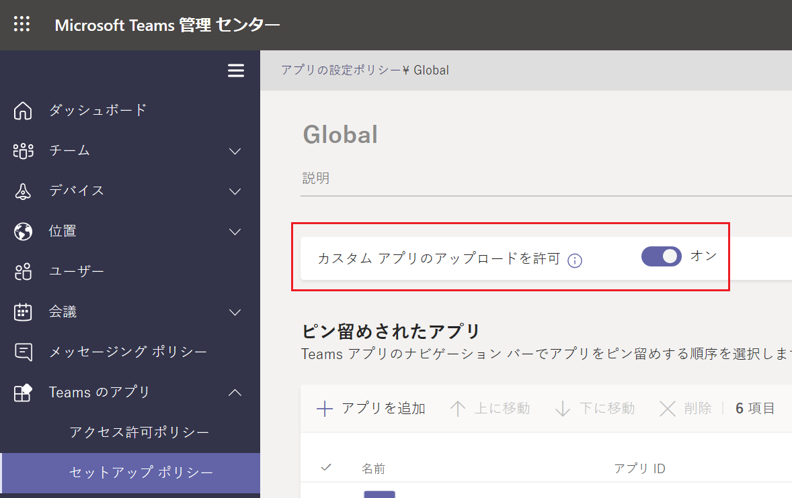

# Microsoft Teams 開発者向け簡易チュートリアル
## 概要
このチュートリアルは、これから Microsoft Teams 向けのアプリケーションの開発を行う初学者のための簡易的なものであり、実際の開発に取り掛かるまでの学習期間の短縮を目的としています。

ここで紹介するのは以下の内容です。
* 開発で使用する Microsoft Teams の特徴的な機能 
* 上記それぞれの概念
* 上記それぞれのアプリケーションの実装方法

チュートリアルとして開発方法を説明するのは Microsoft Teams の以下の機能です。
* タブ
* ボット
* コネクタ
* メッセージ拡張

## 要件
このチュートリアルを実施するには以下の環境が必要です。

* **Microsoft Office 365 Business Premium 以上の[ライセンス](https://products.office.com/ja-JP/compare-all-microsoft-office-products-b?tab=2)**

    ライセンスを持っていない開発者は [Office 365 開発者プログラム](https://developer.microsoft.com/ja-JP/office/dev-program
)に参加して開発者用の無料の Office 365 のサブスクリプションを入手することもできます。このサブスクリプションでは [Office 365 Enterprise E3 Developer](https://docs.microsoft.com/ja-jp/office/developer-program/office-365-developer-program-get-started) が 90 日間無償で使用することができます。このライセンスを開発に積極的に使用している場合は、90 日ごとにサブスクリプションが自動的に更新されます。

    詳しくは以下のドキュメントをご参照ください。

    * [Microsoft 365 開発者プログラムの FAQ - 1 年間のサブスクリプションをなぜ提供しないのですか？](https://docs.microsoft.com/ja-jp/office/developer-program/microsoft-365-developer-program-faq#renew-subscription)

* **Microsoft Teams 管理センターでサイドローディングの許可**

    Microsoft Teams 管理センターにて、開発したアプリケーションがサイドローディングできるように許可を行ってください。
    
    具体的には [Microsoft Teams 管理センター](https://admin.teams.microsoft.com/)のメニュー\[Teams のアプリ\] - \[[セットアップ ポリシー](https://admin.teams.microsoft.com/policies/app-setup/edit/)\] で 「カスタム アプリのアップロードを許可」をオンにします。

    


* **[Visual Studio 2018 以上のエディション](https://visualstudio.microsoft.com/ja/vs/)、もしくは [Visual Studio Code](https://code.visualstudio.com/Download)**

    ボットとメッセージ拡張の開発のチュートリアルで使用します。

    ボットを C# で開発する場合は Visual Studio 201x を JavaScript で開発する場合は Visual Studio Code と [Node.js](https://nodejs.org/en/) をが必要です。

    また、Visual Studio Code を使用する場合は、ローカル環境で Web サーバーを動かすために以下のコマンドを使用して http-server をインストールしてください。

    ```
    npm install http-server -g
    ```

    メッセージング拡張の開発のチュートリアルで使用する Microsoft Teams Toolkit もインストールしておいてください。

    * [Visual Studio Code 用 Microsoft Teams Toolkit](https://marketplace.visualstudio.com/items?itemName=TeamsDevApp.ms-teams-vscode-extension)

    * [Visual Studio 用 Microsoft Teams Toolkit](https://marketplace.visualstudio.com/items?itemName=TeamsDevApp.vsteamstemplate)


* **デスクトップ版 Microsoft Teams**

    アプリケーションの登録を行うにはデスクトップ版の Microsoft Teams が必要です。[Office 365 ポータル](https://www.office.com/?)からインストールしておいてください。

* **[ngrok](https://ngrok.com/download)**

    ローカル環境で動作させた開発中のアプリケーションをインターネットを介して一時的にアクセスできるようにするために使用します。


## 目次
0. [**Microsoft Teams アプリケーション開発について**](Intro.md)

1. [**Microsoft Teams アプリケーションの新規作成**](Ex01.md)
    * [**App Studio を使用したマニフェストファイルの作成**](Tut02.md#app-studio-を使用した-teams-アプリケーションの登録)
2. [**タブ アプリケーション**](Ex02.md)
    * [**パーソナル タブ**](Ex02.md#%E3%82%BF%E3%82%B9%E3%82%AF-1--%E3%83%91%E3%83%BC%E3%82%BD%E3%83%8A%E3%83%AB-%E9%9D%99%E7%9A%84-%E3%82%BF%E3%83%96%E3%81%AE%E8%BF%BD%E5%8A%A0)
    * [**チーム タブ**](Ex02.md#%E3%83%81%E3%83%BC%E3%83%A0-%E6%A7%8B%E6%88%90%E5%8F%AF%E8%83%BD-%E3%82%BF%E3%83%96%E3%81%AE%E8%BF%BD%E5%8A%A0)

    * [**タブ : タスクモジュールの表示**](https://github.com/osamum/Easyway-for-MSTeamsAppDev/blob/master/Ex02.md#タスク-3-タブでのタスク-モジュールの表示)
    
3. [**ボット**](Ex03.md)
    * [**ボットの登録**](https://github.com/osamum/Easyway-for-MSTeamsAppDev/blob/master/Ex03.md#microsoft-teams-へのボットの登録)
4. [**メッセージ拡張**](Ex04.md)
5. [**タブとボットのシングルサインオン**](Ex05.md)
6. [**コネクタ**](Ex06.md)

## 既知の問題
