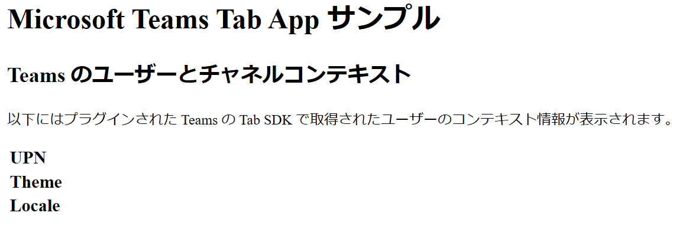
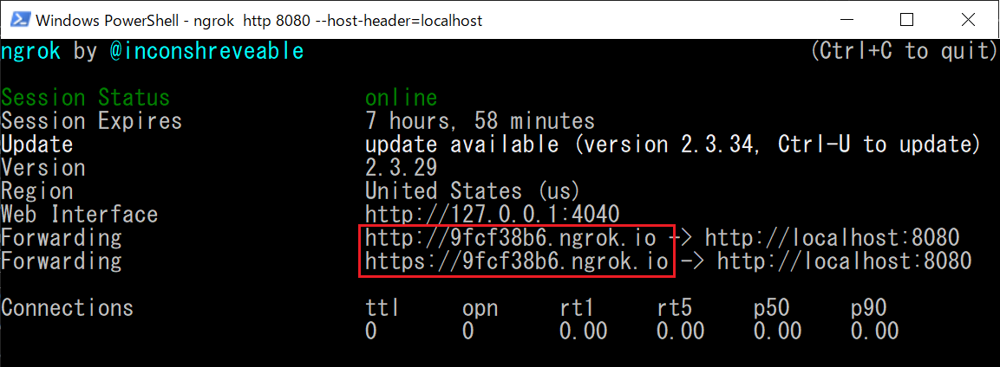

# 演習 2 : タブ アプリケーション
Microsoft Teams のタブは豊富なコンテンツに接続することができます。

タブを使用すると、用途に合わせた適切なツールやサービスをチャネルやプライベートチャットに取り込むことができます。
豊富なダッシュボードとデータビジュアライゼーションの追加、ドキュメントの共同作業、ノートの取得、グループ全体でのタスクの管理、デザインの共有が行えます。

Microsoft Teams のタブには以下の 2 種類のタブがあります。

* **静的タブ**

    パーソナルなスコープのタブです。個々のユーザーをサポートします。

    たとえば、サービスがメモ作成アプリの場合、ユーザーの個人メモを保持するパーソナル タブを追加します。これにより、ユーザーは自分のメモをチーム全体で共有することなく参照できます。

* **構成可能タブ**

    タブはチャネルの一部になり、単一の種類の情報をチームに提供します。構成可能タブには、コンテンツページに加えて構成ページがあります。

## タブのスコープ
Microsoft Teams は、そのスコープに基づいてタブを使用できる場所を決定します。スコープはアプリ マニフェストで設定され、次の値のいずれかになります。
なお、この値は manifest.json 内に設定され App Studio からは見えません。

* **チーム (team)**

    チャネルの一部として、チームのメンバーから共有されます。

    現在、チャネル内のすべてのタブは構成可能なタブです。ユーザーがタブを最初にチャネルに追加するときに、タブエクスペリエンスのコンテンツを構成します。
* **グループ チャット (groupchat)**

    構成可能なタブはグループチャットでも使用できます。これらは、2人以上のユーザー間の会話です。

* **パーソナル (personal)**

    パーソナルスコープのタブを使用すると、ユーザーはプライベートな自分のエクスペリエンスと対話できます。現在、このようなタブはすべて静的タブです。

## Web ページをタブ アプリケーションとして追加するための要件と注意
Microsoft Teams には Web ページをタブとして追加できますが、すべての Web ページがタブに適切に表示できるわけではありません。
カスタムタブ内に読み込まれたページは以下の要件を満たす必要があります。

* **Web ページで iframe での表示を許可**

    多くの標準的な Web ページはコンテンツの盗用やセキュリティのリスクを考慮し iframe での表示を許可していません。

    その場合は [X-Frame-Options](https://developer.mozilla.org/ja/docs/Web/HTTP/X-Frame-Options) および/または [Content-Security-Policy](https://developer.mozilla.org/ja/docs/Web/HTTP/Headers/Content-Security-Policy) ヘッダーを設定して Microsoft Teams のドメインに対してのみ適切な許可を与えます。

* **Web ページで使用されている認証を別の方法で処理**
    
    多くの Web サイトの認証では認証処理をログイン プロバイダーにリダイレクトして行いますが、ログインページはクリックジャッキング攻撃を防止するために iframe でレンダリングされないようになっています。そのため Microsoft Teams のタブ内から Web ページにログインすることはできません。
    これを解決するには[ポップアップを使用するか、トークンを取得する](https://docs.microsoft.com/en-us/microsoftteams/platform/concepts/authentication/auth-flow-tab)ための呼び出しを行います。
    
* **クロスドメイン処理**

    Microsoft Teams クライアントは、タブの読み込み時または通信時に、アプリ マニフェストの静的 [validDomains](https://docs.microsoft.com/en-us/microsoftteams/platform/resources/schema/manifest-schema#validdomains) リストに対してオリジンを検証する必要があるため、[クロスドメイン ナビゲーション](https://docs.microsoft.com/en-us/microsoftteams/platform/concepts/tabs/cross-domain)を異なる方法で処理します。


## パーソナル (静的) タブの追加
パーソナル タブは個々のユーザーをサポートしています。追加したタブを第三者に公開することなく自分だけで使用することができます。

このチュートリアルでは静的な Web ページで [Microsoft Teams JavaScript client SDK](https://docs.microsoft.com/en-us/javascript/api/overview/msteams-client?view=msteams-client-js-latest) を使用して現在のユーザーの簡易的な情報を表示するページ作成し、パーソナル タブとして追加します。


### ユーザーの情報を表示する Web ページの作成

Microsoft Teams にパーソナル タブとして表示する Web ページを作成します。
このページは Teams のタブとして開かれたときだけ現在のユーザーの情報を返します。

具体的な手順は以下のとおりです。

(*) Visual Studio Code で紹介しますが、Visual Studio をお使いの方は、そちらの作業手順に読み替えてください。

1. コマンドプロンプトを起動し、cd コマンドで作業ディレクトリを任意の場所に切り替えます

2. mkdir コマンドを使用してディレクトリ teamsTab を作成します 
    ```
    mkdir teamsTab
    ```
3. cd コマンドを使用して、作業ディレクトリを teamsTab に切り替えます 
    ```
    cd teamsTab
    ```

4. 以下のコマンドを使用して Visual Studio Code を起動します。 
    ```
    code .
    ```
5. Visual Studio Code のメニュー [File] - [New File] クリックします。

6. メニュー [File] - [Save As...] クリックし、ファイルを index.html という名前で保存します。(※ファイルを保存する際、保存ダイアログボックスで \[ファイルの種類] を HTML を指定するようにしてください )

7. Visual Studio Code で開かれている index.html に以下の内容をコピーして貼り付けます。
    ```
    <!DOCTYPE html>
    <html>
    <head>
        <meta charset="utf-8" />
        <title>Teams Tab App Sample</title>
        <style>
            table {
                font-weight: bold;
                font-size: 20px;
            }
            .context-data {
                color:blue;
            }
        </style>
    </head>
    <body>
    <!-- Microsoft Teams JavaScript API (via CDN) -->
    <script src="https://unpkg.com/@microsoft/teams-js@1.3.4/dist/MicrosoftTeams.min.js" integrity="sha384-3zTjxw3msc6gKx3DseSU0lfRM129YrFjr2xgocfMIN/kBCdzJ88d+FSB1n3scUku" crossorigin="anonymous"></script>
    <script>
        let $id = (id) => { return document.getElementById(id); }
        //microsoftTeams クラスの初期化
        microsoftTeams.initialize();
      
        //DOM がロードされてから
        document.addEventListener('DOMContentLoaded', () => {
            //Microsoft Teams のユーザーコンテキストを取得
            microsoftTeams.getContext((context) => {
                $id('showUpn').innerText = context.upn;
                $id('showObjectId').innerText = context.userObjectId;
                $id('showTheme').innerText = context.theme;
                $id('showLocale').innerText = context.locale;
            });
        })
    </script>

        <h1>Microsoft Teams Tab App サンプル</h1>
        <h2>Teams のユーザーとチャネルコンテキスト</h2>
        <p>以下にはプラグインされた Teams の Tab SDK で取得されたユーザーのコンテキスト情報が表示されます。 </p>
        <table>
            <tr><td>UPN</td><td id="showUpn" class="context-data"></td></tr>
            <tr><td>userObjectId</td><td id="showObjectId" class="context-data"></td></tr>
            <tr><td>Theme</td><td id="showTheme" class="context-data"></td></tr>
            <tr><td>Locale</td><td id="showLocale" class="context-data"></td></tr>
        </table>
        </body>
    </html>
    ```
    [Ctrl] + [S] キーを押下して変更を保存します。

8. Visual Studio Code のメニュー [Terminal] - [New Terminal] をクリックします。

9. 画面下部にターミナルウインドウが表示されるので、同ウィンドウ内で以下のコマンドを実行してシェルを Command Prompt に変更します。
    ```
    cmd
    ```
10. ターミナルウインドウで以下のコマンドを実行します。
    ```
    http-server
    ```
    もし、http-server が起動しない場合は Readme の \[[要件](Readme.md#要件)] の内容を確認してください。

11. Web ブラウザーを起動し、以下の URL にアクセスします。
    ```
    http://127.0.0.1:8080/index.html
    ```
    以下の内容が表示されることを確認してください。
    

    Teams のタブでロードされていないので、ユーザーの情報がロードされていません。

### インターネットへのトンネリング
ローカルで動作している Web サーバーに Microsoft Teams がアクセスできるよう、ngrok を使用してトンネリングをおこないます。

1. コマンドプロンプトを起動し、cd コマンドで作業ディレクトリを ngrok.exe が配置されているディレクトリに切り替えます。

     もし、ngrok をインストールしていない場合は Readme の \[[要件](Readme.md#要件)] の内容を確認してください。

2. 以下のコマンドを実行して cmd にシェルを切り替えます。
    ```
    cmd
    ```

3. 以下のコマンドを実行します。
    ```
    ngrok http 8080 --host-header=localhost
    ```
4. エコーされた内容の Foewarding の横に表示された **https** のドメイン名を使用してアクセスします。

    

    たとえば、ngrok から返されたドメイン名が https://9fcf38b6.engrok.io だった場合は以下の URL でインターネットからローカルの default.html にアクセスすることができます。 

    https://9fcf38b6.engrok.io/index.html

    ローカル アドレスでアクセスしたさいと同じコンテンツが表示されることを確認してください。

ここまでの手順で、作成した Web ページに Microsoft Teams からアクセスできるようになのました。

### Teams パーソナルタブとして追加
ローカル環境でホストされている Web コンテンツを Microsoft Teams にパーソナル タブとして追加します。

手順は以下のとおりです。

1. Microsoft Teams で App Studio を起動します。

2. アプリの一覧から [演習 1](Tut01.md) で登録したアプリ **My first app** のタイルをクリックして設定画面を開きます。

3. App Studio の左側のツリーメニュー \[2 Capabilities] - \[Tabs] をクリックします。

4. 右側に **Tabs** の画面が表示されるので、ラベル **Add a personal tab** の下の \[**Add**] ボタンをクリックします。

5. **Personal tab** の設定ダイアログボックスが表示されるので、各項目を以下のように設定します。  

    |項目|値|
    |---|---|
    | *Name | MyPersonalTab |
    | *Entity ID | mypersonaltab |
    | *Content URL | ngrok でホストされている URL |
    | Website URL | 入力なし |

6. \[Save] ボタンをクリックして保存します。

7. App Studio の左側のツリーメニュー \[3 Finish] - \[Test ans distribute] をクリックします。

8. **Test and Distribute** の画面が表示されるので同画面の \[Install] ボタンをクリックします。

9. **My first app** のダイアログボックスが表示されるので \[追加] ボタンをクリックします。

Teams 内にタブとして作成した Web ページが表示され、現在 Teams を使用しているユーザーの情報が表示されていることを確認してください。

\<参考>

* [**Get context for your Microsoft Teams tab**](https://docs.microsoft.com/en-us/microsoftteams/platform/concepts/tabs/tabs-context)


## 目次
1. [**Microsoft Teams アプリケーション開発について**](Tut01.md)
2. [**Microsoft Teams アプリケーションの新規作成**](Tut02.md)
    * [App Studio を使用したマニフェストファイルの作成](Tut02.md#app-studio-を使用した-teams-アプリケーションの登録)
3. [**タブ アプリケーション**](Tut03.md)
    * パーソナル タブ
    * チーム タブ
    * タブ アプリケーションのシングルサインオン
4. [**ボット**](Tut04.md)
    * ボットの登録
    * Teams Bot Builder SDK を使用した拡張
5. [**メッセージ拡張とメッセージアクション**](Tut05.md)
6. [**コネクタ**](Tut06.md))

