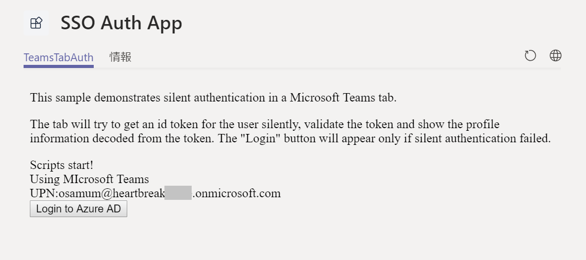
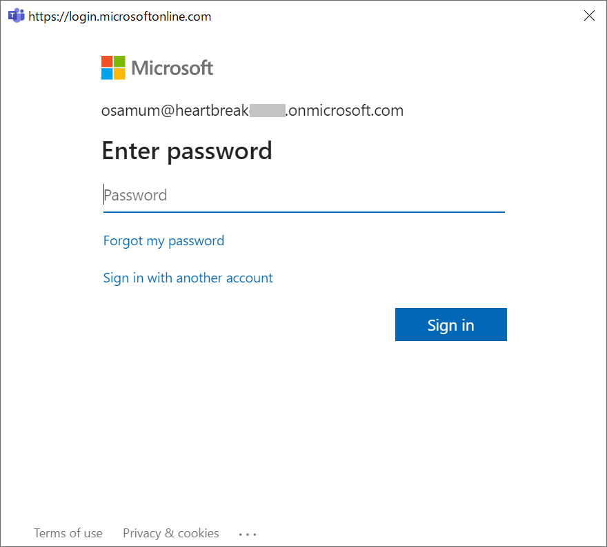

# タブとボットのシングルサインオン
GitHub に用意されているサンプル プロジェクトを使用して Microsoft Teams のタブ アプリケーションとボットにシングルサインオン (Single Singon : SSO) を設定します。

## サンプル プロジェクトの入手
GitHib リポジトリ [**OfficeDev/microsoft-teams-sample-auth-node**](https://github.com/OfficeDev/microsoft-teams-sample-auth-node) からサンプル プロジェクトを Clone するか zip ファイルとして入手します。

なお、サンプル プロジェクトは JavaScript で記述されており Node.js で動作します。

サンプルプロジェクトの具体的な入手方法は以下の通りです。

* **Clone (※ [**git**](https://git-scm.com/downloads) がインストールされている必要があります)**
    
    コマンドプロンプトで任意のディレクトリに移動して以下のコマンドを実行します。

    `git clone https://github.com/OfficeDev/microsoft-teams-sample-auth-node.git`

* **zip ファイルとして入手**

    サンプルの[**リポジトリ**](https://github.com/OfficeDev/microsoft-teams-sample-auth-node)にアクセスして緑色の \[**Clone  or download**\] ボタンをクリック

    表示されたダイアログボックスの \[**Download ZIP**\] ボタンをクリックします。

    

    ダウンロードされた zip ファイルの内容を任意のフォルダに展開してください。

## サンプル プロジェクトの準備

サンプル プロジェクトが必要とするさまざまなモジュールをダウンロードしてインストールします。この作業は **npm** コマンドを使用して一括して行われます。

手順は以下のとおりです。

1. コマンドプロンプトを起動し、作業ディレクトリをダウンロードしたプロジェクトのフォルダ **microsoft-teams-sample-complete-node** に切り替えます。

2. 以下のコマンドを実行します。
    ```
    npm install
    ```
    プロジェクトのビルドや実行に必要となるモジュールがダウンロードされるので完了するまで待ちます。

3. 以下のコマンドを実行して Visual Studio Code 起動します。

    ```
    code .
    ```
4. Visual Studio Code のメニュー\[**Debug**\] - \[**Start Debugging**\] をクリックするか、キーボードの \[**F5**\] キーを押下してデバック実行を開始します。

    画面下部にターミナルウィンドウが表示され以下のメッセージが最後に表示されれはプロジェクトを動かす準備は完了です。
    ```
    Express server listening on port 3978

    Server running successfully
    ```
    起動の確認ができたら \[**Debug**\] - \[**Stop Debugging**\] をクリックするか、キーボードの \[**Shift**\] + \[**F5**\] キーを押下してデバック実行を終了します。

## サンプル プロジェクトのアプリケーション登録

入手したサンプルプロジェクトを Microsoft Teams にアプリケーションとして登録します。
演習 3 の内容を参考にしてボット アプリケーションとして登録してください。

こうすることで、Azure AD 上にアプリケーションの登録が自動で行われます。

なお、ここで行う作業はあくまでもボットアプリケーションの登録のみで、インストールは行わないでください。

## Azure AD へのアプリケーションの登録
前の手順てサンプル プロジェクトが Azure AD (Active Directory) にアプリケーションとして登録されているので認証処理を有効にするための設定を行います。

**なお、この方法は Microsoft Azure のサブスクリプションを持っていなくても Office 365 のサブスクリプションがあれば行うことできます。**

手順は以下のとおりです。

### アプリケーションの Azure AD への登録
1. Azure のポータル(https://portal.azure.com/)にログインします。

2. 左のメニューより \[**Azure Active Directory**\] を選択します。

3. 新たに表示されたAzure AD のブレードより \[**アプリの登録**\] をクリックし、画面上の \[**+新規登録**] ボタンをクリックします。

4. \[**アプリケーション登録**\] ペインが表示されるので各項目を以下のよう設定して \[登録\] ボタンをクリックします。

    |項目|値|
    | ---- | ---- |
    |名前|任意のもの|
    |サポートされているアカウントの種類|任意の組織のディレクトリ内のアカウントと、個人用の Microsoft アカウント (Skype、Xbox、Outlook.com など)
    |リダイレクト URI (省略可能)|https://ngrok のドメイン名/tab-auth/silent-end

5. 登録したアプリケーションが一覧に表示されるので、選択して、左側のブレードの \[**認証**\] をクリックします。

6. 表示されたペイン内の以下のチェックボックスにチェックし、画面上の \[**保存**\] ボタンをクリックして保存します。

    * **アクセス トークン**
    * **ID トークン**

7. 左側のブレードの \[**証明書とシークレット**\] をクリックします。

8. \[**+新しいクライアント シークレット**\] ボタンをクリックすると、\[**クライアント シークレットの追加**\] ダイアログボックスが表示されるので、項目を以下のように設定します。

    |項目|値|
    | ---- | ---- |
    | 説明 | Forever |
    |有効期限|なし|

9. \[**追加**\] ボタンをクリックして保存します。

10. 左側のブレードの \[**API のアクセス許可**\] をクリックします。

11. 画面右側に \[API のアクセス許可\] ペインが表示されるので \[ **+ アクセス許可の追加**\] ボタンをクリックします。

12. 画面右に \[API アクセス許可の要求\] ブレードが表示されるので、同ブレード内の \[**所属している組織で使用している API**\] リンクをクリック

13. API を公開しているアプリの一覧から **Microsoft Graph** をクリックします。

14. 項目 \[アプリケーションに必要なアクセス許可の種類\] で \[**委任されたアクセス許可**\] ボタンをクリックします。 

15. 項目 \[アクセス許可を選択する\] にアクセス許可の一覧が表示されるので、**User.Read** のチェックボックスにチェックをつけ \[**アクセス許可の追加**\] ボタンをクリックします。

以上でアプリケーションの Azure AD への登録は完了です。

次に、アプリケーション側に Azure AD でのクライアント ID を設定します。
手順は以下の通りです。

### アプリケーションのへの Azure AD クライアント ID 設定
1. Azure ポータルで、Azure AD に登録したアプリケーションの \[**概要**\] を表示します。

2. 同ペイン内の \[**アプリケーション(クライアント)ID**] の内容をコピーし、メモ帳などにはりつけます。

3. Visual Studio Code でサンプルアプリケーションを開きます。

4. サンプルアプリケーションのプロジェクト内、**./src/views/tab-auth** ディレクトリ配下にあるファイル **silent.hbs**、**silent-start.hbs**、**silent-end.hbs** のコードを編集します。

    各ファイル中のコード内の **{{appId}}** を手順 2 でコピーした Azure AD のクライアント ID に書き換えます。

5. Visual Studio Code のメニュー\[**Debug**\] - \[**Start Debugging**\] をクリックするか、キーボードの \[**F5**\] キーを押下してデバック実行を開始します。

6. Web ブラウザーから以下の URL にアクセスします。
    ```
    http://127.0.0.1:3978/tab-auth/silent
    ```
    以下のページが表示されれば正常に動作しています。

    

## インターネットへのトンネリング
上の手順で動作しているサンプル アプリケーションを Microsoft Teams にタブ アプリケーションとして登録します。

ローカル環境で動作するサンプル アプリケーションを Microsoft Teams にタブとして追加するには、ngrok を使用してインターネットへのトンネリングを構成します。

手順は以下の通りです。

1. コマンドプロンプトを起動し、以下のコマンドを実行してシェルを cmd.exe に切り替えます。

    ```
    cmd
    ```

2. 作業ディレクトリを ngrok.exe のあるディレクトリに切り替え以下のコマンドを実行します。

    ```
    ngrok http 3978 --host-header=localhost
    ```
3. ローカル環境でサンプル アプリケーションが動作している状態で、Web ブラウザーから ngrok が返す https のドメイン名を使用して以下のようにアクセスします。

    ```
    https://ngrokが返したランダムな数字.ngrok.io/tab-auth/silent
    ```

    ローカルアドレスで接続したのと同じページが表示されれば完了です。


## Microsoft Teams へタブ アプリとして登録
Web ページとして表示されているサンプル アプリケーションを Microsoft Teams にプライベート タブとして追加します。

具体的な登録の手順は以下を参考に行ってください。

* [**タスク 1 : パーソナル (静的) タブの追加**](https://github.com/osamum/Easyway-for-MSTeamsAppDev/blob/master/Tut03.md#%E3%82%BF%E3%82%B9%E3%82%AF-1--%E3%83%91%E3%83%BC%E3%82%BD%E3%83%8A%E3%83%AB-%E9%9D%99%E7%9A%84-%E3%82%BF%E3%83%96%E3%81%AE%E8%BF%BD%E5%8A%A0)

サンプル アプリケーションのページがパーソナルタブとして Microsoft Teams に追加されると、最初に以下のページが表示されます。

 

UPN は [Microsoft Teams client SDK](https://docs.microsoft.com/en-us/javascript/api/overview/msteams-client?view=msteams-client-js-latest) で取得されたものであり、これらの情報はログイン ヒントで使用されますが、サンプル アプリケーションを使用してログインしたことを示すものではありません。

サンプル アプリケーションでログインを行うには、ページ内の \[**Login to Azure AD**\] ボタンをクリックします。

ユーザー Id が設定された状態でログイン ダイアログボックスが表示されるのでパスワードを入力して \[**Sign in**\] ボタンをクリックします。



ログイン処理が正しく完了すると \[Login to Azure AD\] ボタンは消え、ログインしたユーザーの **Object Id** が表示されます。

また、ページを再表示した場合でも \[Login to Azure AD\] ボタン が表示されず、ユーザーの **Object Id** が取得されていることを確認してください。


## 目次
1. [**Microsoft Teams アプリケーション開発について**](Tut01.md)
2. [**Microsoft Teams アプリケーションの新規作成**](Tut02.md)
    * [App Studio を使用したマニフェストファイルの作成](Tut02.md#app-studio-を使用した-teams-アプリケーションの登録)
3. [**タブ アプリケーション**](Tut03.md)
    * [パーソナル タブ](Tut03.md#%E3%82%BF%E3%82%B9%E3%82%AF-1--%E3%83%91%E3%83%BC%E3%82%BD%E3%83%8A%E3%83%AB-%E9%9D%99%E7%9A%84-%E3%82%BF%E3%83%96%E3%81%AE%E8%BF%BD%E5%8A%A0)
    * [チーム タブ](Tut03.md#%E3%83%81%E3%83%BC%E3%83%A0-%E6%A7%8B%E6%88%90%E5%8F%AF%E8%83%BD-%E3%82%BF%E3%83%96%E3%81%AE%E8%BF%BD%E5%8A%A0)
    
4. [**ボット**](Tut04.md)
    * ボットの登録
    * Teams Bot Builder SDK を使用した拡張
5. [**タブとボットのシングルサインオン**](Tut05.md)
6. [**メッセージ拡張とメッセージアクション**](Tut06.md)
7. [**コネクタ**](Tut07.md)


