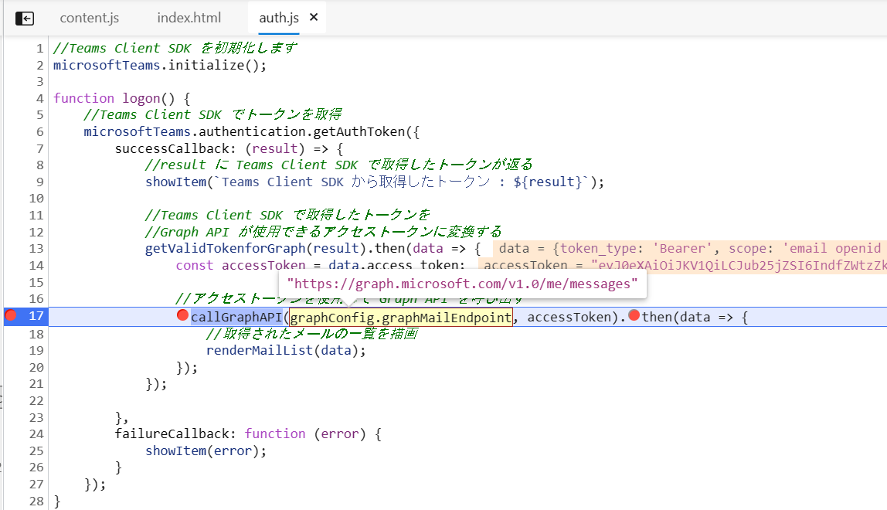

# Teams タブ アプリとしてロードされた Web ページのデバッグ

Web ページを Microsoft Teams のタブ アプリとして追加する際、ほとんどの場合 [**Microsoft Teams Client JavaScript SDK**](https://docs.microsoft.com/en-us/javascript/api/overview/msteams-client?view=msteams-client-js-latest) を使用することになります。

この SDK から提供される機能は、Teams のタブ アプリとして動作した場合にしか動作しないので、単に目的のページの URL を Web ブラウザーで表示しただけではデバッガをアタッチして任意のコード位置にブレークポイントを設定してステップ実行しながら変数の内容を確認する、といったようなデバッグを行うことはできません。

また、Teams のデスクトップ クライアントにロードされた状態で行う方法についても情報が公開されていません。

Microsoft Teams のタブ アプリとして追加された Web ページ内のコードをデバッグするには、Teams クライアントの Web UI を使用します。

具体的な手順は以下のとおりです。なお、同手順で使用する Web ブラウザーは Microsoft Edge を前提としています。

1. Web ブラウザーから以下の URL にアクセスします。

    ```
    https://teams.office.com/
    ```

    Microsoft Edge を使用している場合、メニュー \[**・・・**\]\(設定など　\[Alt\] + \[F\])をクリックし、\[**アプリ**\]-\[**このサイトをアプリとしてインストール**\] を選択して登録しておくと便利です。

2. Microsoft Teams にログインし、デバッグ対象の Teams タブ アプリを表示します

3. キーボードの \[**F12**\] キーを押下して Web ブラウザーの開発者ツールを起動し、画面上部のメニューバーから \[**ソース**\] をクリックします

4. 画面左側にアクティブになっているページのツリー構造が表示されるので、**embedded-page-container(*ページ名*)** のノードを探します

5. 同ノードを展開すると ngrok の返した(Web ページをホストしている)ドメイン名のノードがあるので、展開し、目的のファイルを選択します

    

6. 画面右側に表示される任意のコードの位置にブレークポイントを設定し、Teams タブ アプリで操作を行うと実行を中断させステップ実行 (\[F11]キー)などを行うことができます

    

    もし、ソースコードを変更してもページに変更内容が反映されない場合は、開発者ツールのメニュー \[**ネットワーク**\] をクリックし、\[**キャッシュを無効にする**\] にチェックがついているかを確認してください。

    


ここまでの手順で Web ブラウザーの開発者ツールを使用してタブ アプリとしてロードされた Web ページのデバッグができるようになりました。

Microsoft Edge の開発者ツールについての詳細については以下のドキュメントをご参照ください。

- [**Microsoft Edge開発者ツールの概要**](https://docs.microsoft.com/ja-jp/microsoft-edge/devtools-guide-chromium/)


<br>


# Visual Studio Code での Node.js アプリケーションのデバッグ

Visual Studio Code から、プロセスに Node.js のデバッガをアタッチしてサーバーサイド側をデバッグ実行することができます。

手順は以下のとおりです。

1. Visual Studio Code の左側の \[エクスプローラー\] ビューで、index.js 等のサーバーサイドで動作するコードのファイル中のデバッグ箇所にブレークポイントを設定します

2. 画面左のメニューで \[**実行とデバッグ(Ctrl + Shift + D)**\] メニューボタン (※虫と再生ボタンが重なったデザインのアイコン)をクリックし、表示されたブレード上の\[**実行とデバッグ**\] ボタンをクリックします

    

3. アタッチするデバッガーのリストがドロップダウンリストに表示されるので、**Node.js** を選択します

    

上記の手順でデバッガがアタッチされたホストプロセスが起動し、Node.js アプリケーションのデバッグ実行が可能になります。


Visual Studio Code を使用した Node.js アプリケーションの開発とデバッグ方法についての詳細は、以下のドキュメントをご参照ください。

- [**Visual Studio Code を使用して Node.js の開発とデバッグを行う方法**](https://docs.microsoft.com/ja-jp/azure/developer/javascript/how-to/with-visual-studio-code/install-run-debug-nodejs)

<br>

## 目次
0. [**Microsoft Teams アプリケーション開発について**](../Intro.md)

1. [**Microsoft Teams アプリケーションの新規作成**](../Ex01.md)
    * [**App Studio を使用したマニフェストファイルの作成**](../Ex01.md#app-studio-を使用した-teams-アプリケーションの登録)
    * [**Microsoft Teams 用 開発者ポータルを使用した Teams アプリケーションの登録**](../Ex01.md#microsoft-teams-%E7%94%A8-%E9%96%8B%E7%99%BA%E8%80%85%E3%83%9D%E3%83%BC%E3%82%BF%E3%83%AB%E3%81%AE%E4%BD%BF%E7%94%A8)
    
2. [**タブ アプリケーション**](../Ex02.md)
    * [**パーソナル タブ**](../Ex02.md#%E3%82%BF%E3%82%B9%E3%82%AF-1--%E3%83%91%E3%83%BC%E3%82%BD%E3%83%8A%E3%83%AB-%E9%9D%99%E7%9A%84-%E3%82%BF%E3%83%96%E3%81%AE%E8%BF%BD%E5%8A%A0)
        * [**App Studio を使用した方法**](../Ex02.md#app-studio-%E3%82%92%E4%BD%BF%E7%94%A8%E3%81%97%E3%81%9F%E3%83%91%E3%83%BC%E3%82%BD%E3%83%8A%E3%83%AB-%E3%82%BF%E3%83%96%E3%81%AE%E8%BF%BD%E5%8A%A0)
        * [**Microsoft Teams 用 開発者ポータルを使用した方法**](../Ex02.md#microsoft-teams-%E7%94%A8-%E9%96%8B%E7%99%BA%E8%80%85%E3%83%9D%E3%83%BC%E3%82%BF%E3%83%AB-%E3%82%92%E4%BD%BF%E7%94%A8%E3%81%97%E3%81%9F%E3%83%91%E3%83%BC%E3%82%BD%E3%83%8A%E3%83%AB-%E3%82%BF%E3%83%96%E3%81%AE%E8%BF%BD%E5%8A%A0)


    * [**チーム タブ**](../Ex02.md#%E3%82%BF%E3%82%B9%E3%82%AF-2--%E3%83%81%E3%83%BC%E3%83%A0-%E6%A7%8B%E6%88%90%E5%8F%AF%E8%83%BD-%E3%82%BF%E3%83%96%E3%81%AE%E8%BF%BD%E5%8A%A0)
        * [**App Studio を使用した方法**](../Ex02.md#app-studio-%E3%81%A7%E3%81%AE%E3%83%81%E3%83%BC%E3%83%A0-%E3%82%BF%E3%83%96%E3%81%AE%E8%BF%BD%E5%8A%A0)
        * [**Microsoft Teams 用 開発者ポータルを使用した方法**](../Ex02.md#microsoft-teams-%E7%94%A8-%E9%96%8B%E7%99%BA%E8%80%85%E3%83%9D%E3%83%BC%E3%82%BF%E3%83%AB-%E3%82%92%E4%BD%BF%E7%94%A8%E3%81%97%E3%81%9F%E3%83%91%E3%83%BC%E3%82%BD%E3%83%8A%E3%83%AB-%E3%82%BF%E3%83%96%E3%81%AE%E8%BF%BD%E5%8A%A0)

    * [**タブ : タスクモジュールの表示**](../Ex02.md#%E3%82%BF%E3%82%B9%E3%82%AF-3-%E3%82%BF%E3%83%96%E3%81%A7%E3%81%AE%E3%82%BF%E3%82%B9%E3%82%AF-%E3%83%A2%E3%82%B8%E3%83%A5%E3%83%BC%E3%83%AB%E3%81%AE%E8%A1%A8%E7%A4%BA)

        * [**外部の HTML フォームをタスクモジュールとしてタブに追加**](../Ex02.md#%E3%82%BF%E3%82%B9%E3%82%AF-3-1--%E5%A4%96%E9%83%A8%E3%81%AE-html-%E3%83%95%E3%82%A9%E3%83%BC%E3%83%A0%E3%82%92%E3%82%BF%E3%82%B9%E3%82%AF%E3%83%A2%E3%82%B8%E3%83%A5%E3%83%BC%E3%83%AB%E3%81%A8%E3%81%97%E3%81%A6%E3%82%BF%E3%83%96%E3%81%AB%E8%BF%BD%E5%8A%A0)

        * [**アダプティブ カードをタスクモジュールとしてタブに追加**](../Ex02.md#%E3%82%BF%E3%82%B9%E3%82%AF-3-2--actibity-card-%E3%82%92%E3%82%BF%E3%82%B9%E3%82%AF%E3%83%A2%E3%82%B8%E3%83%A5%E3%83%BC%E3%83%AB%E3%81%A8%E3%81%97%E3%81%A6%E3%82%BF%E3%83%96%E3%81%AB%E8%BF%BD%E5%8A%A0)
    
    * [**タブのシングルサインオン(SSO)**](../Ex02-SSO.md)

    
3. [**ボット**](../Ex03.md)
    * [**ボットの登録**](Ex03.md#%E3%83%9C%E3%83%83%E3%83%88%E3%81%AE%E7%99%BB%E9%8C%B2)
    * [**App Studio を使用したボットの追加**](../Ex03.md#app-studio-%E3%82%92%E4%BD%BF%E7%94%A8%E3%81%97%E3%81%9F%E3%83%9C%E3%83%83%E3%83%88%E3%81%AE%E8%BF%BD%E5%8A%A0)
    * [**Microsoft Teams 用 開発者ポータルを使用したボットの追加**](../Ex03.md#microsoft-teams-%E7%94%A8-%E9%96%8B%E7%99%BA%E8%80%85%E3%83%9D%E3%83%BC%E3%82%BF%E3%83%AB%E3%82%92%E4%BD%BF%E7%94%A8%E3%81%97%E3%81%9F%E3%83%9C%E3%83%83%E3%83%88%E3%81%AE%E8%BF%BD%E5%8A%A0)
    
4. [**メッセージング拡張**](../Ex04.md)
    * [**検索機能の実装**](../Ex04.md#%E3%82%BF%E3%82%B9%E3%82%AF-1--%E3%83%A1%E3%83%83%E3%82%BB%E3%83%BC%E3%82%B8%E3%83%B3%E3%82%B0%E6%8B%A1%E5%BC%B5---wikipedia-%E6%A4%9C%E7%B4%A2%E6%A9%9F%E8%83%BD%E3%81%AE%E5%AE%9F%E8%A3%85)
    * [**操作機能の実装**](../Ex04.md#%E3%82%BF%E3%82%B9%E3%82%AF-2--%E3%83%A1%E3%83%83%E3%82%BB%E3%83%BC%E3%82%B8%E3%83%B3%E3%82%B0%E6%8B%A1%E5%BC%B5---%E6%93%8D%E4%BD%9C%E3%82%A2%E3%82%AF%E3%82%B7%E3%83%A7%E3%83%B3%E3%82%B3%E3%83%9E%E3%83%B3%E3%83%89%E3%81%AB%E3%82%88%E3%82%8B%E5%A4%96%E9%83%A8%E3%82%B5%E3%83%BC%E3%83%93%E3%82%B9%E3%81%AE%E9%80%A3%E6%90%BA)
    
5. [**タブとボットのシングルサインオン**](../Ex05.md)
6. [**コネクタ**](../Ex06.md)
    * [**受信 Webhook を利用したチャネルへの通知**](../Ex06.md#%E3%82%BF%E3%82%B9%E3%82%AF-1--incomming-webhook-%E3%82%92%E5%88%A9%E7%94%A8%E3%81%97%E3%81%9F%E3%83%81%E3%83%A3%E3%83%8D%E3%83%AB%E3%81%B8%E3%81%AE%E9%80%9A%E7%9F%A5)
    * [**送信Webhook を利用した外部サービスの呼び出し**](../Ex06.md#%E3%82%BF%E3%82%B9%E3%82%AF-2--%E9%80%81%E4%BF%A1outgoing-webhook-%E3%82%92%E5%88%A9%E7%94%A8%E3%81%97%E3%81%9F%E5%A4%96%E9%83%A8%E3%82%B5%E3%83%BC%E3%83%93%E3%82%B9%E3%81%AE%E5%91%BC%E3%81%B3%E5%87%BA%E3%81%97)

