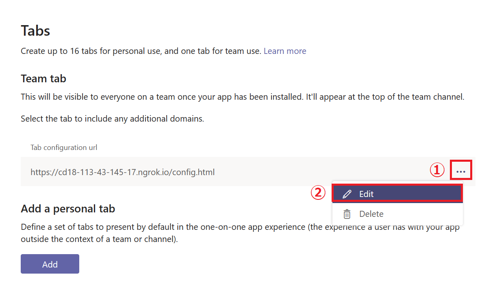
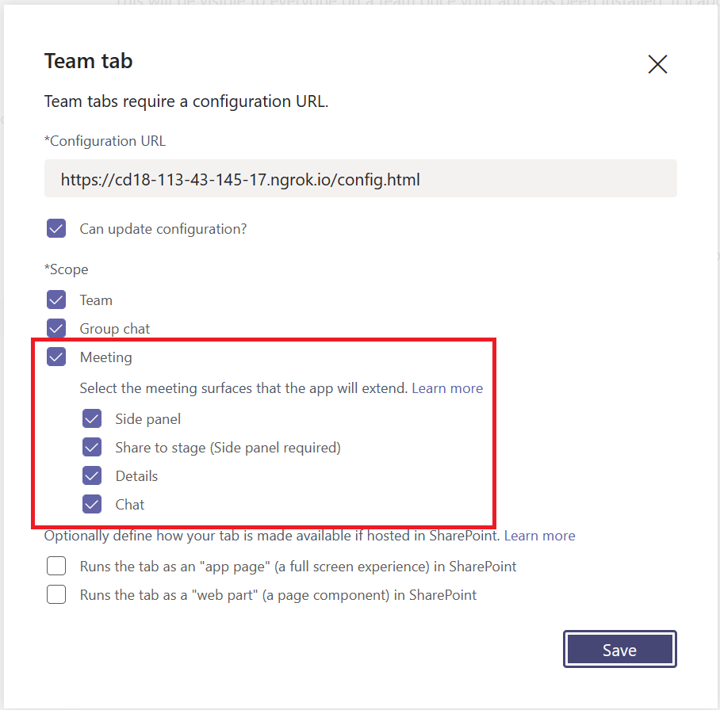
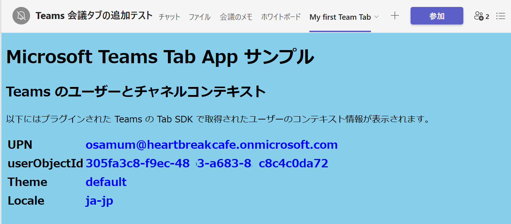
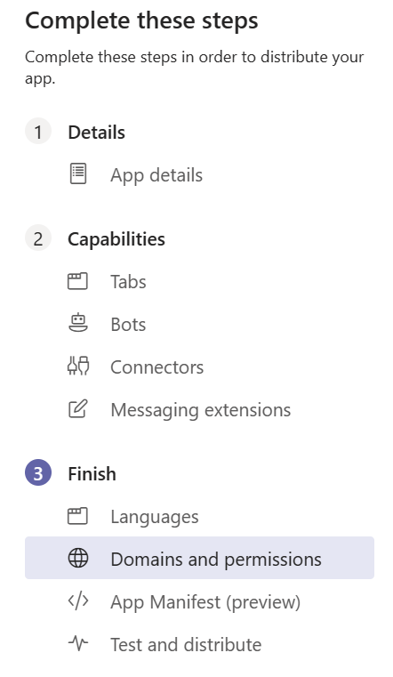

# App Studio について
App Studio は Microsoft Teams のアプリケーションで、アプリマニフェストを含むアプリ パッケージの作成を GUI で行うためのツールです。


App Studio はアプリ パッケージを作成するだけでなく以下の機能も提供します。

1. **ワン クリック サイドロード**
2. **Bot Framework (dev.botframework.com) のボットの認証と設定管理を統合**
3. **アダプティブカードのコードのレビュー**
4. **Microsoft Teams アプリで使用可能なコードレビュー (React の jsx)**

## App Studio のインストール
App Studio は既定の状態では Microsoft Teams にインストールされていないので、App Source から検索してインストールする必要があります。

App Studio のインストール手順は以下のとおりです。

1. Microsoft Teams 起動します。

2. 左側のメニューバーの下から 2 番目にあるメニュー \[アプリ\] をクリックします。

3. Microsoft Teams にインストールすることのできるアプリの一覧画面が表示されるので、その中から選択するか、同画面の左上の \[すべてを検索] ボックスで検索を行います。

4. App Studio のタイルをクリックし、\[チームに追加] ボタンをクリックしてインストールします。 

## App Studio を使用した Teams アプリケーションの登録
ここでは App Studio を使用して、演習として **My first App** というアプリを登録します。

App Studio でアプリの登録を行うには以下の手順を実行します。

1. Microsoft Teams の左端のメニュー \[・・・]\(「さらに追加されたアプリ」) をクリックし、App Studio を選択
2. App Studio の画面に切り替わるので、同画面の上部メニュー \[**Manifest editor**] をクリック
3. 「Welcome」と書かれたボックスの中の \[Create a new app] ボタンをクリック
4. Manifest Editor の画面が表示されるので、**App detail** 内の項目を以下のように設定します。

    なお * のついている項目は必須項目です。

    ### **App Names**

    アプリの名前を指定します。\[Short name](30 文字以下) の指定が必須です。

    |項目|値|
    |---|---|
    | *Short name | **My first app** |
    | Long Name | **My first application for Microsoft Teams** |

    ### **Identification**

    \[App ID] にはアプリの ID を指定します。ID はユニークな GUID である必要があります。

    \[Package Name] には逆引きドメイン表記でこのアプリケーションの一意の識別子を指定します。たとえば、com.example.myapp です。

    |項目|値|
    | ---- | ---- |
    |*App ID|**\[Generate] ボタンをクリックして生成**|
    |*Package Name|**com.example.myfirstapp**|
    |*Varsion|**1.0.0**|

    ### **Descriptions**
    アプリの \[Short description]\(短い説明) と\[Long description]|\(長い説明) の両方を含めます。短い説明は 80 文字以下で、長い説明と同じものを指定することはできません。

    |項目|値|
    | ---- | ---- |
    |*Short description|**My first Application**|
    |*Long description|**My first application in Microsoft Teams easy tutorial**|

    ### **Developer information**
    \[Name] と \[Web Site] を入力します。Web サイトが有効な https URL であることを確認します。

    |項目|値|
    | ---- | ---- |
    |*Name|**Tutrial Developer**|
    |*Web Site|**https://example.com**|

    ### **Partner information**
    必要に応じて、アプリを構築するパートナー組織の Microsoft パートナー ネットワーク ID を提供します。

    |項目|値|
    | ---- | ---- |
    |MPN ID|**規定値のまま**|

    ### **App URLs**
    プライバシーに関する声明および利用規約へのリンクを提供します。

    今回はダミーの URL を使用しますが、実際にアプリケーションの開発を行う際には必ずページを用意し正しい URL を指定してください。

    |項目|値|
    | ---- | ---- |
    |*Privacy statement|**https://example.com/privacy**|
    |*Terms of use|**https://example.com/termofuse**|

    ### **Branding** ###
    1 つのフルカラー アイコン (192x192) と 1 つの透明なアウトライン (32x32) をアップロードします。両方のアイコンの形式は PNG である必要があります。

    |項目|値|
    | ---- | ---- |
    |*Full color<br>192x192|**今回は指定しません**|
    |*Transparent outline<br>32x32|**今回は指定しません**|
    |Accent color|**今回は指定しません**|

    App details 実際の設定画面は以下の通りです。

    

5. App Studio 画面左上の \[Home] メニューをクリックすると指定した値が自動で保存されます。

    

以上で App Studio を使用したアプリの新規登録は完了です。

App Studio の Recently created apps リストに登録したアプリケーション **My first app** のタイルがあることを確認してください。


[以降の手順](../Ex02.md)でアプリの実際の機能 (**Capability**) を登録していきます。

<br>

**⇒【 2. [タブ アプリケーション](../Ex02.md) 】へ**

<br>

# App Studio を使用したパーソナル タブの追加

Teams のアプリである App Studio を使用してパーソナル タブを追加します。

手順は以下のとおりです。

1. Microsoft Teams で App Studio を起動します。

2. アプリの一覧から [演習 1](../Ex01.md) で登録したアプリ **My first app** のタイルをクリックして設定画面を開きます。

        

3. App Studio の左側のツリーメニュー \[2 Capabilities] - \[Tabs] をクリックします。

    

4. 右側に **Tabs** の画面が表示されるので、ラベル **Add a personal tab** の下の \[**Add**] ボタンをクリックします。

5. **Personal tab** の設定ダイアログボックスが表示されるので、各項目を以下のように設定します。  

    |項目|値|
    |---|---|
    | *Name | MyPersonalTab |
    | *Entity ID | mypersonaltab |
    | *Content URL | ngrok でホストされている URL |
    | Website URL | 入力なし |

    実際の画面は以下の通りです。

    

6. \[Save] ボタンをクリックして保存します。

7. App Studio の左側のツリーメニュー \[3 Finish] - \[Test ans distribute] をクリックします。

8. **Test and Distribute** の画面が表示されるので同画面の \[Install] ボタンをクリックします。

9. **My first app** のダイアログボックスが表示されるので \[追加] ボタンをクリックします。

Teams 内にタブとして作成した Web ページが表示され、以下のように現在 Teams を使用しているユーザーの情報が表示されていることを確認してください。


<br>

**⇒【 [Teams パーソナルタブとして追加](../Ex02.md#teams-%E3%83%91%E3%83%BC%E3%82%BD%E3%83%8A%E3%83%AB%E3%82%BF%E3%83%96%E3%81%A8%E3%81%97%E3%81%A6%E8%BF%BD%E5%8A%A0) 】へ**

<br >

# App Studio でのチーム タブの追加
前述の手順で作成した config.html を App Studio からチームタブの設定ページとして登録します。

手順は以下のとおりです。

1. Microsoft Teams で App Studio を起動します。

5. アプリの一覧から [演習 1](../Ex01.md) で登録したアプリ **My first app** のタイルをクリックして設定画面を開きます。

3. App Studio の左側のツリーメニュー \[2 Capabilities] - \[Tabs] をクリックします。

    

4. 右側に **Tabs** の画面が表示されるので、ラベル **Team tab** の下の \[**Add**] ボタンをクリックします。

5. **Taem tab** の設定ダイアログボックスが表示されるので、各項目を以下のように設定します。  

    |項目|値|
    |---|---|
    | *Cinfigration URL | ngrok でホストされている config.html の URL |
    | Can update configuration? | チェック |
    | Scope | Team : チェック<br>Group  chat : チェック|
    
    SharePoint ページについての以下の 2 つのチェックボックスはチェックしません。
    * Runs the tab as an "app page" (a full  screen experience) in SharePoint
    * Runs the tab as a ""

    実際の画面は以下のとおりです。

    

    \[Save] ボタンをクリックして保存します。
    
6. App Studio の左側のツリーメニュー \[3 Finish] - \[Test ans distribute] をクリックします。

7. **Test and Distribute** の画面が表示されるので同画面の \[Install] ボタンをクリックします。

8. **My first app** のダイアログボックスが表示されるので \[チームに追加] ボタンをクリックします。

9. **My first app を使い始めるチャネルの選択** ダイアログボックスが表示されるので、同ダイアログボックスの検索ボックスでタブを追加するチャネルかを選択し、\[タブを設定] ボタンをクリックします。

10. 前述の手順で作成した config.html が設定ダイアログボックスとして表示されるので、config.html 内の \[タブの背景色] ドロップダウンリストボックスから任意の色名を選択して \[保存] ボタンをクリックします。

    

以上で、チーム タブの追加は完了です。

選択したチャネルにタブが追加され、表示されたタブの背景色が以下のように設定ダイアログボックスで指定した色になっていることを確認してください。


<br />

**⇒【 [Teams チーム タブとして追加](../Ex02.md#teams-%E3%83%81%E3%83%BC%E3%83%A0-%E3%82%BF%E3%83%96%E3%81%A8%E3%81%97%E3%81%A6%E8%BF%BD%E5%8A%A0) 】へ**

<br />

# 会議へのタブアプリのテストインストール

App Studio を使用してタブ アプリを Teams 会議にインストールします。

これには[チーム (構成可能) タブ](https://github.com/osamum/Easyway-for-MSTeamsAppDev/blob/master/Ex02.md#%E3%82%BF%E3%82%B9%E3%82%AF-2--%E3%83%81%E3%83%BC%E3%83%A0-%E6%A7%8B%E6%88%90%E5%8F%AF%E8%83%BD-%E3%82%BF%E3%83%96%E3%81%AE%E8%BF%BD%E5%8A%A0) を使用します。

具体的な手順は以下のとおりです。

1. Microsoft Teams で App Studio を起動し、アプリの一覧から目的のチームタブ アプリのタイルをクリックします

2. 遷移した画面左のメニューから \[**Capabilities**\]-\[**Tabs**\] をクリックします

    

3. 遷移した画面で、チーム タブの設定画面の URL が表示されているエディットボックス横の \[**・・・**\] をクリックし、表示されたドロップダウンリストから \[**Edit**\] を選択します

    

4. チームタブの設定画面が表示されるので、項目 \[***Scope**\] の **Meeting**,**Side panel**,**Share to stage (Side panel required)**,**Details**,**Chat** にチェックをつけ \[**Save**\] ボタンをクリックして保存します

    

5. App Studio の左側のツリーメニュー \[**3 Finish**\] - \[**Test ans distribute**\] をクリックします。

6. **Test and Distribute** の画面が表示されるので同画面の \[**Install**\] ボタンをクリックします。

7. アプリのインストールダイアログボックスが表示されるので、\[**チームに追加**\] ボタン右横の **▼** マークをクリックし、表示されたドロップダウンリストから\[**会議に追加する**\] をクリックします

    

8. 会議の検索画面が表示されるので、会議のタイトルに含まれるキーワードで目的の会議を検索し、選択して \[**タブを設定**\]ボタンをクリックします

    

以上の手順でタブ アプリを Teams 会議に追加することができます。




**⇒【 [Teams 会議 タブとして追加](../Ex02.md##%E4%BC%9A%E8%AD%B0-%E3%82%BF%E3%83%96%E3%82%92%E8%BF%BD%E5%8A%A0) 】へ**

\<参考>

* [**Teams 会議で使用するアプリの有効化**](https://docs.microsoft.com/ja-jp/microsoftteams/platform/apps-in-teams-meetings/enable-and-configure-your-app-for-teams-meetings)

<br />

# App Studio を使用したボットの追加

App Studio を使用して ボットを Teams アプリとして登録する具体的な手順は以下のとおりです。

1. 以下のドキュメントの内容に従い App Studio を使用して Teams アプリケーションの Details を作成します。 

    * [**App Studio を使用した Teams アプリケーションの登録**](Ex01.md#app-studio-%E3%82%92%E4%BD%BF%E7%94%A8%E3%81%97%E3%81%9F-teams-%E3%82%A2%E3%83%97%E3%83%AA%E3%82%B1%E3%83%BC%E3%82%B7%E3%83%A7%E3%83%B3%E3%81%AE%E7%99%BB%E9%8C%B2)

2. App Studio の左側のツリーメニューより \[Capabilities\] - \[Bots\] を選択します。

    

3. 右側に **Bots** ペインが表示されるので \[**Set up**\] ボタンをクリックします。

4. **Set up s bot** ダイアログボックスが表示されるので、各項目を以下のように設定します。

    * *Name

        **EchoBot**

    * Massaging bot

        **My bot supports uploading and downloading files** にチェック

    * Calling bot

        なにもチェックしない

    * *Scope

        **Personal**, **Team**, **Group Chat** にチェック

    実際の画面は以下のとおりです。

    


    設定後、\[**Create bot**\] ボタンをクリックします。

5. 生成されたボットの設定画面が表示されるので \[**Generate new password**\] ボタンをクリックします。

    **New password generated** ダイアログ ボックスに生成されたパスワードが表示されるのでコピーしてテキスト エディタ等に貼り付けます。

    

    パスワードは一度しか表示されないので必ず保存してください。

    >パスワードに ￥ マークや \ が含まれているとボットの設定ファイルに張り付けた際に正しく動作しないので一旦削除してからパスワードを再生成してください。

    >なお、パスワードの削除は **Password** リストの右端にある \[・・・\] メニューより行います。

6. 項目 **Messaging endpoint** の \[**Bot endpoint address**\] テキストボックスに以下のようにアドレスを指定します。
    ```
    https://ngrokが生成したドメイン名/api/messages
    ```

7. 項目 **Commands** の [**Add**] ボタンをクリックします。

8. **New command** ダイアログボックスが表示されるので、各項目を以下のように設定

    |項目|値|
    | ---- | ---- |
    |*Command text|**hello**|
    |*Help text|**挨拶です**|
    |*Scope|すべてにチェック|

9. \[Sava\] ボタンをクリックしてダイアログボックスを閉じます。

10. ボット名の下に表示されている GUID をコピーします。

    

11. ボットのプロジェクトに含まれる以下のファイルを開き、前の手順でコピーしたボットの ID と、保存しておいたパワードをそれぞれ設定します。

    * C# プロジェクトの場合

        ファイル : **appsettings.json** 
        ```
        {
            "MicrosoftAppId": "ここにボットの Id",
            "MicrosoftAppPassword": "ここにパワード"
        }
        ```
    * JavaScript (Node.js) プロジェクトの場合

        ファイル : **.env**
        ```
        MicrosoftAppId=ここにボットの Id
        MicrosoftAppPassword=ここにパワード
        ```

    ファイルを保存してボットを再起動します。

12. App Studio の左側のツリーメニュー \[**3 Finish**\] - \[**Test ans distribute**\] をクリックします。

13. **Test and Distribute** の画面が表示されるので同画面の \[Install\] ボタンをクリックします。

9. **EchoBot** のダイアログボックスが表示されるので \[追加] ボタンの下矢印をクリックしインストール先を選択してインストールを行います

    

10. インストールが完了するとインストール先のチャット画面が表示されるのでボットにメッセージを送信し、送信した内容がオウム返しにボットから返ることを確認してください。

<br />

**⇒【 [ボットの登録](..Ex03.md#%E3%83%9C%E3%83%83%E3%83%88%E3%81%AE%E7%99%BB%E9%8C%B2) 】へ**

<br />

# App Studio を使用した SSO タブの追加

この演習では [AppStudio](https://docs.microsoft.com/ja-jp/microsoftteams/platform/concepts/build-and-test/app-studio-overview) を使用して SSO の機能を持ったタブアプリを Teams に追加します。

具体的な手順は以下のとおりです。

1. Microsoft Teams から AppStudio を起動します

2. アプリの一覧が表示されるので、この演習で作成したアプリのタイルをクリックして設定画面を開きます

3. アプリの設定画面左のメニュー項目 **Complete these steps** の下にある \[**③ Finish**\] - \[**Domain and permissions**\] をクリックします

    

4. 表示された画面で、\[**Domains from your tabs**\] 、 \[**AAD App ID**] 、\[**Single-Sign-On**\] 、それぞれの項目を以下のように設定します


    |項目|設定値|
    |---|---|
    |Domains from your tabs|ngrok が生成したドメイン名|
    | AAD App ID | Azure Active Directory に登録した際にメモした**アプリケーション (クライアント) ID**|
    | Single-Sign-On | Azure Active Directory に登録する際、**\[API の公開\]で指定した URI** (api://ngrok が生成したドメイン名/AppIDのGUID)|

    実際の画面は以下のとおりです。

    

    <!--
    
    -->

5. アプリの設定画面左のメニュー項目 **Complete these steps** の下にある \[**③ Finish**\] - \[**Teat and distibute**\] をクリックし、遷移した画面内の \[**Install**\] ボタンをクリックしてアプリをインストールします


6. タブ アプリがインストールされ、画面が表示されたらタブ内の \[**ログオン**\]ボタンをクリックします

    アプリが正しく Azure Active Directory に登録されており、コードが正しく動作していれば、以下のように JSON Web Token (jwt) 形式のトークンが表示されます。

    

    なお、ここで取得したトークンは [**jwt.ms**](https://jwt.ms/) でデコードして内容を確認することができます。

ここまでの手順でクライアント側のアプリケーション コードの作成と、Azure Active Directory の設定は完了です。

<br />

**⇒【 3. [ボット](Ex03.md) 】へ**